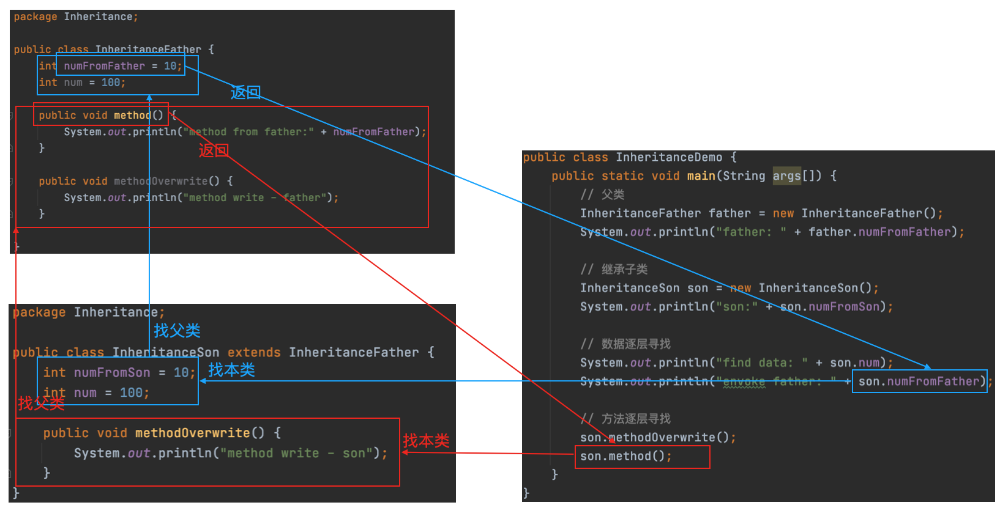
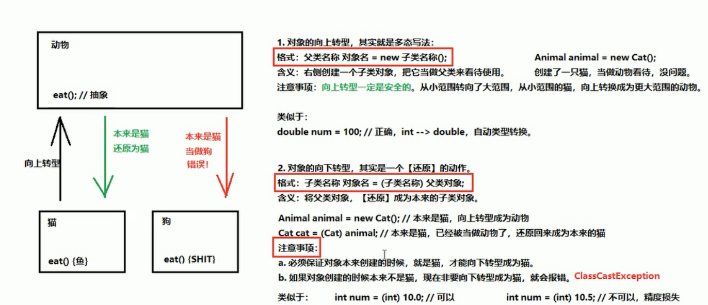

[TOC]

### 1.封装、继承、多态

​	参考：[Java之封装，继承，多态](https://www.cnblogs.com/fenjyang/p/11462278.html)

#### 1.1 封装 encapsulation

​	就是把对象的属性和操作（或服务）结合为一个独立的整体，并尽可能隐藏对象的内部实现细节；有利于保护对象信息的完整性，同时也提高程序的安全性。

​	使用`private`字段对数据进行保护，并且提供`getDate`和`setData`统一提供对成员变量的访问。

#### 1.2 继承 Inheritance

​	**一子对一父，一父可多子**：一个子类只允许有一个父类，但是可以实现多级继承，即子类拥有唯一的父类，而父类还可以再继承。

​	**多级继承**：父类可以有父类，循环之。



​	可以在子类中，使用`this`指定本类的数据，使用`super`指定父类的数据。

```java
package Inheritance;

public class InheritanceSon extends InheritanceFather {
  int numFromSon = 10;
  int num = 100;
  
  public void methodOverwrite() {
    int numMethod = 30;
    System.out.println(numMethod);
    System.out.println(this.numFromSon);
    System.out.println(super.numFromFather);
  }
}
```

****

##### 重写overwrite & 重载 overload

​	1.`重写 overwrite`：**即外壳不变，核心重写！**返回值和形参不能变。

​	2.`重载 overload`：**方法名字相同，而参数不同。**形参改变，返回值可变。

```java
// 父类
package Inheritance;

public class InheritanceFather {
  public void test() {
		System.out.println("test");
  }
}
```

```java
// 子类重写 overwrite
package Inheritance;

public class InheritanceOverwrite extends InheritanceFather {
  public void test() {
		System.out.println("test overwrite");
  }
}
```

```java
// 子类重载 overload
package Inheritance;

public class InheritanceOverload extends InheritanceFather {
  public void test(int i) {
		System.out.println("test overload i" + i);
  }
  
  public void test(String str) {
    System.out.println("test overload s" + str);
  }
}
```

##### final类无法继承

​	final类是不允许被继承的，编译器会报错。很好理解，**由于final修饰符指的是不允许被修改**，而继承中，**子类是可以修改父类的**，这里就产生冲突了，所以final类是不允许被继承的。

****

#### 1.3 多态 Polymorphism

​	多态的实现方式：重写overwrite、接口、抽象类和抽象方法。

##### 向上转型和向下转型

`向上转型`

​	`Father obj = new Son()`：向上转型就是`父类引用指向子类对象`，即声明的时候用父类声明，实例化对象的时候用子类实例化。因此对于一个子类对象来说，它的声明是父类，这就变成了向上转型。但是向上转型之后就不能调用子类的特有方法。

`向下转型`

​	首先要明白，在调用一个多态写法的对象方法时，首先会看父类是否有此方法（因为声明是父类），然后再到子类中运行该方法。因此如果要调用一个父类没有的，而子类新增的方法时，就要向下转型为子类，这样才能调用方法。这里需要注意的是，**必须保证对象创建的时候是父类引用指向子类对象，才能向下转型为子类**。同型对比`int num = (int)10.0;`即为向下转型；而`int num = (int)10.5`则会引起精度缺失，因为一开始声明和实例化的时候就不是向上转型的。

```java
// test
public class Test() {
  public static void main(String args[]) {
    // 多态引用，向上转型
		Animal cat = new Cat();
    cat.eat(); // Cat can eat!
    
    Animal dog = new Dog();
    dog.eat(); // Dog can eat!
    
    
    // 如果要调用父类没有的方法，则要向下转型
    // dog.watchDoor(); // 报错
    Dog dogDown = (Dog)dog;
    dogDown.watchDoor(); // Dog can watch door!
  }
}

class Animal {
  public void eat() {
    System.out.println("animal can eat!");
  }
}

class Cat {
  public void eat() {
    System.out.println("Cat can eat!");
  }
}

class Dog {
  public void eat() {
    System.out.println("Dog can eat!");
  }
  
  public void watchDoor() {
    System.out.println("Dog can watch door!");
  }
}
```



****

### 2.构造器

​	所谓构造器，其实就是一个定义函数，只不过这个函数的特殊性在于**`函数名与类名相同`并且`不声明方法类型void等`**。**构造器会在`new`新对象的时候调用**。

```java
// 在使用的时候：
public class test() {
  public static void main(String args[]) {
    Animal animal = new Animal(); // 'default constructor'
    Animal dog = new Animal("dog"); // 'animal: dog'
  }
}

class Animal {
  public Animal() {
    // 这个就是构造器
    // 默认构造器无参
    System.out.println("default constructor");
  }
  
  public Animal(String animalName) {
    // 重载 定义构造器
		System.out.println("animal: " + animalName);
  }
}


```

​	**实例化子类的时候，首先实例化父类调用父类构造函数。**

```java
// test
public class test {
  public static void main(String args[]) {
    Son son = new son();
  }
}

// 二级父类
class Grandpa {
  public Grandpa() {
    System.out.println("grandpa constructor");
  }
}

// 一级父类
class Father extends Grandpa {
  public Father() {
    System.out.println("father constructor");
  }
}

// 子类
class Son extends Father {
  public Son() {
    System.out.println("son constructor");
  }
}

// 输出：
// grandpa constructor
// father constructor
// son constructor
```

​	**构造器可以不用显示地定义，因为生成类之后会默认定义一个同名的构造器（无参）；如果自定义了构造器，则会覆盖默认构造器。**

- [x] 这里就产生了一个问题，系统会默认调用无参的构造器，但是如果父类显式定义一个有参的构造器，系统就不会调用，那么在声明子类的时候，就要注意要手动调用父类构造器。

```java
// test : 报错
public class test {
  public static void main(String args[]) {
    Son son = new Son();
  }
}

// 二级父类
class Grandpa {
  public Grandpa(String firstName) {
    System.out.println("grandpa constructor" + firstName);
  }
}

// 一级父类
class Father extends Grandpa {
  public Father() {
    System.out.println("father constructor");
  }
}

// 子类
class Son extends Father {
  public Son() {
    System.out.println("son constructor");
  }
}
```

> ​	上面的代码在`new Son()`的时候，自动调用其父类的构造器`Father`，这时候`Father`也有父类，就自动调用其父类`Grandpa`的构造器。但是由于`Grandpa`的构造器已经自定义了一个有参数的，因此默认的无参构造器已经被覆盖，系统就没办法自动调用，这时候其子类`Father`必须负责显式地调用`Grandpa`的构造器；或者注意其父类显式地定义个一个无参构造器，以便系统自动调用。

```java
// 一级父类，显式调用父类有参构造器
public class Father extends Grandpa {
  public Father() {
    //显式调用父类有参构造器
    super.Grandpa("Stephen");
    System.out.println("father constructor");
  }
}
```

```java
// 二级父类，显式定义无参构造器
public class Grandpa {
  public Grandpa() {
    System.out.println("grandpa default constructor");
  }
  
  public Grandpa(String firstName) {
    System.out.println("grandpa constructor" + firstName);
  }
}
```

****

### 3. 抽象类 & 抽象方法


### 4. 接口 interface

- [x] 接口产生原因：有时必须从几个类中派生出一个子类，继承它们所有的属性和方法。但是，Java不支持多重继承。有了接口，就可以得到多重继承的效果。

