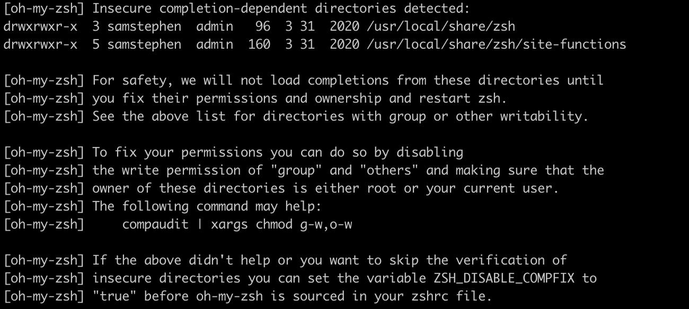
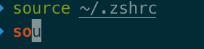

[TOC]

### 1.oh my zsh使用

​	FOR MAC ONLY! 

[iTerm2 + Oh My Zsh打造舒适终端体验](https://www.jianshu.com/p/9c3439cc3bdb)

#### 0. 环境

1. powerline以及homebrew均需要安装command line tool
2. git环境

--------------------

#### 1. 下载iTerm2

​	[此链接下载iTerm2](https://www.iterm2.com/)

```shell
$ chsh -s /bin/zsh
```

​	如果想要修改回默认dash：

```shell
$ chsh -s /bin/bash
```

--------------

#### 2. 安装oh my zsh

```shell
#curl安装，选择这种
$ sh -c "$(curl -fsSL https://raw.githubusercontent.com/robbyrussell/oh-my-zsh/master/tools/install.sh)"
```

```shell
#也可以选择wget安装
$ sh -c "$(wget https://raw.githubusercontent.com/robbyrussell/oh-my-zsh/master/tools/install.sh -O -)"
```

出现了错误：



[[oh-my-zsh]提示Insecure completion-dependent directories detected解决方法](https://www.bootschool.net/article/5e79aba6f60a317efe5bbbd5)

> 大概意思就是说解决这个问题，可以通过去掉给出目录的“group”和“others”分组的写权限并确保其所有者是root或当前用户。
> 参考命令：
> *compaudit | xargs chmod g-w, o-w*
> 如果使用参考命令没有效果，或者只想跳过不安全目录的验证，可以在*`~/.zshrc`*文件中设置变量*`ZSH_DISABLE_COMPFIX`*的值为true`。

###### 方法一：按照提示直接运行参考命令

```shell
$ compaudit | xargs chmod g-w,o-w
```


​	可以看到已经没有insecure directories

###### 方法二：chmod去掉相关文件夹的写权限

```shell
$ chmod g-w,o-w /usr/local/share/zsh
$ chmod g-w,o-w /usr/local/share/zsh/site-functions
#或者
$ chmod 755 /usr/local/share/zsh
$ chmod 755 /usr/local/share/zsh/site-functions
```

###### 方法三：跳过不安全验证

```shell
#在~/.zshrc文件中设置变量ZSH_DISABLE_COMPFIX=true
$ vi ~/.zshrc
# 进入到~/.zshrc后，按i进入编辑模式，添加配置
ZSH_DISABLE_COMPFIX=true
# esc退出编辑模式，:wq保存退出
```

-------------------

#### 安装powerline

```shell
# 如果没有pip，先安装pip
$ sudo easy_install pip
# 安装powerline
$ pip install powerline-status --user
```

-------------------

#### 安装powerFont

```shell
# 安装字体库需要将项目git clone到本地，执行源代码中的install.sh
# 创建一个新文件夹存放项目，在install.sh之后可以将项目删除
$ mkdir ~/Desktop/OpenSource
$ cd ~/Desktop/OpenSource
# git clone
$ git clone https://github.com/powerline/fonts.git --depth=1
# cd to folder
cd fonts
# run install shell
./install.sh
```

```shell
-> Powerline fonts installed to /Users/samstephen/Library/Fonts
```

###### 设置字体

Item2 > Preferences > Profiles > Text > ```Change Font``` > Meslo LG字体（有L、M、S可选）

-------------------

#### 安装配色方案

- [x] 发现并不需要安装配色，就已经有了Solarized Dark/Light两个选项

  Item2 > Preferences > Profiles > Color > ```Color Presets``` > Solarized Drak

​	配色方案在使用VIM或Colorful Log时会变得非常有用，同时界面也不会一片黑绿一样死板。

​	如果没有这两个配色选项，参考[iTerm2 + Oh My Zsh打造舒适终端体验](https://www.jianshu.com/p/9c3439cc3bdb)

-----------------

#### 安装主题

​		agnoster主题可以让当前目录等信息更加显而易见，效果图：


```shell
# 安装agnoster主题
$ cd ~/Desktop/OpenSource
$ git clone https://github.com/fcamblor/oh-my-zsh-agnoster-fcamblor.git
$ cd oh-my-zsh-agnoster-fcamblor/
$ ./install
# 安装完毕，打开zshrc配置文件，将ZSH_THEME后面的字段改为agnoster
# 按i进入编辑，注释掉原本的字段，添加
ZSH_THEME="agnoster"
# esc退出编辑状态，:wq保存退出，执行source
$ source ~/.zshrc
```

----------------

#### 安装高亮

​		高亮可以让一些特别的指令变成高亮状态，比如git等指令，颜色、亮度都会有所差异。


```shell
# 进入到zsh的插件目录，安装插件
$ cd ~/.oh-my-zsh/custom/plugins/
$ git clone https://github.com/zsh-users/zsh-syntax-highlighting.git
# 打开zshrc文件进行配置
$ vi ~/.zshrc
# 编辑模式，找到plugins=(git)，添加highlighting插件
plugins=(
git
zsh-syntax-highlighting
)
# 一定要保证zsh-syntax-highlighting是放在最后
# 然后在文件的最后一行添加，使得立刻生效用，重新载入也可以生效，版本不同可能有不同的表现，执行一下的结果是统一的
source ~/.oh-my-zsh/custom/plugins/zsh-syntax-highlighting/zsh-syntax-highlighting.zsh
# 保存，退出，source
$ source ~/.zshrc
```

-------------------

#### 可选择、命令补全

​		zsh-autosuggestion插件

```shell
# 进入到zsh的插件目录，安装插件
$ cd ~/.oh-my-zsh/custom/plugins/
$ git clone https://github.com/zsh-users/zsh-autosuggestions
# 打开zshrc文件进行配置，
$ vi ~/.zshrc
# 编辑模式，添加highlighting插件，添加autosuggestion插件
plugins=(
git
zsh-autosuggestions
zsh-suntax-highlighting
)
# 保存，退出，source
$ source ~/.zshrc
```

- [x] 但是自动补全只会提示后面一个字母：

  
  
  [iterm2 自动提示一个一个字符提示是什么鬼??!](https://blog.csdn.net/weixin_39973810/article/details/83902164)
  
  > 原因是补全提示的字体颜色和背景颜色完全一致，只有后面一个字母因为光标被看到。因此可以尝试一下改变背景的颜色，在```Item2``` > ```Preferences``` > ```Profiles``` > ```colors``` > ```color presets...```改变背景颜色即可。或者改变autosuggestions的提示字体颜色（更偏向这种）。
  >
  > ```shell
  > # 进入zsh配置文件 
  > # open ~/.zshrc就会直接打开这个文件，可以尝试使用体会一下不同
  > $ vi ~/.zshrc
  > # 在配置文件中添加（随便一行添加都行，我添加在了plugin下面）：
  > # 这里了支持的颜色有限，black, red, green, yellow, blue, magenta, cyan, white
  > ZSH_AUTOSUGGEST_HIGHLIGHT_STYLE='fg=yellow'
  > # ecs :wq保存退出，source一下
  > $ source ~/.zshrc
  > ```
  >
  > 