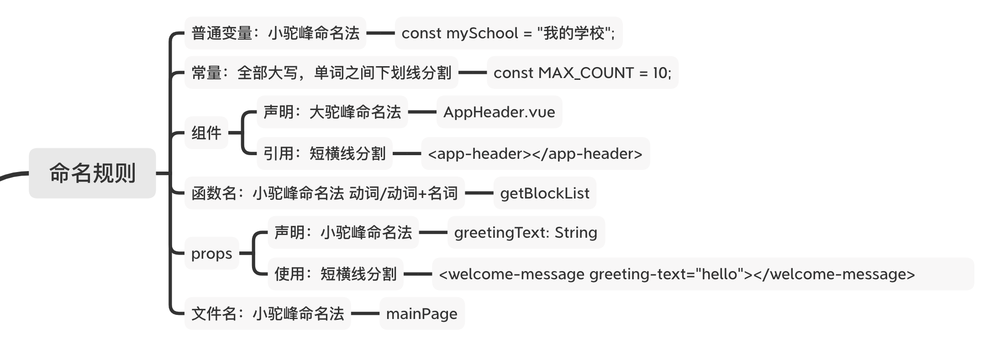

##### 单文件结构

###### ```html```

```<template>```标签中只有一个根元素

```html
<template>
  <div></div>
</template>
```

标签内的属性顺序: 原生的放前面 指令放后面

```html
<div class="" id="" style="" v-model="" v-if="">
  class、id、style是原生属性，v-model、v-if等放后面。
  v-if和v-show不能在同一个DOM元素上使用
</div>
```

###### ```js```

组件选择顺序

```html
<script>
	export default {
    components: {
      
    },
    props: {
      title: {
        type: String,
        default: '',
      }
    },
    data() {
      return {
        
      }
    },
    computed: {
      
    },
    watch: {
      
    },
    
    created() {
      
    },
    mounted() {
      
    },
    methods: {
      
    }
  }
</script>
```

###### 命名规则



###### ES6编码风格

​	0.ES6 export、对象/数组解构

[认识Vue的expert、export default、import](https://blog.csdn.net/harry5508/article/details/84025146)

[es6-对象和数组解构](https://juejin.im/post/6844903958104768519)

​	1.定义变量用```let```, 定义常量用```const```

```js
// let的域是在本块中，const的域是在本页面中
let name = "LZS";
const MY_NAME_LENGTH = "3";
```

​	2.动态字符串用反引号

```js
let name = "LZS";
let joint = ```aaa{$name}```;
```

​	3.拷贝数组

```js
let arr[1, 2, 3];
let arr2[7, 8];
let arr3[...arr, 2, 3, ...arr2];
```

​	4.使用箭头函数

```js
{
	path: '/cert',
	name: 'cert',
	component: () => import('@/views/cert/cert.vue'),
},
arr{
  
}
```

​	5.vue指令规范

1. ```v-on:``` 缩写```@```；```v-bind:``` 缩写```:```
2. ```v-for``` 加上key属性 [为什么使用v-for时必须添加唯一的key？](https://juejin.im/post/6844903577215827982)
3. ```v-if ``` 和 ```v-for``` 不要用在同一个元素上 [Vue: v-for 与 v-if的优先级，以及避免同时使用](https://juejin.im/post/6844903901410361352)

​	6.props贵妃

```html
props:{
	title: {
		type: String,
		default: '',
}
```


