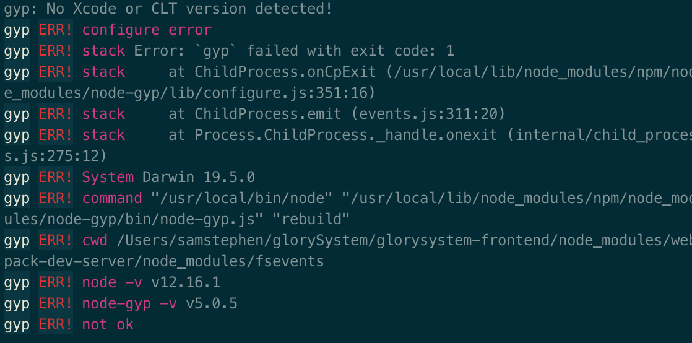

### 1. npm init

[没找到package.json](https://blog.csdn.net/qq_32068809/article/details/79512709)

[执行npm install时出现npm notice created a lockfile as package-lock.json. You should commit this file.](https://blog.csdn.net/roslu/article/details/107962585)


### 2. Npm gyp error

[NPM Error: gyp: No Xcode or CLT version detected!](https://www.cnblogs.com/zhennann/p/12272058.html)

使用npm的时候报错：



> ```shell
> $ sudo rm -rf $(xcode-select -print-path)
> $ xcode-select --install
> ```

