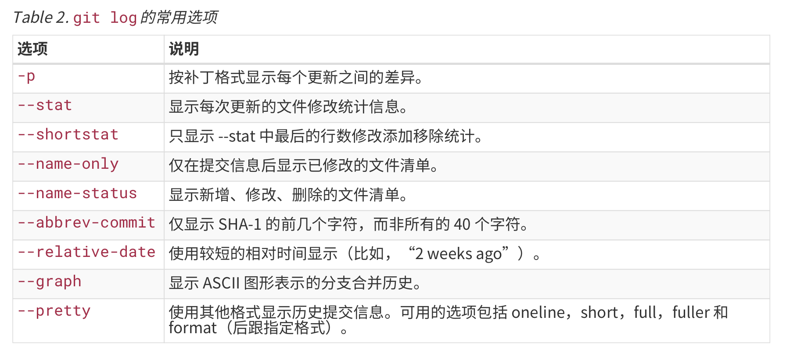

[TOC]

# 0. 配置

## 1. 配置文件

​	`/etc/gitconfig` 文件：包含系统上每一个用户及他们仓库的通用配置。如果使用带有 `--system` 选项的 `git config` 时，它会从此文件读写配置变量。

​	`~/.gitconfig` 或 `~/.config/git/config` 文件：只针对当前用户。可以传递 `--global` 选项让 Git 读写此文件。

​	`.git/config` 文件：针对该仓库，即当前使用仓库的 Git 目录中的 config 文件。

### 配置别名

​	可以通过配置别名的方式简化命令。

```shell
$ git config --global alias.co checkout
$ git config --global alias.br branch
$ git config --global alias.unstage 'reset HEAD --'
$ git config --global alias.last 'log -1 HEAD'

# 以后使用的时候就可以使用别名
$ git unstage fileA # 相当于 git reset HEAD -- fileA
$ git last # 相当于 git log -1 HEAD
```


## 2. 用户信息

​	用户信息作为溯源，追踪代码修改人。在设置好用户名称与邮件地址后，每一个 Git 的提交都会使用这些信息，并且它会写入到每一次提交中，不可更攻。

​	如果使用了 --global 选项，那么该命令只需要运行一次，因为之后无论你在该系统上做任何事情，Git 都会使用那些信息。当你想针对特定项目使用不同的用户名称与邮件地址时，可以在那个项目目录下运行没有 --global 选项的命令来配置。

```shell
# --global
$ git config --global user.name 'xxx'
$ git config --global user.email xxx@example.com

# 只针对本仓库
$ git config uesr.name 'xxx'
$ git config user.email xxx@example.com
```

​	可以查看具体的配置信息。可能会看到重复的变量名，因为 Git 会从不同的文件中读取同一个配置（如 `/etc/gitconfig` 全局系统配置文件和 `~/.gitconfig` 该系统配置文件）。在一键多值的情况下，Git 会使用它找到的每一个变量的最后一个配置，即使用这个键最后输出的值。

```shell
# 查看配置信息
$ git config --list
$ git config user.name|user.email
```

```shell
# 查看配置命令的手册
$ git help config
```


# 1. 概念

## 1. snapshot 快照 与 commit object 提交对象

参考：[Git快照到底该如何理解？](https://www.h5w3.com/82381.html)

参考书籍：《精通Git》

### snapshot 产生过程

> 1.当保存一个文件的时候，git 把这个文件的信息和这个文件的内容存储在一个文件里，然后求得这个文件的 SHA-1 作为文件名(SHA-1的前两位/SHA-1剩余部分,见`.git/objects`)。
>
> 2.保存一个目录，就是把目录信息，以及其中文件通过上述方式求得的 SHA-1 保存在一个文件里，同样求得这个文件的SHA-1 作为文件名。
>
> 3.一个提交就是，把提交的信息(比如父提交的SHA-1等)，以及此次提交所包含的目录/文件的上述方式求得的 SHA-1 放在一个文件里，然后把其 SHA-1 作为文件名。
>
> 4.当提取某次提交的时候，需要给出某次提交的 SHA-1 然后 git 就可以通过SHA-1 找到这个保存这个提交所在的文件，然后这个文件里有其所有包含文件的 SHA-1 ，然后就可以找到所有文件。

> 快照相对于一个文件来说就是在硬盘里把这一块内存锁住，后续的人不能再动这一块空间了，需要用的时候把这一块拿出来就行了，所以当一个文件A被修改时，理论上不是动了这个文件本身，而是生成了一个文件A1，A1和A又构成了一个空间，把这个空间再次锁住，也就是第二个快照，以此类推。
>
> 所以Gitpro里面说“Git Generally Only Adds Data”

```js
----------
在創建Version 1時:

計算A B C的SHA-1, 然後在.git/object中, 創建以下文件 (即"快照")
- 文件名 sha1(A), 內容A
- 文件名 sha1(B), 內容B
- 文件名 sha1(C), 內容C

最後把這幾個SHA-1寫到一個新文件, 這個新文件就是Version 1.
----------
在創建Version 2時

計算A1 B C1的SHA-1, 然後發現sha1(B)這個文件名已經有了, 所以只需要再創建兩個文件:
- 文件名 sha1(A1), 內容A1
- 文件名 sha1(C1), 內容C1

最後把A1 B C1的SHA-1寫到新文件, 這個新文件就是Version 2
----------
以下略
```

### SHA-1 散列构造索引

​	Git 不需要外连到服务器去获取历史，然后再显示出来；它只需要从本地数据库中读取。

​	Git 中所有数据在存储前都计算校验和，然后以校验和来饮用。Git 用以计算校验和的机制叫做 SHA-1 散列。实际上，Git 数据库中保存的信息都是**以文件内容的哈希值来索引**，而不是文件名。

```js
// 哈希值示例
24b9da6552252987aa493b52f8696cd6d3b00373
```

### snapshot 包含了什么？

​	非 Git 类型的VCS（Version Control System，版本控制系统）对待数据的方法是只存储变更，**将它们保存的信息看作是一组基本文件和每个文件随时间逐步积累的差异**。也即如若基本文件丢失，单有变更差异的记录也无法恢复。

​	而 Git 对于数据的处理方法是：每次你提交更新或在 Git 中保存项目状态时，它主要对当时的**全部文件**制作一个快照并保存这个快照的索引。如果文件没有修改，Git 不再重新存储该文件，而是只保留一个链接指向之前存储的文件。（如上面例子的A1，C1变更，存储并保留A1，C1的新索引；但是B没有变更，那么对于B则不再存储文件，而是直接使用指向B的索引）


> ​	snapshot 快照就是你的 project working directory 在某个时刻的整体状态的记录，即"Every time you commit, or save the state of your project in Git, it basically **takes a picture of what all your files look like at that moment** and stores a reference to that snapshot"。

​	Git 一般只添加数据，"Git generally only adds data"。快照相对于一个文件来说就是在硬盘里把这一块内存锁住，后续的人不能再动这一块空间了，需要用的时候把这一块拿出来就行。所以当一个文件 A 被修改时，理论上不是动了这个文件本身，而是生成了一个文件 A1，A1 和 A 又构成了一个空间，把这个空间再次锁住，也就是第二个快照，以此类推。

### 快照 与 提交对象

​	Git 保存的不是文件的变化或者差异，而是一系列不同时刻的文件快照。而为了记录文件快照，需要进行提交 `git commit` 操作。在进行提交的时候，Git 会保存一个提交对象 (commit object)。

​	该提交对象主要包含三个数据：

- 包含一个指向内容快照的指针
- 包含作者的姓名和邮箱、提交时输入的信息
- 包含只想项目根目录树对象的指针（首次提交）或包含指向父对象的指针（后续提交）


## 2. branch 分支

​	Git 的分支，本质上仅仅是**指向提交对象的可变指针**。  


# 2. 命令

```shell
# 修改用户信息
$ git config [--global] user.name 'xxx'
$ git config [--global] user.email xxx@example.com

# 查看配置信息
$ git help config
$ git config --list
$ git config user.name

# 初始化
$ git init
```


## `git init` - 初始化

​	用来将一个文件初始化城一个**可管理的 git 仓库**。	

```shell
# 在目录底下执行命令，初始化
$ git init
```

## `git clone` - 克隆

​	执行克隆命令的时候，默认配置下远程 Git 仓库中的**每一个文件的每一个版本**都将被拉取下来。克隆下来默认将远程仓库命名为 origin 指代该仓库的 URL 地址；可以自己使用新的变量命名自定义本地仓库的名字。

```shell
$ git clone <url>
# e.g. $ git clone https://github.com/libgit/libgit

$ git clone <url> <url_name>
# e.g $ git clone https://github.com/libgit/libgit libgit
# 变量 libgit 指的就是 https://github.com/libgit/libgit 这个 URL 的仓库
```


## `git status` - 查看文件状态

​	会显示目前所在分支，分支内的文件修改状态（未追踪、已修改、已暂存）以及可被提交的内容等。

`untracked` 未追踪：未追踪的文件意味着 Git 在之前的快照（提交）中没有这些文件。

`unmodified` 未修改：文件默认状态，指在之前的快照中存在且尚未进行修改的文件。

`modified` 已修改：已修改的文件指在之前的快照中存在，并且已作出更改的文件。

`staged` 已暂存：暂存的文件意味着把目前的已修改的文件锁定其更改，以便将这些更改形成快照。需要注意的是，对于同一文件更改后放入暂存区，就相当于形成了一个临时的快照。对该文件再次进行更改时，文件会出现在已修改的区域，再次对该修改进行暂存操作，会把这些修改合并放入到暂存区。

```shell
$ git status
$ git status -s|--short # -s 字段，获得更为简洁的状态报告输出
```

### `.gitignore` 忽略文件

​	忽略不需要纳入 Git 管理的文件。可参考：[.gitignore文件列表](https://github.com/github/gitignore)。

```python
# no .a files
*.a

# but do track lib.a, even though you're ignoring .a files above
!lib.a

# only ignore the TODO file in the current directory, not subdir/TODO
/TODO

# ignore all files in the build/ directory
build/

# ignore doc/notes.txt, but not doc/server/arch.txt
doc/*.txt

# ignore all .pdf files in the doc/ directory
doc/**/*.pdf
```

## `git add` - 跟踪或暂存文件

​	添加内容到下一次提交中。`git add` 有两个作用，一个是跟踪新文件，即将 `untracked files` 跟踪；另一个是暂存已修改文件，即将 `unmodified files` 变成 `staged files` 。**运行了 `git add` 之后又作了修订的文件，需要重新运行 `git add` 把最新的版本重新暂存起来。**

```shell
$ git add <filename>
$ git add .
```

### 撤销暂存 `git reset`

​	可以通过该命令撤销对某文件的暂存状态，即 `staged -> modified`。

```shell
$ git status
On branch master
Changes to be committed:
	renamed: README.md -> README
	modified: CONTRIBUTING.md
```

```shell
$ git reset HEAD CONTRIBUTING.md # 撤销对 CONTRIBUTING.md 的暂存
```

### 撤销修改 `git checkout -- <filename>`

```shell
$ git checkout -- CONTRIBUTING.md # 撤销对 CONTRIBUTING.md 的修改
```

## `git diff` - 查看修改明细

​	`git diff` 将通过 patch 文件补丁的格式显示具体哪些行为发生了改变，即具体添加和删除了哪些行。`git diff` 本身默认只显示尚未暂存的改动，即 `modified but not staged files`，而不是自上次提交以来所做的所有改动。如果想要查看暂存区 `staged files` 的文件改动，可以使用 `git diff --cached` 或 `git diff --staged`。

```shell
$ git diff [-cached|--staged]
```

## `git commit` - 提交更新

​	将暂存文件形成快照提交，记录到本地 Git 仓库中。

```shell
$ git commit # 会打开文本编辑器，输入本次 commmit 的提示文本
$ git commit -v # 会把具体变更加入到本次 commit 信息中
$ git commit -m 'prompt message' # 直接在命令行中输入提示文本，而不用打开文本编辑器输入
$ git commit -a # 直接将全部已修改文件暂存并提交, 相当于 git add . + git commit
```

​	可以组合使用，比如可以将已修改的文件直接提交，并且附带提交提示文本：

```shell
$ git commit -a -m 'add all modified files'
```

### 撤销提交 `--amend`

​	撤销提交的作用是把目前的暂存区文件 `staged files` 提交并作为上次提交的一部分合并成一次提交，提交的信息以本次提交为最终结果，即本次提交的提交信息会覆盖上一次的提交信息。如果自上一次提交之后，并没有进行暂存，那么只是修改提交信息。

```shell
$ git commit -m 'old-commitment message'
# git add filename
$ git commit --amend -m 're-commitment message'
```

## `git rm` - 取消追踪

​	移除文件的本质是让 Git 不再对该文件纳入版本管理。对于移除文件的具体需求可能有两种：1.删除源文件 2.不删除源文件，即只去除 Git 对该文件的追踪。

​	针对删除文件，又区分两种情况：一是直接删除一个非暂存区的文件，另一是删除暂存区的文件。由于暂存区算是临时的快照，因此删除暂存区的文件的时候需要使用强制删除选项 `-f`；使用强制删除才能删除暂存区的文件，是为了防止暂存区尚未提交而无法被恢复。删除文件相当于两步操作，第一步是删除文件，第二步是将该操作暂存，下一次提交则不会再追踪该文件。

```shell
# 相当于两步操作
$ rm project.md # modified
$ git add project.md # staged
```

```shell
$ git rm project.md # 1.删除非暂存区的文件
$ git rm -f project.md # 2.删除暂存区的文件

# e.g. 删除log/目录底下扩展名为.log的文件
$ git rm log/\*.log
```

​	针对只去除 Git 对该文件的追踪，仍让源文件保留在磁盘：这种做法通常能解决忘记了添加 `.gitignore` 文件，不小心把一个很大的日志文件或一堆 `.a` 这样的编译生成文件添加到暂存区的问题。使用 `--cached` 选项。

```shell
$ git rm --cached README
```

## `git mv` - 重命名文件

参考：[shell命令之mv](https://blog.csdn.net/zwlove5280/article/details/74141564)

​	`git mv` 相当于三个步骤：1.使用 `mv` 重命名文件 2.取消对旧名字文件的追踪 3.添加新名字文件的追踪。

```shell
# 相当于三个步骤
$ mv old_filename new_filename
$ git rm old_filename
$ git add new_filename

# 直接一步
$ git mv old_filename new_filename
```

## `git log` - 查看提交历史

```shell
$ git log # 查看所有更新(含时间、提交者、提交的提示文本)
$ git log -<n> # 查看最新的<n>次提交 e.g. git log -2 查看最近两次提交

$ git log -p # 在提交历史的展示中附加文件的差异内容
$ git log --stat # 简介版的 git log -p
$ git log --pretty=[oneline|short|full|fuller|format:"%h - %an"] # 具体展示格式
```




## `git remote` - 远程仓库操作

### 查看、添加、移除和重命名

​	可查看本地的仓库，以及相对应的 url 信息。也可以查看远程仓库的url以及跟踪分支的信息（包括哪些远程分支不在本地，哪些远程分支已被删除）。

```shell
# 查看本地仓库
$ git remote # 只显示仓库名
$ git remote -v # 显示仓库名及对应的url

# 查看远程仓库
$ git remote show [remote-name] # 没有指定remote-name, 则采用默认
$ git remote show origin # 会列出远程仓库的url以及跟踪分支的信息
```

​	可以添加一个远程仓库的仓库名：

```shell
# 添加仓库
$ git remote add <shortname> <url>
# e.g. git remote add origin https://github.com/example/pd
```

​	移除和重命名仓库都只是在本地操作，相当于把仓库的变量释放或更名。

```shell
$ git remote rename <old_name> <new_name>
$ git remote rm <remote-name>
```

### `git fetch` & `git pull` - 从远程仓库拉取

​	`git fetch` 和 `git pull` 都会从指定的远程仓库中访问并从中拉取本地还没有的数据。区别是，前者不会自动合并或修改当前的工作，需要自己手动将其合并；后者会在自动的抓取完毕之后自动合并远程分支的内容到本地的分支。当没有指定 `[remote-name]` 的时候，采用默认的仓库（一般为 origin ）。

```shell
$ git fetch [remote-name]
$ git pull [remote-name]
# e.g. git fetch origin
# e.g. git fetch # 拉取默认仓库
```

### `git push` - 推送到远程仓库

​	将本地的提交更新备份到远程仓库。当没有指定`[remote-name]` 和 `[branch-name]` 的时候，采用默认的。

```shell
$ git push [remote-name] [branch-name]
# e.g. git push origin master
```

## `git tag` - 打标签 [unimportant & not listed]

## `git branch` & `git checkout` - 分支创建与切换