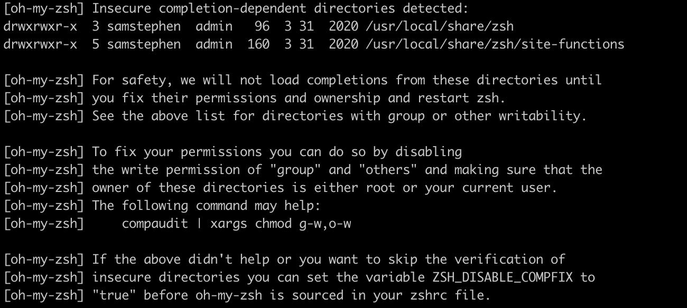
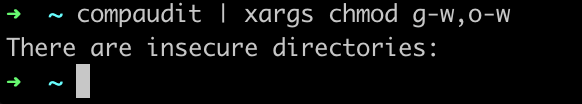
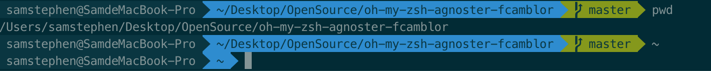
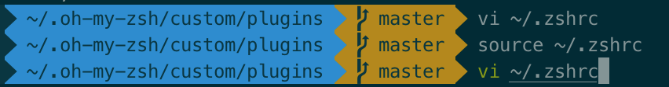
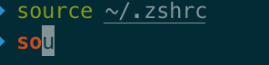

[TOC]

```shell
$ cd // change directory
$ rm -r <directory> // remove -recursive 
$ ls // list
$ mkdir // make directory 创建文件夹
$ touch // 创建文件
$ cp <folder_from> <folder_to> // copy
$ vim // vi => VIsual => vim VIsual IMproved 可见的编辑器
$ cat // concatenate 
$ clear // 清空窗口
```


# 0. 安装 iTerm

​	iTerm 是 mac 系统下一个比较美观的终端工具，比原生的终端的 UI 更美观。

​	参考：[iTerm2 + Oh My Zsh打造舒适终端体验](https://www.jianshu.com/p/9c3439cc3bdb)

## 0. 环境

1. powerline 以及 homebrew 均需要安装 command line tool
2. git 环境

## 1. 下载iTerm2

​	[此链接下载iTerm2](https://www.iterm2.com/)

```shell
$ chsh -s /bin/zsh
```

​	如果想要修改回默认dash：

```shell
$ chsh -s /bin/bash
```

## 2. 安装oh my zsh

```shell
#curl安装，选择这种
$ sh -c "$(curl -fsSL https://raw.githubusercontent.com/robbyrussell/oh-my-zsh/master/tools/install.sh)"
```

```shell
#也可以选择wget安装
$ sh -c "$(wget https://raw.githubusercontent.com/robbyrussell/oh-my-zsh/master/tools/install.sh -O -)"
```

出现了错误：



[[oh-my-zsh]提示Insecure completion-dependent directories detected解决方法](https://www.bootschool.net/article/5e79aba6f60a317efe5bbbd5)

> 大概意思就是说解决这个问题，可以通过去掉给出目录的“group”和“others”分组的写权限并确保其所有者是root或当前用户。
> 参考命令：
> *compaudit | xargs chmod g-w, o-w*
> 如果使用参考命令没有效果，或者只想跳过不安全目录的验证，可以在*`~/.zshrc`*文件中设置变量*`ZSH_DISABLE_COMPFIX`*的值为true`。

### 方法一：按照提示直接运行‘参考命令

```shell
$ compaudit | xargs chmod g-w,o-w
```



​	可以看到已经没有insecure directories

### 方法二：chmod去掉相关文件夹的写权限

```shell
$ chmod g-w,o-w /usr/local/share/zsh
$ chmod g-w,o-w /usr/local/share/zsh/site-functions
#或者
$ chmod 755 /usr/local/share/zsh
$ chmod 755 /usr/local/share/zsh/site-functions
```

### 方法三：跳过不安全验证

```shell
#在~/.zshrc文件中设置变量ZSH_DISABLE_COMPFIX=true
$ vi ~/.zshrc
# 进入到~/.zshrc后，按i进入编辑模式，添加配置
ZSH_DISABLE_COMPFIX=true
# esc退出编辑模式，:wq保存退出
```

安装powerline

```shell
# 如果没有pip，先安装pip
$ sudo easy_install pip
# 安装powerline
$ pip install powerline-status --user
```

## 3. 安装powerFont

```shell
# 安装字体库需要将项目git clone到本地，执行源代码中的install.sh
# 创建一个新文件夹存放项目，在install.sh之后可以将项目删除
$ mkdir ~/Desktop/OpenSource
$ cd ~/Desktop/OpenSource
# git clone
$ git clone https://github.com/powerline/fonts.git --depth=1
# cd to folder
cd fonts
# run install shell
./install.sh
```

```shell
-> Powerline fonts installed to /Users/samstephen/Library/Fonts
```

### 设置字体

Item2 > Preferences > Profiles > Text > ```Change Font``` > Meslo LG字体（有L、M、S可选）

## 4. 安装配色方案

- [x] 发现并不需要安装配色，就已经有了Solarized Dark/Light两个选项

  Item2 > Preferences > Profiles > Color > ```Color Presets``` > Solarized Drak

​	配色方案在使用VIM或Colorful Log时会变得非常有用，同时界面也不会一片黑绿一样死板。

​	如果没有这两个配色选项，参考[iTerm2 + Oh My Zsh打造舒适终端体验](https://www.jianshu.com/p/9c3439cc3bdb)

## 5. 安装主题

​		agnoster主题可以让当前目录等信息更加显而易见，效果图：



```shell
# 安装agnoster主题
$ cd ~/Desktop/OpenSource
$ git clone https://github.com/fcamblor/oh-my-zsh-agnoster-fcamblor.git
$ cd oh-my-zsh-agnoster-fcamblor/
$ ./install
# 安装完毕，打开zshrc配置文件，将ZSH_THEME后面的字段改为agnoster
# 按i进入编辑，注释掉原本的字段，添加
ZSH_THEME="agnoster"
# esc退出编辑状态，:wq保存退出，执行source
$ source ~/.zshrc
```

## 6. 安装高亮

​		高亮可以让一些特别的指令变成高亮状态，比如git等指令，颜色、亮度都会有所差异。



```shell
# 进入到zsh的插件目录，安装插件
$ cd ~/.oh-my-zsh/custom/plugins/
$ git clone https://github.com/zsh-users/zsh-syntax-highlighting.git
# 打开zshrc文件进行配置
$ vi ~/.zshrc
# 编辑模式，找到plugins=(git)，添加highlighting插件
plugins=(
git
zsh-syntax-highlighting
)
# 一定要保证zsh-syntax-highlighting是放在最后
# 然后在文件的最后一行添加，使得立刻生效用，重新载入也可以生效，版本不同可能有不同的表现，执行一下的结果是统一的
source ~/.oh-my-zsh/custom/plugins/zsh-syntax-highlighting/zsh-syntax-highlighting.zsh
# 保存，退出，source
$ source ~/.zshrc
```

## 7. 可选择、命令补全

​		zsh-autosuggestion插件

```shell
# 进入到zsh的插件目录，安装插件
$ cd ~/.oh-my-zsh/custom/plugins/
$ git clone https://github.com/zsh-users/zsh-autosuggestions
# 打开zshrc文件进行配置，
$ vi ~/.zshrc
# 编辑模式，添加highlighting插件，添加autosuggestion插件
plugins=(
git
zsh-autosuggestions
zsh-suntax-highlighting
)
# 保存，退出，source
$ source ~/.zshrc
```

- [x] 但是自动补全只会提示后面一个字母：

  

  [iterm2 自动提示一个一个字符提示是什么鬼??!](https://blog.csdn.net/weixin_39973810/article/details/83902164)

  > 原因是补全提示的字体颜色和背景颜色完全一致，只有后面一个字母因为光标被看到。因此可以尝试一下改变背景的颜色，在```Item2``` > ```Preferences``` > ```Profiles``` > ```colors``` > ```color presets...```改变背景颜色即可。或者改变autosuggestions的提示字体颜色（更偏向这种）。
  >
  > ```shell
  > # 进入zsh配置文件 
  > # open ~/.zshrc就会直接打开这个文件，可以尝试使用体会一下不同
  > $ vi ~/.zshrc
  > # 在配置文件中添加（随便一行添加都行，我添加在了plugin下面）：
  > # 这里了支持的颜色有限，black, red, green, yellow, blue, magenta, cyan, white
  > ZSH_AUTOSUGGEST_HIGHLIGHT_STYLE='fg=yellow'
  > # ecs :wq保存退出，source一下
  > $ source ~/.zshrc
  > ```
  >
  > 


# NPM

参考：[An Absolute Beginner's Guide to Using npm](https://dzone.com/articles/an-absolute-beginners-guide-to-using-npm-1)。


​	NPM（Node Package Manager）

1.使用`npm init`生成`package.json`文件管理依赖，使用该命令需要你输入项目相关的一些内容（这些内容可以完全不用管）；可以添加`-y`/`--yes`来直接生成默认的`package.json`文件。

```shell
$ npm init [-y, --yes]
```

### package.json

​	`package.json`是管理项目依赖的文件；当通过`npm install <package_name>`下载一些依赖的时候，会自动将依赖的信息（包括依赖名称、版本号等）写入到`package.json`中。

​	而具体的依赖内容会放置到`node_modules`目录当中，管理项目的时候**不需要把所有依赖都当作项目一部分上传到仓库**，只需要在新的环境中根据`package.json`下载所有依赖；比如：当将项目克隆到本地的时候，执行`npm install`就能把项目相关的所有依赖下载。

```shell
$ npm install
```

#### .gitignore

​	由于`node_modules`里的文件过于庞大，因此在git仓库管理项目的时候要忽略这个文件夹，克隆下来之后可以根据`package.json`来自行下载获取。通过管理`.gitignore`可以使git忽略`node_modules`，避免项目太过臃肿。

```shell
// 在node_modules所在的主目录下：
$ vim .gitignore

// 添加下面内容（按i进入编辑模式，添加完按esc，输入:wq，再按回车键enter）

// dependencies in node_modules
/node_modules
```

​	但需要注意的是，项目在`git push`之前就要管理好`.gitignore`；如果已经push上去，git不会忽略。在这种情况下，先生成好上述的`.gitignore`，再执行下面代码：

```shell
$ git rm -r --cached . //取消git追踪管理所有文件
$ git add . //重新追踪所有文件
$ git commit -m "update .gitignore"
$ git push
```

#### npm --save 和 npm --save-dev？

参考：[stackoverflow：--save & --save-dev](https://stackoverflow.com/a/42206389/15493049)、[npm install官方文档](https://docs.npmjs.com/cli/v7/commands/npm-install)、[stackoverflow：dependencies](https://stackoverflow.com/a/22004559/15493049)。

`npm --save`：项目不可或缺的依赖项，缺少了就不能运行起来（build & run）。

> Let's say you were building an app that used the **moment** package to parse and display dates. Your app is a scheduler so it really needs this package to run, as in: **cannot run without it**. In this case you would use
>
> ```shell
> $ npm install moment --save
> // 如果项目不需要此依赖，可以uninstall
> $ npm uninstall moment --save
> ```

`npm --save-dev`：有助于项目开发的依赖项（develop => tools），比如一些工具`sass`、`vue`等，项目缺少了能跑起来，只不过有可能不会展示成预期的情况。

> When you are developing, it really helps to use tools such as test suites and may need jasmine-core and karma. In this case you would use
>
> ```shell
> $ npm install jasmine-core --save-dev
> ```

​	其根源理解，即`dependencies`和`devDependencies`的区别。

> `dependencies` are required to run, `devDependencies` only to develop。

```shell
// 如果不想下载devDependencies，pass the --production flag
$ npm install --production
```

#### package.json 和 package-lock.json

参考：[package.json VS package-lock.json](https://dltlabs.medium.com/package-json-vs-package-lock-json-c8d5deba12cb)、

> ## **What is the purpose or use of package-lock.json?**
>
> To avoid differences in installed dependencies on different environments and to generate the same results on every environment we should use the **package-lock.json** file to install dependencies.
>
> Ideally, this file should be on your source control with the package.json file so when you or any other user will clone the project and run the command “npm i”, it will install the exact same version saved in package-lock.json file and you will able to **generate the same results as you developed with that particular package**.
>
> **This file is created with the details of the specific version installed in your project.**

​	实际上`package.json`记录的依赖的信息，`package-lock.json`记录了更加细节的一些版本信息，即`package.json`里的依赖本身就有一些依赖，为了确保所有的依赖都完全一致，因此用`package-lock.json`记录了更加详尽的所有相关依赖。


# Linux

### Linux内核

> Linux系统的核心是Linuxn内核。

> Linux内核主要负责以下四个功能：
>
> 1. 系统内存管理
> 2. 软件程序管理
> 3. 硬件设备管理
> 4. 文件系统管理


# vim

### 什么是vim编辑器

> vi编辑器是Unix系统最初的编辑器。后来对vi编辑器进行改善进行了重命名，即**vim = vi improved**


### 

[Liunx下touch、 mkdir、 cat、 vim 、cp、mv、--help命令的使用](https://blog.csdn.net/ningyuxuan123/article/details/79749403)

