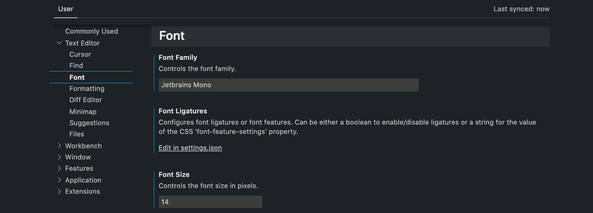

[TOC]

### Vscode插件

#### 0. 同步功能Sync

​	在vscode中下载了插件以及配置了settings之后，可以开启`Settings Sync`，在打开了设置`settings`之后可以在右上角看到。`sync`的作用以及注意事项参考[Settings Sync](https://code.visualstudio.com/docs/editor/settings-sync)。

[高效搬砖：我的VS Code配置分享和插件推荐](https://my.oschina.net/u/4593024/blog/4549653/)

#### `open in browser` & `Live Server`

`open in browser`：This allows you to open the current file in your default browser or application.

`Live Server`：Launch a development local Server with live reload feature for static & dynamic pages，当代码进行保存的时候可以即时地更新页面。

****

#### `Auto Rename Tag` `Bracket Pair Colorizer 2` `Highlight Matching Tag`

`Auto Rename Tag`：html标签同步更改。

 `Bracket Pair Colorizer 2`：会把不同的匹配括号用不同颜色标注出来，更容易找到配对的括号。

 `Hightlight Matching Tag`：点击一个标签之后，会在所配对的标签下面用underline标注出来。

------------

####  `gitlens`

`gitlends`：gitlens可以看到git pull下来的所有文件的改动记录，并且观看代码的改动。

---

#### `todo tree`

`Todo Tree`：记录关键字，比如`todo`，会以一棵树的方式在侧栏记录，点击后跳转到记录的位置。可以配置相关关键字以及highlight的颜色、方式等。

​		`todo tree` > `Extension Settings` > `Edit in settings.json` 

```json
// settings.json
{
    "todo-tree.tree.showScanModeButton": false,
    "todo-tree.general.tags": [
        "NOTE:",
        "FIX:",
        "TODO:",
    ],
    "todo-tree.general.tagGroups": {
        "TODO:": ["todo:"]
    },
    "todo-tree.regex.regexCaseSensitive": false,
    "todo-tree.highlights.defaultHighlight": {
        "foreground": "#fff",
        "icon": "check",
        "type": "text",
        "iconColour": "#6dd5ed",
        "borderRadius": "5px",
    },
    "todo-tree.highlights.customHighlight": {
        "TODO:": {
            "icon": "alert",
            "background": "#f8b500",
            "iconColour": "#f8b500"
        },
        "FIX:": {
            "background": "#ef475d",
            "icon": "tools",
            "iconColour": "#ef475d",
        },
        "NOTE:": {
            "background": "#B06AB3",
            "icon": "list-unordered",
            "iconColour": "#B06AB3",
            "rulerLane": "full"
        },
    },
    "todo-tree.regex.regex":"((//|#|<!--|;|/\\*)\\s*($TAGS)|^\\s*- \\[ \\])",
}
```

#### 跳转：`CSS Peek`

​	可以在元素的类名上预览样式具体内容。

****

#### Theme： `Atom one dark Theme` or `Oceanic next`

​	个人比较偏好`Oceanic next`

****

#### 预览：`image preview` & `color highlignt`

`Image preview`：悬停可以预览照片。

`color highlight`：颜色值可以直接在代码中显示出来。

#### 字体：`JetBrains Mono`

参考：[字体官方下载](https://www.jetbrains.com/lp/mono/)，下载完打开`font`文件夹内的所有文件，下载到本机当中。在vscode的`settings > user > Text Editor > Font > Font Family`输入`Jetbrains Mono`。 



​	在Font Family下面的Font Ligatures，有`Edit in settings.json`可以设置其他参数，比如调整字体大小和行间距，这个字体和行间距比较舒服：

```js
{
  	"editor.fontSize": 14,
    "editor.lineHeight": 22,
}
```

****

#### Project Manager

​	每个文件打开之后可以保存其路径，并且在侧边栏给这个路径保存一个名字；下次直接点击这个名字就可以打开这个文件，方便多文件之间的切换。

****

### Vscode git

​		`Source Control`栏：`Changes`文件夹保存本地修改过的代码的文件，通过在修改文件后的`+`可以将文件添加到`Stage Changes`，`commit`按钮可以将代码放在准备push的栈（commit之前记得在Message的input框中填写本次commit的内容），然后在`···`中的`push`将代码push上去。

​		同时如果想要pull/clone代码，也可以通过`···`中的`pull `/ `clone` 进行操作。

****

### Vscode C++

​	参考：[在mac上使用vscode创建第一个C++项目](https://blog.csdn.net/brazy/article/details/92801958)。

​	1.`clang`：mac使用，相当于linux、window使用的GCC

​	3.`C++插件`：