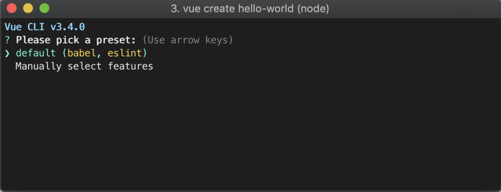
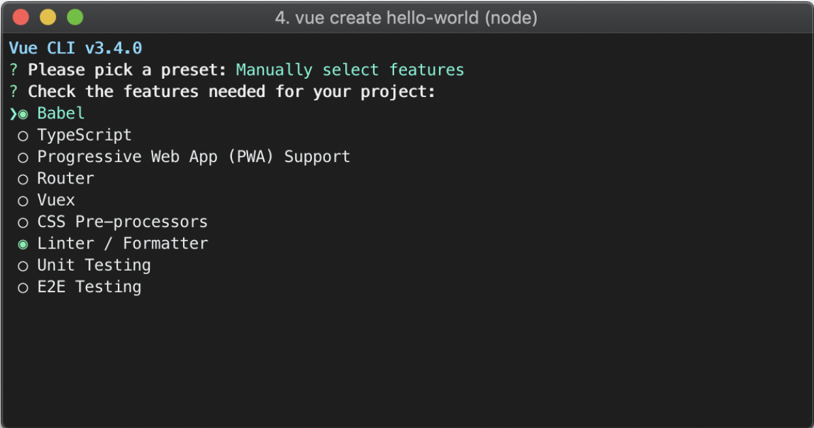

### Vue入门

[TOC]

# DONE

#### 引入Vue

```html
<!-- 开发环境版本，包含了有帮助的命令行警告 -->
<script src="https://cdn.jsdelivr.net/npm/vue/dist/vue.js"></script>
```

```html
<!-- 生产环境版本，优化了尺寸和速度 -->
<script src="https://cdn.jsdelivr.net/npm/vue"></script>
```

> 使用vue-cli脚手架构建vue项目
>
> https://cli.vuejs.org/zh/


#### 声明式渲染

Vue.js 的核心是一个允许采用简洁的模板语法来声明式地<u>将数据渲染进 DOM</u> 的系统：

```html
<div id="app">
  {{ message }}
</div>
```

```js
var app = new Vue({
  el: '#app',
  data: {
    message: 'Hello Vue!'
  }
})
```

除了文本插值，我们还可以绑定元素属性：

```html
<div id="app">
  <span v-bind:title="message">
  	将鼠标放放在上面悬停几秒
  </span>
</div>
```

```js
var app = new Vue({
  el: '#app',
  data: {
    message: '页面加载于' + new Date().toLocaleString()
  }
})
```

`v-bind` attribute 被称为**指令**。指令带有前缀 `v-`，以表示它们是 Vue 提供的特殊 attribute。

在这里，该指令的意思是：“将这个元素节点的 `title` attribute 和 Vue 实例的 `message` property 保持一致”


#### 命令式与声明式

> **命令式**：一步一步告诉程序如何去做，能否达成结果取决于开发者的设计。（用jQuery操作DOM）
> **声明式**：只告诉程序想要什么结果，如何达成由程序保证，开发者不用关心。

> 需求：展示今天的日期，如果是周日就用粉色的字，否则用蓝色。

命令式渲染，使用jQuery：

```html
<div class="box"></div>
```

```js
// JS
let today = new Date();
let color = today.getDay() === 0 ? 'pink' : 'lightBlue';
let box = $('.box');
box.text(today.toLocaleDateString()); 
box.css('color', color);
```

声明式渲染实现的是，DOM 随状态（数据）更新而更新。用 Vue 实现上述功能，代码如下：

```html
<div id="root">
  <div :style="boxStyle">{{today}}</div>
</div>
```

```js
// JS
new Vue({
  el: '#root',
  data: {
    today: '',
    boxStyle: {
      color: ''
    }
  },
  mounted() {
    let now = new Date();
    this.today = now.toLocaleDateString();
    this.boxStyle.color = now.getDay() === 0 ? 'pink' : 'lightBlue';
  }
});
```


#### 条件与循环

##### v-if

```html
<div id="app">
  <p v-if="seen">
    现在你看到我了
  </p>
</div>
```

```js
var app = new Vue({
  el: '#app',
  data: {
    seen: true
  }
})
```

这个例子演示了我们不仅可以把数据绑定到 DOM 文本或 attribute，还可以绑定到 **DOM 结构**。

##### v-if vs. v-show的区别

实例演示

详细解释： https://cn.vuejs.org/v2/guide/conditional.html#v-if-vs-v-show

##### v-for

```html
<div id="app">
  <ol>
    <li v-for="todo in todos">
      {{ todo.text }}
    </li>
  </ol>
</div>
```

```js
var app = new Vue({
  el: '#app',
  data: {
    todos: [
      { text: '学习 JavaScript' },
      { text: '学习 Vue' },
      { text: '整个牛项目' }
    ]
  }
})
```

#### 与用户交互

为了让用户和你的应用进行交互，我们可以用 `v-on` 指令添加一个事件监听器，通过它调用在 Vue 实例中定义的方法：

```html
<div id="app">
  {{count}}
  <button v-on:click="increase">+1</button>
  <button v-on:click="decrease">-1</button>
</div>
```

```js
var app = new Vue({
  el: '#app',
  data: {
    count: 0
  },
  methods: {
    increase() {
      this.count++;
    },
    decrease() {
      this.count--;
    }
  }
})
```

我们更新了应用的状态，但没有触碰 DOM——所有的 DOM 操作都由 Vue 来处理，你编写的代码只需要关注逻辑层面即可。

#### 处理用户输入

```html
<div id="app">
  <p>{{message}}</p>
  <input v-model="message">
</div>
```

```js
var app = new Vue({
  el: '#app',
  data: {
    message: 'Hello Vue'
  }
})
```

#### 组件化构建应用

```html
<div id="app">
  <ol>
    <todo-item></todo-item>
    <todo-item></todo-item>
  </ol>
</div>
```

```js
Vue.component('todo-item', {
  template: '<li>这是待办项</li>'
});
var app = new Vue({
  el: '#app',
})
```

##### 给组件传值

```js
Vue.component('todo-item', {
  props: ['todo'],
  template: '<li>{{todo}}</li>'
})
var app = new Vue({
  el: '#app',
  data: {
    todoList: ['学习js', '学习Vue', '整个项目']
  }
})
```

```html
<div id="app">
  <ol>
    <todo-item v-for="item in todoList" v-bind:todo="item"></todo-item>
  </ol>
</div>
```

##### 验证prop

```js
Vue.component('my-component', {
  props: {
    // 基础的类型检查 (`null` 和 `undefined` 会通过任何类型验证)
    propA: Number,
    // 多个可能的类型
    propB: [String, Number],
    // 必填的字符串
    propC: {
      type: String,
      required: true
    },
    // 带有默认值的数字
    propD: {
      type: Number,
      default: 100
    },
    // 带有默认值的对象
    propE: {
      type: Object,
      // 对象或数组默认值必须从一个工厂函数获取
      default: function () {
        return { message: 'hello' }
      }
    },
    // 自定义验证函数
    propF: {
      validator: function (value) {
        // 这个值必须匹配下列字符串中的一个
        return ['success', 'warning', 'danger'].indexOf(value) !== -1
      }
    }
  }
})
```

##### 父子组件通信

```html
<div id="app">
	<child-component v-on:say="handleSend"></child-component>
</div>
```

```js
Vue.component('child-component', {
  template: `
    <div>
    <button v-on:click="send">向父组件通信</button>    
    </div>
  `,
  methods: {
    send() {
      this.$emit('say', 'Hello parent');
    }
  }
})
var vm = new Vue({
  el: '#app',
  methods: {
    handleSend(value) {
      console.log(value);
    }
  }
})
```


#### Vue生命周期

参考资料：

https://juejin.im/entry/6844903602356502542

https://blog.csdn.net/xdnloveme/article/details/78035065


**created**:在模板渲染成html前调用，即通常初始化某些属性值，然后再渲染成视图。

**mounted**:在模板渲染成html后调用，通常是初始化页面完成后，再对html的dom节点进行一些需要的操作。

#### 缩写

##### v-bind缩写

```html
<!-- 完整语法 -->
<a v-bind:href="url">...</a>

<!-- 缩写 -->
<a :href="url">...</a>

<!-- 动态参数的缩写 (2.6.0+) -->
<a :[key]="url"> ... </a>
```

##### v-on缩写

```html
<!-- 完整语法 -->
<a v-on:click="doSomething">...</a>

<!-- 缩写 -->
<a @click="doSomething">...</a>

<!-- 动态参数的缩写 (2.6.0+) -->
<a @[event]="doSomething"> ... </a>
```

#### 使用Vue-CLI创建项目

Vue-CLI官网：https://cli.vuejs.org/zh/

##### 安装

环境要求：node.js

```sh
npm install -g @vue/cli
# OR
yarn global add @vue/cli
```

##### 创建一个新项目

```sh
vue create hello-world
```





- [x] `Babel` 主要是对es6语法转换成兼容的js 

- [ ] `TypeScript` 支持使用TypeScript语法来编写代码

- [ ] `PWA` [PWA](https://developers.google.com/web/progressive-web-apps/) 支持

- [x] `Router` 支持vue路由配置插件

- [x] `Vuex` 支持vue程序状态管理模式

- [ ] `CSS Pre-processors` 支持css预处理器

- [ ] `Linter / Formatter` 支持代码风格检查和格式化 

- [ ] `Unit Testing` 单元测试

- [ ] `E2E Testing` E2E测试