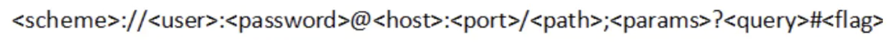
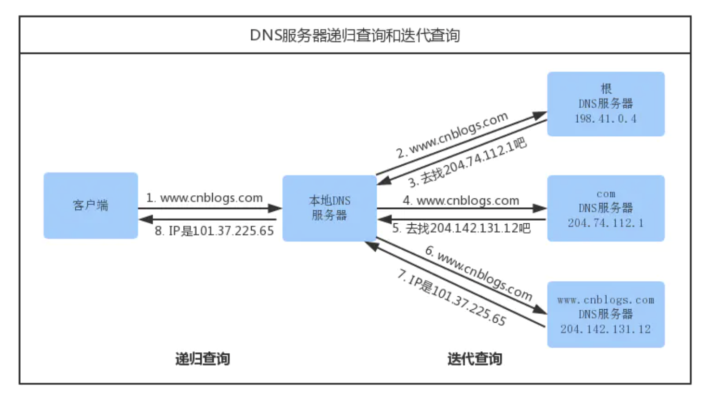
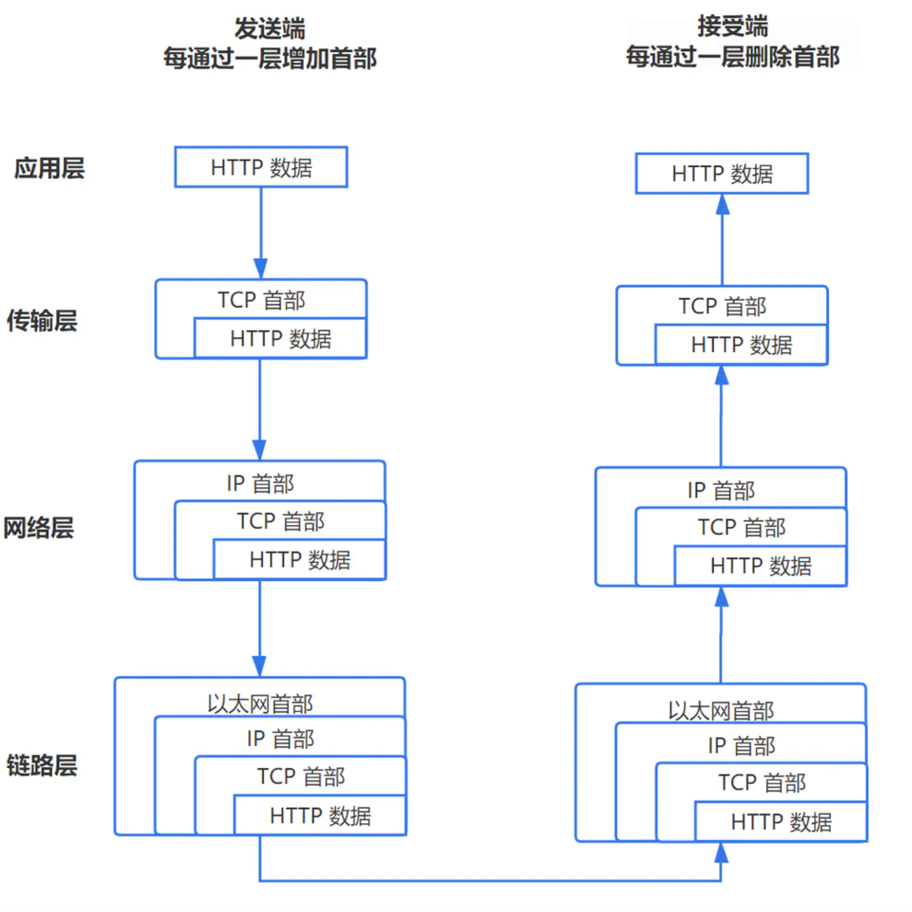
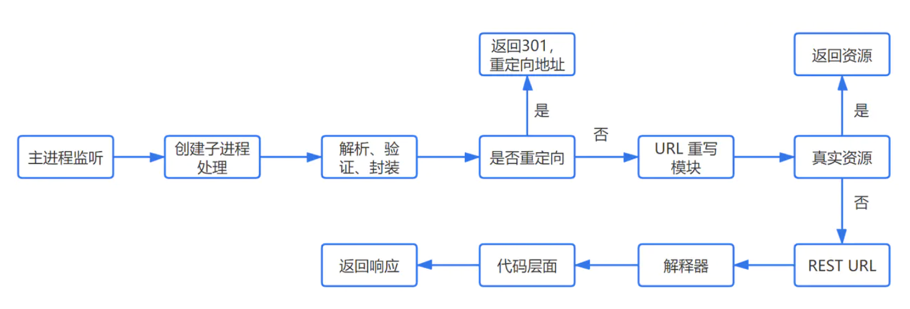

### 在浏览器输入URL回车之后会发生什么

[TOC]

#### 一、URL解析

URL一般格式：

http://www.imooc.com/article/draft/id/430 这个网址缺少了一些东西，端口号，用户名，密码，query和flag都没有。这些东西都是非必须的，甚至协议、路径都可以不要，最简洁的方式为imooc.com，浏览器会对一些默认的东西进行补齐。例如：互联网url默认端口号为80，浏览器默认补齐功能会补齐协议http，有些还会直接在域名前面补上www。所以实际上，即使我们输入的是imooc.com，然而实际访问的却是http://www.imooc.com。

##### 地址解析

首先判断你输入的是一个合法的 URL 还是一个待搜索的关键词，并且根据你输入的内容进行自动完成、字符编码等操作

##### HSTS

由于安全隐患，会使用 HSTS 强制客户端使用 HTTPS 访问页面。详见：[你所不知道的 HSTS](https://www.barretlee.com/blog/2015/10/22/hsts-intro/)。

**其他操作**

浏览器还会进行一些额外的操作，比如安全检查、访问限制（之前国产浏览器限制 996.icu）。

##### 检查缓存

HTTP状态码：https://www.runoob.com/http/http-status-codes.html

#### 二、DNS查询

DNS：域名系统（Domain Name System）是互联网的一项服务。它作为将域名和IP地址相互映射的一个分布式数据库，能够使人更方便地访问互联网。

##### 1. 浏览器缓存

浏览器会先检查是否在缓存中，没有则调用系统库函数进行查询。

##### 2. 操作系统缓存

操作系统也有自己的 DNS缓存，但在这之前，会向检查域名是否存在本地的 Hosts 文件里，没有则向 DNS 服务器发送查询请求。

##### 3. 路由器缓存

路由器也有自己的缓存。

##### 4. ISP DNS 缓存

ISP DNS 就是在客户端电脑上设置的首选 DNS 服务器，它们在大多数情况下都会有缓存。

##### 根域名服务器查询

在前面所有步骤没有缓存的情况下，本地 DNS 服务器会将请求转发到互联网上的根域，下面这个图很好的诠释了整个流程：

DNS原理：http://www.ruanyifeng.com/blog/2016/06/dns.html

#### 三、TCP连接

#### 四、服务器处理请求

##### HTTPD（即**HTTP Daemon**，[超文本传输协议](https://zh.wikipedia.org/wiki/超文本传输协议)[守护程序](https://zh.wikipedia.org/wiki/守护进程)的简称）

最常见的 HTTPD 有 Linux 上常用的 Apache 和 Nginx，以及 Windows 上的 IIS。

它会监听得到的请求，然后开启一个子进程去处理这个请求。

##### 处理请求

接受 TCP 报文后，会对连接进行处理，对HTTP协议进行解析（请求方法、域名、路径等），并且进行一些验证：

- 验证是否配置虚拟主机
- 验证虚拟主机是否接受此方法
- 验证该用户可以使用该方法（根据 IP 地址、身份信息等）

##### 重定向

假如服务器配置了 HTTP 重定向，就会返回一个 `301`永久重定向响应，浏览器就会根据响应，重新发送 HTTP 请求（重新执行上面的过程）。

##### URL 重写

然后会查看 URL 重写规则，如果请求的文件是真实存在的，比如图片、html、css、js文件等，则会直接把这个文件返回。

否则服务器会按照规则把请求重写到 一个 REST 风格的 URL 上。

然后根据动态语言的脚本，来决定调用什么类型的动态文件解释器来处理这个请求。

#### 五、浏览器接受响应

浏览器接收到来自服务器的响应资源后，会对资源进行分析。

首先查看 Response header，根据不同状态码做不同的事（比如上面提到的重定向）。

如果响应资源进行了压缩（比如 gzip），还需要进行解压。

然后，对响应资源做缓存。

接下来，根据响应资源里的 [MIME](https://developer.mozilla.org/zh-CN/docs/Web/HTTP/Basics_of_HTTP/MIME_types) 类型去解析响应内容（比如 HTML、Image各有不同的解析方式）。

#### 六、渲染页面

 [浏览器渲染原理.md](浏览器渲染原理.md) 

#### 参考资料

在浏览器输入地址发生了什么？：https://juejin.im/post/6844903795101532173

在浏览器输入URL回车之后发生了什么：https://juejin.im/post/6844903922084085773

