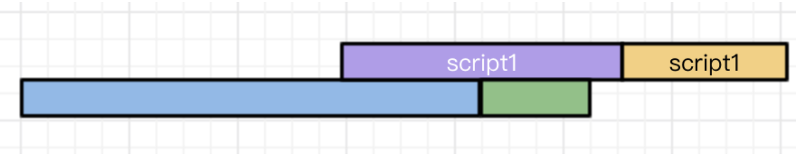
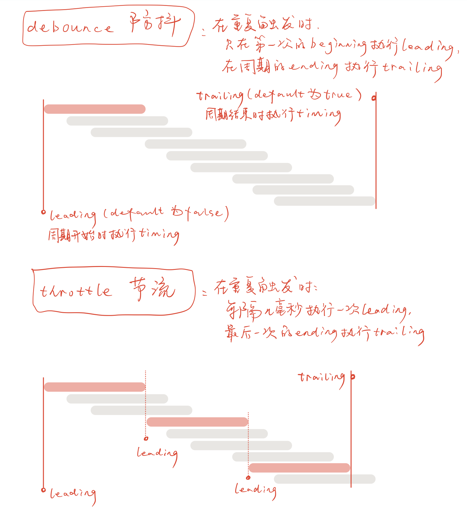

[TOC]

# 1. 概念部分

## 0. var变量提升

参考：[var变量的提升](https://www.cnblogs.com/shmilynanmei/p/9151769.html)。

### `var` 函数提升 & 变量提升

> 首先js引擎在读取js代码时会进行两个步骤，第一个步骤是解释，第二个步骤是执行。
>
> **解释**：就是会先通篇扫描所有的js代码，然后把所有声明提升到顶端，第二步才是执行。
>
> **IMPO**：声明包括`函数声明`和`变量声明`，而且注意的是只把声明提升了，赋值等其他的内容还是按照原顺序。

> 所谓的`变量提升`，就是**把变量声明提升到当前执行环境的最顶端**(本级域内的最顶端)。
>
> ```js
> console.log(a); //undefined
> var a = 10;
> 
> //上述的这段代码首先经过js引擎的解释，解释成：
> var a;
> console.log(a); //undefined
> a = 10;
> ```
>
> 除了`变量声明提升`，还有`函数声明提升`，并且后者提升在前者提升上面。
>
> ```js
> foo();
> function foo() {
> console.log('aaa');
> }
> 
> //上述的这段代码，解释成：
> function foo() {
> 	console.log('aaa');
> }
> foo(); //aaa
> ```
>
> ```js
> foo();
> foo = function foo() {
> console.log('aaa');
> }
> 
> //上述的这段代码，解释成：
> var foo; //声明提升，从赋值语句中直接解释出来的
> foo(); //foo is not a function
> foo = function() {
> console.log('aaa');
> }
> ```
>
> ```js
> console.log(foo); // (1)
> var foo = 10;
> function foo() {
> console.log(10); // (2)
> }
> console.log(foo); // (3)
> 
> //上述的代码解释成：
> function foo() {
> console.log(10);
> } //函数声明在最上面
> var foo; //变量声明
> console.log(foo) //(1) foo(){ console.log(10); }
> foo = 10;
> function foo() {
> console.log(10); //(2) 10
> } 
> console.log(foo); //(3) 10
> ```

### `let` 无变量提升 & 暂时性死区

> `let`命令要求必须在使用变量之前就把变量声明完毕，如果按照var的方式，会报错而不是返回`undefined`
>
> ```js
> console.log(a); //ReferenceError: a is not defined
> let a = 10; 
> ```
>
> 因为在使用`let`命令声明变量的时候，必须保证变量的声明在变量使用之前，即如果使用了`let`命令，顺序必须严格按照`声明变量 -> 使用变量`的顺序，如果不按照顺序就会进行报错。因此在一下情况下，就算在外部定义了一个全局作用的变量，如果在内部使用了`let`命令，就会隔绝外部的作用，也必须在本域内严格按照`声明变量 -> 使用变量`。
>
> ```js
> var tmp = 10;
> if (true) {
> tmp = 100; //ReferenceError: tmp is not defined
> let tmp;
> }
> ```
>
> 在上面的这种情况下，首先遍历代码找到`let`命令：`let tmp;`。然后隔绝了`tmp`全局定义的作用，即`tmp`被绑定在本区域内--if函数内部，于是外部`var`声明的全局性就无法作用在该函数内部。这时候判断`tmp = 100;`是在`let`命令声明变量之前，就会报错Error。

### IIFE（立即执行函数）

参考：[说一说JS的IIFE](https://www.cnblogs.com/yiven/p/8462666.html)。

> IIFE（Immediately Invoked Function Expression，立即调用的函数表达式），声明函数的同时立即调用这个函数，是JS为了弥补`var`命令声明的时候可能引起的作用域泄漏的问题解决方式。
>
> 写法： `()()` / `(())`，在第一个左括号后添加想要立即执行的函数。
>
> ```js
> // ()()
> (function foo(){
> var a = 3;
> console.log(a);
> })()
> ```
>
> ```js
> // (())
> (function foo(){
> var a = 3;
> console.log(a);
> }())
> ```
>
> 使用IIFE就可以解决变量作用域泄漏的问题：
>
> ```js
> var a = 2;
> (function IIFE(global){
>  var a = 3;
>  console.log(a); // 3
>  console.log(global.a); // 2
> })(window);
> 
> console.log(a); // 2
> ```

## 1. var声明的全局变量以及局部变量问题

​	1.var定义局部变量：**以函数为单位的**函数内外比较产生的全局性与局部性。在《JavaScript高级程序设计》书中指出：

> 使用var操作符定义的变量将成为定义该变量的作用域中的局部变量。也就是说，如果在函数中使用var定义一个变量，那么这个变量在函数退出后就会被销毁。
>
> ```js
> function test() {
> var message = 'hi'; // 局部变量
> }
> test();
> alert(message); // error "message is not defined"
> ```

这里强调的是：函数内部与函数外部的关系，`var`声明的是局部变量（在函数内可用）。如果想要在函数内定义一个全局变量（即在函数执行完毕之后变量仍然存在），可以不使用`var`直接初始化一个变量。

> 创建一个全局变量：
>
> ```js
> function test() {
> message = "hi"; // 全局变量 ，不声明直接赋值
> }
> test();
> alert(message); // "hi"
> ```

​	2.在ES6中指出，var定义的是全局变量，let定义的是局部变量：**以代码块为单位的**函数内部的全局性和局部性。（每一对`{ }`为一个代码块。

> ```js
> function var_test() {
> for(var i=0; i<9; i++) { // var声明代码块的全局变量
> 		//pass
> }
> console.log(i); // 9
> }
> ```
>
> ```js
> function let_test() {
> for(let i=0; i<9; i++) { // let声明代码块的局部变量
> 		//pass
> }
> console.log(i); // error "i is not defined"
> }
> ```

​	总结：可以看到书中和ES6中讲解`var`的时候侧重点不同，一个强调**函数外的使用性**，一个强调**代码块外的使用性**。按照一般的需求：1.如果想要在**函数执行完毕**之后仍然**保留变量**：不要使用`var`；2.如果想要代码块执行完毕即**销毁变量**，使用`let`而不使用`var`。

​	但是官方不推荐使用函数外的全局变量：难维护。

> 局部作用域中定义的全局变量很难维护。
>
> 在严格模式`use "strict"`下，给未经声明的变量赋值会导致抛出`ReferenceError`错误。

****

## 2. 函数 与 方法的区别

​	参考：[函数和方法的区别](https://blog.csdn.net/qq_34952846/article/details/78943800)。

​	1.从定义上看：

> [函数]()(**function**)：是可以执行的javascript代码块，由javascript程序定义或javascript实现预定义。函数可以带有实际参数或者形式参数，用于指定这个函数执行计算要使用的一个或多个值，而且还可以返回值，以表示计算的结果。
>
> [方法]()(**method**)：是通过对象调用的javascript函数。也就是说，**方法也是函数，只是比较特殊的函数**。

​	2.更加直观的角度去理解：方法与对象有关，函数与对象无关

> 1. **函数**是一段代码，通过名字来进行调用。它能将一些数据（参数）传递进去进行处理，然后返回一些数据（返回值），也可以没有返回值。所有传递给函数的数据都是显式传递的。
>
> 2. **方法**也是一段代码，也通过名字来进行调用，但它`跟一个对象相关联`。
>
>    方法和函数大致上是相同的，但有两个主要的不同之处：
>
>    1. 方法中的数据是隐式传递的
>    2. 方法可以操作**类内部的数据**（请记住，对象是类的实例化–类定义了一个数据类型，而对象是该数据类型的一个实例化） -- 方法可以操作已在类中声明的私有实例（成员）数据。其他代码都可以访问公共实例数据。

​	3.C++与Java中的命名区别：

> [C++]()中：方法在C++ 中是被称为`成员函数`。因此，在 C++ 中的“方法”和“函数”的区别，就是“成员函数”和“函数”的区别。
>
> [Java]()中：诸如 Java 一类的编程语言只有“方法”。所以这时候就是“静态方法”和“方法”直接的区别。

****

## 3. `<script>` 为什么放在html文件的body内部的最后为好？

参考：[浅谈script标签中的async和defer](https://www.cnblogs.com/jiasm/p/7683930.html)、[你不知道的 DOMContentLoaded](https://zhuanlan.zhihu.com/p/25876048)。

### `<script>` 放在html的 `<body>` 内部的最后并非是最优。最优的是利用好  `async` 和 `defer` 。

​		参照[虚拟DOM和真实DOM](../VUE/vue问题汇总)，理解渲染过程。

​		A: 在解决这个问题之前，先确认概念「首屏」和「最终效果屏」。

> `Render Tree`（渲染树）是`DOM Tree`和`CSS Rule Tree`共同构造出来。而JS可以通过DOM API和CSSOM API接口分别对DOM Tree和CSS Rule Tree进行修改，从而构造最后的Render Tree。因此可以将这个过程分类成两种情况：
>
> 1. JS没有通过API修改形成的Render Tree
> 2. JS通过API修改形成的Render Tree
>
> 在讨论这个问题之前，**首屏**指的就是``JS没有通过API修改DOM Tree和CSS Rule Tree而形成的Render Tree渲染出来的页面``。而**最终效果屏**则指的是`JS通过API修改DOM Tree和CSS Rule Tree最终形成的Render Tree渲染出来的页面`。
>
> 在这种首屏的情况下，只对HTML里面的元素进行渲染，而没有JS修改。
>

​		B: 而JS会阻塞`DOM Tree`和`CSS Rule Tree`的构造。

> 浏览器加载一个有` <script>`标签的网站发生的事情:
>
> 1.拉取 HTML 页面 (e.g. index.html)，开始解析 HTML
>
> 2.解析到`<script>`标签之后准备获取 script 文件.
>
> 3.浏览器获取script文件。同时，html 解析中断并且**阻断**页面上其他html的解析。
>
> 4.一段时间后，script下载完成并且**执行**。继续解析HTML文档的其他部分（解析script之后的html代码）
>
> 在第三步中，浏览器获取script文件，会阻断页面上其他html的解析，也就是无法继续构造DOM Tree，直到script完全下载完成，才会进行第四步继续构造DOM Tree。

​		在理解了A和B两个部分之后，也就能看出：把script标签放在<body>的底部，可以防止script阻断DOM的构造，通过一定的参数设定使得在最终效果屏出来前，能加载出一个首屏。比如有时候加载一个网页，可能就会出现这样的首屏（只有内容，很丑），没有样式的修改。即`FOUC`：由于浏览器渲染机制（比如firefox），在CSS加载之前，先呈现了HTML，就会导致展示出无样式内容，然后样式突然呈现的现象；

​		但是对最终效果屏来说，二者都需要等待script文件下载并执行完毕才能够出来，因此是无差别的。

### async & defer

​		`async`和`defer`都不会产生上述的阻断`DOM Tree`构造，即运用了这两个属性，script的下载不会阻断html的解析。

​		`async`：async标记的Script异步执行下载，并执行。**重点：不用等待别人，加载完毕即执行。**

```html
<!-- 
异步执行需要关注两点：
1.不用顾虑前件script是否加载完毕，只要是script就可以立马进行加载，并行加载
2.不用考虑前件script是否执行完毕，只要是加载完毕就可以立马执行
-->
<script type="text/javascript" src="script1.js" async></script>
<script type="text/javascript" src="script2.js" async></script>
<!-- script2可能会比script1更早执行完毕 -->
```

​		`defer`：defer标记的Script顺序执行。**重点：顺序执行，加载完毕需等待前者执行完毕。**

```html
<!-- 
顺序执行需要关注两点：
1.不用顾虑前件script是否加载完毕，只要是script就可以立马进行加载，顺序执行仍然是并行加载script
2.等待前件script执行完毕，只有前件script执行完毕之后才能执行
-->
<script type="text/javascript" src="script1.js" async></script>
<script type="text/javascript" src="script2.js" async></script>
<!-- 这意味着虽然script2可能加载比script1更早完成，但是一定要等待script1执行完毕 -->
```

​		**值得注意的是，script的下载都是并行的**。用以下三张图理解区别：

图中`蓝色：html解析`、`紫色：script加载`、`黄色：script执行`、`绿色：DOMContentLoaded`。

`无属性script`：

```html
<script type="text/javascript" src="script2.js"></script>
<script type="text/javascript" src="script1.js"></script>
```


`async`：

```html
<script type="text/javascript" src="script2.js" async></script>
<script type="text/javascript" src="script1.js" async></script>
```




`defer`：

```html
<script type="text/javascript" src="script2.js" defer></script>
<script type="text/javascript" src="script1.js" defer></script>
```


- [x] defer总是会比async稳定。

  ​	首先理解`DOMContentLoaded`的含义：HTML文档被加载和解析完成。

  > ​	比如你打开这篇博客时，可能并不需要等所有图片都加载完成，而是看到博客的正文就可以正常阅读了。把上面的话提炼一下就是，用户有时候只需要在空白的网页上看见内容就可以了，而不需要等待所有内容都加载出来。那既然这样，回到刚刚的问题，我觉得衡量一个网页加载速度的一个方法就是“计算这个网页从空白到出现内容所花费的时间”。那怎么计算这段时间？[HTML5 规范](https://link.zhihu.com/?target=https%3A//www.w3.org/TR/html5/syntax.html%23the-end)已经帮我们完成了相应的工作，就是**当一个 `HTML 文档`被加载和解析完成后，DOMContentLoaded 事件便会被触发。**

  ​	再来看`defer`比`async`稳定的原因。

  > ​	我们可以看到async存在一种情况，即`DOMContentLoaded`可能会在`script`执行之前就已经执行。如果**脚本代码依赖于页面中的`DOM`元素**（比如代码语法高亮依赖script），那么就要避免`DOMContentLoaded`先于`script`执行。
  >
  > ​	而如果脚本并不关心页面中的DOM元素，则使用`async`也无妨。
  >
  > ​	如果不太能确定，那么使用defer总会比async稳定。

****

## 4. event-loop 事件循环

参考：[详解JavaScript中的Event Loop（事件循环）机制](https://www.cnblogs.com/cangqinglang/p/8967268.html)、[javascript的宏任务和微任务](https://blog.csdn.net/lc237423551/article/details/79902106)、[异步编程，一次搞懂javascript事件循环、宏任务与微任务执行顺序](https://www.bilibili.com/video/BV1Dr4y167MK?spm_id_from=333.999.0.0)。

### 4.1 js 单线程 + 同步任务

​	JS是单线程，只有一个主线程处理所有的任务；主线程通过 `执行栈` 选取任务执行，栈底为全局执行上下文。`执行栈` 的任务都是同步的。接下来出现的问题是，如果任务是异步的怎么办？

### 4.2 引入异步任务处理

​	主线程正常选取 `执行栈` 中的任务执行，异步任务也正常执行（按照同步一样结束）然后继续调用 `执行栈` 里的任务。另一边，异步任务执行完毕被挂起，返回成功之后，其结果被放到一个 `事件队列` 中。主线程一直执行任务，直到只有栈底的全局上下文，执行结束。

​	也就是说，在执行完毕之后，还有一些任务（ `事件队列` 中）未被执行，这时候引入宏任务和微任务以及事件循环的概念。

### 4.3 宏任务 & 微任务 及 事件循环

​	异步任务之间的优先级也有不同，其区别分为两个：`微任务(micro task)`（如 `new Promise()` 、 `new MutationObserver()` ） 和 `宏任务(macro task)` （如`setInterval()` 、 `setTimeout` ）。

​	按照同步任务+单线程的逻辑执行，就会忽略了事件队列中的任务。因此一轮的事件执行分为了：`微任务` => `同步任务` => `宏任务` 。

```js
// 1. 执行微任务，如
new Promise();

// 2. 正常执行 `执行栈` 中的任务

// 3. 执行宏任务，如
setTimeout(function microFunc(){...}, 0);
                                
// 顺序
Promise() >> 同步 >> SetTimeout(将其回调放入微任务栈) >> Promise.then() >> SetTimeout(micro)
```

​	但是宏任务中也可能进一步产生新的微任务，如 `setTimeout` 中的 `microFunc` 。也就是说，事件并不是一轮执行就能执行完全，因此产生了 `事件循环` 的概念。而类似 `setTimeout` 中产生的微任务，则在下一轮事件循环的开始执行。以下面为例：

```js
//  (*) => console.log('*')
setTimeout(a, 0);
new Promise(b).then(c);
d
// 'b' 'd' 'c' 'a'

// 第一轮
// 1. 执行微任务
'b';
// 2.0 正常执行
'd';
// 2.1 Promise.then()在正常执行之后
'c';
// 3. 宏任务
setTimeout();

// 下一轮
// 1. 执行微任务
'a';
```

:exclamation: 每次一个宏任务 和 每次所有微任务。

​	上面的意思是，在事件循环的时候，宏任务和微任务各有一个事件队列。

1. 碰到可以执行的宏任务，那么就执行队列头部的宏任务。
2. 执行完该宏任务，并非一次性执行队列中的所有宏任务，而是在执行完毕之后，进入下一个事件循环，查看微任务队列是否有微任务，有的话则将微任务队列的所有事件全部执行。
3. 然后再查看宏任务队列，执行下一个宏任务。

​	如此循环，把任务放到执行栈（Execution Stack）执行，直至所有的任务都执行完毕。可以看到，每执行一个宏任务，都进入下一个事件循环。

```js
// 手动触发 和 代码触发区别
let btn = document.querySelector('#btn')
btn.addEventListener('click', () => {
  queueMicrotask(() => {
    console.log('microtask 1');
  })
  console.log('1');
})
btn.addEventListener('click', () => {
  queueMicrotask(() => {
    console.log('microtask 2');
  })
  console.log('2');
})

// 手动触发 > 点击btn
1 > microtask1 > 2 > microtask 2
// 代码触发 > 实际上将两个click监听函数汇总成一个函数，即变成一个宏任务
btn.click();
1 > 2 > microtask 1 > microtask 2
```


## 5. 并发、并行、同步、异步

参考：[一个视频告诉你“并发、并行、异步、同步”的区别](https://www.bilibili.com/video/BV17V411e7Ua?spm_id_from=333.999.0.0)。

1. **并发和并行**：**并发（Concurrency）**是一个比较宽泛的概念，它单纯代表计算机能够同时执行多项任务。比如对于一个单核处理器，计算机可以通过分配时间片的方式实现，不同的任务交替往复地使用CPU。对于多核处理器，能够在不同的核心上处理不同的任务实现“同时”处理，而不用通过分配时间片，这就是**并行（Parallelism）**。
2. 同步和异步：是两种不同的编程模型。**同步（Synchronous）**代表需要等到前一个任务执行完毕之后才能够执行另一个任务，因此在同步中并没有并发或者并行的概念。异步（Asynchronous）则代表不同的任务之间并不会相互等待，各自执行。对于JS来说，由于是单线程编程语言，其异步是并发而非并行的，主要通过 callback 回调函数实现。

> ​	例如使用了 `fetch` 函数之后，执行到 `fetch` ，**不会一直等待其结束，而是会继续执行后续代码**（此即异步），等到 `fetch` 的网络请求返回了数据，才会继续执行其回调函数。

```js
console.log("Begin");

fetch("cat.jpg")
	.then((res) => res.blob())
	.then((blob) => {
  	addImage(blob);
  	console.log('Image loaded');
	})

console.log("End")

>>> Begin
>>> End
>>> Image loaded
```


## 6. 浅拷贝和深拷贝

参考：[浅谈JS中的浅拷贝和深拷贝](https://www.cnblogs.com/chengxs/p/10788442.html)、[一文读懂 Javascript 深拷贝与浅拷贝](https://mp.weixin.qq.com/s/7C4kq48eu2g0Q3AEBiNhhw)。


`浅拷贝`：拷贝开销小（不生成新的内存地址），拷贝完之后双方会互相影响。如果属性是基本类型，拷贝的就是基本类型的值，如果属性是引用类型，拷贝的就是内存地址 ，所以如果其中一个对象改变了这个地址，就会影响到另一个对象。

`深拷贝`：开销大，深拷贝是将一个对象从内存中完整的拷贝一份出来,从堆内存中开辟一个新的区域存放新对象,且修改新对象不会影响原对象。

```js
var a1 = {b: {c: {}};
          
var a2 = shallowClone(a1); // 浅拷贝方法
a2.b.c === a1.b.c // true 新旧对象还是共享同一块内存

var a3 = deepClone(a3); // 深拷贝方法
a3.b.c === a1.b.c // false 新对象跟原对象不共享内存
```

`赋值`：赋值、深拷贝、浅拷贝针对基本类型的时候，效果都是一样的，改变基本类型彼此不会影响；如果针对的是引用类型，当我们把一个对象赋值给一个新的变量时，**赋的其实是该对象的在栈中的地址，而不是堆中的数据**。也就是两个对象指向的是同一个存储空间，无论哪个对象发生改变，其实都是改变的存储空间的内容，因此，两个对象是联动的。可以看下面的例子：

=> `赋值`：引用类型赋值，无论内部是什么数据，都会相互影响。

=> `浅拷贝`： 引用类型浅拷贝，内部的基本类型不会相互影响，引用类型会相互影响。

=> `深拷贝`：引用类型深拷贝，内部基本类型、引用类型都不会互相影响。

```js
let obj1 = {name: 'init', arr: [1, [2,3], 4]};
let obj2 = obj1;
obj2.name = 'update';
obj2.arr[1] = [5,6];
>>> obj1: {name: 'update', arr: [1, [5,6], 4]}
>>> obj2: {name: 'update', arr: [1, [5,6], 4]}
let obj3 = shallowClone(obj1); //采用浅拷贝
obj3.name = '';
obj3.arr[1] = [7,8];
```


# 2. 运用

## 0. `==` 与 `===` 的使用

- [x] `==` 是更加宽松的判断（先转换后判断），比如`0 == ''`、`false == 0`返回都是true
- [x] `===` 是十分严格的判断，必须完全一致才会返回true

### `false` 的宽松等价？

```js
0 == '' == false
undefined == null
// 在if里
!undefined == !null == !0 == !'' == !false 

// 空对象和空数组都为真
if([]) == if({}) == if(true)
```

### 何时可巧妙使用 `==` ？

​	一般情况下最好使用 `===` ，但有时候可以使用宽松的判断。比如表示个数的时候，有可能以 `'1'` 的方式存放，有可能以 `1` 的方式存放；比如对一个空字符串判定的时候，`null` 、 `undefined` 都可能；一种办法是严格规定类型并使用 `===`，比如：

```js
let amount = amount * 1; // 保证amount是int类型
if(amount === 1) {
  console.log('只有1')
} else {
  console.log('大于1')
}
```

​	但是实际上以何种方式存储这个数据（string｜int）并无所谓，因为我们在意的只是数据本身的内容；就可以使用 `==` 来判断：

```js
if(amount == 1) //(amount === '1' || amount === 1)
if(str == null) //(str === null || str === 'undefined')
```


## 1. 深拷贝 和 浅拷贝 实现

浅拷贝

```js
// 1.展开运算符 ... - "Array"和"object"都一样
arr1 = [...arr];
dic1 = {...dic};
// 2.assign - "object?
let obj1 = {···};
let obj2 = Object.assign({}, obj1);
```

深拷贝

```js
// 1.stringify + parse - "Array"和"object"都一样
arr = [1, [2, 3]];
arr1 = JSON.parse(JSON.stringify(arr));
// obj 同理: obj1 = JSON.parse(JSON.stringify(obj));

// 2.使用 slice - "Array"
arr1 = [1, 2, 3 ,4];
arr = arr1.slice(0,4); //arr: [1, 2, 3, 4]

// 3. 自己实现
function deepClone(obj) {
  let newObj = obj instanceof Array?[]:{}; // 1. 对象?数组
  for(let item in obj) {
    let temp = typeof(obj[item])=='object'?deepClone(obj[item]):obj[item]; // 2. 引用?基础类型
    newObj[item] = temp; // 3. 赋值
  }
  return newObj;
}
```


## 2. 中断循环

### 2.0 forEach 和 map的区别

参考：[JS中Map和ForEach的区别](https://blog.csdn.net/qq_39207948/article/details/80357569)。

- [x] 相同点：forEach 和 map 都能遍历数组元素，对每个数组元素进行规定的function操作。二者对原数组都不会进行修改（除非你在function中直接对数组进行了操作）。
- [x] 不同点：forEach不接收返回结果（无return）；map接收返回结果，并且map返回的是一个新数组。

```js
let arr = [1, 2, 3];
let arr2 = arr.map((value, index) => {
  return value*2
})

arr // [1, 2, 3]
arr2 // [2, 4, 6]

// forEach不返回结果，如果要实现上述：
arr.forEach((value, index) => {
  arr[index] = value * 2;
})
```

​	一般来说，如果只需要读数组的数据，就可以使用 forEach；如果需要读完之后进行操作，使用 map 有 `return` 并且返回的新数组。

:exclamation: forEach 和 map 对遍历元素都是即时执行，并非等到上一个执行完毕之后才执行下一个。

```js
[1,2,3].forEach((item) => {
  setTimeout(() => console.log(`1000${item}`), 2000)
})

[1,2,3].map((item) => {
  setTimeout(() => console.log(`1000${item}`), 2000)
})

// 上面的两个都会在等待2s后直接弹出 10001 10002 10003
```

### 2.1 `for` => break & continue

`continue` ：结束本次循环，进入下一个循环。

`break` ：结束整个for（注意只会结束一层的for，如果嵌套的话不会结束外层）。

### 2.2 `switch` => break

```js
// switch 的 case 判断是全等号 ===，严格相等
switch(i) {
  case 25:
    console.log('25');
    break;
  case 26: 
    console.log('26');
    break;
  default:
    console.log('default');
}

// 不使用break会继续向前判断
let i = 25;
switch(i) {
  case 25:
    console.log('25');
  default:
    console.log('default');
}
// 25
// default
```

### 2.3 `forEach` => return

参考：[在Java8的foreach()中使用return/break/continue](https://blog.csdn.net/lmy86263/article/details/51057733)。

> **不能使用break和continue**这两个方法。
>
> 在一个方法的lambda表达式中使用return时，这个方法是不会返回的，而只是执行下一次遍历。

```js
testBreak() {
  const arr = [1, 2, 3, 4];
  arr.forEach(el => {
    console.log(`before break ${el}`);
    if(el > 2 ) return;
    // 如果return之后，下面的代码不会继续执行
    // 类似是continue的作用，本次的循环结束，进行下一个元素的操作
    console.log(`after break ${el}!!!!`);
  })
}
// before break 1
// after break 1!!!!
// before break 2 
// after break 2!!!!
// before break 3
// before break 4
```

### 2.4 `map` => return

参考：[js终止map循环_JavaScript 用 for 循环太 low？你是不是有什么误解](https://blog.csdn.net/weixin_39821189/article/details/110800385?utm_term=map遍历终止方法&utm_medium=distribute.pc_aggpage_search_result.none-task-blog-2~all~sobaiduweb~default-0-110800385&spm=3001.4430)。

> map, filter 和reduce等方法的目的是防止传入的内容发生改变。在FP(函数式编程)风格中，向这些方法传递一个数组将返回一个新集合，而原始集合则保持不变。
>
> map, filter 和reduce本身不能被终止；它们将一直迭代直到遍历完数组中的每一项。

```js
// map的中断和forEach一样
// 使用return会停止该元素的操作，后面的代码不再执行
// 然后执行后继元素的遍历操作
```


## 3. 防抖 `debounce` & 节流 `throttle`

参考：[vue , debounce 使用](https://www.jianshu.com/p/6b32337099db)，[防抖(debounce) 和 节流(throttling)](https://blog.csdn.net/hupian1989/article/details/80920324)、[浅谈 JS 防抖和节流](https://segmentfault.com/a/1190000018428170/)、[Lodash之throttle（节流）与debounce（防抖）总结](https://www.cnblogs.com/dreamsqin/p/11305028.html)。

深入实现：[由浅入深学习lodash的bebounce函数](https://segmentfault.com/a/1190000015312430)

- [x] 1. 只点击一次那么就不会触发`trailing`，即点击一次不会触发防抖｜节流。
- [x] 2. `leading`: 默认值为 `false`，即前缘触发函数。
- [x] 3. `trailing`: 默认值为 `true`，即后置触发函数。

理解图：



```js
import debounce from 'lodash/debounce';
import throttle from 'lodash/throttle';

export default {
  data: {
    this.funcName = debounce(this.funcName, 800, { leading: false, trailing: true});
  	this.anotherFunc = throttle(this.anotherFunc, 800, { leading: false, trailing: true});
    return { }
  }
  methods: {
    funcName() { },
    anotherFunc() { }
  }
}
```


## 4. instanceof & typeof

参考：[typeof与instanceof区别](https://www.jianshu.com/p/4ff2332228be)、[JS中typeof与instanceof的区别](https://www.cnblogs.com/Trr-984688199/p/6180040.html)。

参考：[instanceof - MDN](https://developer.mozilla.org/zh-CN/docs/Web/JavaScript/Reference/Operators/instanceof)。

```js
// typeof 判断 `数据类型`
// typeof 是一个一元运算操作符, 不是函数, 但可以使用圆括号
// 返回一个字符串, 该字符串说明运算数的类型
// undefined, boolean, number, string, object, function
// null会被认为是一个对象的空引用
let message = 'astring';
let messageObj = new String('astring');
typeof message // 'string'
typeof(message) // 'string'
typeof messageObj // 'object'
typeof(null) // 'object'
```

​	`instanceof` 运算符需要注意几个点：

1. prototype 可能会被更改，同一语句的返回值可能会被改变。
2. 字面量字符串不是 String。
3. 多全局对象情况下会产生非预期返回值。在浏览器中脚本可能需要在多个窗口之间进行交互，多个窗口意味着多个全局环境，不同的全局环境会有不同的全局对象，从而拥有不同的内置类型构造函数。因此可能都是 `Array` ，但却是不同全局对象构造函数的实例，因此在另一个全局环境中检测一个数组可能返回的不是数组。

```js
// instanceof `判断对象实例`
// instanceof 是对象运算符, object instanceof constructor, 返回 true| false
// 检测 constructor.prototype 是否存在于参数 object 的原型链上
// 1. 非幂等, 返回值可能会改变, 因为 prototype 可能会被修改
o instanceof Car // true
Car.prototype = {}; // 改变 prototype
o instanceof Car // false

// 2. 字面量字符串不是 String
let stringObj = new String('astring');
typeof messageObj; // object
messageObj instanceof String // true
let simpleString = 'this is a string';
simpleString instanceof String // false

// 3. 多全局对象
[] instanceof window.frames[0].Array // 可能返回 false
// [] 是的原型是 Array.prototype
// 但是另一个全局环境 window.frames[0]中的 Array.prototype 不是同一个
// Array.prototype !== window.frames[0].Array.prototype
```


## 5. 判断是否为数组

1. `value instanceof "Array"` : 正常情况下都能返回正确（假定只有一个全局执行环境）。**拥有一个弊端**：要返回 true，value 必须是一个数组，而且**还必须与 Array 构造函数在同个全局作用域中**（Array 是 window 的属性）。如果 value 是在另一个 frame 中定义的数组，那么就会返回 false。

2. `Array.isArray(value)` : 不管是在哪个全局执行环境中创建，但需要浏览器支持。

3. `Object.prototyle.toString.call(value)` : 在任何值上调用 Object 原生的 toString() 方法，都会返回一个 `[Object NativeConstructorName]` 格式的字符串。每个类在内部都有一个 [[class]] 属性，这个属性中就指定了上述字符串中的构造函数名。参考：[Object.prototype.toString.call()原理](https://blog.csdn.net/WCBandCTZ/article/details/115536202)。

   ```js
   return Object.prototype.toString.call(value) == "[object Array]"
   // “Array”, “Object”, “Function”, “Boolean”, “Number” 和 “String”
   // "Arguments", “Date”, “JSON”, “Math”, “RegExp”, “Error”；
   // [object Undefined] 和 [object Null]
   ```

   > ​	由于Object.prototype.toString()本身允许被修改，像Array、Boolean、Number的toString就被重写过，所以需要调用Object.prototype.toString.call(arg)来判断arg的类型，call将arg的上下文指向Object，所以arg执行了Object的toString方法。


## 6. 二维数组定义

```js
let dp = new Array(k).fill(undefined).map(() => new Array(n).fill(0));

// 错误做法：
// new Array(n).fill(0)是引用类型，改一个就全改
let dp = new Array(k).fill(new Array(n).fill(0));
dp[0][0] = 1; // [[1,0,0,0,0],[1,0,0,0,0],[1,0,0,0,0]]
```


## 7. call apply bind

​	`call` 和 `bind` 的传参都是以序列的方式，`aplly` 是以数组的方式；`call` 是即时执行，`bind` 是绑定不执行，并返回绑定后的函数，如果需要执行的话再执行。

```js
// 1. call 可以call别人的函数，改变this指向
let person = new Object();
person.name = 'sam';
person.sayName = function() {
  alert(this.name);
}

let newPerson = new Object();
newPerson.name = 'hey sam!';
person.sayName.call(newPerson); // hey sam!

// 2. bind只绑定不执行，返回绑定后的参数
let sayNewPerson = person.sayName.bind(newPerson);
sayNewPerson(); // hey sam!
```


## 8. for in 和 for of 区别？

参考：[for…in和for…of的用法与区别](https://blog.csdn.net/z591102/article/details/106757593/)。

​	`for in` 是遍历（object）键名，`for of` 是遍历（array）键值。

```js
// for in 只遍历`可枚举`属性（包括它的原型链上的可枚举属性）
for(let item in {a:1, b:2, c:3}) {
  // item: a, b, c
}

// array 的 index 也是可枚举属性
for(let item in [1,2,3,4]) {
  // item: 0,1,2,3
}
```

```js
// for of 在`可迭代`对象上创建一个迭代循环
// 包括Array，Map，Set，String，TypedArray，arguments 对象等等
for(let item of [1,2,3,4]) {
  // item: 1,2,3,4
}
```


# 3. 调试

## 1. console.*

参考：[console - MDN](https://developer.mozilla.org/en-US/docs/Web/API/console#outputting_text_to_the_console)、[JS 花式输出 | 你真的会用 console.log 吗？](https://www.bilibili.com/video/BV1Eq4y1t7C1?spm_id_from=333.999.0.0)。

​	`console.log(msg, [arr1, arr2...])` 可以嵌套 css 样式到输出中，使用 `%c` 符号，直至下一个 `%c` 之间的所有内容都会使用指定样式。

```js
console.log('%cA red messge', 'color: red');
console.log('%cRED%cBLUE%cdefault', 'color: red', 'color: blue', '');
```

​	也可以使用下面的 `console.` 。

```js
console.assert(![], 'that is falsy') // 判断是否为真，非真则报错指定信息
console.group('Level 2');
console.groupEnd(); // 相当于创建 log 的层级
```


# 4. 原理

## 1. typeof(null) === 'object'

​	`typeof(null)` 的输出为 `object` 其实是一个底层的错误。原因是在 JavaScript 初始版本中，值以 32 位存储，前 3 位表示数据类型的标记，其余位则是值。对于所有的对象，它的前 3 位都是以 `000` 作为类型标记。

​	早期版本中，`null` 被认为是一个特殊的值，用来对应 C 中的空指针，但 JavaScript 中没有 C 中的指针，所以 `null` 意味着什么都没有或者 void 并且以全0（32位）表示。因此当 JavaScript 读取 `null` 时，它的前三位 `000` 将它识别为对象类型。

## 2. 0.1 + 0.2 !== 0.3

## 3. null 和 undefined

> ​	JavaScript 的最初版本设置 `null` 表示“无”的**对象**（空对象指针），转为数值时为零；`undefined` 是一个表示“无”的原始**值**，转为数值时为 NaN。
>
> ​	心路历程：1.初始设计null的时候，借鉴了Java来设置出一个代表“无”的值，但是null是一个对象，并且能够隐式转化成0，很不容易发现错误。 2.为了填补null的坑，设计出来undefined，其被设计成一个“值”而不是“对象”，并且转换成数值为NaN。
>
> ```js
> typeof null // 'object'
> typeof undefined // 'undefined'
> 
> Number(null) // 0
> Number(undefined) // NaN
> ```
>
> 参考：[【JS】三、null和undefined的区别](https://www.bilibili.com/video/BV1Cq4y1k7Dg?from=search&seid=8276824949386555596&spm_id_from=333.337.0.0)。

> ​	Undefined 类型只有一个值，即 undefined。当声明的变量还未被初始化时，变量的默认值为 undefined。
>
> ```js
> let aValue;
> alert(aValue == undefined) // true
> alert(typeof undefined) // 'undefined'
> ```
>
> ​	Null 类型也只有一个值，即 null。null 用来表示尚未存在的对象，常用来表示函数企图返回一个**不存在的对象**。
>
> ```js
> alert(null == document.getElementById('notExistElement')); // true
> alert(typeof null) // 'object'
> ```
>
> ​	注意下面几个输出：
>
> ```js
> alert(null == undefined) // true
> alert(null === undefined) // false
> alert(typeof null == typeof undefined) // false
> ```
>
> 参考：[JS中Null与Undefined的区别](https://www.cnblogs.com/eastday/archive/2010/03/03/1677324.html)。


## 4. Enumerable 特性

