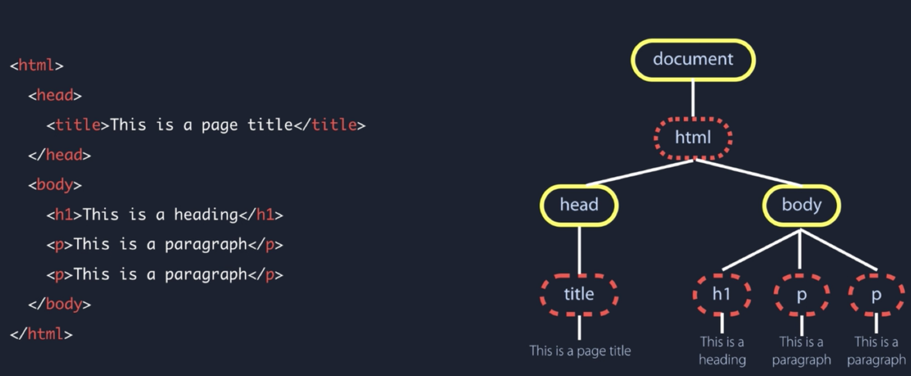

[TOC]

[p2p论坛](http://p2p.wrox.com)

## 一. JS简介

### 1.1 js、es、node.js

> **JS**：`JS`是由`ES(ECMAScript)`、`DOM`(浏览器文档对象)、`BOM`(浏览器对象模型)组成。
>
> **Node.js**：其中`Node.Js`就只有`ES`，目前浏览器比较流行的版本就是`ES6(ES2015)`，老浏览器的版本基本上都是`ES5`。所以`alert`和`document`不能在`Node`运行(因为`Node`没有`dom`和`bom`)。
>
> **ES**：ECMAScript就是对实现标准规定的各个方面内容的语言的描述。JS实现了ES，Adobe ActionScript同样也实现了ES。

****

### 1.2 DOM

​	首先理解HTML、CSS、JS三个所负责的任务。

1. HTML负责静态网页结构(structure)，也就是网页的元素一旦确定即不可修改。
2. CSS负责静态网页中元素的样式(style)。
3. JS负责将静态网页变成动态。

​	那么JS如何动态地去更改静态网页HTML元素？如图：通过对HTML的元素遍历生成一个DOM树，如果想要按需更改结构的话（比如点击按钮，浮现出一段文字）就是对这个DOM树操作。根据官方对DOM的定义理解：

> ​	文档对象模型（DOM，Document Object Model）是针对XML但经过扩展用于HTML的**应用程序编程接口**（API，Application Programming Interface）。DOM把整个页面映射为一个多层节点结构。HTML或XML页面中的每个组成部分都是某种类型的节点，这些节点又包含着不同类型的数据。
>
> ​	通过DOM创建的这个表示文档的树形图，开发人员获得了控制页面内容和结构的主动权。借助DOM提供的API，开发人员可以轻松自如地删除、添加、替换或修改任何节点。
>
> ​	**DOM提供访问和操作网页内容的方法和接口。**

图片来源：[为初学者准备的：DOM 速成](https://www.bilibili.com/video/BV1Nt411q73a?from=search&seid=16011203734396970827)。视频比较基础，没必要看。



​	也就是说，本来是静态网页的文档HTML，我们能够通过操作DOM来对静态文档进行动态更新。实际上**DOM就是一个提供操作的接口**。

​	DOM是接口！

​	DOM是接口！！

​	DOM是接口！！！

​	在DOM Tree中，最上层的元素是`document`。可以在`console`里面输入`document`获取整个页面的文档内容。

> ​	需要注意的是：**DOM并不只是针对JavaScript的**，很多别的语言也都实现了DOM。比如一些语言添加了特定语言相关的新方法和新接口：**SVG**（Scalable Vector Graphic，可伸缩矢量图）；MathML（Mathematical Markup Language，数学标记语言）；**SMIL**（Synchronized Multimedia Integration Language，同步多媒体集成语言）。

****

### 1.3 BOM

​	BOM（Browser Object Model，浏览器对象模型），开发人员使用BOM可以控制浏览器显示的页面以外的部分。比如说弹出新浏览器窗口的功能、移动缩放以及关闭浏览器的功能等。**但是BOM目前没有相关的标准（因此经常会导致问题）。HTML5致力于把很多BOM功能写入正式规范。**

> **BOM提供与浏览器交互的方法和接口。**

****

## 二. 在HTML中使用JavaScript

​	在HTML中使用JavaScript需要使用`<script>`元素：可以直接嵌入在`.html`文件中，也可以外部引用`.js`文件。

```html
<!-- 直接嵌入example.html中 -->
<script>
	function sayHi() {
    alert("Hi!");
  }
</script>
```

```html
<!-- 引用外部js文件 -->
<script type="text/javascript" src="./example.js"></script>
```

​	关于1.`script`标签放在`body`内容的末尾；2.配合`async`和`defer`使用`<script>`标签更优，详见JS问题汇总。

## 三. 基本概念

### 3.1 注释

```js
// 单行注释
/*
 * 多行注释，
 * 为了增加可读性，在每一行前面添加*
 */
```

****

### 3.2 关键字和保留字

​	1.**关键字**可用于表示控制语句的开始或结束，或者用语执行特定操作等。

```js
break 			do				instanceof		typeof
case				else			new						var
catch				finally		return				void
continue		for				switch				while
debugger		function	this					with
default			if				throw
delete			in				try
```

- [x] typeof：判断变量类型

- [x] switch

  > ```js
  > handle(e) {
  >   switch(e) {
  >     case 0:
  >       console.log('0');
  >     case 1:
  >       console.log('1');
  >   }
  > }
  > ```

- [x] debugger：用于产生断点

​	2.**保留字**还没有任何特定的用途，但它们有可能在将来被用作关键字。

```js
// ES5在非严格模式下运行时的保留字缩减为：
class			enum			extends			super
const			export		import
// 严格模式下
implements 		package			public
interface			private			static
let						protected		yield
```

- [x] `严格模式`：严格模式是为JavaScrip定义了一种不同的解释和执行模型。一些不确定的行为将得到处理，而且对某些不安全的操作也会跑出错误。

  ```js
  function doSomething() {
    "use strict";
    // pass
  }
  ```

### 3.3 变量

```js
var message; // 声明不赋值；message === 'undefined'
var str = 'hi'; // 声明并初始化
str = 100; // 可以改变类型，但是不建议
var paper = "hi",
    found = false,
    age = 29; // 声明并初始化多个变量
```

****

### 3.4 数据类型

​	

## Arr

变更方法（会变更调用了这些方法的原始数组）：push/pop/shift/unshift/splice/sort/reverse

非变更方法（返回一个新数组）：filter/concat/slice

map/reduce/forEach


​		