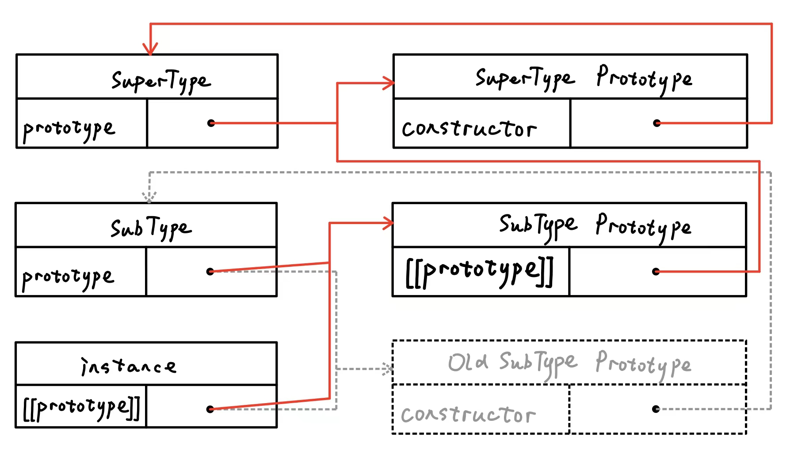

[TOC]

# 1. 对象声明

​	对象的声明可以使用两种方式：1.创建一个 `Object` 实例，然后再为它添加属性和方法。 2.对象字面量语法声明。

```js
// 创建实例后添加属性和方法
let person = new Object();
person.name = "Sam";
person.sayName = function() {
  alert(this.name);
}
```

```js
// 字面量语法
let person = {
	name: 'Sam',
  sayName: function() {
    alert(this.name);
  }
}
```

## 构造函数

​	任何函数，**只要通过 `new` 操作符来调用，那它就可以作为构造函数**；而任何函数，如果不通过 `new` 操作符来调用，那它跟普通函数也不会有什么两样。

```js
// 构造函数
let person = new Person("Nicholas");
person.sayName(); // "Nicholas"

// 普通函数
Person("Sam");
window.sayName(); // "Sam"
// ⚠️注意：
// 当在全局作用域中调用一个函数时，this 对象总是指向 Global 对象（在浏览器中就是 window 对象）
```

​	构造函数的弊端是**不同实例上的同名函数是不相等的**：同一个构造函数创建的实例，同名方法不是同一个 Function 实例。`person.sayName` 和 `window.sayName` 两个方法都是由 `Person` 实例化，完成的任务是相同的，但是实际上创建了两个完成同样任务的 Function 实例。

```js
person.sayName(); // "Nicholas"
window.sayName(); // "Sam"
```

1. 可以通过把 Function 函数定义放在构造函数外部，但是缺点是缺少了封装性，因此不考虑。
2. 使用原型模式，将共享的属性和方法放在原型对象中。

## 原型 prototype

​	构造函数的缺点引出原型 prototype 的解决方式，其目的是处理共享的属性的方法。

> 1. 原型、构造函数、实例
> 2. new 构造函数就能创建原型；实例属性根据原型链索引来获取
> 3. 避免字面量定义原型；prototype可以显式更改从而使旧实例断开连接
> 4. 构造函数模式创建引用属性，原型创建基础属性

### 原理 及 获取原型对象

​	需要厘清 `原型 prototype` 、`构造函数 constructor` 和 实例`instance` 三者的联系：

1. prototype 实际就是存储了共享属性和方法的对象。如果想要拥有此共享属性和方法的实例，就通过其构造函数来声明一个实例，即构造函数本质上就是原型的工具，通过此工具来创建实例。因此需要存放一个 `constructor` 来指明其工具（构造函数）是哪一个。
2. constructor 构造函数是工具，需要指明是谁的工具（为哪个原型创建实例），因此存放一个 `prototype` 来指明其所属。
3. instance 实例，是通过构造函数创建出来的。创建出来之后要知道拥有哪个原型的属性和方法，因此存放一个 `prototype` 来指明共享属性和方法所在的原型。

​	可以看到 instance 实例和 constructor 构造函数并没有直接联系，因为构造函数只是一个工具。构造函数及实例都要指明原型（工具所属和共享所在），因此二者没有联系，但都与原型有联系。**这个连接存在于实例与构造函数的原型对象之间，而不存在于实例与构造函数之间。**

​	如下图所示：


​	主要通过两种办法判断原型。

```js
// 构造函数/类的prototype
Person.prototype.isPrototypeOf(person1); // true

// 实例的__proto__
Object.getPrototypeOf(person1) == Person.prototype
person1.__proto__ == Person.prototype
```


### 创建Prototype 及 实例属性定义和获取（原型链）

​	那么如何去创建一个原型对象？

1. 只要创建了一个新函数，就会根据一组特定的规则为该函数创建一个 prototype 属性，这个属性指向函数的原型对象。e.g. 上图中的 `Person` 构造函数，就是在创建新函数的时候立即创建，并且拥有属性 `prototype`，其指向 `Person Prototype` 。
2. 在默认情况下，所有原型对象都会自动获得一个 `constructor` 属性，这个属性是一个**指向 `prototype` 属性所在函数**的指针。e.g. 上图中的 `Person Prototype` 原型对象，自动获取一个 `constructor` 属性，其指向 `Person`（`Person.prototype` 所在函数）。

​	:exclamation: 实例属性的定义：**实例定义的属性会屏蔽原型对象的同名属性，而非改写**。原型对象中定义的属性类似定义了默认值。而当在实例中添加了一个属性，如果原型对象中有该同名属性，实例就会屏蔽原型对象中的同名属性（默认值仍存在）。简单来说，无法通过修改实例属性而更改原型属性。

> ​	可以通过对象实例访问保存在原型中的值，但却不能通过对象实例重写原型中的值。
>
> ​	实例的属性与实例原型中的一个属性同名，那我们就在实例中创建该属性，该属性将会屏蔽原型中的那个属性。

​	:exclamation: 实例属性的查找：**属性的获取沿原型链向上查找**。一旦在实例中无法找到属性，就会通过原型链向上查找该属性（这也是“屏蔽”的含义所在，即实例不会改写原型对象的属性，因为一旦实例的属性通过某种方式删除(如delete)，就可以重新沿原型链找到原型对象的该同名属性）。**原型链实际就是实例在查找属性的时候沿着 `[[prototype]]` 从下往上查找，这个查找的链就是原型链。**

> ​	搜索首先从对象实例本身开始。如果在实例中找到了具有给定名字的属性，则返回该属性的值；如果没有找到，则继续搜索指针指向的原型对象，在原型对象中查找具有给定名字的属性。

```js
person1.name // "default", 返回的是原型对象的属性 person1.prototype.name

person1.name = "sam";
person1.name // "sam", 返回的是实例的属性 person1.name, 原型对象的同名属性被屏蔽(没被重写)
delete person1.name
person1.name // "default", 删除实例属性，被屏蔽的原型属性可以重新访问, 返回 person1.prototype.name
```

​	:exclamation: 实例属性的判断：当查找实例的属性的时候，可能返回的是实例自己的属性，也可能返回的是原型对象的属性。可以通过 `hasOwnProperty` 检测一个属性是存在于实例中，还是存在于原型中。

```js
// 只有给定属性存在于对象实例中，才会返回true
person1.name = "sam";
person1.hasOwnProperty(name); // true

// in: 只要能通过该对象访问到给定属性就返回true
"name" in person2 // true, 给定属性来自原型对象
```

​	

### 字面量定义 prototype 及 原型的动态性

​	**避免使用字面量定义对象原型**，因为字面量定义的时候相当于重写原型（新建了一个原型对象并且将 prototype 指向该原型对象，断开原来原型对象的连接）。

​	使用字面量定义 prototype 的时候需要注意显式定义 constructor，并且修改其 Enumerable 特性。

```js
function Person(){}

Person.prototype = {
  constructor: Person, // 如果不显式指明，则会重写成默认的Object构造函数, constructor: Object
  name: 'Sam',
  age: 25,
  sayName: function() {
    alert(this.name);
  }
}

// 以字面量这种方式会把 constructor 属性的[[Enumerable]]特性设置为true
// 需要进一步修改回 false
Object.defineProperty(Person.prototype, "constructor", {
  enumerable: false,
  value: Person
})
```

​	下面两个例子理解 “重写” 的造成的影响。**实例的 prototype 会指向声明时的原型(“旧的实例”和“旧的原型”保持联系)，构造函数的 prototype 则会因为重写而指向新原型。**可以通过 `Object.setPrototypeOf(o1, newPrototype)` 来设置新的原型，也可以通过字面量声明重写原型。

> ​	重写原型对象切断了现有原型与任何之前已经存在的对象实例之间的联系；它们引用的仍然是最初的原型。

```js
// 正常添加属性不会出错
let friend = new Person();
Person.prototype.sayHi = function() {
  alert("hi");
}
friend.sayHi(); // "hi"
```

```js
// 重写原型对象会出现问题
function Person() {}
let friend = new Person();

Person.prototype = {
  constructor: Person,
  name: 'Sam',
  age: 25,
  sayName: function() {
    alert(this.name);
  }
}
friend.sayName(); // error
```


### 构造函数模式 和 原型模式 组合使用

​	原型对象中的属性是共享的，但是如果原型属性中存在引用类型，那么实例的操作就会影响到其他实例。

```js
function Person() {}

Person.prototype = {
  constructor: Person,
  friends: ['Sam', "Stephen"]
}

let person1 = new Person();
let person2 = new Person();

person1.friends.push('Van');
person2.friends // "Sam, Stephen, Van", 实例 person1 影响实例 person2
```

​	可以组合使用构造函数和原型，**将引用类型的属性放在构造函数中**，则会各自分配其引用属性的空间。

```js
function Person(name, age) {
  this.name = name;
  this.age = age;
  this.friends = ['Sam', "Stephen"];
}

Person.prototype = {
  constructor: Person,
	sayName: function() {
    alert(this.name);
  }
}

let person1 = new Person('Nicholas', 29);
let persib2 = new Person('Sam', 25);
person1.friends.push('Van');
person2.friends // "Sam, Stephen"
```


### 总结及应用

​	关于原型：

> 1. 创建对象可以使用字面量创建的方式（包括基础类型、函数，都可以作为属性放在对象里）。在这种情况就碰到一个问题：几个对象拥有相同的属性，比如说相同的key：name、age、function，就希望能够像工厂的方式去封装这些相同的属性，即共享属性。但是function虽然是同名，但是并不是同一个实例，一旦创建的对象多了，那么维护的function实例就比较多。
> 2. 解决这种同名不同实例的function的方式，第一个想到的就是在同一个作用域里去声明好这些function，然后创建对象的时候，属性直接调用这些function，但是一旦这样的function属性多的时候，就需要在这个作用域里维护很多的function，并且不能保证封装性。
> 3. 所以为了解决这样的维护开销大、封装性差的问题，就想到了原型对象prototype的方式。可以在prototype里面定义一些共享属性，所有创建的实例都有一个prototype指向这个原型对象，就可以在创建初始化 `new constructor` 的时候拥有这些属性。其中需要注意三个问题：1.引用类型的属性，实例更改会彼此影响，要采用构造函数和原型模式结合的方式。2.实例同名属性的添加实际上是屏蔽了原型对象的同名属性，可以通过delete实例属性重新访问原型对象的同名属性。3.prototype可以修改，旧实例和旧原型对象的联系还在，但新实例和新原型对象已经完全不同。
> 4. 原型链：实际就是实例在查找属性的时候沿着 `[[prototype]]` 从下往上查找，这个查找的链就是原型链。
>
> ```js
> // 原理 - 代码
> prototype = {
>   sayName: function() {
>     console.log(this.name);
>   }
> }
> 
> function Person(name) {
>   const obj = Object.create(prototype);
>   obj.name = name;
>   return obj;
> }
> 
> let person = Person('Sam');
> ```

​	应用参考：[前端面试题：原型对象（一）原型的基本概念](https://www.bilibili.com/video/BV1Cf4y1b7iP?spm_id_from=333.880.my_history.page.click)：用于扩展对象，不管是原始js内置的还是说自己定义的。

```js
let date = new Date(); 

// 输出 2022年3月11日
Date.prototype.cFormat = function() {
  let year = this.getFullYear();
  let month = this.getMonth() + 1;
  let date = this.getDate();
  return `${year}年${month}月${date}日`;
}
date.cFormat();
```


## 原型链 和 继承

### 原理	

​	原型链（继承）的本质是**将原型对象修改为另一个原型的实例。**

> ​	假如我们让原型对象等于另一个类型的实例，此时的原型对象（下图的subType Prototype）将包含一个指向另一个原型（SuperType prototype）的指针；相应地，另一个原型（SuperType prototype）中也包含着一个指向另一个构造函数（SuperType）的指针。



```js
// 构造函数SubType, 其原型对象原本为Old SubType Prototype
function SubType() {}

// 构造函数SuperType, 其原型对象为SuperType Prototype
function SuperType() {}

// 构造原型链，改变SubType的原型对象为SuperType实例
SubType.prototype = new SuperType();

let instance = new SubType(); 

// 确定实例和原型关系: instanceof 和 isPrototypeOf
instance instanceof SuperType // true
SuperType.prototype.isPrototypeOf(instance) // true
```

​	所有函数的默认原型都是 `Object` 的实例，因此默认原型都会包含一个内部指针，指向 `Object.prototype` 。

```js
// 默认原型为 Object 的实例
SuperType.prototype.__proto__ == Object.prototype

// 函数的原型为 Function
let f = function() {}
f.__proto__ == Function.prototype
```

### 组合继承

​	组合继承（伪经典继承）是综合原型链和经典继承（借用构造函数）的继承方式。

1. 原型链存在**引用类型属性在实例间相互影响**的问题，这是浅拷贝的缘故。

   ```js
   function SuperType() { this.colors = ['red']; }
   function SubType() {}
   // 继承
   SubType.prototype = new SuperType();
   
   // 实例间引用属性相互影响
   let instance1 = new SubType();
   let instance2 = new SubType();
   instance1.colors.push('green');
   instance2.colors // 'red', 'green'
   ```

2. 经典继承存在函数复用性差的问题。

   ```js
   function SuperType() { this.colors = ['red']; }
   // 继承, 通过.call或.apply方法执行构造函数实现
   function SubType() {
     superType.call(this);
     // 还可以传递参数 superType.call(this, 'Sam'), 加入SuperType(name);
   }
   
   // 实例间不会影响
   let instance1 = new SubType();
   let instance2 = new SubType();
   instance1.colors.push('green');
   instance2.colors // 'red'
   ```

​	组合继承属性使用经典继承，方法使用原型链。

```js
function SuperType(name) {
  this.name = name;
  this.colors = ['red'];
}
SuperType.prototype.sayName = function() { alert(this.name); }

function SubType(name, age) {
  // 继承属性
  SuperType.call(this, name);
  
  this.age = age
}

// 继承方法
SubType.prototype = new SuperType();
SubType.prototype.constructor = SubType;
// 自定义方法
SubType.prototype.sayAge = function() { alert(this.age); }
```


​	原型链的例子参考：[【中篇】详解JavaScript原型和原型链](https://www.bilibili.com/video/BV1wZ4y1C71j?spm_id_from=333.999.0.0)、[前端面试题：原型对象（三）原型继承与原型链](https://www.bilibili.com/video/BV1fy4y1M7oN?spm_id_from=333.880.my_history.page.click)、[原型链-哈默](https://www.bilibili.com/video/BV1zy4y1b7J9?spm_id_from=333.880.my_history.page.click)、[JavaScript原型链 - Web前端工程师面试题讲解](https://www.bilibili.com/video/BV1N7411k7D2?spm_id_from=333.880.my_history.page.click)。

```js
const o1 = { a: 1}
const o2 = { b: 2}
const o3 = { c: 3}

// o3 -> o2 -> o1
o3.proto = o2;
o2.proto = o1;
o1.proto = null;

const handler = {
  get: function(obj, prop) {
    let curr = obj;
    while(curr) {
      if(!curr[prop]) {
        curr = curr.proto;
        continue;
      }
    }
    return curr[prop];
  }
}
const proxy = new Proxy(o3, handler);

o3.a // 1
// 参考：【中篇】详解JavaScript原型和原型链
```

```js
// ES5 - 使用构造函数
function User(username, password) {
  this.username = username;
  this.password = password;
  this.login = function() {
    console.log('login');
  }
}
function Admin() {
  this.deleteUser = function() {
    console.log('delete');
  }
}
Admin.prototype = new User(); // 使其原型对象为User的一个实例即可
// 参考：前端面试题：原型对象（三）原型继承与原型链

// ES6 - 使用 Class
class Person{
  constructor(name) {
    this.name = name;
  }
  drink() { console.log("I'm drinking."); }
}

class Teacher extends Person{ // 使用extends即可
  constructor(name, subject) {
    super(name);
    this.subject = subject;
  }
	teach() { console.log(`I'm ${this.name}, teach ${this.subject}.`) }
}

const teacher = new Teacher('Sam', 'English');
teacher.drink(); // I'm drinking.
teacher.teach(); // I'm Sam, teach English.

// teacher是实例，Teacher是构造函数
// teacher.__proto__ == Teacher.prototype
// Teacher.prototype.__proto__ == Person.prototype
// 参考：原型链-哈默
```

```js
var F = function(){};

Object.prototype.a = function(){};
Function.prototype.b = function(){};
var f = new F(); // f是对象，原型链肯定有Object
// F有.b（F是function），所有函数的__proto__都指向Function.prototype
// 但是f没有.b（f是对象，由构造函数F创建）
```


# 2. 对象方法

## Object.assign(a,b, ...)

```js
let a = {a:1, b:2};
let b = {b:3, c:4};
let obj = Object.assign(a,b); // {a:1, b:3, c:4}
// obj = {...a, ...b} 使用spread operation扩展运算符

function extend(a, b) {
  for(let key in b) a[key] = b[key];
  return a;
}
```

