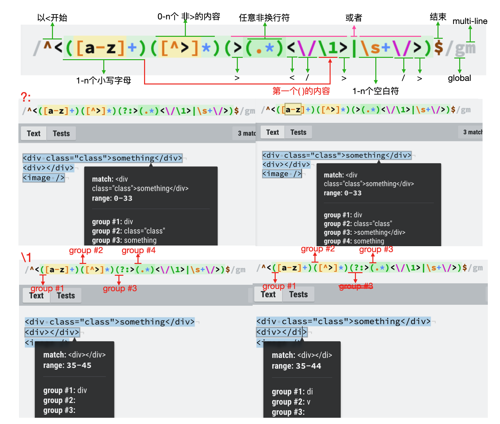
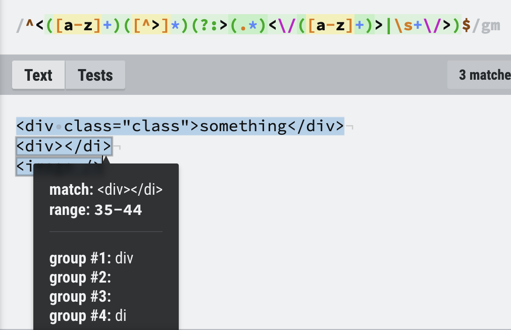
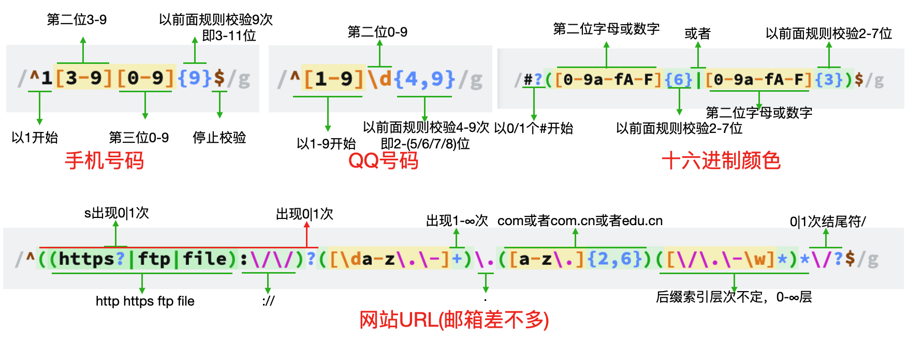

[TOC]


# 1. 字符 Unicode & 模版

## 1. Unicode

​	允许采用 `\uxxxx` 形式表示一个字符，其中 `xxxx` 表示字符的 Unicode 码点。

:exclamation: 这种表示法只限于码点在 `\u0000` ~ `\uFFFF` （UTF-16）之间的字符，如果超出这个范围的字符必须用两个双字节的形式表示，否则会自动拆分。

:exclamation: 可以将超出范围的码点放在大括号里，正确解析。

```js
"\u20BB7"
// JS自动理解成\u20BB + 7
// \u20BB是一个不可打印字符，因此显示一个空格，后面跟一个7
// " 7"

// 双字节表示码点 === {超出范围的码点}
"\uD843\uDFB7" === "\u{1F680}" // 𠮷
```

### parse 和 json 的冲突

```js
// json可以直接使用行分隔符和段分隔符（一般后端返回json）
// 字符串不允许直接使用行分隔符和段分隔符
// 因此在对 json 使用 parse 的时候，可能会报错
const json = '"\u2028"';
JSON.parse(json); // 可能error


// ⚠️ ES2019允许在字符串中直接使用
// ⚠️ 模板字符串允许直接输入这两个字符
// ⚠️ 正则表达式依然不允许直接输入这两个字符，这是没有问题的，因为 JSON 本来就不允许直接包含正则表达式
```

### stringify 的改造

​	ES2019改变了 `JSON.stringify()` 的行为。如果遇到 `0xD800` 到 `0xDFFF` 之间的单个码点，或者不存在的配对形式，它会返回转义字符串，留给应用自己决定下一步的处理。

## 2. 模版 ``

```js
// 使用 `` 的作用和字符串 '' 以及 ""一致
// 可以在 ${} 内部使用变量、函数、运算表达式
// ⚠️ 如果使用模板字符串表示多行字符串，所有的空格和缩进都会被保留在输出之中。
```


# 2. 字符串方法

​	一些旧的方法只能针对 `2个字节` 存储的字符，如果是使用 `4个字节` 存储的字符（Unicode 码点大于 `0xFFF` 的字符），就会出错。

​	只针对 `2个字节` 字符的方法包括：`String.fromCharCode `、`charAt` 、`charCodeAt` 。

## 0. `for...of` 字符串遍历

```js
// for...of可以识别大于 0xFFFF 的码点
for(let codePoint of 'foo𠮷') {
  console.log(codePoint);
}
// 'f'
// 'o'
// 'o'
// '𠮷'
```

## 1. `String.fromCharCode` & `String.fromCodePoint`

```js
// String.fromCharCode 不能识别码点大于 0xFFFF 的字符。
// 会自动舍弃最高位
String.fromCharCode(0x20BB7)
// "ஷ" === '\u0BB7'

// String.fromCodePoint 弥补了缺点
String.fromCodePoint(0x20BB7)
// "𠮷"
```

## 2. `charAt` 、`charCodeAt` & `codePointAt`

​	三者返回的都是码点的十进制，可以使用 `toSting(16)` 转换为十六进制。

```js
s.codePointAt(s).toString(16);
```

​	`charAt()` 和 `charCodeAt()` 针对 `2个字节` 存储的字符，如果码点大于 `0xFFFF` 的字符，就不能正确返回。

```js
// 4个字节存储的字符, JavaScript 会认为它们是两个字符
// 0x20BB7 === 0xD852 0xDFB7 (55362 57271)
// 字符串长度会误判为2
let s = '𠮷';
s.length // 2

// charAt, 无法读取整个字符
s.charAt(0) // ''
s.charAt(1) // ''

// charCodeAt, 分别返回前两个字节和后两个字节
s.charCodeAt(0) // 55362
s.charCodeAt(1) // 57271
```

​	`codePointAt()` 可以正确处理 `4个字节` 存储的字符，但是位置依旧是按照每 `2个字节` 算一个字符的规则判断。

```js
let s = '𠮷a';

s.codePointAt(0) // 134071 toString => '20bb7', 正确获取4个字节
s.codePointAt(1) // 57271 '𠮷'的后2个字节，和charCodeAt(1)一致

s.codePointAt(2) // 97
```

### 遍历有效字符

​	可以看到，`codePointAt` 可以返回正确的 `4个字节` 字符，但是由于字符串的长度依然是以 `2个字节` 为单位，因此在位置判断会有冗余。可以使用 `for...of` 方法，或扩展运算符 `...` 来去除字符单位产生的冗余字符。

```js
let s = '𠮷a'; // s.length === 3
s.codePointAt(1) // 57271, '𠮷'的后2个字节, 没有意义

// 1.使用for...of
// for...of 会自动识别字符，无论多少字节
for (let ch of s) {
  console.log(ch.codePointAt(0).toString(16));
  // 对于4个字节字符, codePointAt(1)就忽略了
}

// 2.使用...
let arr = [...s]; // arr.length === 2
arr.forEach(ch => console.log(ch.codePointAt(0).toString(16)))
```

## 3. `String.raw` & `normalize`

​	`String.raw` 返回的是一个 `斜杠都被转义（即斜杠前面再加一个斜杠）` 的字符串。一般用来处理模版字符串。

```js
String.raw`Hi\n${2+3}!`
// 实际返回 "Hi\\n5!",
// 显示的是转义后的结果 "Hi\n5!"

String.raw`Hi\\n`
// 返回 "Hi\\\\n"
```

​	`normalize` 用于把 Unicode 提供的两种不同表示方法的同一字符规范化，用于等价识别。`Ǒ`（\u01D1）和其合成符号（combining character） `O`（\u004F）和 `ˇ`（\u030C）合成 `Ǒ`（\u004F\u030C）等价，但是 JavaScript 不能识别。

```js
'\u01D1'==='\u004F\u030C' //false
'\u01D1'.normalize() === '\u004F\u030C'.normalize() // true
```

## 4. `indexof` 、`includes` 、`startsWith` & `endsWith`

```js
let s = 'Hello world!';

s.indexof('llo'); // 2
s.indexof('HHHHH'); // -1

s.includes('ello'); // true
s.startsWith('Hello'); // true
s.endsWith('!'); // true
```

​	可以使用第二个参数。

```js
// 第二个参数表示 从第n位开始, 直到字符串结束
s.includes('world', 6); // true
s.startsWith('Hello', 6); // false

// 第二个参数表示针对 前n个字符
s.endsWith('Hello', 5); // true
```

## 5. `repeat` 、`replace` & `replaceAll`

​	`repeat` 将字符串重复n次，返回。

``` js
'x'.repeat(3) // 'xxx'

'na'.repeat(0) // ''
'na'.repeat(-0.9) // '', 只取整数部分
'na'.repeat(NaN) // ''

'err'.repeat(Infinity) // RangeError, Infinity
'err'.repeat(-1) // RangeError, 负数
```

​	`replace` ，只替换第一个匹配；如果替换所有，需要使用正则的 `g` (global)修饰符,。

```js
'aabbcc'.replace('b', '_'); // 'aa_bcc'
'aabbcc'.replace(/b/, '_'); // 'aa_bcc'
'aabbcc'.replace(/b/g, '_') // 'aa__cc'
```

​	`replaceAll` ，和 `replace` 的用法相同，返回一个新字符串，不会改变原字符串。

```js
'aabbcc'.replaceAll('b', '_'); // 'aa__cc'
'aabbcc'.replaceAll(/b/, '_'); // error, replaceAll的正则必须使用global修饰符
'aabbcc'.replaceAll(/b/g, '_'); // 'aa__cc'
```

## 6. `padStart` & `padEnd` 、`trim` 、`trimStart` & `trimEnd`

```js
// 用特定字符串填充头｜尾，默认为空格填充
// 第一个参数是填充完成后的字符串长度
// 第二个参数是用于填充的字符串
'2'.padStart(2, '0'); // '02' => 填充月份
'x'.padEnd(4, 'ab'); // 'xaba'

// ⚠️注意是字符串才有的方法
// 需要时要进行类型转换
let month = 2;
month.toString().padStart(2, '0');
```

```js
// 消除空格、tab、换行符
const s = ' abc ';
s.trim(); // 'abc'
s.trimStart(); // 'abc '
s.trimEnd(); // ' abc'
```


# 3. 正则表达式

参考：1.[test和match的用法](https://blog.csdn.net/weixin_39818813/article/details/79731542)；2.[bilibili：JavaScript 10个常用正则表达式](https://www.bilibili.com/video/BV1QK4y1K72U) 3.[测试网站RegExr](https://regexr.com)。

#### 2.1 基础

##### 1. `?`、`+`、`*`及`{n,m}`

​	针对前面的一个字符，如果有括号括起来就算是一个字符整体。

`?`：匹配0｜1次，即最多只能出现一次。如果出现在`?`、`+`、`*`后面，表示由贪婪（最大匹配）变成非贪婪（最小匹配）。

`+`：匹配1-n次，即最少出现一次。

`*`：匹配0-n次。

`{n,m}`：匹配最少n次，最多m次；也可直接使用一个参数`{k}`，即匹配k次(包括这一次)。

****

##### 2. `\d`、`\w`、`\s`、`\S`、`.`

`\d`：(digit)表示`[0-9]`，在Javascript中可用，在其他语言中慎用。

`\w`：表示字母`[a-zA-Z]`、数字`[0-9]`和下划线`[_]`。

`\s`：匹配**所有空白符**，包括换行，等价于 `[ \f\n\r\t\v]`(注意有空格)。

`\S`：匹配任何非空白字符。等价于`[^ \f\n\r\t\v]`(注意有空格)。

`.`：表示换行符`\n`以外的所有字符。

****

##### 3. `^`、`$`、`|`、`\`

`^`：在中括号`[]`外面表示开始标志；在中括号里面使用表示`非`。

`$`：结束符号。`/[0-9]$/g`。

`|`：或者。注意这个符号是以**前后一串字符**为单位，比如`/0[1-9]|[12][0-9]|3[01]$/g`。

`\`：转义字符。如想要匹配`.`、`/`，就需要转义成`\.`、`\/`。

****

##### 4. `()`、`\1`、`?:`

- [x] 有时候我们不仅需要查看字符串是否匹配规则，还想要在匹配的同时获取一些数据。这时候使用`()`就可以选择获得内容；`\1`表示第一个括号获取的内容，`\2`表示第二个括号获取的内容······；但是有时候我们使用括号是因为作为一个整体，而并不想要获取里面的内容，就需要使用`?:`。



`?:`：可以看到使用`?:`之后，本选择组`()`的内容不会再进行选择记录，但是不影响本选择组里面的选择组。即屏蔽了右侧`group #3`的内容，但是并不影响原本的`group #4`；屏蔽之前有4组选择组，屏蔽之后`group #3`去除，`group #4`变为`group#3`。使用`?:` 的原因是，我们并不需要原本`group #3`的内容，但是由于`|`或者的判断，需要将前后的一长串字符作为判断单位；因此这时候需要选择组的作用，但不需要选择组的内容。

`\1`：`\1`是当前匹配字段和`group #1`所匹配的字段。可以看到将后面的`/div`改成了`/di`之后，`group #1`的内容就变成了`di`。如果我们不使用`\1`，而复制粘贴相同的规则，可以看到各自判断各自的内容：`group #1`的内容是`div`，`group #4`的内容是`di`。按照正确的使用场景，应该各自判断获取内容，然后再进行判断是否内容一致，内容不一致说明标签匹配错误；一致才能说明标签使用正确。



****

#### 2.2 常用正则表达式



```js
// 手机号码
let phoneReg = /^1[3-9][0-9]{9}$/g;
// QQ号码, js里面\d等同于[0-9]，如果是其他语言要注意，\d包括除了0-9之外的其他数字字符 
let qqAcountReg = /^[1-9]\d{4,9}/g; // \d <=> [0-9]
// 十六进制颜色匹配
let colorReg = /#?([0-9a-fA-F]{6}|[0-9a-fA-F]{3})$/g; // #000000; 000000; #000;
// 邮箱地址
let mailReg = /^([a-zA-Z0-9_\-\.])+@([a-zA-Z0-9_\-\.])+\.([A-Za-z]{2,4})$/g;
// URL
let urlReg = /^((https?|ftp|file):\/\/)?([\da-z\.\-]+)\.([a-z\.]{2,4})([\/\.\-\w]*)*\/?$/g;
// html标签/爬虫
let elReg = /^<([a-z]+)([^>]*)(?:>(.*)<\/([a-z]+)>|\s+\/>)$/gm; // m表示匹配多行，各行都按照该规则匹配
// ipv4
let ipv4Reg = /^(([01]?[0-9][0-9]?|2[0-4][0-9]|25[0-5])\.){3}([01]?[0-9][0-9]?|2[0-4][0-9]|25[0-5])$/g;
// 日期 2021-03-01
let dateReg = /^[0-9]{4}-(0[1-9]|1[0-2])-(0[1-9]|12[0-9]|3[01])$/g;
// 身份证 正则部分(还需要通过权重判断)
let idReg = /^[1-9][0-9]{5}(18|19|[23][0-9])[0-9]{2}(0[1-9]|1[0-2])(0[1-9]|[12][0-9]|3[01])[0-9]{3}[0-9xX]$/g;
```

`身份证权重计算`：

```js
// 身份证前17位与各自权重相乘得出总数，取余之后根据相应的数组得出最后一位；
// 根据上面的生成规则对比即可得出身份证是否正确
// 1.身份证号前17位的权重因子
const factor = [7, 9, 10, 5, 8, 4, 2, 1, 6, 3, 7, 9, 10, 5, 8, 4, 2];
// 2.身份证号最后一位校验位的对应11的余数
const parity = [1, 0, 'X', 9, 8, 7, 6, 5, 4, 3, 2]; 
// 假如idCard为输入的身份证号码
var idCard = '';
// code为身份证最后一位校验码
let code = idCard.substring(17);
// 根据权重因子计算出总数
let sum = 0;
for (let i = 0; i < 17; i++) {
  sum += str[i] * factor[i];
}
// 判断是否正确
if (parity[sum % 11].toString() !== code.toUpperCase()) {
	return false;
}
```

****

#### 2.3 `text | match`判断是否符合规定的正则：

```js
let phoneReg = /^1[3-9][0-9]{9}$/g;
let phoneNum = '13120030000';
// test是regExp的方法，参数是字符串，返回值返回true｜false
if (!phoneReg.test(phoneNum)) {
	return false;
}
// match是String的方法，参数是正则表达式，返回值是数组
if(phoneNum.match(phoneReg) === null) {
  return false;
}
```

