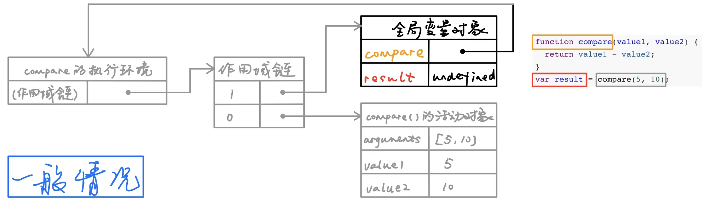
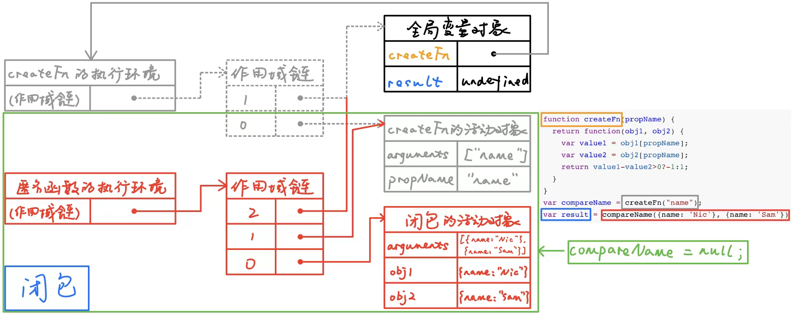

[TOC]

# 0. 函数定义

​	定义函数主要分为两种方式：函数声明和函数表达式。

```js
// 函数声明
function functionName() {}

// 函数表达式
let functionName = function() {}
```

​	函数声明的重要特征是函数声明提升（function declaration hoisting），意味着可以把函数声明放在调用它的语句后面。

## 匿名函数 和 闭包

​	函数表达式是创建一个函数并将它赋值给变量 functionName，实际上函数是没有 name 属性的。这种情况下创建的函数叫做匿名函数（anonymous function），因为 **function 关键字后面没有标识符**。这种情况下必须先赋值后调用。

​	闭包是指**有权访问另一个函数作用域的变量的函数**。创建闭包的常用方式就是在函数内部创建另一个函数。

1. 一般情况下当函数执行完毕之后，局部活动对象就会被销毁，内存中仅保存全局作用域（全局执行环境的变量对象）。如下图，compare的活动对象会随着执行 `compare(5, 10)` 产生，并且在执行完之后销毁（包括作用域链）。



2. 闭包情况下，被引用的活动对象仍留在内存中。如图，createFn的活动对象在 `createFn("name")` 执行完毕之后并没有销毁（因为匿名函数的作用域链还引用着它），直到 `compareName = null` 解除对匿名函数的引用时释放内存，createFn的活动对象才会随着闭包的活动对象一起被销毁。




## arguments.callee 解决递归调用问题

```js
function factorial(num) {
  if(num <= 1) return 1;
  else return num * factorial(num-1);
}

let anotherFactorial = factorial;
factorial = null;
anotherFactorial(4); // 会报错，因为在执行代码的时候,代码内部有factorial(num-1),此时已经为null
```

```js
// 消除factorial字眼，就不会出错
function factorial(num) {
  if(num <= 1) return 1;
  else return num * arguments.callee(num-1);
}
```


# 1. 函数参数

## 0. 不可使用 let const 声明

​	不能在函数体内再次使用 `let` 或 `const` 声明。

```js
function log(x, y) {
  let x = 0; // error
}

// 实际上函数的形参列表就是声明语句
function log() {
  let x, y;
}
```

## 1. 赋值默认值 及 function.length

​	可在函数的形参声明处直接赋值默认值。

```js
function log(x, y = 'world') {
  console.log(x, y);
}

log('Hello') // Hello world
log('Hello', undefined) // Hello world => undefined触发默认值
log('Hello', 'China') // Hello China
log('Hello', '') // Hello

// 设置默认值的时候, 先对形参列表计算完毕(有默认值的形成单独作用域context去完成计算), 后进入函数体内执行
// 1. y=x 由于在形参列表该位置之前没找到x, 因此指向函数体外部寻找到 let x = 1;
// 2. 形参列表赋值完成后(y=1), 执行内部代码, 故打印出1
let x = 1; // 如果没有在外部声明, 那么形参在计算时就会报错, 因为未找到x的声明
function f(y = x) {
  let x = 2;
  console.log(y);
}
f() // 1
```

### 形参声明、默认值以及对象解构

```js
// 基本类型参数, 没有传参时调用
// 1. 没有使用默认值
function log(x) {
  console.log(x);
}
log(); // 没有传参 => undefined

// 2. 使用默认值
function log(x = 0) {
  console.log(x);
}
log(); // 没有传参 => 0
```

```js
// 对象类型参数, 没有传参时调用
// 1. 没有使用默认值
function log({x, y}) {
  console.log(x, y);
}
log(); // 没有传参 => TypeError: Cannot read property 'x' of undefined

// 2. 使用默认值
function log({x, y} = {x:0, y:0}) {
  console.log(x, y);
}
log(); // 没有传参 => 0 0
```

```js
// 对象解构
// 1.0 没有传参的时候, 使用的“默认值”
// 1.1 默认值处没有函数需要的, 则看“形参声明处”有无可使用
// 2. 有传参的时候, 不再看“默认值”, 而看“声明形参处”, 通过解构获取参数
function log({x=0, y} = {}) {
  console.log(x, y);
}
log(); // 没有传参, 使用默认值, 但是默认值里没有需要的x和y, 查看形参声明处 => 0 undefined
log({}); // 传参, 传了一个空对象, 看“声明形参处” => 0 undefined
```

### 函数的 length 属性

```js
// 函数的length属性指该函数预期传入的参数个数
// 这个个数是指从第一个形参算起, 碰到的第一个设置了默认值的形参结束
(function (a) {}).length // 1
(function (a=5) {}).length //0
(function (a, b, c=0)).length //2
 
(function (a=0, b, c)).length // 0
(function (a, b=1, c)).length // 1
```

# 2. 箭头函数

​	注意使用箭头函数的几个点：

1. 箭头函数没有自己的 `this` 对象
2. 不可以当作构造函数，也就是说，不可以对箭头函数使用 `new` 命令，否则会抛出一个错误。
3. 不可以使用 `arguments `对象，该对象在函数体内不存在。如果要用，可以用 rest 参数代替。
4. 不可以使用 `yield` 命令，因此箭头函数不能用作 Generator 函数。

## 参数解构 & rest

​	可以使用对象解构或者数组 rest 来使用箭头函数。

```js
// 使用解构
const full = () => first + ' ' + last;

// 等同于
function full(person) {
  return person.first + ' ' + person.last;
}
```

```js
// 数组 rest ...
const numbers = (...nums) => nums;
numbers(1,2,3,4,5); // [1,2,3,4,5]
```

​	不可以使用`arguments`对象，该对象在函数体内不存在。如果要用，可以用 rest 参数代替。

## this 指针

​	**对于普通函数来说，内部的 `this` 指向函数运行时所在的对象**，但是这一点对箭头函数不成立。

​	**箭头没有自己的 `this` 对象，内部的 `this` 就是定义时上层作用域中的 `this`** 。注意重点：**定义时**。

​	也就是说，箭头函数内部的 `this` 指向是固定的，相比之下，普通函数的 `this` 指向是可变的。

```js
this.s1 = 'window_s1';
let ob = {
  s1: 'ob_s1',
  // 普通函数
  sayS: function() {
    console.log(this.s1);
  },
  // 箭头函数
  saySA: () => {
    console.log(this.s1);
  }
}

let check = {
  s1: 'check_s1',
}

ob.sayS(); // 'ob_s1'
ob.saySA(); // 'window_s1'
ob.sayS.call(check); // 'check_s1'
ob.saySA.call(check); // 'window_s1'
```

