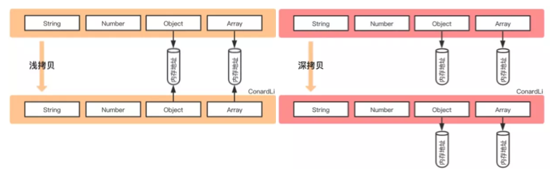

[TOC]


### 1. var变量的提升

[var变量的提升](https://www.cnblogs.com/shmilynanmei/p/9151769.html)

###### `var`函数提升&变量提升

> 首先js引擎在读取js代码时会进行两个步骤，第一个步骤是解释，第二个步骤是执行。
>
> **解释**：就是会先通篇扫描所有的js代码，然后把所有声明提升到顶端，第二步才是执行。
>
> **IMPO**：声明包括`函数声明`和`变量声明`，而且注意的是只把声明提升了，赋值等其他的内容还是按照原顺序。

> 所谓的`变量提升`，就是**把变量声明提升到当前执行环境的最顶端**(本级域内的最顶端)。
>
> ```js
> console.log(a); //undefined
> var a = 10;
> 
> //上述的这段代码首先经过js引擎的解释，解释成：
> var a;
> console.log(a); //undefined
> a = 10;
> ```
>
> 除了`变量声明提升`，还有`函数声明提升`，并且后者提升在前者提升上面。
>
> ```js
> foo();
> function foo() {
>   console.log('aaa');
> }
> 
> //上述的这段代码，解释成：
> function foo() {
> 	console.log('aaa');
> }
> foo(); //aaa
> ```
>
> ```js
> foo();
> foo = function foo() {
>   console.log('aaa');
> }
> 
> //上述的这段代码，解释成：
> var foo; //声明提升，从赋值语句中直接解释出来的
> foo(); //foo is not a function
> foo = function() {
>   console.log('aaa');
> }
> ```
>
> ```js
> console.log(foo); // (1)
> var foo = 10;
> function foo() {
>   console.log(10); // (2)
> }
> console.log(foo); // (3)
> 
> //上述的代码解释成：
> function foo() {
>   console.log(10);
> } //函数声明在最上面
> var foo; //变量声明
> console.log(foo) //(1) foo(){ console.log(10); }
> foo = 10;
> function foo() {
>   console.log(10); //(2) 10
> } 
> console.log(foo); //(3) 10
> ```

###### `let`无变量提升 & 暂时性死区

> `let`命令要求必须在使用变量之前就把变量声明完毕，如果按照var的方式，会报错而不是返回`undefined`
>
> ```js
> console.log(a); //ReferenceError: a is not defined
> let a = 10; 
> ```
>
> 因为在使用`let`命令声明变量的时候，必须保证变量的声明在变量使用之前，即如果使用了`let`命令，顺序必须严格按照`声明变量 -> 使用变量`的顺序，如果不按照顺序就会进行报错。因此在一下情况下，就算在外部定义了一个全局作用的变量，如果在内部使用了`let`命令，就会隔绝外部的作用，也必须在本域内严格按照`声明变量 -> 使用变量`。
>
> ```js
> var tmp = 10;
> if (true) {
>   tmp = 100; //ReferenceError: tmp is not defined
>   let tmp;
> }
> ```
>
> 在上面的这种情况下，首先遍历代码找到`let`命令：`let tmp;`。然后隔绝了`tmp`全局定义的作用，即`tmp`被绑定在本区域内--if函数内部，于是外部`var`声明的全局性就无法作用在该函数内部。这时候判断`tmp = 100;`是在`let`命令声明变量之前，就会报错Error。

****

### 2. typeof

`typeof`是js中用来检测一个变量的类型的。

****

### 3. IIFE

[说一说JS的IIFE](https://www.cnblogs.com/yiven/p/8462666.html)

> IIFE（Immediately Invoked Function Expression，立即调用的函数表达式），声明函数的同时立即调用这个函数，是JS为了弥补`var`命令声明的时候可能引起的作用域泄漏的问题解决方式。
>
> 写法： `()()` / `(())`，在第一个左括号后添加想要立即执行的函数。
>
> ```js
> // ()()
> (function foo(){
>   var a = 3;
>   console.log(a);
> })()
> ```
>
> ```js
> // (())
> (function foo(){
>   var a = 3;
>   console.log(a);
> }())
> ```
>
> 使用IIFE就可以解决变量作用域泄漏的问题：
>
> ```js
> var a = 2;
> (function IIFE(global){
>     var a = 3;
>     console.log(a); // 3
>     console.log(global.a); // 2
> })(window);
> 
> console.log(a); // 2
> ```
>
> 

### 4. 浅拷贝和深拷贝

[浅谈JS中的浅拷贝和深拷贝](https://www.cnblogs.com/chengxs/p/10788442.html)、[一文读懂 Javascript 深拷贝与浅拷贝](https://mp.weixin.qq.com/s/7C4kq48eu2g0Q3AEBiNhhw)



`浅拷贝`：拷贝开销小（不生成新的内存地址），拷贝完之后双方会互相影响。如果属性是基本类型，拷贝的就是基本类型的值，如果属性是引用类型，拷贝的就是内存地址 ，所以如果其中一个对象改变了这个地址，就会影响到另一个对象。

`深拷贝`：开销大，深拷贝是将一个对象从内存中完整的拷贝一份出来,从堆内存中开辟一个新的区域存放新对象,且修改新对象不会影响原对象。

```js
var a1 = {b: {c: {}};
          
var a2 = shallowClone(a1); // 浅拷贝方法
a2.b.c === a1.b.c // true 新旧对象还是共享同一块内存

var a3 = deepClone(a3); // 深拷贝方法
a3.b.c === a1.b.c // false 新对象跟原对象不共享内存
```

`赋值`：赋值、深拷贝、浅拷贝针对基本类型的时候，效果都是一样的，改变基本类型彼此不会影响；如果针对的是引用类型，当我们把一个对象赋值给一个新的变量时，**赋的其实是该对象的在栈中的地址，而不是堆中的数据**。也就是两个对象指向的是同一个存储空间，无论哪个对象发生改变，其实都是改变的存储空间的内容，因此，两个对象是联动的。可以看下面的例子：

=> `赋值`：引用类型赋值，无论内部是什么数据，都会相互影响。

=> `浅拷贝`： 引用类型浅拷贝，内部的基本类型不会相互影响，引用类型会相互影响。

=> `深拷贝`：引用类型深拷贝，内部基本类型、引用类型都不会互相影响。

```js
let obj1 = {name: 'init', arr: [1, [2,3], 4]};
let obj2 = obj1;
obj2.name = 'update';
obj2.arr[1] = [5,6];
>>> obj1: {name: 'update', arr: [1, [5,6], 4]}
>>> obj2: {name: 'update', arr: [1, [5,6], 4]}
let obj3 = shallowClone(obj1); //采用浅拷贝
obj3.name = '';
obj3.arr[1] = [7,8];
```

​	

#### 4.1 浅拷贝实现

```js
// 1.展开运算符 ...
arr1 = [... arr];
dic1 = {... dic};
// 2.assign

```


```js
// 使用slice可以深拷贝
arr1 = [1, 2, 3 ,4];
arr = arr1.slice(0,4); //arr: [1, 2, 3, 4]
```

#### 4.2 深拷贝实现

```js
arr = [1, [2, 3]];
arr1 = JSON.parse(JSON.stringify(arr));
```

