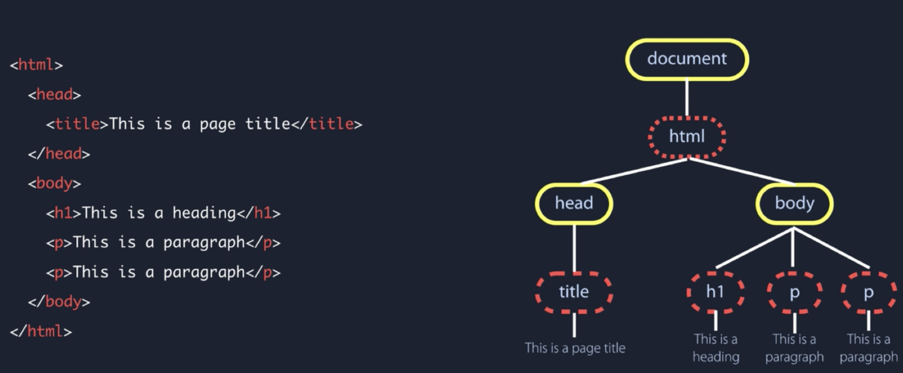

[TOC]

[p2p论坛](http://p2p.wrox.com)

## 一. JS简介

### js、es、node.js

> **JS**：`JS`是由`ES(ECMAScript)`、`DOM`(浏览器文档对象)、`BOM`(浏览器对象模型)组成。
>
> **Node.js**：其中`Node.Js`就只有`ES`，目前浏览器比较流行的版本就是`ES6(ES2015)`，老浏览器的版本基本上都是`ES5`。所以`alert`和`document`不能在`Node`运行(因为`Node`没有`dom`和`bom`)。
>
> **ES**：ECMAScript就是对实现标准规定的各个方面内容的语言的描述。JS实现了ES，Adobe ActionScript同样也实现了ES。

****

### DOM

​	首先理解HTML、CSS、JS三个所负责的任务。

1. HTML负责静态网页结构(structure)，也就是网页的元素一旦确定即不可修改。
2. CSS负责静态网页中元素的样式(style)。
3. JS负责将静态网页变成动态。

​	那么JS如何动态地去更改静态网页HTML元素？如图：通过对HTML的元素遍历生成一个DOM树，如果想要按需更改结构的话（比如点击按钮，浮现出一段文字）就是对这个DOM树操作。根据官方对DOM的定义理解：

> ​	文档对象模型（DOM，Document Object Model）是针对XML但经过扩展用于HTML的**应用程序编程接口**（API，Application Programming Interface）。DOM把整个页面映射为一个多层节点结构。HTML或XML页面中的每个组成部分都是某种类型的节点，这些节点又包含着不同类型的数据。
>
> ​	通过DOM创建的这个表示文档的树形图，开发人员获得了控制页面内容和结构的主动权。借助DOM提供的API，开发人员可以轻松自如地删除、添加、替换或修改任何节点。
>
> ​	**DOM提供访问和操作网页内容的方法和接口。**

图片来源：[为初学者准备的：DOM 速成](https://www.bilibili.com/video/BV1Nt411q73a?from=search&seid=16011203734396970827)。视频比较基础，没必要看。



​	也就是说，本来是静态网页的文档HTML，我们能够通过操作DOM来对静态文档进行动态更新。实际上**DOM就是一个提供操作的接口**。

​	DOM是接口！

​	DOM是接口！！

​	DOM是接口！！！

​	在DOM Tree中，最上层的元素是`document`。可以在`console`里面输入`document`获取整个页面的文档内容。

> ​	需要注意的是：**DOM并不只是针对JavaScript的**，很多别的语言也都实现了DOM。比如一些语言添加了特定语言相关的新方法和新接口：**SVG**（Scalable Vector Graphic，可伸缩矢量图）；MathML（Mathematical Markup Language，数学标记语言）；**SMIL**（Synchronized Multimedia Integration Language，同步多媒体集成语言）。

****

### BOM

​	BOM（Browser Object Model，浏览器对象模型），开发人员使用BOM可以控制浏览器显示的页面以外的部分。比如说弹出新浏览器窗口的功能、移动缩放以及关闭浏览器的功能等。但是BOM目前没有相关的标准（因此经常会导致问题）。HTML5致力于把很多BOM功能写入正式规范。

> **BOM提供与浏览器交互的方法和接口。**

****

## 二. 在HTML中使用JavaScript

​	在HTML中使用JavaScript需要使用`<script>`元素：可以直接嵌入在`.html`文件中，也可以外部引用`.js`文件。

```html
<!-- 直接嵌入example.html中 -->
<script>
	function sayHi() {
    alert("Hi!");
  }
</script>
```

```html
<!-- 引用外部js文件 -->
<script type="text/javascript" src="./example.js"></script>
```

​	关于1.`script`标签放在`body`内容的末尾；2.配合`async`和`defer`使用`<script>`标签更优，详见JS问题汇总。


