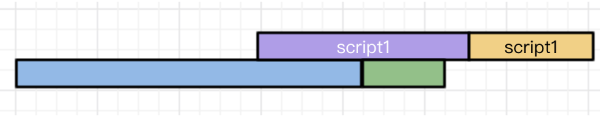

[TOC]

### 1. script为什么放在html文件的body内部的最后为好？

[浅谈script标签中的async和defer](https://www.cnblogs.com/jiasm/p/7683930.html)

[你不知道的 DOMContentLoaded](https://zhuanlan.zhihu.com/p/25876048)

###### `<script>`放在html的`<body>`内部的最后并非是最优。最优的是利用好```async```和```defer```。

​		参照[虚拟DOM和真实DOM](../VUE/vue问题汇总)，理解渲染过程。

​		A: 在解决这个问题之前，先确认概念「首屏」和「最终效果屏」。

> ```Render Tree```（渲染树）是```DOM Tree```和```CSS Rule Tree```共同构造出来。而JS可以通过DOM API和CSSOM API接口分别对DOM Tree和CSS Rule Tree进行修改，从而构造最后的Render Tree。因此可以将这个过程分类成两种情况：
>
> 1. JS没有通过API修改形成的Render Tree
> 2. JS通过API修改形成的Render Tree
>
> 在讨论这个问题之前，**首屏**指的就是``JS没有通过API修改DOM Tree和CSS Rule Tree而形成的Render Tree渲染出来的页面``。而**最终效果屏**则指的是```JS通过API修改DOM Tree和CSS Rule Tree最终形成的Render Tree渲染出来的页面```。
>
> 在这种首屏的情况下，只对HTML里面的元素进行渲染，而没有JS修改。
>
> 

​		B: 而JS会阻塞```DOM Tree```和```CSS Rule Tree```的构造。

> 浏览器加载一个有` <script>`标签的网站发生的事情:
>
> 1.拉取 HTML 页面 (e.g. index.html)，开始解析 HTML
>
> 2.解析到`<script>`标签之后准备获取 script 文件.
>
> 3.浏览器获取script文件。同时，html 解析中断并且**阻断**页面上其他html的解析。
>
> 4.一段时间后，script下载完成并且**执行**。继续解析HTML文档的其他部分（解析script之后的html代码）
>
> 在第三步中，浏览器获取script文件，会阻断页面上其他html的解析，也就是无法继续构造DOM Tree，直到script完全下载完成，才会进行第四步继续构造DOM Tree。

​		在理解了A和B两个部分之后，也就能看出：把script标签放在<body>的底部，可以防止script阻断DOM的构造，通过一定的参数设定使得在最终效果屏出来前，能加载出一个首屏。比如有时候加载一个网页，可能就会出现这样的首屏（只有内容，很丑），没有样式的修改。即```FOUC```：由于浏览器渲染机制（比如firefox），在CSS加载之前，先呈现了HTML，就会导致展示出无样式内容，然后样式突然呈现的现象；

​		但是对最终效果屏来说，二者都需要等待script文件下载并执行完毕才能够出来，因此是无差别的。

###### async & defer

​		```async```和```defer```都不会产生上述的阻断```DOM Tree```构造，即运用了这两个属性，script的下载不会阻断html的解析。

​		```async```：async标记的Script异步执行下载，并执行。**重点：不用等待别人，加载完毕即执行。**

```html
<!-- 
异步执行需要关注两点：
1.不用顾虑前件script是否加载完毕，只要是script就可以立马进行加载，并行加载
2.不用考虑前件script是否执行完毕，只要是加载完毕就可以立马执行
-->
<script type="text/javascript" src="script1.js" async></script>
<script type="text/javascript" src="script2.js" async></script>
<!-- script2可能会比script1更早执行完毕 -->
```

​		```defer```：defer标记的Script顺序执行。**重点：顺序执行，加载完毕需等待前者执行完毕。**

```html
<!-- 
顺序执行需要关注两点：
1.不用顾虑前件script是否加载完毕，只要是script就可以立马进行加载，顺序执行仍然是并行加载script
2.等待前件script执行完毕，只有前件script执行完毕之后才能执行
-->
<script type="text/javascript" src="script1.js" async></script>
<script type="text/javascript" src="script2.js" async></script>
<!-- 这意味着虽然script2可能加载比script1更早完成，但是一定要等待script1执行完毕 -->
```

​		值得注意的是，script的下载都是并行的。用以下三张图理解区别：

图中`蓝色：html解析`、`紫色：script加载`、`黄色：script执行`、`绿色：DOMContentLoaded`。

```无属性script```：

```html
<script type="text/javascript" src="script2.js"></script>
<script type="text/javascript" src="script1.js"></script>
```


```async```：

```html
<script type="text/javascript" src="script2.js" async></script>
<script type="text/javascript" src="script1.js" async></script>
```




```defer```：

```html
<script type="text/javascript" src="script2.js" defer></script>
<script type="text/javascript" src="script1.js" defer></script>
```


- [x] defer总是会比async稳定。

  ​	首先理解`DOmcontentLoaded`的含义：HTML文档被加载和解析完成。

  > ​	比如你打开这篇博客时，可能并不需要等所有图片都加载完成，而是看到博客的正文就可以正常阅读了。把上面的话提炼一下就是，用户有时候只需要在空白的网页上看见内容就可以了，而不需要等待所有内容都加载出来。那既然这样，回到刚刚的问题，我觉得衡量一个网页加载速度的一个方法就是“计算这个网页从空白到出现内容所花费的时间”。那怎么计算这段时间？[HTML5 规范](https://link.zhihu.com/?target=https%3A//www.w3.org/TR/html5/syntax.html%23the-end)已经帮我们完成了相应的工作，就是**当一个 HTML 文档被加载和解析完成后，DOMContentLoaded 事件便会被触发。**

  ​	再来看`defer`比`async`稳定的原因。

  > ​	我们可以看到async存在一种情况，即`DOMContentLoaded`可能会在`script`执行之前就已经执行。如果**脚本代码依赖于页面中的`DOM`元素**（比如代码语法高亮依赖script），那么就要避免`DOMContentLoaded`先于`script`执行。
  >
  > ​	而如果脚本并不关心页面中的DOM元素，则使用`async`也无妨。
  >
  > ​	如果不太能确定，那么使用defer总会比async稳定。

### 2. var声明的全局变量以及局部变量问题

​	1.var定义局部变量：**以函数为单位的**函数内外比较产生的全局性与局部性。在《JavaScript高级程序设计》书中指出：

> 使用var操作符定义的变量将成为定义该变量的作用域中的局部变量。也就是说，如果在函数中使用var定义一个变量，那么这个变量在函数退出后就会被销毁。
>
> ```js
> function test() {
>   var message = 'hi'; // 局部变量
> }
> test();
> alert(message); // error "message is not defined"
> ```

这里强调的是：函数内部与函数外部的关系，`var`声明的是局部变量（在函数内可用）。如果想要在函数内定义一个全局变量（即在函数执行完毕之后变量仍然存在），可以不使用`var`直接初始化一个变量。

> 创建一个全局变量：
>
> ```js
> function test() {
>   message = "hi"; // 全局变量 ，不声明直接赋值
> }
> test();
> alert(message); // "hi"
> ```

​	2.在ES6中指出，var定义的是全局变量，let定义的是局部变量：**以代码块为单位的**函数内部的全局性和局部性。（每一对`{ }`为一个代码块。

> ```js
> function var_test() {
>   for(var i=0; i<9; i++) { // var声明代码块的全局变量
> 		//pass
>   }
>   console.log(i); // 9
> }
> ```
>
> ```js
> function let_test() {
>   for(let i=0; i<9; i++) { // let声明代码块的局部变量
> 		//pass
>   }
>   console.log(i); // error "i is not defined"
> }
> ```

​	总结：可以看到书中和ES6中讲解`var`的时候侧重点不同，一个强调**函数外的使用性**，一个强调**代码块外的使用性**。按照一般的需求：1.如果想要在**函数执行完毕**之后仍然**保留变量**：不要使用`var`；2.如果想要代码块执行完毕即**销毁变量**，使用`let`而不使用`var`。

​	但是官方不推荐使用函数外的全局变量：难维护。

> 局部作用域中定义的全局变量很难维护。
>
> 在严格模式`use "strict"`下，给未经声明的变量赋值会导致抛出`ReferenceError`错误。

