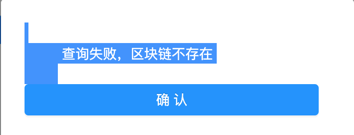
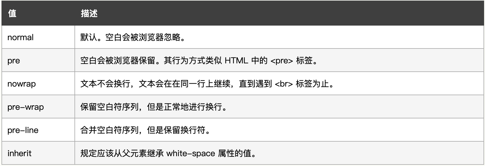
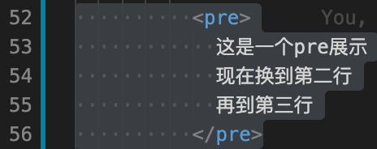

[TOC]

# 1. 概念

## 1. 语法糖

​		使用的时候的简写。如 `v-bind:` 简写成 `:`，`v-on:` 简写成 `@` 。实际上就是使用时的便捷写法。

## 2. 脏检查

参考：[什么是脏检查？](https://www.cnblogs.com/eret9616/p/9155675.html)、[如何理解angular的脏检查？](https://www.jianshu.com/p/850f0f76e908)、[AngularJS脏检查深入分析](https://www.cnblogs.com/likeFlyingFish/p/6183630.html)。

​		脏检查（Dirty Checking）的全名是脏数据检查。是AngularJS命名的。脏数据也就是产生了变化的数据。

​		脏检查这个东西，其实在三大主流前端框架中或多或少都有涉及。React 每次生成新的 `Virtual DOM`，与旧 `Virtual DOM`的 diff 操作本来就可以看做一次脏检查。Vue 从相对彻底的抛弃了脏检查机制，使用 `Property` 主动触发 UI 更新，但是 Vue 仍然不能抛弃 `track by` (用来标记数组元素的key) 这个东西。通过将新旧数组的 `track by` 元素做 diff 猜测用户的行为，最大可能的减少 DOM 树的操作，这就是 `track by`的用处。

​		Angular 1的性能被广为诟病，因为在 Angular 1 的机制下，脏检查的执行范围过大以及频率太过频繁了。

- [ ] track by？

  > AngularJS remembers the value and compares it to a previous value. This is basic dirty-checking. If there is a change in value, then it fires the change event.

  > Angular defines a concept of a so called digest cycle. This cycle can be considered as a loop, during which Angular checks if there are any changes to all the variables watched by all the $scopes. So if you have $scope.myVar defined in your controller and this variable was marked for being watched, then you are explicitly telling Angular to monitor the changes on myVar in each iteration of the loop.


​		用户点击了 button，angular 执行了一个叫 onClick 的方法。这个 onClick 的方法体对于 angular 来说是黑盒，它到底做了什么不知道。可能改了 $scope.content1 的值，可能改了 $scope.content2 的值，也可能两个值都改了，也可能都没改。那么 angular 到底应该怎样得知 onClick() 这段代码后是否应该刷新 UI，应该更新哪个 DOM 元素？angular 必须去挨个检查这些元素对应绑定表达式的值是否有被改变。这就是脏数据检查的由来。		在angular程序初始化时，会将绑定的对象的属性添加为监听对象（watcher），也就是说一个对象绑定了N个属性，就会添加N个watcher。Angular并不是周期性触发藏检查。**只有当UI事件，ajax请求或者 timeout 延迟事件，才会触发脏检查。**

## 3. 虚拟DOM / 真实DOM？

​		DOM（Document Object Model，文档对象模型），是W3C组织推荐的处理**可拓展置标语言**的标准变成接口。它提供了对文档的结构化的表述，并定义了一种方式可以使从程序中对该结构进行访问，从而改变文档的结构，样式和内容。DOM 将文档解析为一个由节点和对象（包含属性和方法的对象）组成的结构集合。

​		DOM是针对HTML和XML文档的一个API（应用程序编程接口）。DOM描绘了一个层次话的节点树，允许开发人员添加、移除和修改页面的一部分。

### DOM

​		在了解虚拟DOM之前，需要对DOM Tree在渲染所处位置进行了解。

​		浏览器获取了文件之后的工作流程，「构建DOM -> 构建CSSOM -> 构建渲染树 -> 布局 -> 绘制」

> 1. 构建DOM：根据HTML/SVG/XHTML等，构建DOM TREE
> 2. 构建CSSOM：根据CSS构建CSSOM
> 3. JS/脚本通过DOM API和CSSOM API来操作DOM Tree和CSS Rule Tree
> 4. 构造Render Tree（渲染树）
> 5. 布局绘制页面


​				

​		可以看到，DOM Tree可能会因为调用DOM API而产生频繁的修改。每一次修改都需要进行一定量的计算，因此会耗费大量的资源。

### 真实DOM和虚拟DOM

​		为了减少对DOM（即真实DOM）的修改，引入虚拟DOM。虚拟DOM主要完成的事情包括：

> 1. 将页面改变的内容应用到虚拟 DOM 上，而不是直接应用到 DOM 上。
> 2. 变化被应用到虚拟 DOM 上时，虚拟DOM并不急着去渲染页面，而仅仅是调整虚拟 DOM 的内部状态，这样操作虚拟DOM的代价就变得非常轻了。
> 3. 在虚拟 DOM 收集到足够的改变时，再把这些变化一次性应用到真实的 DOM 上。

		

> 1. **创建阶段。**首先依据 JSX 和基础数据创建出来虚拟 DOM，它反映了真实的 DOM 树的结构。然后由虚拟 DOM 树创建出真实 DOM 树，真实的 DOM 树生成完后，再触发渲染流水线往屏幕输出页面。
> 2. **更新阶段**。如果数据发生了改变，那么就需要根据新的数据创建一个新的虚拟DOM树；然后比较两个树，找出变化的地方，并把变化的地方一次性更新到真实的 DOM 树上；最后渲染引擎更新渲染流水线，并生成新的页面。

### CQ：`hidden` & `display` 与 render tree

`hidden`

​	hidden字符只是将元素隐藏，但是还是会添加到render tree（渲染树）进行页面的渲染。

`display`

​	display字符将元素设置为不展示，即不会讲元素添加到render tree。

which one?

​	如果要对页面中的元素进行频繁地隐藏/显示操作，改动元素的`hidden`，这样子就不会进行重复渲染。

## 4. import、export、export default

参考：[关于Vue中的import、export、export default的区别以及用法](https://blog.csdn.net/qq_35953966/article/details/104677918?utm_medium=distribute.pc_relevant.none-task-blog-title-2&spm=1001.2101.3001.4242)。https://www.cnblogs.com/fanyanzhao/p/10298543.html。

​	一个模块就是一个独立的文件。该文件内部的所有变量，外部无法获取。如果你希望外部能够读取模块内部的某个变量，就必须使用 `export` 关键字输出该变量。

> 1. `export` 与 `export default` 之间最大的区别就是前者需要 `{ exportContent }` 后者不需要 `{}` 包裹。
> 2. `export default` 在 `import xxx from './filename.js'` 的时候可以随便取名字；如果使用 `export` 也可以用 `import { exportName as importName } from './filename.js'` 。
> 3. 一个JS文件中，只能有一个`export default` ; 但是可以有多个 `export` 。 

`export`

```js
// exportTest.js
// 1.1 单个变量
export var name = "this is my name";
// 1.2 多个变量
const name1 = 'this is my name1';
const name2 = 'this is my name2';
export { name1, name2 } // 或分开 export name1; export name2;
// 2. 函数, 和变量没有区别, 也可以先声明后 export
export function add(x, y) { alert(x*y); }

// <!-- .vue文件import -->
import { name } from './exportTest.js';
import { name1, name2 } from './exportTest.js';
import { add } from './exportTest.js';
```

`export default`

> 在一个文件或模块中，export、import可以有多个，`export default` 仅有一个（也因此 import 不用 `{}` ）

```js
// exportTest.js
export default function add(x, y) { ... }

// <!-- .vue文件import -->
import add from './exportTest.js';
```

## 5. svg & less

> SVG（Scalable Vector Graphics，可缩放矢量图形），使用 XML 格式定义图像。参考：[svg](https://developer.mozilla.org/zh-CN/docs/Web/SVG) 。
>
> CSS（Cascading Style Sheets，层叠样式表），是用来控制网页在浏览器中的显示外观的声明式语言。
>
> Less（Leaner Style Sheets），扩充了 CSS 语言，增加了诸如变量、混合(mixin)、运算、函数等功能。参考：[less](https://less.bootcss.com)。
>

## 6. vue watch

[关于Vue.js中 watch(deep深度监听)](https://blog.csdn.net/qq_36343904/article/details/98657105)

[Vue中对watch的理解（尤其是immediate和deep属性](https://blog.csdn.net/qq_40323256/article/details/101907326)


# 2. `v-`

## 1. v-text 和 v-html 区别：纯文本 vs 渲染文本

> v-html会将元素当成HTML标签解析后输出。也就是对文本的内容**先进行html解析**，再输出。

I：在显示一般的文字文本的时候，两者没有差别。普通文本在html解析之后仍然为普通的文本。

II：如果需要显示链接文本，需要使用v-html。v-text只会显示成一般的文本。

```html
<!-- 如对message进行v-text和v-html输出，效果不同 -->
message: "<a href='http://localhost:8080'>click</a>"
<h1 v-text = "message"></h1>
<h2 v-html = "message"></h2>
```

```js
// v-text: 把文本原封不动地展示
<a href='http://localhost:8080'>click check</a>

// v-html: 先进行html解析，因此展示成一个a-link类型的组件，内容为click

```

## 2. v-bind｜`:` 和 v-model 区别：单向监听和双向绑定

​		`v-bind:src="imgSrc"` 可以看作是数据的单向监听，`element` 监听 `data` 的数据变化，但是自身不会进行 `imgSrc` 的改变。当监听到数据的变化则进行渲染。

​		`v-model="message"` 可以看作是数据的双向绑定，`element` 和 `data` 都会对 `message` 这个数据进行改变，某一个改变都会进行双向的同步修改。

## 3. v-for 的 key 字段警告

[解决v-for产生的警告的办法](https://www.cnblogs.com/kugeliu/p/6728245.html)：

```vue
指定key即可
<li v-for="{{list}}" :key="list.id"></li>
```

## 4. v-for 和 v-if 优先级，以及避免同时使用

​	[Vue：v-for与v-if的优先级，以及避免同时使用](https://juejin.im/post/6844903901410361352)

​	一般我们会在一下的这两种情况下倾向于将 `v-for` 和 `v-if` 同时使用：

1. 为了过滤一个列表中的项目。比如

   ```vue
   <li v-for="user in users" v-if="user.isActive">···</li>
   ```

   ​		在这种情况下，解决这个问题，将users替换为一个计算属性（比如activeUsers），让其返回过滤后的列表。即**先通过v-if返回一个过滤完成的列表，再使用v-for**。

   ```vue
   <ul>
     <li v-for="user in activeUsers" 
         :key="user.id"
     >
       {{ user.name }}
     </li>
   </ul>
   ```

2. 为了**避免渲染**<u>本应该被隐藏的列表</u>。比如

   ```vue
   <li v-for="user in users" v-if="shouldShowUsers">···</li>
   ```

   ​		在这种情况下，将v-if移动至容器元素上。

   ```vue
   <ul v-if="shouldShowUsers">
   	<li
     	v-for="user in users"
   	  :key="user.id"
   	>
     	{{ user.name }}
   	</li>
   </ul>
   ```

**原因**：

```vue
<ul>
  <li
    v-for="user in users"
    v-if="user.isActive"
    :key="user.id"
  >
    {{ user.name }}
  </li>
</ul>
```

​	对于上述的代码，哪怕我们只渲染出一小部分用户的元素，也得**在每次重渲染**的时候**遍历整个列表**，**不论活跃用户是否发生了变化**。会进行如下的计算：

```vue
<!-- 每次都遍历整个列表看看需要渲染哪部分 -->
this.users.map(function (user) {
  if (user.isActive) {
    return user.name
  }
})
```

​	而如果通过`computed`挑选出需要显示的部分。

```vue
computed: {
 activeUsers: function () {
     return this.users.filter(function (user) {
     return user.isActive
 })
 }
}
```

```vue
<ul>
  <li
    v-for="user in activeUsers"
    :key="user.id"
  >
    {{ user.name }}
  </li>
</ul>
```

​	过滤后的列表 `activeUsers` 只会在 `users` 数组发生相关变化的时候才会被重新运算，过滤更加高效。不用每一次重渲染都遍历一整个数组。而我们在渲染的时候只遍历活跃用户，渲染更高效。（实际上只有 `activeUsers` 是需要被关注的，整个列表有一些冗余的部分并不需要被关注。）


# 3. 实战问题

## 1. 首次加载页面过慢

1.懒加载：[vue页面首次加载缓慢原因及解决方案](https://www.cnblogs.com/zyulike/p/11190012.html)。

2.link标签：[link标签是同步还是异步加载](https://www.cnblogs.com/eret9616/p/13154861.html)。

>  link的加载机制是由浏览器实现的，规范中并没有指明是同步还是异步
>
>  但是能够保证的是 如果link没有加载完成，document.onload不会被触发
>
>  我们一般认为是 同步的。

​	因此在 `<link>` 加载一些比如 font-family 内容的时候，如果该内容加载速度过慢的话，就会影响整个网站的加载速度。

## 2. 含有转义符号的 data 文本渲染

```vue
<p id="render-data-paragraph">
  {{ messageData }}
</p>

<script>
export default {
  data() {
    return {
      messageData: '这是一条信息\n但是放了\n一些换行字符'
    }
  }
}
</script>
```

要把转义字符争取地显示出来（比如`\n`显示出来换行，必须要对样式进行修改）

```js
#render-data-paragraph {
	white-space: pre-wrap;
}
```

但是这样也产生了一个问题：



可以看到渲染出来之后会前面会有一些indent，以及上下都有空行。

1.查看css的`white-space`属性：



`pre-wrap`：保留**空白符序列**，但是正常地进行换行（即执行换行符`\n`）。

2.在理解空白符序列之前，先要理解一下html中`pre`与`p`的差别。




可以看到pre展示出来的内容是完全按照`pre`标签内的所有空白符号的具体情况一一展示出来。

而`p`标签会忽略indent和换行符号。

3.`white-space`属性管理

`white-space`属性实际上就是控制元素内文本类似于`pre`的展示方式，通过赋予不同的属性来控制其中的空白符序列。

再回到渲染之后出现一些indent并且还有上下行的问题，查看代码：


可以看到，在`<p>`之后，先进行了换行，产生具体内容的上一行；在`{{messageAlertModal}}`前面有一些缩进内容，产生了空白符，因此在具体modal展示的时候会产生一些空白符；在`</p>`之前，进行了换行，产生具体内容的下一行，因此就造成了最后文本展示的时候，规定了`white-space: pre-wrap;`之后产生了不想要的一些空白符。

知道了原因，规避这些符号即可：

```vue
<!-- 把内容放在同一行即可 -->
<p>{{ messageAlertModal }}</p>
```

## 3. `@funcName` 中不要瞎用 `this` !

```vue
<!-- 由于cancel函数可能比较简单，因此在父组件中直接写 -->
<ConfirmModal
	visibleConfirm="visible"
	@cancel="visible=false"	
>
<!-- 这里千万不要写成@cancel="this.visible=false" -->
<!-- 如果在这里使用了this，改的就不是父组件定义的visible了！别乱用  -->
</ConfirmModal>
```

## 4. `obj['attr']` 和 `obj.attr`

```js
this.$refs['refName'] <=> this.$refs.refName // 二者一致

// 适用动态获取属性
const funcName = res.data;
this[funcName]() // 根据res.data的具体函数名，调用this.funcName()函数
```

## 5. 跳转锚点

`window.location.href = '#locationID'`。

注意不要在 `created` 中使用，因为那时候还没有各个元素的id。

## 6. CORS 跨域

### 6.0 同源策略

参考：[CORS|MDN](https://developer.mozilla.org/zh-CN/docs/Glossary/CORS)、

​	一般来说，自己的资源限定自己能够访问。但是实际上大部分时候，访问的都是别人的资源，如本地的前端程序访问服务器上的资源。这时候引入一个**同源策略**的概念，跨域问题其实就是浏览器的同源策略所导致的：

> **「同源策略」**是一个重要的安全策略，它用于限制一个 origin 的文档或者它加载的脚本如何能与另一个源的资源进行交互。它能帮助阻隔恶意文档，减少可能被攻击的媒介。

​	同源：只有当 protocol 协议、domain 域名、port 端口 三者一致，才是同源。

>  e.g. `http://www.example.com:80/path/myfile.html?key=value1&data=data1#anchor` 。
>
> `http://` ：protocol 协议
>
> `www.example.com `：domain 域名
>
> `:80` ：port 端口
>
> `/path/myfile.html` ：path 路径
>
> `?key=value&data=data1` ：parameters 请求参数
>
> `#anchor` ：anchor 锚点

​	且：`http` 默认端口为80，`https` 默认端口为443。即 `http://www.example.com` 等价 `http://www.example.com:80` ；`https://www.example.com` 等价 `https://www.example.com:443` 。

​	同源策略默认阻止跨域获取资源。但是为了满足这样的需求，引入CORS（Cross-Origin Resource Sharing，跨域资源共享）系统。这个系统由一系列的 HTTP 头组成，这些 HTTP 头决定浏览器是否阻止前端 JavaScript 代码获取跨域请求的响应。即 CORS 通过给 web 服务器特定权限，**服务器**可以选择允许跨域请求访问到它们的资源。

## 7. watch() 监听数组时 handler 的 val 和 oldval 相同

- [x] 问题：使用 watch 监听一个数组时，如果对数组进行 `arr.unshift` 操作触发监听器时，val 和 oldval 都是最新的值，没有正确记录 oldval 的值。
- [x] 解决办法：使用拓展符完成数组的更新，而不是封装好的函数。

```js
watch: {
  arr() {
    handler(val, oldval) {
      console.log(val === oldval);
    }
  }
}

arr.unshift('new val'); // val === oldval
arr = ['new val', ...arr]; // val !== oldval
```
