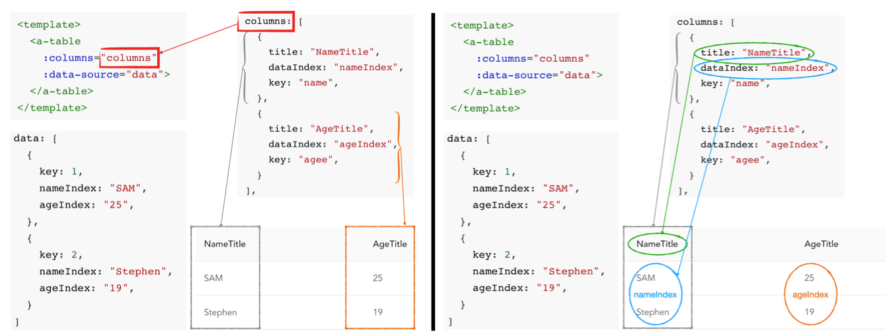
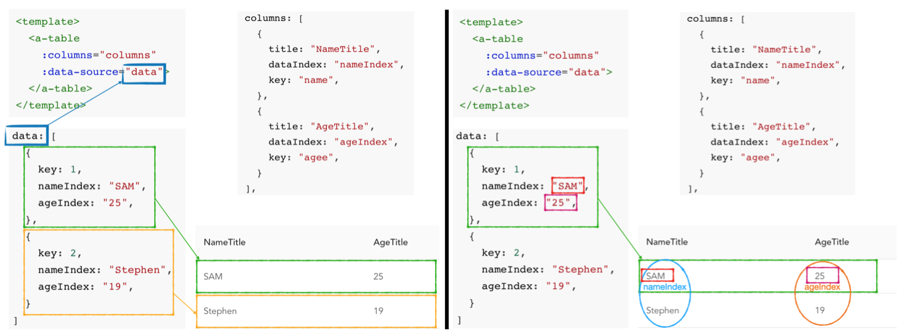
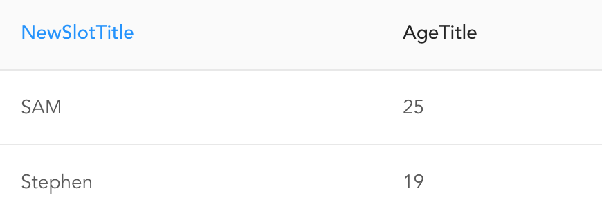
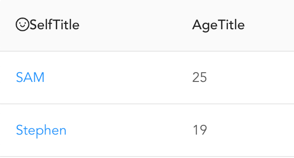
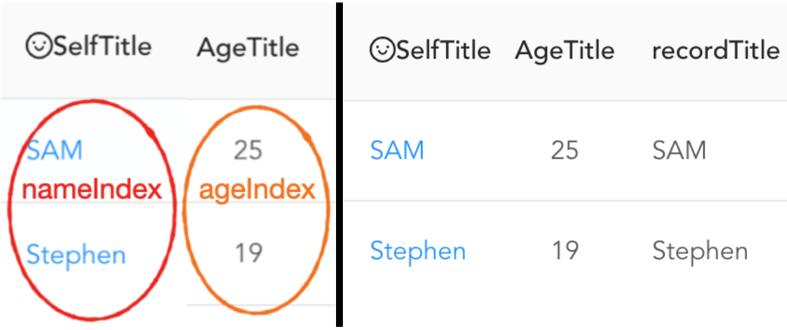

[TOC]

## Antdv.com

[ant design](antdv.com)

- [x] 学会官方组件库，组件实现的具体方式的查看

> [ant design/Customize Theme](https://antdv.com/docs/vue/customize-theme/)
>
> [default variables](https://github.com/vueComponent/ant-design-vue/blob/master/components/style/themes/default.less)
>
> [ant design/components](https://github.com/vueComponent/ant-design-vue/tree/master/components)

### 如何引入ant design组件？

[vue中使用ant design](https://www.cnblogs.com/psxiao/p/11417697.html)

​	1.打开项目terminal，下载ant design

```shell
$ npm i --save ant-design-vue
```

> 在执行了这个命令之后，package.json中会添加相关的依赖"dependencies"
>
> 这样如果上传到git之后，git pull完，通过```npm install```就可以下载相关的依赖，包括刚引入的ant-design-vue。
>
> 下面无论**全局引入**还是**局部引入**，都需要先下载。

​	2.1选择全局引入

```js
// 在src/main.js添加
import Antd from 'ant-design-vue'
import 'ant-design-vue/dist/antd.css'

Vue.use(Antd)
```

> 全局引入完成后，其他的页面使用的时候就不用进行其他别的操作，直接使用即可。
>
> 全局引入的问题是引入了很多你可能不会用上的一些组件，使得整个项目很臃肿。

​	2.2选择部分引入

```js
// 在src/main.js添加
import Table from 'ant-design-vue'
//import {Table, Button} from 'ant-design-vue'
import 'ant-design-vue/dist/antd.css'

Vue.use(Table);
//Vue.use(Button);
```

​	2.3按需引入

> 按需引入是在每个页面各自import，而不是在main.js里面管理import。有点麻烦，没必要。

---

### a-tooltip

###### ```title```

​		弹出的提示信息。在```a-tooltip```内部嵌入不同的元素，当鼠标移到该元素的时候会出现提示信息。

```vue
<template>
  <a-tooltip title="tips text">
    <p>Tooltip will show when mouse enter.</p>
  </a-tooltip>
</template>
```

###### ```placement```

​		可以设定气泡框的位置，同时也可以设定气泡的箭头相对于气泡的位置。

​		气泡框相对于元素出现的位置：```top```/```bottom```/```left```/```right```

​		气泡框的小箭头相对于气泡的位置：```topLeft/topRight``` / ```bottomLeft/bottomRight``` / ```leftTop/leftBottom``` / ```rightTop/rightBottom```

```vue
<template>
  <a-tooltip title="tips text" placement="topLeft">
    <p>Tooltip will show when mouse enter.</p>
  </a-tooltip>
</template>
```

###### ```arrowPointAtCenter```

​		气泡框出现的位置置中。

```vue
<template>
  <a-tooltip title="tips text" placement="topLeft" arrow-point-at-center>
    <p>Tooltip will show when mouse enter.</p>
  </a-tooltip>
</template>
```

###### ```autoAdjustOverflow```

​		气泡被遮挡时自动调整位置。```:auto-adjust-overflow="true"```是默认的。

```vue
<template>
  <a-tooltip title="tips text" placement="topLeft" :get-popup-container="getPopupContainer">
    <p>Tooltip will show when mouse enter.</p>
  </a-tooltip>
</template>
<script>
export default {
  data() {
    return {
    };
  },
  methods: {
    getPopupContainer(trigger) {
      return trigger.parentElement;
    },
  },
};
</script>
```

----------------

### a-icon

​		图标。

###### ```type```

​		图标类型。遵循图标的命名规范。

```vue
<a-icon type="search" />
```

###### ```theme```

​		图标主题风格。可以选择实心、描线、双色。适用于官方图标。

​		```filled```：实心

​		```outlined```：描线，默认属性

​		```twoTone```：双色。仅适用于官方的双色图标。

```vue
<a-icon type="smile" theme="twoTone">
```

​		对于```twoTone```，可以通过使用```Icon.getTwoToneColor()```和```Icon.setTwoToneColor()```来全局设置图标的主色。

```js
import { Icon } from 'ant-design-vue'

Icon.setTwoToneColor('#eb2f96');
Icon.getTwoToneColor(); // #eb2f96
```

###### ```spin```

​		图标旋转

```vue
<a-icon type="smile" theme="twoTone" spin>
```

-------------------

### a-input

###### ```placeholder```

​		不输入任何字符的时候，文本框默认显示的内容。

```vue
<template>
  <a-input placeholder="Basic usage" />
</template>
```

###### ```prefix``` & ```suffix```

​		在文本框内的头尾加入一些元素。

```vue
<!-- 加入一些简单的字符元素 -->
<a-input prefix="￥" suffix="RMB" />

<!-- 
	加入图片、图标；可以选用a-icon和a-tooltip，
	在子元素中定义 slot=""来设定位置
-->
<a-input ref="userNameInput" v-model="userName" placeholder="Basic usage">
	<a-icon slot="prefix" type="user" />
	<a-tooltip slot="suffix" title="Extra information">
		<a-icon type="info-circle" style="color: rgba(0,0,0,.45)" />
	</a-tooltip>
</a-input>
```

###### ```allow-clear```

​		允许快捷删除框内的内容。

```vue
<a-input placeholder="search" v-model="data" allow-clear></a-input>
```

#### a-input-search

​		?

----------------

### a-pagination

###### ```size```

​		分页栏提供两种样式，一种是带边框的（default），一种是不带边框的```size="small"```。

```vue
<a-pagination
	size="small"
	v-model="current"
	:total="total"
  >
</a-pagination>
```

###### ```total``` & ```show-total```

​		```total```绑定总共要展示的条目，页面大小默认值是10条目/页。```show-total```可以展示出总共有多少页（实际上可以根据分页的情况也可以看到总共多少页）。```:show-total="total => `共 ${pages} 页`" ```。这里的```pages```可以是后台直接返回一个相应的页码数，也可以根据回调函数返回的参数pageSize & 和总条目书total进行计算得到。

```vue
<a-pagination
	size="small"
	v-model="current"
	:total="total"
	:show-toal="total => `共 ${pages} 页"
	>
</a-pagination>
```

###### ```showSizeChanger```

​		决定页面大小是否可以进行改变，会有相应改变框。改变框中的选项也可以自定义。

```vue
<a-pagination
	size="small"
	v-model="current"
	:total="total"
	:show-toal="total => `共 ${pages} 页"
	show-size-changer
	>
</a-pagination>
```

###### ```showQuickJumper```

​		决定是否能够输入页码快速跳转过去，会有相应改变框。

```vue
<a-pagination
	size="small"
	v-model="current"
	:total="total"
	:show-toal="total => `共 ${pages} 页"
	show-size-changer
	show-quick-jumper
	>
</a-pagination>
```

###### ```simple```

​		一种十分简洁的跳转页码。

```vue
<a-pagination
	simple
	v-model="current"
	:total="total"
	>
</a-pagination>
```

###### 回调函数

​		```change```页码改变响应函数。

​		```showSizeChange```页面大小改变响应函数。

```vue
<a-pagination 
	size="small"
	:total="total" 
	:show-total="total => `共 ${pages} 页`" 
	:default-current=1
	@change="handleChange"
	@showSizeChange="handleChange"
	show-size-changer 
	show-quick-jumper >
</a-pagination>
```

---

### a-table

###### ```columns``` & ```dataSource```

​		定义表格的标题内容，以及该标题下（这一列）的各个表格元素的数据绑定。

```vue
<template>
	<a-table 
		:columns="columns" 
		:data-source="data">
  </a-table>
</template>
```

```vue
<script>
export default {
  data(){
    return {
      columns: [
		    {
			    title: "NameTitle",
			    dataIndex: "nameIndex",
			    key: "name",
		    },
		    {
			    title: "AgeTitle",
			    dataIndex: "ageIndex",
			    key: "age",
		    }
      ],
      data: [
        {
		      key: 0,
		      nameIndex: "SAM",
		      ageIndex: "25",
	      },
	      {
		      key: 1,
      		nameIndex: "Stephen",
		      ageIndex: "19",	
	      }
      ]
    }
  }
}
</script>
```

​		1.通过```:columns="columns"```来接收对表格整体参数的设定，主要分为```title```和```dataIndex```两个部分。这两个部分在```this.columns```数组中定义，数组每多一个元素就多一列（如左图中```NameTitle灰色列```和```AgeTitle橙色列```）。

​		```title```定义这一列的标题

​		```dataIndex```**数据域**定义接收数据的参数（如右图中```蓝色接收nameIndex```，```橙色接收ageIndex```）。



​		2.通过columns已经能够完成标题的渲染，现在需要对数据域进行渲染。数据域渲染出来的文本通过```:data-source="data"```来传，在```this.data```数组中定义，数组每多一个元素就多一行（如左图中```绿色行```和```橙色行```）。如下图的```data[0].nameIndex="SAM"```，即```第一行```的```nameIndex域```渲染成文本```SAM```；```data[0].ageIndex="25"```，即```第一行```的```ageIndex域```渲染成文本```25```。同理：```data[1].ageIndex="19"```，即```第二行```的```ageIndex域```渲染成文本```19```。



###### ```slot``` & ```scopedSlots```

​		上面两个图可以看到，```title```和```dataIndex```里面的内容都是简单的text属性。我们可以自己修改这两个default属性从而**改变表格内标题和单元格显示的样式**。

​		```slot```：改变标题样式，**替换**了```title```的作用。注意，不能再使用```title```（优先级高）给标题定值。

​		```scopedSlots```：改变data域的样式，**补充**了```dataIndex```。

​		1.0 ```slot```的改变

```vue
<template>
	<a-table 
		:columns="columns" 
		:data-source="data">
	<a slot="selfTitleSlot">NewSlotTitle</a>
  </a-table>
</template>
```

```vue
<script>
export default {
  data(){
    return {
      columns: [
		    {
			    // title: "NameTitle", //此处title优先级最高，如果写了就会覆盖其他的改写样式
          slots: {title: "selfTitleSlot"}, //告知 title我将会自行定义样式
			    dataIndex: "nameIndex",
			    key: "name",
		    },
		    {
			    title: "AgeTitle",
			    dataIndex: "ageIndex",
			    key: "age",
          // align: "center", //如果想文字居中直接在这里定义
		    }
      ],
      data: [
        {
		      key: 0,
		      nameIndex: "SAM",
		      ageIndex: "25",
	      },
	      {
		      key: 1,
      		nameIndex: "Stephen",
		      ageIndex: "19",	
	      }
      ]
    }
  }
}
</script>
```

为了更好地看清楚代码，截取其中改变的：

> 1.在columns里定义纵列的时候，不要给```title```赋值，而**替换成**告知自己将要采用新的title样式```slots: {title: "selfTitleSlot"}```。
>
> ```js
> {
> 	// title: "NameTitle", //此处title优先级最高，如果写了就会覆盖其他的改写样式
> 	slots: {title: "selfTitleSlot"}, //告知 title我将会自行定义样式
> 	dataIndex: "nameIndex",
> 	key: "name",
> },
> ```
>
> 2.在```<a-table>```组件内部，定义想要的样式（如这里的```<a></a>```），用```slot="selfTitleSlot"```即可替换成功。
>
> ```vue
> <template>
> 	<a-table 
> 		:columns="columns" 
> 		:data-source="data">
> 	<a slot="selfTitleSlot">NewSlotTitle</a>
>   </a-table>
> </template>
> ```
>
> 

​		2.0 ```scopedslots```的改变

```vue
<template>
	<a-table 
		:columns="columns" 
		:data-source="data">
    <span slot="selfTitleSlot"><a-icon type="smile-o"></a-icon>NewSlotTitle</span>
    <a slot="nameContent" slot-scope="text">{{ text }}</a>
    <!-- 这里也可以写成slot-scope="nameText" {{ nameText }}，只是一个参数 -->
    <!-- 但是后面用到的record是关键字，表示这个row上的数据集 -->
  </a-table>
</template>
```

```vue
<script>
export default {
  data(){
    return {
      columns: [
		    {
          slots: {title: "selfTitleSlot"}, 
			    dataIndex: "nameIndex",
          scopedSlots: {customRender: "nameContent"},
			    key: "name",
		    },
		    {
			    title: "AgeTitle",
			    dataIndex: "ageIndex",
			    key: "age",
		    }
      ],
      data: [
        {
		      key: 0,
		      nameIndex: "SAM",
		      ageIndex: "25",
	      },
	      {
		      key: 1,
      		nameIndex: "Stephen",
		      ageIndex: "19",	
	      }
      ]
    }
  }
}
</script>
```

同样，为了更好地看清楚代码，截取其中改变的：

> 1.在columns里定义纵列的时候，**补充**```dataIndex```告知自己将要采用新的单元格样式```scopedSlots: { customRender: "nameContent"}```。这里为什么需要```补充dataIndex```而不是替换，在第二步中继续说明。
>
> ```js
> {
> 	slots: {title: "selfTitleSlot"}, 
> 	dataIndex: "nameIndex",
> 	scopedSlots: {customRender: "nameContent"},
> 	key: "name",
> },
> ```
>
> 2.同样，在```<a-table>```组件内部，定义想要的样式（如这里的```<a></a>```），用```slot="selfTitleSlot"```即可替换成功。
>
> 注意```html```中，与改变title样式不同（这个例子中对上个例子的title进行了进一步的修改），改变单元格的样式时，元素内部多了一个要指定的```slot-scope="text"```，原因是每一个column中只有一个title，但是会有很多个单元格，因此每个单元格放什么内容需要指定。```<a slot="nameContent" slot-scope="text">{{ text }}</a>```的意思是，每个单元格本身的内容直接渲染即可。当然这里的```text```也可以改成别的名称。
>
> ```vue
> <template>
> 	<a-table 
> 		:columns="columns" 
> 		:data-source="data">
>     <span slot="selfTitleSlot"><a-icon type="smile-o"></a-icon>NewSlotTitle</span>
>     <a slot="nameContent" slot-scope="text">{{ text }}</a>
>     <!-- 这里也可以写成slot-scope="nameText" {{ nameText }}，只是一个参数 -->
>     <!-- 但是后面用到的record是关键字，表示这个row上的数据集 -->
>   </a-table>
> </template>
> ```
>
> 
>
> **BUT！**这里有一个关键字：```record```：整一行的数据。然后再使用```record.dataIndex```来取一行中的某个单元格内容（e.g.上述例子```{{record.nameIndex}}```可以取SAM和Stephen）。这里也是为什么自定义单元格样式```scopedSlots: {customRender: "CSSNAME"}```是对```dataIndex```的补充，因为用```record.dataIndex```的时候需要用到。
>
> 添加第三列来说明。
>
> 1.在colomns中添加第三列信息
>
> ```js
> {
> 	title: recordTitle,
> 	//dataIndex: "", 此处因为要使用别的列的数据，因此不用自己的单元格内容
> 	scopedSlots: {customRender: "byRecordContent"},
> 	key: "recordTitleKey",
> },
> ```
>
> 2.在html中使用，这里的```nameIndex```是第一列的单元格域。
>
> ```vue
> <a-table 
> 	:columns="columns" 
> 	:data-source="data">
> 	<span slot="selfTitle"><a-icon type="smile-o" />SelfTitle</span>
> 	<a slot="nameContent" slot-scope="text">{{ text }}</a>
> 	<span slot="actionRenderSlot" slot-scope="record">{{ record.nameIndex }}</span>
>   <!--  record.nameIndex红色部分，record.ageIndex橙色部分-->
> </a-table>
> ```
>
> 
>
> 再引用```<a-tag>```体会一下元素定义的```slot-scope```的含义。
>
> ```vue
> <!-- 记得要在main.js import Tag以及use -->
> <span slot="tagRenderSlot" slot-scope="tagsText">
> 	<a-tag
> 	v-for="item in tagsText"
> 	:key = item
> 	:color="item === 'loser' ? 'volcano' : item.length > 5 ? 'geekblue' : 'green'"
> > {{ item.toUpperCase() }} </a-tag>
> </span>
> ```
>
> 这里官方例子的三元表达式可以好好理解一下。（如果```item==='loser'```则```:color="volcano"```红色，否则就执行```:```后面的```item.length > 5 ? 'geekblue' : 'green'```；这后面的又是一个三元表达式：如果```item.length > 5```则```:color="geekblue"```，否则就```:color="green"```。）
>
> ```js
> {
> 	title: "Tags",
> 	dataIndex: "tagIndex",
> 	scopedSlots: { customRender: "tagRenderSlot"},
> 	key: "tagKey",
> }
> ```
>
> ```js
> data: [
> 	{
> 		key: 1,
> 		nameIndex: "SAM",
> 		ageIndex: "25",
> 		tags: ['nice', 'developer'],
> 	},
> 	{
> 		key: 2,
> 		nameIndex: "Stephen",
> 		ageIndex: "19",	
> 		tags: ['loser'],
> },
> ```
>
> 

###### ```rowKey```

​		定义每一行的```key```。一般在```data```中定义每一行数据的时候可以直接指定这一行的```key```，如：

```js
data: [
	{
	key: 0,
	nameIndex: "SAM",
	ageIndex: "25",
	},
	{
	key: 1,
	nameIndex: "Stephen",
	ageIndex: "19",	
	}
]
```

​		**BUT！**有时候```data```数据是从父组件调用过来，因此```data```并不是一个固定的数组。这时候可以直接在```<a-table>```中直接使用```record.```来指定每一行的```key```：```:row-key="record => record.nameIndex"```。

```vue
<a-table
	:row-key="record => record.nameIndex"
	>
</a-table>
```

###### ```pagination```

​		一般```pagination="false"```隐藏起来```a-table```自带的分页栏，而使用更多操作的```a-pagination```。


### a-layout


