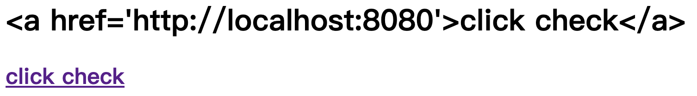
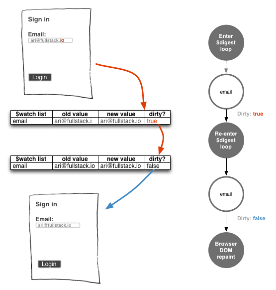
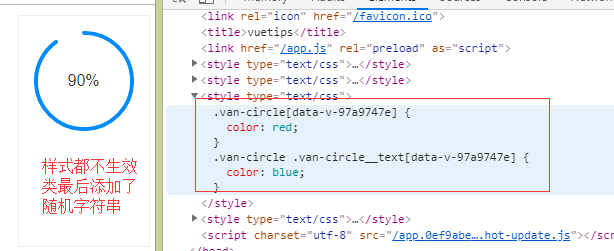
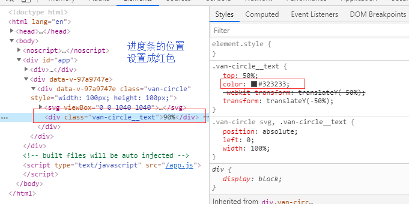

[TOC]

### 1. v-text和v-html区别

> v-html会将元素当成HTML标签解析后输出。也就是对文本的内容**先进行html解析**，再输出。

I：在显示一般的文字文本的时候，两者没有差别。普通文本在html解析之后仍然为普通的文本。

II：如果需要显示链接文本，需要使用v-html。v-text只会显示成一般的文本。

```html
<!-- 如对message进行v-text和v-html输出，效果不同 -->
message: "<a href='http://localhost:8080'>click check</a>"
<h1 v-text = "message"></h1>
<h2 v-html = "message"></h2>
```



----------

### 2. v-bind & v-model

​		```v-bind:src="imgSrc"```可以看作是数据的单向监听，```element```监听```data```的数据变化，但是自身不会进行```imgSrc```的改变。当监听到数据的变化则进行渲染。

​		```v-model="message"```可以看作是数据的双向绑定，```element```和```data```都会对```message```这个数据进行改变，某一个改变都会进行双向的同步修改。

------------------

### 3. v-on: input?

### 4. v-for的key字段警告

[解决v-for产生的警告的办法](https://www.cnblogs.com/kugeliu/p/6728245.html)

### 5. 虚拟DOM / 真实DOM？

​		DOM（Document Object Model，文档对象模型），是W3C组织推荐的处理**可拓展置标语言**的标准变成接口。它提供了对文档的结构化的表述，并定义了一种方式可以使从程序中对该结构进行访问，从而改变文档的结构，样式和内容。DOM 将文档解析为一个由节点和对象（包含属性和方法的对象）组成的结构集合。

​		DOM是针对HTML和XML文档的一个API（应用程序编程接口）。DOM描绘了一个层次话的节点树，允许开发人员添加、移除和修改页面的一部分。

###### DOM

​		在了解虚拟DOM之前，需要对DOM Tree在渲染所处位置进行了解。

​		浏览器获取了文件之后的工作流程，「构建DOM -> 构建CSSOM -> 构建渲染树 -> 布局 -> 绘制」

> 1. 构建DOM：根据HTML/SVG/XHTML等，构建DOM TREE
> 2. 构建CSSOM：根据CSS构建CSSOM
> 3. JS/脚本通过DOM API和CSSOM API来操作DOM Tree和CSS Rule Tree
> 4. 构造Render Tree（渲染树）
> 5. 布局绘制页面


​				

​		可以看到，DOM Tree可能会因为调用DOM API而产生频繁的修改。每一次修改都需要进行一定量的计算，因此会耗费大量的资源。

###### 真实DOM和虚拟DOM

​		为了减少对DOM（即真实DOM）的修改，引入虚拟DOM。虚拟DOM主要完成的事情包括：

> 1. 将页面改变的内容应用到虚拟 DOM 上，而不是直接应用到 DOM 上。
> 2. 变化被应用到虚拟 DOM 上时，虚拟DOM并不急着去渲染页面，而仅仅是调整虚拟 DOM 的内部状态，这样操作虚拟DOM的代价就变得非常轻了。
> 3. 在虚拟 DOM 收集到足够的改变时，再把这些变化一次性应用到真实的 DOM 上。

		

> 1. **创建阶段。**首先依据 JSX 和基础数据创建出来虚拟 DOM，它反映了真实的 DOM 树的结构。然后由虚拟 DOM 树创建出真实 DOM 树，真实的 DOM 树生成完后，再触发渲染流水线往屏幕输出页面。
> 2. **更新阶段**。如果数据发生了改变，那么就需要根据新的数据创建一个新的虚拟DOM树；然后比较两个树，找出变化的地方，并把变化的地方一次性更新到真实的 DOM 树上；最后渲染引擎更新渲染流水线，并生成新的页面。

#### CQ：```hidden:``` & ```display:```与render tree

```hidden```

​		hidden字符只是将元素隐藏，但是还是会添加到render tree（渲染树）进行页面的渲染。

```display```

​		display字符将元素设置为不展示，即不会讲元素添加到render tree。

which one?

​		如果要对页面中的元素进行频繁地隐藏/显示操作，改动元素的```hidden```，这样子就不会进行重复渲染。

----------------

### 6. 语法糖是什么？

​		简写。如```v-bind:```简写成```:```，```v-on:```简写成```@```。

---------------

### 7. 脏检查？

[什么是脏检查？](https://www.cnblogs.com/eret9616/p/9155675.html)

[如何理解angular的脏检查？](https://www.jianshu.com/p/850f0f76e908)

[AngularJS脏检查深入分析](https://www.cnblogs.com/likeFlyingFish/p/6183630.html)

​		脏检查（Dirty Checking）的全名是脏数据检查。是AngularJS命名的。脏数据也就是产生了变化的数据。

​		脏检查这个东西，其实在三大主流前端框架中或多或少都有涉及。React 每次生成新的 `Virtual DOM`，与旧 `Virtual DOM`的 diff 操作本来就可以看做一次脏检查。Vue 从相对彻底的抛弃了脏检查机制，使用 `Property` 主动触发 UI 更新，但是 Vue 仍然不能抛弃 `track by` (用来标记数组元素的key) 这个东西。通过将新旧数组的 `track by` 元素做 diff 猜测用户的行为，最大可能的减少 DOM 树的操作，这就是 `track by`的用处。

​		Angular 1的性能被广为诟病，因为在 Angular 1 的机制下，脏检查的执行范围过大以及频率太过频繁了。

- [ ] track by？

  > AngularJS remembers the value and compares it to a previous value. This is basic dirty-checking. If there is a change in value, then it fires the change event.

  > Angular defines a concept of a so called digest cycle. This cycle can be considered as a loop, during which Angular checks if there are any changes to all the variables watched by all the $scopes. So if you have $scope.myVar defined in your controller and this variable was marked for being watched, then you are explicitly telling Angular to monitor the changes on myVar in each iteration of the loop.



​		用户点击了 button，angular 执行了一个叫 onClick 的方法。这个 onClick 的方法体对于 angular 来说是黑盒，它到底做了什么不知道。可能改了 $scope.content1 的值，可能改了 $scope.content2 的值，也可能两个值都改了，也可能都没改。那么 angular 到底应该怎样得知 onClick() 这段代码后是否应该刷新 UI，应该更新哪个 DOM 元素？angular 必须去挨个检查这些元素对应绑定表达式的值是否有被改变。这就是脏数据检查的由来。		在angular程序初始化时，会将绑定的对象的属性添加为监听对象（watcher），也就是说一个对象绑定了N个属性，就会添加N个watcher。Angular并不是周期性触发藏检查。**只有当UI事件，ajax请求或者 timeout 延迟事件，才会触发脏检查。**

-------

### 8. a-pagination scroll

​		必须定义x的值，不然<a-table>中的<th>会fix住，不会移动。

​		并且x的值要大于table的宽度。

```vue
<a-table
	:columns="columns"
	:data-source="blockList"
	:row-key="record => record.blockHeight"
	:pagination="false"
	:scroll="{x:1400, y:480}"
	class="block-list"
	>
</a-table>
```

---

### 9. import、export、export default

[关于Vue中的import、export、export default的区别以及用法](https://blog.csdn.net/qq_35953966/article/details/104677918?utm_medium=distribute.pc_relevant.none-task-blog-title-2&spm=1001.2101.3001.4242)

```export```

​		export 单个变量

```js
// exportSingleSample.js
export var name="LiangZesheng";
```

```vue
<!-- .vue文件import -->
import { name } from "./exportSingleSample.js"
export default {
	data(){
		return{
			
		}
	},
	created(){
		alert(name) //可以弹出来“LiangZesheng”
	}
}
```

​		export 多个变量

```js
// exportFewSample.js
var name1 = "LiangZesheng";
var name2 = "StephenSam";
export { name1, name2 };
// 也可以分开写
// export name1; 
// export name2;
```

```vue
<!-- .vue文件import -->
import { name1, name2 } from "./exportFewSample.js"

export default {
  data () {
    return { }
  },
  created:function(){//create:打开文件默认执行的方法
    alert(name1)//可以弹出来“LiangZesheng”
    alert(name2)//可以弹出来“StephenSam”
  }
}
```

​		export 函数

```js
// exportFunctionSample.js
function add(x,y){
   alert(x * y)
}
export { add }
```

```vue
<!-- .vue文件import -->
import { add } from "./exportFunctionSample.js"
export default {
  data () {
    return { }
  },
  created:function(){
   add(4,6) //弹出来24
  }
 }
```

```export default```

> 在一个文件或模块中，export、import可以有多个，**export default仅有一个**
>
> **通过export方式导出，在导入时要加{ }，export default则不需要**

```js
// exportDefaultSample.js
export default {
  data(){
    return {
      name1: "",
      name2: "",
    }
  }
}
```

```vue
<!-- .vue文件import -->
<script>
import name1, name2 from "exportDefaultSample.js"
</script>
```

--------

### 10. v-for 和 v-if 优先级，以及避免同时使用

​	[Vue：v-for与v-if的优先级，以及避免同时使用](https://juejin.im/post/6844903901410361352)

​	一般我们会在一下的这两种情况下倾向于将```v-for``` 和 ```v-if```同时使用：

1. 为了过滤一个列表中的项目。比如

   ```vue
   <li v-for="user in users" v-if="user.isActive">···</li>
   ```

   ​		在这种情况下，解决这个问题，将users替换为一个计算属性（比如activeUsers），让其返回过滤后的列表。即**先通过v-if返回一个过滤完成的列表，再使用v-for**。

   ```vue
   <ul>
     <li v-for="user in activeUsers" 
         :key="user.id"
     >
       {{ user.name }}
     </li>
   </ul>
   ```

2. 为了**避免渲染**<u>本应该被隐藏的列表</u>。比如

   ```vue
   <li v-for="user in users" v-if="shouldShowUsers">···</li>
   ```

   ​		在这种情况下，将v-if移动至容器元素上。

   ```vue
   <ul v-if="shouldShowUsers">
   	<li
     	v-for="user in users"
   	  :key="user.id"
   	>
     	{{ user.name }}
   	</li>
   </ul>
   ```

**原因**：

```vue
<ul>
  <li
    v-for="user in users"
    v-if="user.isActive"
    :key="user.id"
  >
    {{ user.name }}
  </li>
</ul>
```

​	对于上述的代码，哪怕我们只渲染出一小部分用户的元素，也得**在每次重渲染**的时候**遍历整个列表**，**不论活跃用户是否发生了变化**。会进行如下的计算：

```vue
<!-- 每次都遍历整个列表看看需要渲染哪部分 -->
this.users.map(function (user) {
  if (user.isActive) {
    return user.name
  }
})
```

​	而如果通过```computed```挑选出需要显示的部分。

```vue
computed: {
 activeUsers: function () {
     return this.users.filter(function (user) {
     return user.isActive
 })
 }
}
```

```vue
<ul>
  <li
    v-for="user in activeUsers"
    :key="user.id"
  >
    {{ user.name }}
  </li>
</ul>
```

​	过滤后的列表```activeUsers```只会在```users```数组发生相关变化的时候才会被重新运算，过滤更加高效。不用每一次重渲染都遍历一整个数组。而我们在渲染的时候只遍历活跃用户，渲染更高效。（实际上只有```activeUsers```是需要被关注的，整个列表有一些冗余的部分并不需要被关注。）

---

### 11. 关于vue的懒加载

​	在vue的router中，可以通过**懒加载**的方式，在网页需要用的时候才会进行文件的加载。

```js
// 通过固定加载的方式，只要启动项目就会加载相关的import文件
import Vue from 'vue'
import Router from 'vue-router'
import mainpage from '@/components/mainpage' //@是自己配置的根目录

Vue.use(Router)

export default new Router({
  mode: 'history',
  routers:[
    {
      path: '/',
      name: 'mainpage',
      component: mainpage,
    }
  ]
})
```

```js
// 通过懒加载的方式，在启动项目的时候不加载，只有在点击事件需要相关import文件的时候才会进行加载
import Vue from 'vue'
import Router from 'vue-router'
// 此处不用import mainpage from '@/components/mainpage'

Vue.use(Router)

export default new Router({
  mode: 'history',
  routers:[
    {
      path: '/',
      name: 'mainpage',
      component: () => import('@/componets/mainpage'),
    }
  ]
})
```

---

#### 如何配置router的```@```目录指代


---

### 12. SCSS全局设置参数

类似于可以定义MAX_SIZE=10这样的方式，以便于后续的代码维护。对于CSS样式中的比如颜色之类的，也可以使用SCSS来进行--background-color=""设定好某一种主题颜色来方便后期的代码维护。

---

### 13. 关于antd组件的语言问题

[ConfigProvider](https://antdv.com/components/config-provider/)

---

### 14. CSS样式穿透 ```>>>``` or ```/deep/```

[vue中CSS样式穿透](https://segmentfault.com/a/1190000020368529?utm_source=tag-newest)

> 采用有赞开发的vant组件库。组件库内置了很多样式，方便了我们开发者，同时又因高度封装，有时也会给我们带来一点点困扰。比如在使用vant组件库中的环形进度条时，查看官方文档，有改变进度条颜色，有改变轨道颜色，也有改变填充颜色。就是没有改变现实文字颜色的。凑巧的是，我们的需求就是要**改变文字颜色**，怎么办呢？

```van-circle```组件为例，该组件内部是一个svg和div标签组成，svg用于现实我们图形，div用于显示文字。并且在这个div上存在一个class为```van-circle__text```，且default-color: black。按照以下思路来进行文字颜色完成```color: blue```的修改。

​	1.父级元素更改

​		```van-circle```里包含```div```，在```div```中存在```van-circle__text```。根据css的优先级，修改父级设置并不能改变字体颜色，因为```van-circle__text```的优先级更高。因此下面这种方法是没办法修改文字颜色的。

```vue
<style lang="less" scoped>
  .van-circle{color: blue;}
</style>
```

​	2.scoped域的限定

​		scoped会将css样式限定在本页面样式渲染，其原理是在每一个样式都会添加一个独一无二的随机属性标签。可以将scoped去除，从而将样式编程全局（全局样式可能会导致样式的污染）。



如果删除了scoped，```van-circle__text```的颜色依然为```color: black```。



​	3.**样式穿透**

​		官方提供深度选择器，即我们所说的样式穿透。通过上面两个方式的模拟解决，发现并没有办法对高度封装的样式的某些属性进行修改，这时候就需要用到深度选择器。可以在需要穿透的选择器前面添加```>>>```或者```/deep/```就可以实现深度选择器（样式穿透）。

```vue
// 用/deep/关键字符
//less写法
<style lang="less" scoped>
  .van-circle {
    /deep/ .van-circle__text {
      color: blue;
    }
  } 
</style>

//css写法
<style>
	.van-circle /deep/ .van-circle__text {
    color: blue;
  } 
</style>
```

```vue
// 用>>>关键字符
//less写法
<style lang="less" scoped>
  .van-circle {
    >>> .van-circle__text {
      color: blue;
    }
  } 
</style>

//css写法
<style scoped>
  .van-circle >>> .van-circle__text {
    color: blue;
  }
</style>
```

###### 如何检查需要穿透的元素所在的位置？

​	直接在页面检查，点击元素的详情看看父子关系就可以知道了。

---

### 15. svg & less

> SVG（Scalable Vector Graphics，可缩放矢量图形），使用 XML 格式定义图像。
>
> [svg](https://developer.mozilla.org/zh-CN/docs/Web/SVG) 
>
> CSS（Cascading Style Sheets，层叠样式表），是用来控制网页在浏览器中的显示外观的声明式语言。
>
> Less（Leaner Style Sheets），扩充了 CSS 语言，增加了诸如变量、混合(mixin)、运算、函数等功能。
>
> [less](https://less.bootcss.com)

- [x] 学会官方组件库，组件实现的具体方式的查看

  > [ant design/Customize Theme](https://antdv.com/docs/vue/customize-theme/)
  >
  > [default variables](https://github.com/vueComponent/ant-design-vue/blob/master/components/style/themes/default.less)
  >
  > [ant design/components](https://github.com/vueComponent/ant-design-vue/tree/master/components)

---

### 16. 一个ROOT的原因？

---

### 17. 三元表达式 & 对象表达式

> ```html
> //首先定义两个style用来理解这两种表达式
> <style>
> .active{
>  border: 1px solid green; //定义active为1px的绿色边框
> }
> .mofang{
>  border: 1px solid red; //定义mofang为1px的红色边框
> }
> </style>
> ```

> 三元表达式
>
> ```html
>    :title="imgTitle"
>   :class="isActive?'active'"> //如果isActive===true,则class="active";反之,class=""
> ```

> 对象表达式
>
> ```html
>    :title="imgTitle"
>   :class="{mofang:isActive}"> //如果isActive===true,则class="active";反之,class=""
> ```

---