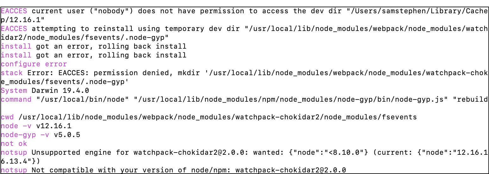
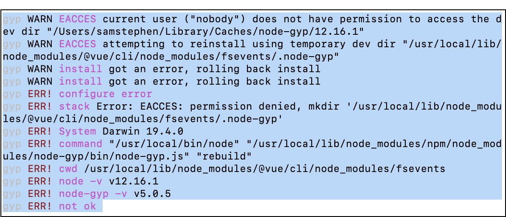
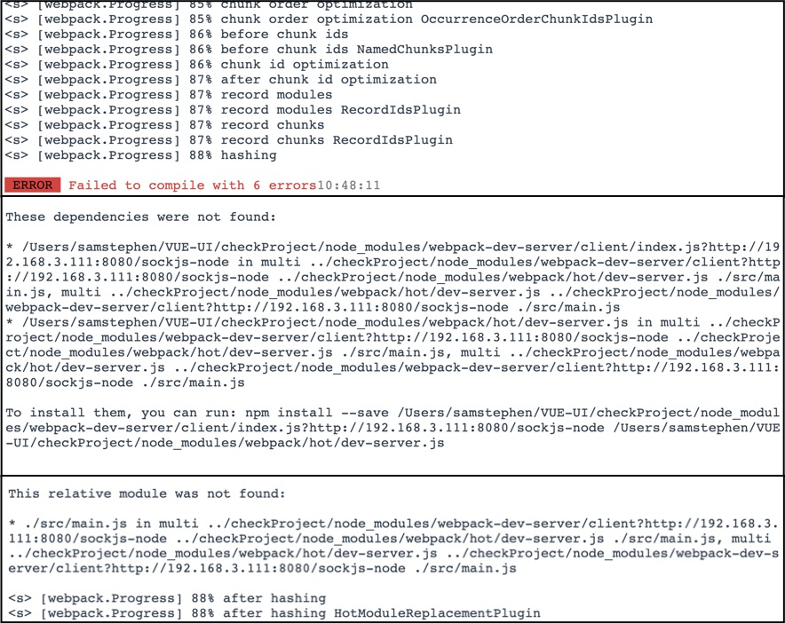
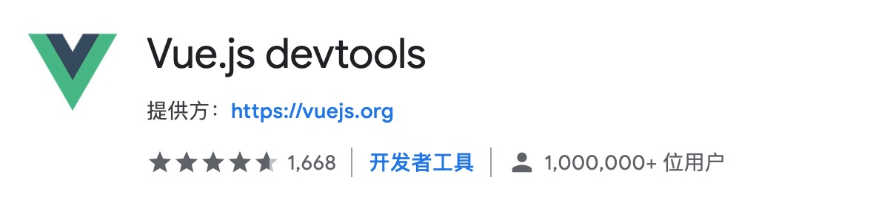
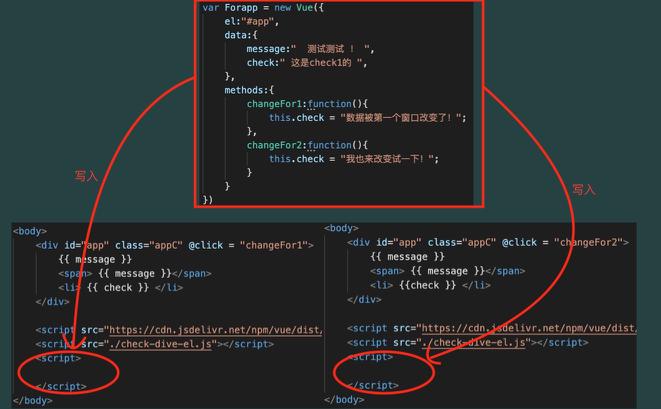
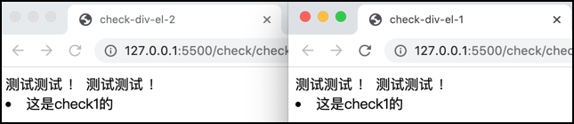
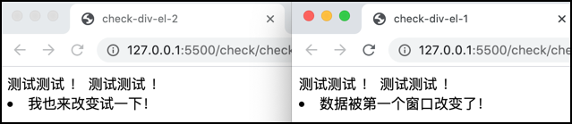

[TOC]

# 0. vue-cli

参考：[vue cli的超详细教程--安装](https://blog.csdn.net/qq_40741855/article/details/87077521)、[vue 利用vue ui创建项目--安装、使用](https://blog.csdn.net/weixin_40688217/article/details/88321322)。

​	脚手架提供一个方便进行项目新建、管理的一个插件，还提供了管理的可视化页面。

## 1. MAC安装vue cli和使用

在安装cli之前，需要安装webpack，关于webpack的作用，参考[我为什么要使用webpack](https://www.jianshu.com/p/9f2d0b64f3b8)

> *我们可以将HTML、CSS和JavaScript代码放在同一个.vue文件当中，强大的Webpack可以将这些代码分离出来，并分别与其他同类型的代码打包到一起。而我们不需要管Webpack内部是如何运作的，只需要知道单文件组件形式确实会为我们的工作带来极大的便利性。*

### 1.1 安装webpack

```shell
$ sudo npm install webpack -g //如果出现代理proxy问题，翻墙再执行即可
```

:exclamation: **执行完毕之后出现的error，提供后续检查：**



```shell
$ webpack -v //查看版本 检查是否安装完成
//如果出现需要安装webpack-cli，需要自己手动安装，不要自动安装，因为自动安装没有-g全局
$ sudo npm install webpack-cli -g
```

### 1.2 安装vue-cli

```shell
$ sudo npm install -g @vue/cli //下载最新版本vue cli
```

:exclamation: **执行完毕之后出现的error，提供后续检查：**



```shell
// 目前觉得可能是升级了系统之后终端提示的，后续检查再看：
The default interactive shell is now zsh.
To update your account to use zsh, please run `chsh -s /bin/zsh`.
For more details, please visit https://support.apple.com/kb/HT208050.
```

```shell
$ vue -V //查看版本 检查是否安装完成
$ vue -h //查看帮助
$ which vue //查看路径 -> /usr/local/bin/vue
```

### 1.3 使用 vue-ui

参考：[vue 利用vue ui创建项目](https://blog.csdn.net/weixin_40688217/article/details/88321322)。

```shell
$ vue ui //打开网页版vue项目管理页面，注意关闭终端则会断开链接
```

参考引文中的步骤：

- 选择samstephen > VUE-UI文件夹创建项目

- 包管理器“默认”；更多选项都不勾选；初始化git仓库勾选

- 选择手动配置，**babel**、**router**、**使用配置文件**、Linter/formatter格式太严苛，别安装

- 不要选择history mode（别勾选，使用哈希模式）[history mode](https://router.vuejs.org/guide/essentials/history-mode.html#example-server-configurations)

- 保存/不保存预设都行

  > 配置完成之后项目会自行创建，在终端上可以看到相关的记录，但是可能会出现error
  >
  > 参考[NPM Error: gyp: No Xcode or CLT version detected!](https://www.cnblogs.com/zhennann/p/12272058.html)：
  >
  > ```shell
  > $ Xcode-select --install //下载相关的Xcode-cli即可
  > ```

- 点击左侧插件栏目，点击添加新的插件“vue-cli-plugin-element”，右下角安装此插件

  > 此处看视频有弹幕说可以在终端上执行npm install element

- 配置插件"vue-cli-plugin-element"，fully import改成import on demand，项目简洁一点

- 在可视化网页端管理项目的server中运行项目，项目出错：



- [x] 在vue-ui里运行始终会出问题，直接在vscode里打开项目，在终端console上运行`npm run serve`（具体run serve｜dev要看package.js中写的命令）即可。

****

### 1.4 终端创建vue项目

```shell
$ cd 指定目录 //会在该目录底下创建文件
$ vue create projectName
```

```shell
//在vscode上打开文件，打开终端，运行项目
$ npm run serve
```

- [x] `Babel` 主要是对es6语法转换成兼容的js 
- [ ] `TypeScript` 支持使用TypeScript语法来编写代码
- [ ] `PWA` [PWA](https://developers.google.com/web/progressive-web-apps/) 支持
- [x] `Router` 支持vue路由配置插件
- [x] `Vuex` 支持vue程序状态管理模式
- [ ] `CSS Pre-processors` 支持css预处理器
- [ ] `Linter / Formatter` 支持代码风格检查和格式化 
- [ ] `Unit Testing` 单元测试
- [ ] `E2E Testing` E2E测试

****

# 1. vue

## 0. vue和html文件在代码上的不同

> 1. html的主体最外层为html,其次head、body，script部分包含在body内，并放在body末尾好
> 2. vue的主体是template

```html
<!-- html的主体最外层为html,其次head、body -->
<html lang="en">

<head>
    <meta charset="UTF-8">
    <meta name="viewport" content="width=device-width, initial-scale=1.0">
    <meta http-equiv="X-UA-Compatible" content="ie=edge">
    <title>check-div-el-1</title>
</head>

<body>
    <div id="app" class="appC" @click = "changeFor1">
        {{ message }}
        <span> {{ message }}</span> 
        <li> {{ check }} </li>
    </div>

    <script src="https://cdn.jsdelivr.net/npm/vue/dist/vue.js"></script>
    <script src="./check-dive-el.js"></script>
</body>

</html>
```

```vue
<!-- vue的主体是template和script两部分 -->
<template>
  <div class="home">
    
    <HelloWorld msg="Welcome to Your Vue.js App"/>
  </div>
</template>

<script>
// @ is an alias to /src
import HelloWorld from '@/components/HelloWorld.vue'

export default {
  name: 'Home',
  components: {
    HelloWorld
  }
}
</script>
```

## 1. 关于vue：vscode插件 & chrome插件

- [x] 关于更多的插件，见`git/vscode.md`

为了方便开发，使用vscode，引入三个插件：

1. `open in browser`: 提供在浏览器打开
2. `Live Server`: 提供实时的浏览器更新，只要代码保存，浏览器就会实时变化
3. vue
4. `Vuter`（项目构建可能需要这个库）
5. `Auto Rename Tag`：提供了html开始标签和关闭标签的同步修改

**需要注意的是，在安装了Live Server插件之后，想要使用需要在vscode中打开整个项目文件包，如果只打开其中一个.vue文件是不能使用的。具体的使用只要在相应的代码中 「鼠标右键」> 「“open with live server”」即可。**

此外，在chrome上通过google的应用商店安装插件`vue.js devtools`，可以提供vue的专门检查工具：



****

## 2. vue的引用

参考：[vue官方文档](https://cn.vuejs.org/v2/guide/installation.html).

Vue的官方文档中提供了两种版本提供友好开发，目前以开发版本为主。

1. 下载到本地作为本地文件引入

   ```html
   <body>
     <script src="./vue.js" type="text/javascript" charset="utf-8"></script>
   </body>
   ```

2. 直接CDN引入

   > CDN的全称是Content Delivery Network，即内容分发网络。CDN是构建在现有网络基础之上的智能虚拟网络，依靠部署在各地的边缘服务器，通过中心平台的负载均衡、内容分发、调度等功能模块，使用户就近获取所需内容，降低网络拥塞，提高用户访问响应速度和命中率。

   ```html
   <body>
     <script src="https://cdn.jsdelivr.net/npm/vue/dist/vue.js"></script>
   </body>
   //直接利用CDN，不需要下载到本地
   ```

​	vue的引用、java的import很重要的概念是：引用一份文件，只是拷贝到本地。定义在另一个a.js文件内的内容，在b.html引用的时候，将a.js的内容拷贝到b.html上（相当于粘贴到b.html的代码后面）；在c.html引用的时候，拷贝到c.html上。因此同样对a.js里面定义的数据进行操作的时候，并不会共享同一个内容，而是分别操作拷贝到本地的数据。

```js
<!-- 在a.js中定义了 script的内容，之后给共享 -->
var Forapp = new Vue({
    el:"#app", 
    data:{
        message:"  测试测试 ！ ",
        check:" 这是check1的 ",
    },
    methods:{
        changeFor1:function(){
            this.check = "数据被第一个窗口改变了！";
        },
        changeFor2:function(){
            this.check = "我也来改变试一下！";
        }
    }
})
```

```html
<!-- 在b.html -->
<html lang="en">

<head>
    <meta charset="UTF-8">
    <meta name="viewport" content="width=device-width, initial-scale=1.0">
    <meta http-equiv="X-UA-Compatible" content="ie=edge">
    <title>check-div-el-1</title>
</head>

<body>
    <div id="app" class="appC" @click = "changeFor1">
        {{ message }}
        <span> {{ message }}</span> 
        <li> {{ check }} </li>
    </div>

    <script src="https://cdn.jsdelivr.net/npm/vue/dist/vue.js"></script>
    <script src="./check-dive-el.js"></script>
</body>

</html>
```

```html
<!-- 在c.html -->
<html lang="en">

<head>
    <meta charset="UTF-8">
    <meta name="viewport" content="width=device-width, initial-scale=1.0">
    <meta http-equiv="X-UA-Compatible" content="ie=edge">
    <title>check-div-el-2</title>
</head>

<body>
    <div id="app" class="appC" @click = "changeFor2">
        {{ message }}
        <span> {{ message }}</span> 
        <li> {{check }} </li>
    </div>

    <script src="https://cdn.jsdelivr.net/npm/vue/dist/vue.js"></script>
    <script src="./check-dive-el.js"></script>
</body>

</html>
```

上面b.html和c.html都通过changeFor函数对message进行了数据的改变，但是实际上b.html和c.html所改变的message并不是同一个message，可以看作，b.html改变的是拷贝过来的message形成的message_b；c.html改变的是拷贝过来的message形成的message_c。这就是import引用的内核。

​	再见下图：

​	

​	各自写入自己的html文件中，相当于下载到本地，对自己下载下来的本地文件进行操作，**并不会对引入的源文件的数据进行改变**。也就是“引入”的概念就是把目标文件的代码在运行的时候接入自己的代码中，**所接入的代码的数据的域，为本地**。因此两个不同文件引入同一个js文件的时候，二者的数据并没有联系。唯一的相同之处是所有的数据名、函数名以及初始值是一样的。

​	结果像下面的图所示，在改变是不会影响另一个引入相同js文件的html文件。

​	

​	

​	因此，定义在js文件里面，可以提高复用的效率，但是在复用的时候，大家只是拷贝一份代码到本文件中。

--------------------

## 3. vue基础知识

### 1. 数据`data`和挂载点`el`

> el = element link ?

> 在.js文件中定义，或者直接在html中通过<script>直接引入。
>
> ```html
> <!-- 挂载点el可以用三种方式进行管理，只要选择其中一种即可 -->
> <script>
> 	var forApp = new Vue({
>     el:"#app", //id选择器（建议使用），锁定管理id="app"的组件，用#管理
>     el:".app", //类选择器，容易因为类别同名而造成混乱，锁定第一个class="app"的组件，用.管理
>     el:"div", //组件选择器，锁定第一个div组件
>     
>     data:{
>       message:{
>         
>       },
>       content:{
>         
>       }
>     },
>     //methods可以扩展写，也可以省略写，但尽量统一写法
>     methods:{
>       doIt:function(){
>         //:function不省略
>         this.message = "doIt"; //this指示上面data里面的message
>       },
>       doItH(p1, p2){
>         //:function直接省略
>       }
>     }
>   })
> </script>
> ```

--------------

### 2. `v-text` / `v-html` / `v-on`|`@`

> v-text和v-html有联系点，具体见「vue问题汇总.md」中的问题。
>
> v-on是重点。

1. `v-text`

> **v-text绑定的内容优先级更高，原本布局元素的内容优先级低而显示不出来**
>
> ```html
> <h2 v-text="message + '???'">
>   这是测试优先级部分文字
> </h2>
> <!-- 在data中定义的message为： -->
> data:{
> 	message:" v-text look !",
> }
> ```
>
> ```js
> //最终显示的效果为：
> v-text look !???
> //h2内容的文字都被覆盖无法显示
> ```

> **假如想要数据的渲染+原本组件的内容都显示，不使用v-text即可**
>
> ```html
> <h2>测试{{ message + "???"}}</h2>
> ```
>
> ```js
> //最终显示的效果为：
> 测试 v-text look !???
> ```

2. `v-html`

> v-html会将元素当成HTML标签解析后输出。也就是对文本的内容先进行html解析，再输出。

**详见"./vue问题汇总" > 「v-text 和 v-html区别」**

3. `v-on:` | `@`

> 用于绑定事件，事件的描述函数在methods里面实现。

> ```html
> //v-on:click=""可以缩写成@click=""
> <input type="button" value="click" v-on:click="doIt">
> <input type="button" value="click" @click="doIt">
> ```

> 关于v-on的四个常用绑定事件
>
> ```html
> <input type="button" value="singleClick" @click="doIt"> //单击触发
> <input type="button" value="doubleClick" @dbclick="doIt"> //双击触发
> <input type="button" value="mouseEnter" @mouseenter="doIt"> //鼠标碰到就会触发
> <input type="button" value="keyupSpecific" @keyup.enter="doIt"> //按键抬起响应，.限定某个键--space空格、keyup.u对应「u」按键的抬起
> ```

------------------

### 3. `v-show` & `v-if`

> v-show实际上是控制样式，将该元素的display值改变从而隐藏，但是**dom元素仍然在**，只是不显示。
>
> v-if实际上是控制dom元素，**当false，dom元素直接移除**，当true，dom元素添加。
>
> 但是二者在false的时候，视觉效果是完全一样的。

> 在具体想要切换「显示」和「隐藏」两种状态的时候。可以通过绑定一个data的数据，然后在method中实现布尔值的切换。
>
> ```html
> //用一个按钮来改变布尔值
> <input type="button" value="change status" @click="changeStatus">
> 
> 
> //在script中定义data和method
> <script>
> 	var app = new Vue({
>     el:"#app",
>     data:{
>       orShow: false,
>     },
>     methods:{
>       changeStatus(){
>         this.orShow = !this.orShow;
>       }
>     }
>   })
> </script>
> ```

------------------

### 4. `v-bind:` / `:`

> 一般参数都是固定数值，可以通过v-bind绑定一个变参。这样可以在data中初始赋值，当需要修改值的时候，直接在method中修改。这里的v-bind可以看作单向的绑定，监听data的变化，但是自身不会去改变该数据，只会获取该数据。

> v-bind可以进行缩写
>
> ```html
>  //imgSrc可以在data和method中改变
> 
> ```

#### 三元表达式 & 对象表达式

> ```html
> //首先定义两个style用来理解这两种表达式
> <style>
>   .active{
>     border: 1px solid green; //定义active为1px的绿色边框
>   }
>   .mofang{
>     border: 1px solid red; //定义mofang为1px的红色边框
>   }
> </style>
> ```

> 三元表达式
>
> ```html
>       :title="imgTitle"
>      :class="isActive?'active'"> //如果isActive===true,则class="active";反之,class=""
> ```

> 对象表达式
>
> ```html
>       :title="imgTitle"
>      :class="{mofang:isActive}"> //如果isActive===true,则class="active";反之,class=""
> ```

----------------

### 7.`v-for` `v-model`

参考：[VUE速成基础](https://docs.qq.com/doc/DTVNwY0hiSWdlZVZv)。

​	`v-for` 用来循环作用，`(item,index) in arr`。v-for的key参考[解决v-for产生的警告的办法](https://www.cnblogs.com/kugeliu/p/6728245.html)

```vue
<ul>
	<li v-for="(item,index) in dataList" :key="index"> {{ index }} : {{ item.text }}</li>
</ul>
```

​	`v-model:`用来双向绑定，如text中的值和data绑定后，两处变化同步，一处变两处变。


### 8.DOM

​		DOM（Document Object Model，文档对象模型）是针对HTML和XML文档的一个API（应用程序编程接口）。DOM描绘了一个层次话的节点树，允许开发人员添加、移除和修改页面的一部分。

​		浏览器获取了文件之后的工作流程，「构建DOM -> 构建CSSOM -> 构建Render Tree -> 布局 -> 绘制」

> 1. 构建DOM：根据HTML/SVG/XHTML等，构建DOM TREE
> 2. 构建CSSOM：根据CSS构建CSSOM
> 3. JS/脚本通过DOM API和CSSOM API来操作DOM Tree和CSS Rule Tree
> 4. 构造Render Tree（渲染树）
> 5. 布局绘制页面


​		具体参照「./vue问题汇总：虚拟DOM和真实DOM」


### `v-` family

### 1. `v-for`

#### 使用

```vue
// 使用of|in作为arr分隔符都行 => 数组;
// index(optional)
<div v-for="(item, index) of arr"></div>
<div v-for="(item, index) in arr"></div>

// 使用in作为obj分隔符 => 对象
// key(optional)
// index(optional)
<div v-for"(value, key, index) in obj"></div>
```

#### `:key`

- [x] 作用1：使用“就地更新”的策略。如果数据项的顺序被改变，Vue 将不会移动 DOM 元素来匹配数据项的顺序，而是就地更新每个元素，并且确保它们在每个索引位置正确渲染。为了给 Vue 一个提示，以便它能跟踪每个节点的身份，从而重用和重新排序现有元素 => 使用`:key`需要绑定唯一标识符，有相同父元素的子元素必须有独特的key。

- [x] key值：用字符串或数值类型的值。不要使用对象或数组之类的非基本类型值。

```vue
<li v-for="item in items" :key="item.id">...</li>
```

参考：[vue-api-key](https://cn.vuejs.org/v2/api/#key)；

​	`:key`绑定元素默认会复用该元素，并且修改其内容；如果想要强制替换元素（删除old新增new），完整地触发组件的生命周期钩子，或者触发过渡，就可以绑定成改变的内容。

```vue
<transition>
  <span :key="text">{{ text }}</span>
</transition>
```

