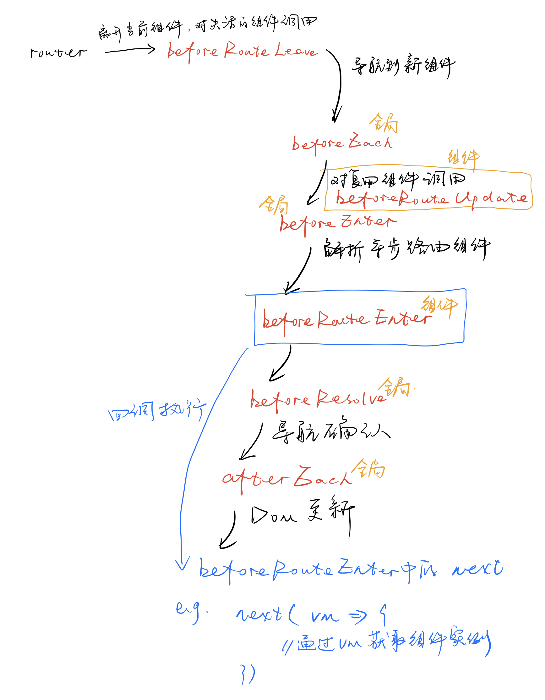

[TOC]

参考：[Vue Router](https://router.vuejs.org/zh/installation.html)

# 基础

## 1. 起步

1.`<router-link>`默认被渲染成一个`<a>`标签；`<router-view>`是路由出口，渲染路由匹配到的组件。通过点击`router-link`改变router的值，然后根据相应path的对应component，将该组件渲染到`router-view`上。

2.除了`<router-link>`（声明式），还可以通过`this.$router.push()`（编程式）来改变router值。（‘编程式的导航’内容）

## 2. 动态路由匹配

1.动态路由匹配相当于在路由中的“传参”功能。在下面的例子中，无论是`/user/foo`和`/user/bar`都会跳转到`User`这个Component去，而且可以通过`$route.params.id`获取`:id`部分，即`foo`和`bar`部分。并且可以设置多段的“路径参数“，如`/user/:username/post/:post_id`。

```js
const User = {
  template: '<div>User {{ $route.params.id }}</div>'
}

const router = new VueRouter({
  routes: [
    // 动态路径参数 以冒号开头
    { path: '/user/:id', component: User}
  ]
})
```

2.路由跳转的组件实例会被复用，意味着**组件的生命周期钩子不会再被调用**。可以通过监测路由变化`$route`对象。

```js
// watch监测
const User = {
  template: '...',
  watch: {
    $route(to, from) {
      // 对路由变化作出响应...
    }
  }
}
```

```js
// 或使用 导航守卫
const User = {
  template: '...',
  beforeRouteUpdate(to, from, next) {
    
  }
}
```

3.通配路由，使用通配符`*`。使用通配符路由时，请确保路由的顺序是正确的，也就是说含有通配符的路由应该放在最后。这个路由的顺序指的是定义路由路径的顺序，会按照顺序索引（路由定义得越早，其优先级越高）。`$route.params.pathMatch`可以获取通配符所匹配的值。参考[vue-router通配符的使用](https://blog.csdn.net/qq_37600506/article/details/102785894)。

```js
const Test = {
  template: '<div>User {{ $route.params.pathMatch }}</div>'
}
const NotFount = {
  template: '<p>404</p>'
}

const router = new VueRouter({
  routes: [
    { path: '/test', name: 'test', component: Test},
    { path: '/user-*', component: Test},
    { path: '*', component: NotFound}
  ]
})
```

- [ ] history模式？

## 3. 嵌套路由

​	通过嵌套路由可以表达层级关系，组件也可以嵌套`<router-view>`；子路由对应组件中嵌套的`<router-view>`。但需要注意的是，只匹配到路由而没有匹配到子路由的时候，嵌套的路由出口不会渲染任何东西，因此可以提供**空的**子路由进行渲染。如下面的例子，

1.匹配到`/user/:id`，会渲染`User`组件，但`User`中的`<router-view>`不会进行任何渲染；

2.如果提供了`''`的`children`，就能相应渲染需要的组件。

```js
const User = {
  template: `
<div>
<h2>User {{ $route.params.id }}</h2>
<router-view></router-view>
</div>
`
}

const router = new VueRouter({
  routes: [
    {
      path: '/user/:id',
      component: User,
      children: [
        // 当 /user/:id 匹配成功，
        // UserHome 会被渲染在 User 的 <router-view> 中
        { path: '', component: UserHome },
        // 当 /user/:id/profile 匹配成功
        { path: 'profile', component: UserProfile },
        // 当 /user/:id/posts 匹配成功
        { path: 'posts', component: UserPosts }
      ]
    }
  ]
})
```

## 4. 编程式的导航

1.使用`<router-link :to="...">`，等于在调用`router.push(...)`。这个方法会向 history 栈**添加一个新的记录**，所以，当用户点击浏览器后退按钮时，则回到之前的 URL。

```js
// 在Vue实例内部，使用`this.$router.push`即可

const userId = '123'
router.push({ name: 'user', params: { userId } }) // -> /user/123
router.push({ path: `/user/${userId}` }) // -> /user/123
// path参数会忽略params
router.push({ path: '/user', params: { userId } }) // -> /user

// 提供了导航成功完成 (在所有的异步钩子被解析之后) 
// 或终止 (导航到相同的路由、或在当前导航完成之前导航到另一个不同的路由) 
// 的时候进行相应的回调函数
router.push({}, onComplete, onAbort);
```

:exclamation:如果目的地和当前路由相同，只有参数发生了改变（比如从`/user/1` -> `/user/2`），需要使用`beforeRouteUpdate`来响应这个变化。

2.使用`<router-link :to="..." replace>`，等于在调用`router.replace(...)`。它不会向 history 添加新记录，而是跟它的方法名一样 —— **替换掉当前的 history 记录**。

3.`router.go()`，在 history 记录中向前或者后退多少步。

```js
// 在浏览器记录中前进一步，等同于 history.forward()
router.go(1)

// 前进 3 步记录
router.go(3)

// 后退一步记录，等同于 history.back()
router.go(-1)

// 如果 history 记录不够用，那就默默地失败呗
router.go(-100)
router.go(100)
```

## 5. 命名路由 & 命名视图

1.路由可以配置`name`命名，调用时使用`name`参数即可。

2.实现同级展示多个视图，可以使用`components`（也可以实现嵌套）。

```vue
<!-- 默认default -->
<router-view></router-view>
<router-view name="a"></router-view>
<router-view name="b"></router-view>
```

```vue
<!-- 嵌套 -->
<!-- UserSettings.vue -->
<div>
  <h1> User Settings</h1>
  <NavBar />
  <router-view />
  <!-- 没有就不渲染 -->
  <router-view name="helper" />
</div>
```

```js
const router = new VueRouter({
  routes: [
    {
      path: '/',
      // 注意有s
      components: {
        default: Foo,
        a: Bar,
        b: Baz
      }
    },
    // 嵌套
    {
      path: '/settings',
      component: UserSettings,
      children: [{
        path: 'emails',
        component: UserEmailsSubscriptions
      }, {
        path: 'profile',
        components: {
          default: UserProfile,
          helper: UserProfilePreview
        }
      }]
    }
  ]
})
```

## 6. 重定向和别名

1.**重定向**的意思是，当用户访问`/a`时，URL将会被替换成`/b`，然后匹配路由为`/b`。

```js
const router = new VueRouter({
  routes: [
    // 访问 /a ，实际会替换到访问 /b
    // URL和路由匹配都替换
    { path: '/a', redirect: '/b'},
    { path: '/a', redirect: { name: 'foo' } }
  ]
})
```

2.**别名**意味着：当用户访问`/b`时，URL会保持为`/b`，但是路由匹配则为`/a`，就像用户访问`/a`一样。

```js
const router = new VueRouter({
  routes: [
    // URL保持自己，但路由匹配为path
    { path: '/a', component: A, alias: '/b'}
  ]
})
```

## 7. 路由组件传参

1.使用`props`设置为组件的属性，取代`$route.params`以方便使用。

```js
const User = {
  // 一般使用$route.params取得路由参数
  // template: '<div> User {{ $route.params.id }} </div>'
  template: '<div> User {{ id }} </div>'
}

const router = new VueRouter({
  routes: [
    // 未设置props，耦合度高
    // { path: '/user/:id', component: User },
    { path: '/user/:id', component: User, props: true},
    
    // 对于包含命名视图的路由，分别添加
    {
      path: '/user/:id',
      components: { default: User, sidebar: Sidebar },
      props: { default: true, sidebar: false }
    },
    
    // 函数模式
    {
      path: '/search',
      component: SearchUser,
      props: route => ({ query: route.query.q })
    }
  ]
})
```

:exclamation:请尽可能保持 `props` 函数为无状态的，因为它只会在路由发生变化时起作用。

## 8. History模式

1.`vue-router`默认hash模式，使用URL的hash来模拟一个完整的URL，于是当 URL 改变时，页面不会重新加载。参考[Vue-Router的Hash说起的URL相关知识](https://www.cnblogs.com/mmzuo-798/p/10260346.html)。

> `http://www.example.com/index.html#print` 就代表网页中`index.html`的print位置。浏览器读取这个URL后会自动将页面滚动到print这个标识符的位置；
>
> 修改#后面的url不会触发网页加载。`http://www.example.com/index.html#location1` 改为 `http://www.example.com/index.html#lcoation2`
> 浏览器不会发起任何请求。
>
> 每改变一次#后面的，都会在浏览器的访问历史中增加一个记录，使用倒退按钮可以返回，前进等。

2.history有时候需要后端配合。history模式下，前端的URL必须和实际向后端发起请求的URL一致。如`htttp://www.abc.com/book/id`。如果后端缺少对/book/id 的路由处理，将返回404错误。参考[vue-router的两种模式（hash和history）及区别](https://blog.csdn.net/xiaokanfuchen86/article/details/105879101)。

****

# 进阶

## 1. 导航守卫

1.全局守卫：`beforeEach`、`beforeEnter`、`beforeResolve`、`afterEach`

2.组件守卫：`beforeRouteEnter`、`beforeRouteUpdate`、`beforeRouteLeave`



****

## 2. 路由元信息

​	通过路由的`meta`记录更多路由信息（如跳转到该路由是否需要登录），然后使用`$route.matched.meta`访问。路由记录可以嵌套，因此当一个路由匹配成功后，可能匹配多个路由记录（如下面的`/foo/bar`url将会匹配父路由记录和子路由记录，也因此要用`.some`来检查）。

```js
const router = new VueRouter({
  routes: [
    path: '/foo',
    component: Foo,
    children: [
      {
        path: 'bar',
        component: Bar,
        meta: { requiresAuth: true }
      }
    ],
  ]
})
```

```js
router.beforeEach((to, from, next) => {
  if(to.matched.some(record => record.meta.requiresAuth)) {
    // 检查是否已经登录
    if(!auth.loggedIn()) {
      next({
        path: '/login',
        query: { redirect: to.fullPath }
      })
    } else {
      next()
    }
  } else {
    next() // 确保一定调用next
  }
})
```

## 3. 过渡动效

1.嵌套`transition`即可

```vue
<transition>
  <router-view></router-view>
</transition>
```

## 4. 

## 5. 

## 6. 路由懒加载

​	一般情况下，所有页面都会在初次加载的时候把所有资源都加载；采用路由懒加载，当路由被访问的时候才加载对应组件，这样就更加高效了。

```js
// 定义组件路由懒加载
const Foo = () => import('./Foo.vue');

// 正常引入
const router = new VueRouter({
  routes: [{
    path: '/foo',
   	component: Foo
  }]
})
```

# 问题

## 1. 判断路由前缀 `$route.path.startsWith()`

```js
if(this.$route.path.startsWith(`/mymessage/chatmessage`)) {
  
}
```

## 2. 实现路由跳转并打开新页面

参考：[vue-router跳转时打开新页面的两种方法](https://www.jb51.net/article/166428.htm)。

```vue
// router-link
<router-link target="_blank" :to="{ path: '/home?to_id=${id}'}"></router-link>

// js
const routePath = this.$router.resolve({
	path: "/home",
	query: { to_id: '1' }
});
window.open(routePath.href, '_blank');
```

