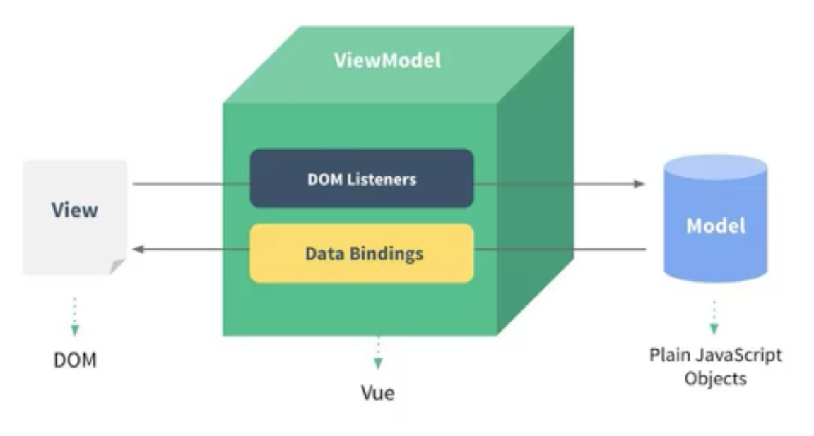
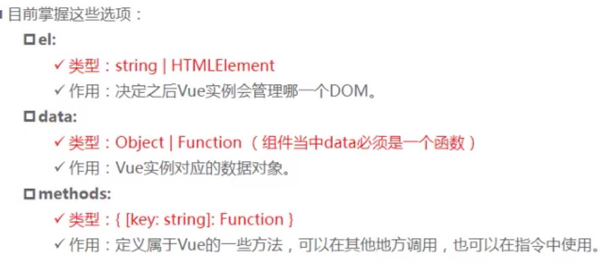
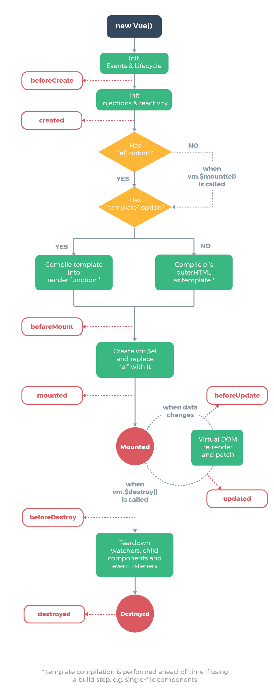

[TOC]

### 序

[2019年最全最新Vue、Vuejs教程，从入门到精通](https://www.bilibili.com/video/BV15741177Eh?from=search&seid=8754941890195373466)

> 本文件主要是记录在b站看的一个讲解vue的系列视频过程中想要记录的一些笔记。

- [ ] JS、bootsrtap、Ajax
- [ ] ES6
- [ ] node TypeScript
- [ ] SSM Spring Springboot Mybatis
- [ ] 

****

### 基础

> 基础部分是对本文件夹中[2.vue基础]()基础知识漏洞的补充

#### vue的MVVM结构



#### vue中的proxy代理

- [ ] [使用proxy实现vue数据劫持](https://zhuanlan.zhihu.com/p/50547367)

```vue
<script>
  //proxy
  const obj = {
    counter: 0,
    message: 'abc'
  }
  
  //Vue会自动把obj中的数据对应带this.中去，后面再详细理解
  const app = new Vue({
    el: "#app",
    data: obj,
    methods: {
      add() {
        console.log(this.message);
        this.counter++;
      },
      sub() {
				console.log(this.message);
        this.counter--;
  }
    }
  })
</script>
```

#### Vue的options选项



- [ ] 什么时候是函数，什么时候是方法？[函数和方法的区别](https://blog.csdn.net/qq_34952846/article/details/78943800)

  > A.从定义上来看：
  >
  > [函数]()(**function**)：是可以执行的javascript代码块，由javascript程序定义或javascript实现预定义。函数可以带有实际参数或者形式参数，用于指定这个函数执行计算要使用的一个或多个值，而且还可以返回值，以表示计算的结果。
  >
  > [方法]()(**method**)：是通过对象调用的javascript函数。也就是说，**方法也是函数，只是比较特殊的函数**。
  >
  > B.从更加直观的角度看（方法与对象有关，函数与对象无关）：
  >
  > 1. **函数**是一段代码，通过名字来进行调用。它能将一些数据（参数）传递进去进行处理，然后返回一些数据（返回值），也可以没有返回值。所有传递给函数的数据都是显式传递的。
  >
  > 2. **方法**也是一段代码，也通过名字来进行调用，但它`跟一个对象相关联`。
  >
  >    方法和函数大致上是相同的，但有两个主要的不同之处：
  >
  >    1. 方法中的数据是隐式传递的
  >    2. 方法可以操作**类内部的数据**（请记住，对象是类的实例化–类定义了一个数据类型，而对象是该数据类型的一个实例化） -- 方法可以操作已在类中声明的私有实例（成员）数据。其他代码都可以访问公共实例数据。

  > 补充1：
  >
  > [C++]()中：方法在C++ 中是被称为`成员函数`。因此，在 C++ 中的“方法”和“函数”的区别，就是“成员函数”和“函数”的区别。
  >
  > [Java]()中：诸如 Java 一类的编程语言只有“方法”。所以这时候就是“静态方法”和“方法”直接的区别。


##### 生命周期和钩子函数

> 生命周期就是在Vue实例的时候所经过的一些具体的步骤，比如说创建、渲染等。钩子函数就是在经历某一部分生命周期的时候，通过钩子函数可以具体在某一个周期对内部进行操作，比如说在创建的时候可以`console.log('created!')`。



****

#### Mustache语法

即`{{ }}`

[mustache语法](https://www.cnblogs.com/DF-fzh/p/5979093.html)

###### `v-once`

> ```vue
> <!-- 
> 使用了v-once，只会进行初步渲染，不会进行再次渲染
> 即更新了message之后，不会对v-once的元素进行实时渲染
> -->
> <h2 v-once>
>   {{message}}
> </h2>
> ```

###### `v-html`

即html中的v-html，可以在元素中设定。会将文本内容按照html元素渲染出来，而不是单文本渲染。

> ```vue
> <h2 v-html="url">
> </h2>
> 
> <script>
>   data(){
>     return{
>       url: '<a href="http://www.baidu.com/">百度搜索</a>'
>     }
>   }
> </script>
> ```

###### `v-pre`

`pre`的意思是`prevent`，即阻止进行解析或渲染，按照文本的原本内容完全展示出来（没有渲染步骤）

```vue
<h2 v-pre>{{message}}</h2>
// 在界面上看到的结果是： {{message}}
```

###### `v-cloak`

`v-cloak`解决了渲染闪烁的问题（即js部分的内容还没来得及渲染出来`Hello!`，显示的是未渲染的时候的文本`{{message}}`），这种情况下使用者就会看到一些比较混乱的源码。

```vue
<h2>
  {{message}}
</h2>

<script>
  data(){
    return{
      message: 'Hello!'
    }
  }
</script>
```

解决这个问题在于：在js未进行渲染的时候，该元素是不可见的状态（设置`v-cloak`），而在js已经完成了渲染的时候，该元素才能变成可见状态。这样子用户就不会看到不好看的源码。js在渲染的时候会自动去除`v-cloak`字段，因此可以对`v-cloak`进行设置。

```vue
<style>
  [v-cloak]{
    display: none;
  }
</style>

<div id="app" v-cloak>
  {{message}}
</div>

<script>
  // 在vue解析之前，div中有一个v-cloak的属性
  // 在vue解析之后，该v-cloak属性被去除
  setTimeout(function() {
    const app = new Vue({
      el: '#app',
      data() {
        return{
          message: 'Hello!'
        }
      }
    })
  })
</script>
```

- [ ] 懒加载和这个的关系？

****

#### v-bind

##### 动态绑定class

```vue
<h2 class='title' :class="{active: isActive, line: isLine}">
  {{message}}
</h2>
```

> 上面的示例就展示了，`class="title"`这个class是固有的，不能进行操作，是一些固定的样式。而对于`active`、`line`这两个样式，就可以通过绑定`isActive`、`isLine`这两个字段（true/false），来改变其样式是否显示。比如点击之后显示成灰色背景样式，那么就可以通过设定`active`为灰色背景，通过改变`isAcitve="true/false"`来选择是否显示这样的样式。

****

### 训练

1. v-17：列表，`v-bind:class`，实现点击列表某一项之后得到一个active的class属性
2. 