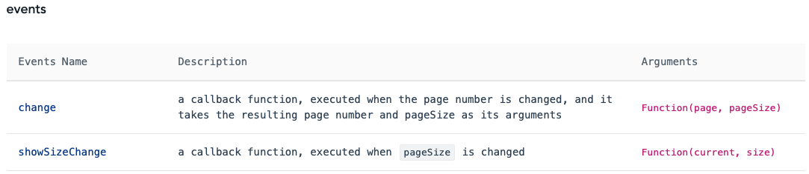

[TOC]

### 0. 关于代码快捷方式

###### 快速生成vue各板块

```<vue```之后会弹出```vue with default.vue```，```tab```即可：即会生成

```vue
<template>
  
</template>

<script>
export default {

}
</script>

<style>

</style>
```


### 1. props父子组件的通信以及回调函数

​	父子组件的通信主要通过两个主体来理解，第一个主体是**子组件**，第二个主体是**父组件**。

###### 子组件得到父组件的数据

> ​		首先明确，**子组件一般实现模块化**，然后进行**父组件引入模块**。如果涉及到父组件的一些数据，一般是从父组件进行调用，调用到本地域之后，再在本地域进行使用（第三部分讲到不能直接对调用的数据直接进行修改的问题）。从子组件出发接受数据：
>
> ​		1.1 props：在本地域指定需要的一些参数
>
> ```vue
> // 在子组件中，比如这个子组件是SonTitle
> <script>
> 	export default {
>     components: {
>       
>     },
>     prop: {
>       //在此处定义需要父组件给我的一些数据
>       sonNeed1:{
>         type: String,
>         default: "",
>       },
>       sonNeed2: {
>       	type: Boolean,
>         default: false,
> 	    },
>     },
>     data() {
>       return {
>         
>       }
>     },
>     created: {
>       
>     },
>     methods: {
>       
>     }
>   }
> </script>
> ```
>
> ​		1.2 父组件首先需要引入子组件，import
>
> ```vue
> <template>
> 	<SonTitle></SonTitle> //这里也可以使用<son-title></son-title>
> </template>
> 
> <script>
> import SonTitle from './components/SonTitle' //此处不用.vue后缀
> </script>
> ```
>
> ​		1.3 根据子组件需要的那些参数，父组件告知对应的我会给你什么数据
>
> ```vue
> <template>
> 	<SonTitle
> 	:sonNeed1="giveToSon1" //在此处给子组件相应的数据
> 	:sonNeed2="giveToSon2"
> 	></SonTitle>
> </template>
> 
> <script>
> import SonTitle from './components/SonTitle'
> 
> 	export default {
>     components: {
>       
>     },
>     prop: {
>       
>     },
>     data() {
>       return {
>         giveToSon1: '',
>         giveToSon2: '',
>       }
>     },
>     created: {
>       
>     },
>     methods: {
>       
>     }
>   }
> </script>
> ```

---

###### 子组件发送数据给父组件 以及 调用父组件的函数

> ​		子组件有时候需要调用父组件的一些函数，同时调用这些函数的时候有可能需要响应的函数参数，这时候父组件就需要子组件返回一些数据，然后用这些数据调用父组件的函数。比如子组件实现一个```a-table```模块，可能需要当前页码 ```currentPageNum``` 以及 当前容纳的条目数量（页面大小）```currentPageSize``` 。
>
> 
>
> 如图，假设从后端调用得到相应数据需要```pageNum```和```pageSize```两个参数。
>
> 父组件定义的数据：```blockList```、```pages```、```pageNum```、```pageSize```
>
> 子组件定义的数据：```currentPageNum```、```currentPageSize```
>
> > ```blockList```是父组件通过调用后端函数，返回相应的数据。子组件需要在自己的```a-table```里显示出来这些相应的数据，因此属于第一部分「子组件得到父组件的数据」。
> >
> > ```pages```、```pageNum```、```pageSize```是用来调用初始化```created```函数，初始化表格以及得到初始化数据，这部分需要父组件来实现。
> >
> > ```currentPageNum```、```currentPageSize```是由于```a-table```的操作是在子组件操作，因此在操作之后，相应的数据变化应该是发生在子组件。为了告知父组件相应的参数变化（父组件需要pageNum和pageSize来调用后端函数从而得到新的渲染数据）。这里为了告知父组件响应的参数，就需要第二部分「子组件发送数据给父组件」。
> >
> > TIPS: 这里父组件的pageNum与子组件的currentPageNum含义相同，父组件的pageSize和子组件的currentPageSize含义相同。
>
> ​		2.1 子组件定义函数emit
>
> ```vue
> // showSearchTable
> // a-pagination模块
> // @change @showSizeChange涉及回调函数，在第三部分「回调函数」讲解。
> <template>
> 	<div id="pagination-operator" align="right">
>     	<a-pagination size="small"
>     		:total="total" 
>       	:show-total="total => `共 ${pages} 页`" 
>       	:default-current=1
>       	@change="handleChange()" //这里指的是点击了当前页码引发currentPageNum的变化
>       	@showSizeChange="handleChange()" //这里指的是点击了[10/page]框引发currentPageSize变化
>       	show-size-changer 
>       	show-quick-jumper />
> 	</div>
> </template>
> 
> <script>
> 	export default {
>     components: {
>       
>     },
>     prop: {
>       
>     },
>     data() {
>       return {
>         
>       }
>     },
>     created: {
>       
>     },
>     methods: {
>       //定义函数告知父组件
>       handleChange(currentPageNum, currentPageSize){
> 			this.$emit("handlePageChange", currentPageNum, currentPageSize);
> 			}
>     }
>   }
> </script>
> ```
>
> ​		点击当前页面和页面大小的时候发生了什么？
>
> > 点击当前页面所绑定的函数即```@change```，点击该页面的时候就会调用```@change```所绑定的函数```handleChange```。同理点击页面大小的时候会调用```@showSizeChange```所绑定的函数```handleChange```。而这里的```@change```和```@handleChange```就是所谓的回调函数，这个在了解了当前部分之后，在第三部分「回调函数」继续进行剖析。
>
> > 那么现在关注点就要放在绑定在回调函数上的```handleChange```函数了。
>
> ​		```handleChange```如何与父组件进行通信？
>
> > 就像第一部分「子组件得到父组件的数据」的数据通信："告诉父组件我需要的数据在我这里的名称" => "父组件把相应的数据通过我给的这个名称进行数据传递" => "我拥有了父组件传过来的数据"
> >
> > ```js
> > // 在子组件定义了一个数据sonNeed1
> > sonNeed1:{
> >         type: String,
> >         default: "",
> >       	},
> > // 在父组件定义了相关的数据，然后给子组件相应的数据
> > data() {
> >       return {
> >         giveToSon1: '',
> >         giveToSon2: '',
> >       }
> > },
> > <SonTitle
> > 	:sonNeed1="giveToSon1" //在此处给子组件相应的数据
> > 	></SonTitle>
> > ```
> >
> > 这部分的emit原理上也是一样："告诉父组件我需要的函数在我这里的名称" => "父组件把相应的函数通过我给的这个名称让我可以进行调用" => "我能调用父组件的函数"。但是这里还有一个问题，假如父组件的这个函数是需要参数的呢？因此在emit的时候，同时要沟通好，在调用父组件的函数的时候需要子组件把哪几个参数也告诉父组件。分析下面这行代码就能明白：
> >
> > ```js
> > // 子组件定义模块ShowSearchTable
> > methods: {
> > 	handleChange(currentPageNum, currentPageSize){
> > 	this.$emit("handlePageChange", currentPageNum, currentPageSize);
> > 	}
> > }
> > // "handlePageChange"就相当于数据中的sonNeed1，sonNeed2这样的名称
> > // 因此在父组件进行通信的时候，（import过程与第一部分相同，省略）
> > <ShowSearchTable
> >         :sonNeed="giveToSon1" //第一部分内容讲解的
> >         @handlePageChange="handlePageChangeFromParent"
> >       ></ShowSearchTable>
> > // 在父组件的methods中定义相应的
> > methods: {
> >   handlePageChangeFromParent(pageNum, pageSize){
> >     console.log(pageNum);
> >     console.log(pageSize);
> >   }
> > }
> > ```
> >
> > 1. 子组件通过```this.$emit("handlePageChange")```告诉父组件，我需要调用你的函数了，暗号是```handlePageChange```。父组件通过```@handlePageChange="handlePageChangeFromParent"```，告知子组件，"通过暗号我已经告诉好了，你能调用我这边的函数```handlePageChangeFromParent```了"。
> > 2. 但是这里的父组件的```handlePageChangeFromParent```还需要两个参数才能调用。因此子组件在告诉暗号的同时，还要把相应的参数给父组件。```this.$emit("handlePageChange", currentPageNum, currentPageSize)```告诉父组件，"你需要的两个参数我也附在后面给你发过去了"。值得注意的是，这几个参数的顺序必须和父组件所定义的函数参数顺序一致。
> >
> > Q：但是，子组件给父组件发过去的参数，父组件一定要使用才行吗？自然是否定的。因此子组件通过```this.$emit```发送给父组件的参数，有两种情况：
> >
> > > 1. 父组件使用了参数。在这种情况下可以使用显式或者隐式两种方式来使用。
> > >
> > >    ```js
> > >    //针对使用了参数：
> > >    methods: {
> > >      handlePageChangeFromParent(pageNum, pageSize){
> > >        console.log(pageNum);
> > >        console.log(pageSize);
> > >      }
> > >    }
> > >    //隐式，不用写参数，反正你给的参数符合我这个函数需要的参数，我就不写出来了
> > >    @handlePageChange="handlePageChangeFromParent"
> > >    //显式，即我调用了你给我的两个参数currentPageNum\currentPageSize放到这个函数里面了
> > >    //而且为了更清楚地看到，所以我把参数都写出来了
> > >    //显式是更清楚地说明这是一个调用了参数的函数，子组件告诉的参数，我用了
> > >    @handlePageChange="handlePageChangeFromParent(currentPageNum, currentPageSize)"
> > >    
> > >    
> > >    //二者都可以，隐式更简洁
> > >    ```
> > >
> > > 2. 父组件不使用参数。
> > >
> > >    ```js
> > >    methods: {
> > >      handlePageChangeFromParent(pageNum, pageSize){
> > >        console.log(pageNum);
> > >        console.log(pageSize);
> > >      }
> > >    }//重新定义一个不使用参数的
> > >    methods: {
> > >      handlePageChangeFromParent(){
> > >        console.log("不使用参数");
> > >      }
> > >    }
> > >    // 由于没有参数调用，所以只有类似于上述的隐式
> > >    @handlePageChange="handlePageChangeFromParent"
> > >    
> > >    // 原理上。实际是函数实现的时候没有使用子组件给过来的参数。
> > >    methods: {
> > >      handlePageChangeFromParent(pageNum, pageSize){
> > >        //console.log(pageNum);
> > >        //console.log(pageSize);
> > >        console.log("不使用参数");
> > >      }
> > >    }
> > >    ```
> >
> > ​		2.2 在子组件定义了emit之后，父组件import并且使用```@```。

---

###### 回调函数

​		在上述的函数调用过程，实际上就是：

> 1.子组件定义```this.$emit("functionName", para1 , ..., paraN)```
>
> 2.父组件```import```并使用```@```。

​		那么我们再来看一下回调函数，拿```a-pagination```的回调函数为例：



看到[ant design/pagination](https://antdv.com/components/pagination/)官方给出的回调函数，总共有两个：

[change](): 点击页码触发。返回的两个参数值是```page```和```pageSize```，分别表示当前点击了的页码以及当前的页面大小。[showSizeChange](): 点击了改变页面大小栏出发。返回的两个参数值是```current```和```size```，分别表示了当前的页码以及当前页面的大小。**实际上这两个参数值只是在命名上有所不同，意义上是完全一致的。**

​		再看看实际调用的时候，参照第二部分「子组件发送数据给父组件 以及 调用父组件的函数」理解：

> 1.```a-pagination```里定义了```this.$emit("change", page, pageSize)```和```this.$emit("showSizeChange", current, size)```
>
> 2.使用```<a-pagination></a-pagination>```标签进行使用该子组件

这么一看是不是完全就是子组件和父组件的通信了！只不过子组件是他们已经为我们写好了的函数，而所谓的**回调函数**就是我们在子组件中自己通过this.$emit定义出来告诉父组件的函数。

！！现在再来研究一下这段代码，看看这两个重要的参数的具体交互过程：

```vue
<template>
	<div id="pagination-operator" align="right">
    	<a-pagination size="small"
      	@change="handleChange()" 
      	@showSizeChange="handleChange()" />
	</div>
</template>

<script>
	export default {
    components: {
      
    },
    prop: {
      
    },
    data() {
      return {
        
      }
    },
    created: {
      
    },
    methods: {
      //定义函数告知父组件
      handleChange(currentPageNum, currentPageSize){
			this.$emit("handlePageChange", currentPageNum, currentPageSize);
			}
    }
  }
</script>
```

1.调用a-pagination的回调函数change，由于```@change="handleChange"```，因此handleChange函数中的两个参数，```currentPageNum = page```，```currentPageSize = pageSize```，这样子就通过“接棒”的方式，change的回调参数到了我们自定义的handleChange手中

2.子组件emit。由于```this.$emit("handlePageChange", currentPageNum, currentPageSize)```，当父组件对该子组件的函数进行```@```的时候，这两个参数就会交接到父组件手上。比如父组件的```handlePageChangeFromParent(pageNum, pageSize)```，那么这时候通过交接，```pageNum = currentPageNum```，```pageSize = currentPageSize```。

3.在父组件中，就可以具体使用```pageNum```和```pageSize```进行相应的操作了。而实质上，这个```pageNum```是源头a-pagination通过回调函数输出的```page```，```pageSize```是a-pagination输出的```pageSize```。

（同理a-pagination的回调函数showSizeChange也是一样的数据流，只不过和change负责不同的点击响应）

---

###### 引入子组件的数据不要在子组件进行修改

​		有时候，我们从父组件拿来了一个数据，但是最后由于子组件的操作，这个数据又需要跟着子组件的操作相应变更。在双向绑定的原理上，子组件改变了这个数据，父组件的双向绑定数据也会因此改变，但是vue建议不要使用这种方式去改变。比如在```:sonNeed1="giveToSon1"```之后，二者任意一个数据的变动，两者都会同步改变。但是由于源头是父组件的```giveToSon1```，因此建议返回父组件让父组件改动，而不是直接在子组件中直接改变```sonNeed1```。以```<a-modal>```操作为例，该组件需要在特定事件响应显示出弹窗，然后在点击完成/X的时候弹窗消失，这个过程用```visible```来操作演示这个过程，明白更好地操作这个数据的方式。

```vue
// 子组件ModalWindow
<template>
	<a-modal
		:visible="visibleWindow"
		@cancel="closeModal"
	>
</template>
<script>
	export default {
    components: {
      
    },
    prop: {
      visibleWindow: {
        type: Boolean;
        default: false;
      }
    },
    data() {
      return {
        
      }
    },
    created: {
      
    },
    methods: {
      //定义函数告知父组件
      cancel(){
        //this.visibleWindow = false; 这种方法直接在子组件修改不妥，应该交给父组件修改
				this.$emit("cancel");
			}
    }
  }
</script>
```

```vue
// 父组件
<ModalWindow
	:visibleWindow="visibleWindowFromParent">
	@cancel="cancel"
</ModalWindow>
data(){
	return{
		visibleWindowFromParent: false,
	}
}
methods: {
	canel() {
		this.visibleWindowFromParent = false;
	}
}

//可以看到这里的cancel函数很简单，所以也可以直接
<ModalWindow
	:visibleWindow="visibleWindowFromParent">
	@canel="visibleWindowFromParent = false"
</ModalWindow>
```

--------

### 2. ES6

 [es6-对象和数组解析](https://juejin.im/post/6844903958104768519)

