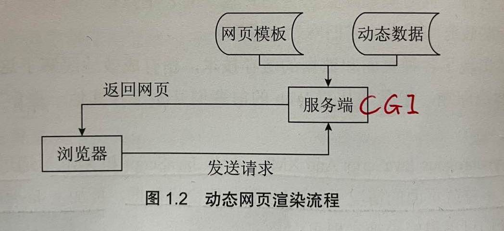
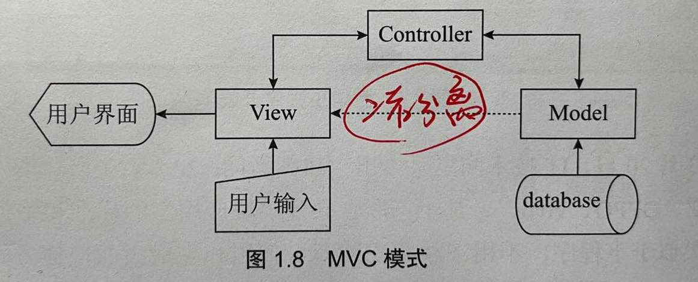
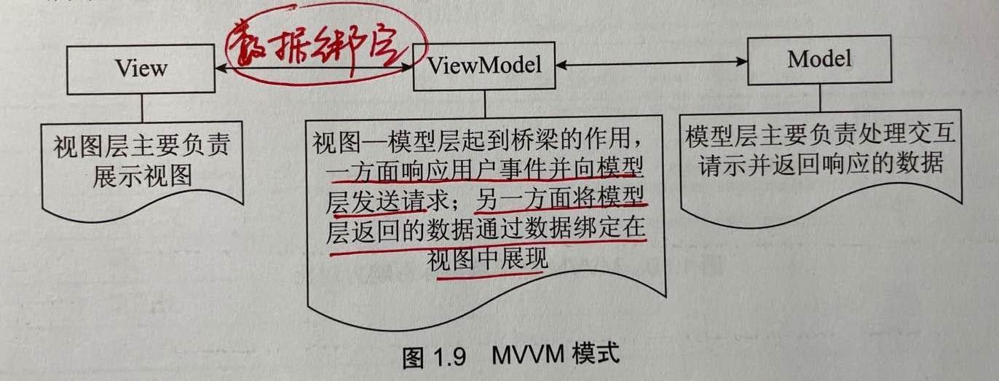

[TOC]

## 引言

### 1. CGI

#### CGI

​	早期的HTML文档，是

> 开发者把写好的网页放在服务器指定位置（网站根目录）下，然后将映射URL分享给使用者，使用者在浏览器地址栏输入URL即可访问网页内容。

> 早期的HTML作为静态文件，即使只有部分内容是需要变动的，那么有多少种变动的可能性，就需要准备多少份文档，这对开发者来说是非常不友好的，并且无法与用户交互。

​	CGI（Common Gateway Interface）。CGI的出现是则解决了早期HTML静态文件的缺陷。

> CGI作为服务器拓展功能，可以从数据库或者文件系统获取数据，在将数据渲染为HTML文档后，返回至客户端，从而实现了网页的动态生成。

​	CGI的缺陷

> CGI被广泛认为是服务端脚本语言的鼻祖。然而，它也有着非常致命的缺陷。
>
> 1. CGI每接受到一个请求，都会新开一个进程进行处理，占用服务器的CPU和内存，当请求量成千上万时，服务器可能无法支撑以致崩溃。
> 2. 黑客很容易通过不完善的CGI程序非法进入开发者的服务器系统，这从安全方面来考虑是绝对不允许的。

--------------------

#### Ajax

​	Ajax（Asynchronous JavaScript And XML，异步JavaScript和XML）

​	在web1.0时代：

> 在web1.0时代，前后端是如何写作的呢？由于网页是在服务端使用**动态脚本语言**和**模版引擎**渲染出来的，所以一般由前端先写模版，写好后交付给后端套用，之后前后端联调，以确认模版套用无误。
>
> 网站的这种组织架构还会带来另外一些问题。比如，页面哪怕仅有一小块内容需要变更，浏览器也需要重新请求和渲染整个页面。一方面，网站资源的传输耗费了更多的时间；另一方面，页面重载的用户体验也十分糟糕。

​	Ajax异步数据加载：

> Ajax通过XMLHttpRequest对象，可以在不重载页面的情况下与Web服务器交换数据，再加上JavaScript的document对象，开发者们可以很轻松地实现页面局部内容更新。

- [ ] 具体如何交换数据？

--------------------

#### RESTful接口

​	RESTful（Representational State Transfer，表述性状态转移）接口

> 在取得一个良好定义的RESTful接口后，两端甚至可以在零沟通成本的情况下并行完成项目任务。

- [ ] RESTful接口具体考究？

--------------------

#### 前端路由

​	前端路由：

> 是在浏览器端配置路由规则，通过监听浏览器地址的变化，异步加载和更新页面内容。

--------------------

#### Ajax & 前端路由

​	Ajax实现了无刷新的数据交互，而前端路由则实现了无刷新的页面跳转。

​	后台只负责数据的存取和组装，而前端则负责业务逻辑层和视图层的全部工作。

- [ ] 怎么理解各自的无刷新？

-----------------------

### 2. MVVM

​	MVC（Model-View-Controller，模型-视图-控制器）模式，通过控制器链接模型和视图。

​	MVVM（Model-View-ViewModel，模型-视图-视图模型）模式，本质上是MVC的改进版，其最重要的特性是数据绑定（data binding），此外还包括依赖注入、路由配置、数据模版等一些特性。

#### MVC

​	MVC（Model-View-Controller，模型-视图-控制器）模式，通过控制器链接模型和视图。

> 1. Model 模型层：业务模型用于计算、校验、处理和提供数据，但不直接与用户产生交互
> 2. View 视图层：用户能够看到并进行交互的客户端界面，如桌面应用的图形界面、浏览器端渲染的网页等
> 3. Controller 控制器：负责收集用户输入的数据（View端），向相关模型请求数据（Model）并返回相应的视图（View）来完成交互请求
>
> MVC模式实现了Model和View的代码分离，Model专注于数据，View专注于表达，Controller则在M和V之间架起了一座桥梁。

-----------------------

#### MVVM

​	MVVM（Model-View-ViewModel，模型-视图-视图模型）模式，本质上是MVC的改进版，其最重要的特性是数据绑定（data binding），此外还包括依赖注入、路由配置、数据模版等一些特性。

> 与MVC模式一样，MVVC的主要目的是分离视图（View）和模型（Model），ViewModel层封装了界面展示和操作的属性和接口。**通过数据绑定**，我们可以将View和ViewModel关联在一起，当ViewModel中的数据发生变化时，View也会同步进行更新。
>
> MVVM模式解耦了视图和模型。

> 1. Model 模型层：
> 2. View 视图层：
> 3. ViewModel 视图-模型层：在模式中，每一个视图都有对应的一个ViewModel，同时ViewModel与模型建立联系。当接收到用户请求后，ViewModel获取模型响应的数据（Model），并通过数据绑定将相应的视图页面重新渲染（View）。=> 模型层的数据只需要传入ViewModel即可实现视图的同步更新，从而实现了视图和模型之间的松散耦合。

- [ ] 怎么理解每一个视图都有对应的一个ViewModel？

  > 按照vue理解，就是每一个.vue文件都有一个<script scoped>限定，这个<script scoped>就是所谓的ViewModel。 --（这种理解是否正确？）

-------------------

#### MVC & MVVC

​	MVC和MVVC二者的区别：

> MVC是系统架构级别的，而MVVC是用于单页面上的。

------------------

#### Vue.js简介

​		vue的核心库只关注视图层，并且提供尽可能简单的API以实现数据绑定、组件复用等机制，且非常容易学习并混入其他库。

​		同时，Vue也完全有能力支持采用SPA（single page Application，单页面应用）设计和组合其他Vue生态库的系统。

##### Vue & React

​		Vue和React都是轻量级框架，不过总体来看，Vue的性能时要高于React的。**Vue的渲染速度要更快一些，因为React中有大量用于提供警告和错误提示信息的检查机制。**

###### 独立库

​		Vue和React都有专门负责路由和全局状态管理等功能的配套库。与Vue配套的有vue Router、vuex；与React配套的有React Router、Redux。Vue的状态管理库vuex和路由库vue Router都是由官方维护更新，从而保证了这些库与Vue本身的统一性。

##### Vue & Angular

​		Vue的许多语法和Angular十分相似，可以认为Angular是Vue的灵感之源。

​		Vue和Angular 1相比最大的区别在于没有脏检测机制。

> ​	在Angular 1中存在多个watcher，当watcher越来越多时，检测耗时会越来越长。因为作用域中每发生一次变化，所有watcher都要重新计算，而一些watcher在计算之后可能又会导致新的变化，并引发所有watcher重新计算，从而进入一种无限循环的脏检测。 -> Angular 1的处理方式是设置循环上限。
>
> ​	显然这种脏检测机制性能十分低下、耗时长，并不适合大型Web应用。

​		相比，vue的处理方式：

> vue全局只设置一个watcher，用这一个watcher来记录和更新一组关联对象的值，从而回避了脏检测的问题。

​		有意思的是，vue最初是参考Angular的，而Angular 2则借鉴了Vue的机制，采用了相似的设计解决脏检测存在的问题。

------------

