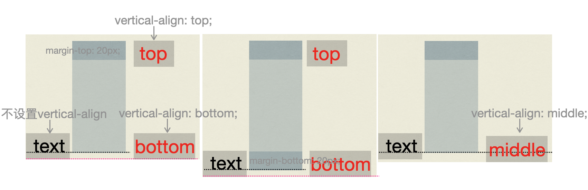
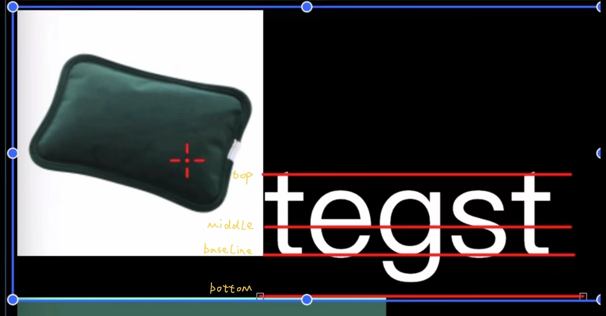

[TOC]

# 1. 问题解决

## 1. `clear-fix` 解决父元素高度坍塌

​	`clearfix` 可以解决float之后父容器 `height: 0;` 的问题，实际是在float子元素后面放一个空元素占位，把父元素高度撑开。参考：[clearfix（清除浮动）](https://blog.csdn.net/weixin_41041379/article/details/81871980)。

```css
// 采用伪元素
.parent:after {
  content: '';
  display: table;
  clear: both;
}
```

​	或者直接在浮动元素下方添加div（不使用伪元素，而直接添加元素）：

```scss
.after-parent {
  clear: both;
}
```

​	另外也可以直接给父元素添加：`overflow: hidden;`

```scss
.parent {
  overflow: hidden;
}
```


## 2. `backface-visibility`解决translate抖动

​	原意指对背面元素指定显示效果；在指定为`hidden`的时候，可以解决`translate`改变的时候样式位置有些偏移震动`shaky`的问题。

```scss
.shaky {
  backface-visibility: hidden;
}
```


## 3.取消 `<a>` 的锚点功能

```html
// 1. onclick 返回 false
<a href="http://www.baidu.com"  onclick="return false" >不能跳到百度</a> 

// 2. 使用伪协议
<a href="javascript:void(0)" >不能跳转</a>

// 3. 跳转到页面顶部
<a href="#"></a>。
```


## 4. 消除 image 底部间隙



​	底部间隙产生的原因：`baseline` **仅和父元素有关**。其产生的方式是按照父元素 `默认font-size` 生成一个类似于上述的 `text` 元素内容，其 `baseline` 就是文字内容的最下面。其他非文字属性如 `<image>` 默认底部对齐 `baseline`，如下图所示。



​	因此解决方式就围绕 `baseline` 。

1. 设置父元素字体大小为0。`.img-container { font-size: 0; }` 。
2. 将 img 元素设置为 `display: block` ，打破其对齐 `baseline` 。
3. 将 img 元素设置为 `vertical-align: bottom` ，改变其对齐 `baseline` 为 `bottom` 。
4. 给父元素设置 `line-height: 5px` ，这里的 `5px` 具体就是 gap 的高度。


## 5. 元素固定底部｜右侧

​	具体是页面中有两个元素，其中一个固定宽高然后放在底部｜右侧，另一个元素占满其余空间。

1. 使用 `cal` 方法。
2. 使用 `flex` 布局。父元素规定好 flex 布局，固定元素按需使用固定宽高，另一元素指定 `flex: 1` 即可。


## 6. 文本溢出显示省略号

```scss
// 单行
.single-line {
  overflow: hidden;
  text-overflow: ellipsis;
  white-space: nowrap;
  max-width: 300px; // 按需定义宽度即可
}
```

```scss
// 多行
.multi-line {
  overflow: hidden;
  text-overflow: ellipsis;
  
  display: -webkit-box;
  -webkit-line-clamp: 2;
  -webkit-box-orient: vertical;
}
```


# 2. 样式修改

## 1. 取消 `<a>` 底部横线样式

```scss
a {
  text-decoration: none;
}
```

## 2. 修改 input placeholder 样式

```css
.placeholder-custom::-webkit-input-placeholder {
  color: #000;
  font-size: 12px;
}
```

## 3. 修改 input 的光标和选中框

参考：[19 个实用的 CSS 技巧！](https://mp.weixin.qq.com/s/jlKYW6TfUyLXrPnZp3ZHIA)。

​	使用 `caret-color: #000` 修改选中光标的颜色。

​	使用 `outline: none` 取消选中框效果。

## 4.  隐藏滚动条

```css
.box-hide-scrollbar::-webkit-scrollbar {
  display: none;
}
```

## 5. 自定义选定的文本样式

```css
.box-custom::selection {
  color: #000;
  background-color: #000;
}
```


# 2. 响应式

## 1.width & height

When setting height property of an element using percentages, then the percentage is relative to the **height** of the parent element. That's the only case I guess.

其他的按照百分比，比如`padding: 10%`、`margin: 10%`是按照parent的`width`。


# 3. 命名

`dialog`：


# 4. 布局

## 1. 元素居中的几种方式

1.flex布局居中

```css
.center {
  display: flex;
	justify-content: center;
  align-items: center;
}
```

2.position定位居中

```css
.center {
  position: absolute;
  top: 50%;
  left: 50%;
  transform: translate(-50%, -50%);
}
```

3.margin auto居中（横向居中）

```css
.center {
  margin: 0 auto;
}
```

## 2. mask遮罩效果

```scss
/* 想要在幕布上面再定义一些展示的东西，设置z-index: 999;即可。 */
.mask {
  background: rgba(0, 0, 0, 0.4);
  z-index: 998;
  position: fixed;
  width: 100%;
  height: 100%;
  top: 0;
}

.item {
  position: absolute;
  z-index: 999;
}
```

## 3. 文本多行省略

参考：[多行文本溢出显示省略号](http://www.html.cn/archives/5206/)、[Line Clampin’ (Truncating Multiple Line Text)](https://css-tricks.com/line-clampin/)。

