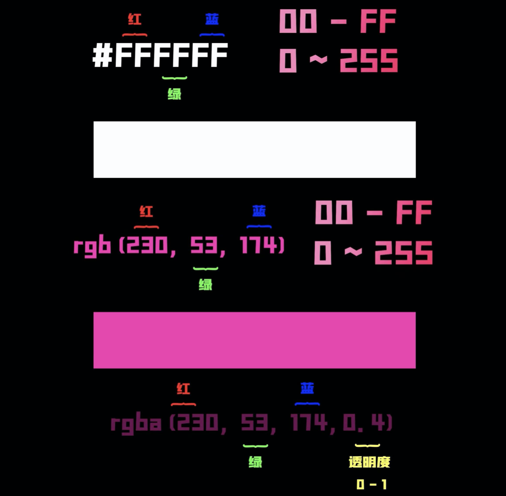
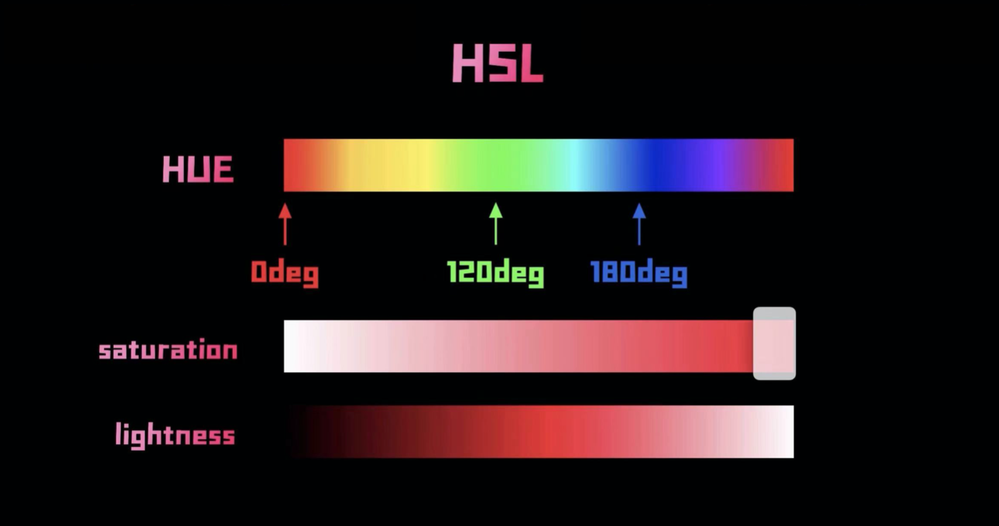

[TOC]

# 1. CSS常用属性

[常用css样式属性大全](https://www.cnblogs.com/zhaoyingblog/p/8342739.html)


## 0. 颜色三种表示方式

#### `#000000` 及  `rgb` & `rgba`



​	最简单的两种是使用`rgb`以及十六进制的表示方法`#000000`。其中`rgba`是添加了表示透明度的字段，`0`表示全透明，`1`表示不透明。

#### `hsl`



​	`HSL`即`hue色相`、`saturation饱和度`和`lightness亮度`。同时HSL提供透明度属性`alpha`，从`0%`全透明到`100%`不透明。

```css
* {
  background: hsl(120deg, 100%, 50%, 100%);
}
```


## 1. text 文本相关

### 文字

[text-decoration相关属性](https://developer.mozilla.org/en-US/docs/Web/CSS/text-underline-offset)：对**下划线改变颜色**等更多的操作。

``` css
.text_words {
  color: #000000; /* 颜色 */
  font-size : 9px; /* 大小 */
  font-variant: small-caps; /* 小字体 */
  font-family: sans-serif; /* 字体样式 */
  font-style: itelic; /* 斜体 */
  font-weight: bold/700; /* 粗体 */ /* 400:normal 700:bold */
  text-decoration: line-through/overline/underline/none; /*删除线/顶线/下划线/去除链接下划线 */
}
```

### 段落

参考：[vertical-align到底怎么用](https://www.jianshu.com/p/ce7e4a997a2c)、[w3s vertical-align](https://www.w3school.com.cn/tiy/t.asp?f=csse_vertical-align)。

```css
.text_paragraph {
  text-align: right/left/center/justify; /* 对齐方式 => 右对齐/左对齐/居中/平铺 */
  text-indent: 28px; /* 首行缩进 */
  line-height: 200%/1/2;：/* 行高/行间距 */
  letter-spacing: 1px; /* 字间距离 */
  text-transform: capitalize/uppercase/lowercase; /*字母大小写: 首字大写or全大/小写 */ 
  vertical-align: super/sub; /* 上标/下标 */
  vertical-align: top/bottom/middle/text-top/text-bottom; /* 垂直对齐方式 */
}
```

### 文字阴影

`text-shadow`


## 2. 背景

```css
.background {
  background: #000000; /* 背景颜色 */
  background:transparent; /* 背景透视 */
  background-image: url(/image/bg.gif); /* 背景图片 */ 
  background-size: 100px 100px | cover | fill | contain ; /* 指定背景图片的大小 */
  background-repeat : repeat/no-repeat/repeat-x/repeat-y; /* 图片重复方式 */
  background-position : 90% 90%/top/right/bottom/left/center; /* 背景位置 */
  background-attachment : fixed;  /* 浮水印固定背景 */
  
  object-fit: fill|contain|cover|scale-down|none|initial|inherit;
}
```


## 3. `margin` / `border` / `padding` / `outline`

```scss
.padding {
  padding-top/right/bottom/left: 10px;
  padding: top right bottom left;
  padding: @top @right @bottom @left;
  padding: @top @right @bottom;
  padding: @top&bottom @right&left;
}

.margin {
  margin-top/right/bottom/left: 10px;
  margin: @top @right @bottom @left;
  margin: @top @right @bottom;
  margin: @top&bottom @right&left;
}

.border {
  border-top/right/bottom/left: 1px solid #000000;
  border-top-width: 1px;
  border-top-style: solid;
  border-top-color: #000000;
}

.border-style {
  solid //实线框
  dashed // 虚线框
  dotted //点线框
  double //双线框
  groove //立体内凸框
  ridge //立体浮雕框
  inset //凹框
  outset //凸框
}

/* 
  是绘制于元素周围的一条线，位于边框边缘的外围，可起到突出元素的作用。
  => 轮廓线不会占据空间，也不一定是矩形。
*/
.outline {
  outline: #00FF00 dotted 1px;
  outline-offset: 10px; // 和border之间的间隙
}
```

# 2. 进阶属性

## 1. 过渡相关

### transition(&transform) & animation(&keyframe)

:exclamation: transition单次执行；animation可以循环播放。

```scss
.transition-example
{
  transition: @property @duration @timing-function @delay; // default: all 0 ease 0
  transition-property: width | height···; // 变化针对的属性名
  transition-duration: 2s; // 该变化在多久内完成
  transition-timing-function: linear | ease | ease-in | ease-out | ease-in-out;
  transition-delay: 1s; // 延迟多久后开始变化
  
  // 用`,`可以设置几个属性
  transition: background 1s ease-in,
    transform 1s ease-out .5s;
}

// ease-in:开始速度缓慢; ease-out:结束速度变慢
// ease-in-out:开始和结束的时候速度放缓
```

一般搭配`transform`改变。参考：[css 的 Transform 详解](https://www.jianshu.com/p/8a33214a1b26)，重点可看`skew`的讲解。

```scss
.transform-example {
  transform: translate(x, y) | translateX() | translateY(); // 移动
  transform: rotate(30deg); // 正值：顺时针旋转
  transform: scale(x, y) | scaleX() | scaleY(); // 缩放，scale(n)默认x,y都取n
  transform: skew(x, y) | skewX(30deg) | skewY(); // skewX则"站"在X轴，30deg
}
```

****

```css
.animation-example {
  animation: @name @duration @timing-function @delay @iteration-count @direction @fill-mode;
  animation-name: @keyframe; //需要绑定到选择器的 keyframe 名称
  animation-duration: 2s;
  animation-timing-funcion: linear | ease | ease-in | ease-out | ease-in-out;
  animation-delay: 1s;
  animation-iteration-count: n | infinite; // n次/无数次
  animation-direction: normal | alternate; // 顺次循环/到达终点反向回来
  animation-fill-mode: backwards | forwards | both;
}
```

`animation-fill-mode`指定`backwards`时，在`animation-delay`这个时间段使用`0%`时的样式；指定`forwards`时，在动画完成之后保留`100%`的样式；指定`both`=>`backwards` + `forwards`。

需要使用`@keyframe`为animation创建具体的实例：

```scss
@keyframe animationObject {
  0% {
    
  }
  10% {
    
  }
  100% {
    
  }
}
```


### linear-gradient & repeat-linear-gradient

参考：[linear-gradient](https://developer.mozilla.org/zh-CN/docs/Web/CSS/gradient/linear-gradient())：角度deg、颜色分配、[linear-gradient渐变色](https://www.runoob.com/cssref/func-linear-gradient.html)。

​	1.角度deg的含义、以及渐变线的起始终止点：


`角度deg`：默认角度是从上到下（180deg），0deg代表从下到上，以顺时针递增计算角度。

`gradient line`：以容器正中心点和角度deg生成的线，该线决定颜色渐变的方向。

`startng point & ending point`：起始点是渐变线上代表起始颜色值的点。起始点由**渐变线**和**过容器顶点的垂直线**之间的交叉点来定义。终止点可以以同样的方式找到，或者直接根据中心点对称。

​	2.颜色过渡分配

一般定义了角度（默认180deg，to bottom）之后，再定义颜色，默认按照定义的颜色平均分配。由`gradient line`的长度，各种颜色默认各自分配均分其一；即默认情况下，从一个颜色的终止点平滑的过渡到另一个颜色的终止点--由于平滑过渡，过渡的中心点就是两个颜色的起始点的中间。

也可以在颜色的后面**添加长度百分比定义其颜色的起始点，以及过渡的中心点**。如以`linear-gradient(#000 10%, 30%, #fff 90%)`为例，默认第一个颜色会从`0%处开始`，因此定义`10%`后实际效果是从`0%`开始；然后后面跟着的`30%`意思是和两侧颜色的过渡点放在`30%`处，而按照默认，应该是`(10+90)/2 = 50%`处，因此颜色的过渡不会很平滑。该两个属性`opt可选`。

同时还可以定义颜色渐变**从某个地方才开始，前面不渐变**。如`linear-gradient(#000 0% 30%, #fff)`，那么在`0%-30%`就完全是白色，从`30%-100%`对白色和黑色进行渐变。

```css
.linear-gradient {
  background-image: liner-gradient(#000000, #ffffff);
  background-image: liner-gradient(to right bottom, #000000, #ffffff);
	background-image: liner-gradient(0deg, #000000, #ffffff); /* 0deg从下到上，顺时针计算 */
  
  background: linear-gradient(#000 10%, 30%, #fff 90%);
  background: linear-gradient(#000 0% 30%, #fff);
}
```

​	3.repeat-linear-gradient

`linear-gradient`是对过渡线`0-100`完全按照颜色过渡分配，默认平滑过渡；

`repeat-linear-gradient`是对过渡线按照既定的颜色起始终止点，重复分配过渡线，直至分配完毕。如下面：`0%-5%分配#fff`，`5%-10%过渡#fff、#000`；一次循环结束，从`10%`重复前面的分配规则。

```css
.repeat-linear-gradient {
  background: repeat-linear-gradient(0deg, #fff 5%, #000 10%);
}
```

- [x] transparant：`transparent`属性实际上相当于一种颜色属性，如果按照视觉效果和白色相似；但是是透明的，可以看到背后视图的颜色。


### @media

```scss
@media(max-width: 400px) {
  // max-width: desktop
  // min-width: phone
}
```


## 2. 容器相关

### box-shadow & box-sizing

​	1. box-shadow

```scss
.shadow
{
  // default: none
  // @horizontal: x轴偏移，默认往右偏移
  // @vertical: y轴偏移，默认向下偏移
  // @blur模糊效果; 
  // @spread可以控制阴影大小,默认阴影与元素一致大小
  box-shadow: @h-shadow @v-shadow @blur @spread @color; 
  box-shadow: 0 2px 0 -2px #5E5A5A; 
}
```

​	2. box-sizing

```css
.box-sizing
{
  box-sizing: content-box | border-box; // default: content-box
}
```

`content-box`：宽度和高度分别应用到元素的内容框。**在宽度和高度之外绘制元素的内边距和边框**。

`border-box`：为**元素设定的宽度和高度决定了元素的边框盒**。为元素指定的任何内边距和边框都将在已设定的宽度和高度内进行绘制。

### display

```css
.display
{
  display: none; /* 不显示，文档流中移除 */
  display: block | inline | inline-block;
}
```

### object-fit

```css
.object-fit
{
  object-fit: fill | contain | cover; // default: fill
}
```

​	一般用于`img`和`video`标签。注意要对该标签的长宽进行定义，不然就按照原尺寸大小直接展示。

`fill`：不顾原尺寸比例，填充整个容器。

`contain`：保持原有尺寸比例。内容被缩放。按照最小边进行缩放，保持比例。

`cover`：保持原有尺寸比例。内容被裁剪。按照最大边保持比例，容器小的时候对内容进行裁剪。


## 3. 事件相关

### pointer-event


## 4. 函数

​	css提供的函数，sass/scss能使用；反之不行。

### calc()

​	`css提供`。可以进行复杂计算，而不用自己进行手动计算替换。比如一个元素定义了长度，内部第一个元素也定义了长度，那么就可以根据前两个width和`calc()`来计算得出剩余元素的长度。注意，如果在`scss`中使用变量，要使用`#{$variable}`。

```scss
.col-1-of-2 {
  width: calc((100% - #{$gutter-horizontal}) / 2);
}
```

### Darken() 、 lighten()

​	`scss提供`。可以根据给定元素和想要改变的百分比，获取一个新的颜色值（更加暗色或更加亮色）。

```scss
.el {
  background-color: darken($color, 10%);
  color: lighten($color, 10%);
}
```

