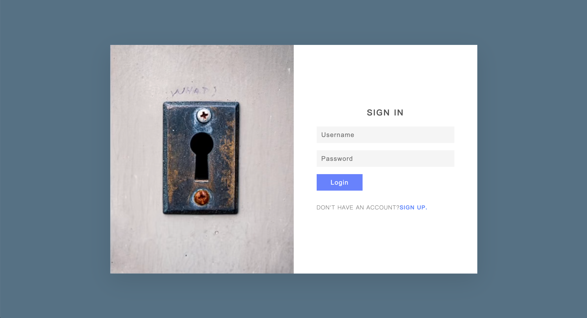
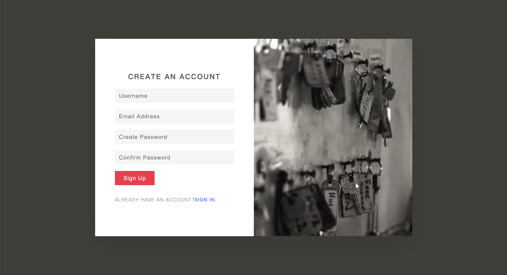
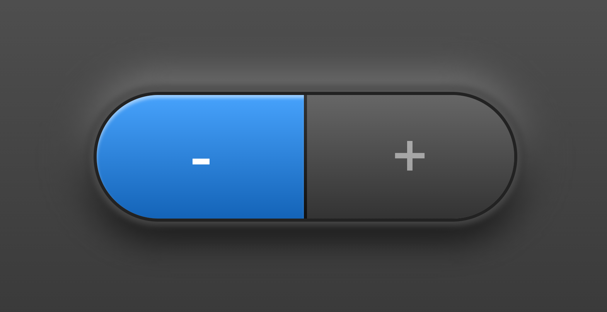
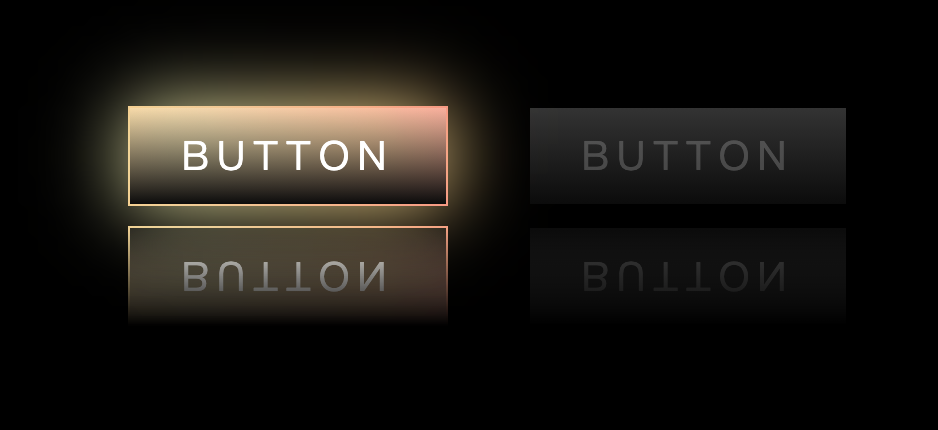

[TOC]

# 1. 视频学习

## 1.登录注册表单制作

​	Resiponsive sign in % sign up form：[bilibili：登陆注册表单制作](https://www.bilibili.com/video/BV1uv411a73Z)。





### transition / box-sizing / object-fit / display: none/initial / pointer-event / @media

`transition`：规定数据变化的时候有一个缓慢变化的时间。

`box-sizing`：规定`border`是否计算在`width`和`height`中。`content-box`指定边框为额外内容；`border-box`指定边框为指定大小内部内容。

`object-fix`：规定`img`、`video`是否保持尺寸。

`display: none;`：即移除文本流。`display: initial;`即设置为默认状态。

`pointer-event: none;`：鼠标不再监听当前层而去监听下面的层中的元素。`pointer-event: auto;`：效果和没有定义pointer-events属性相同，鼠标不会穿透当前层。

`@media`：可以针对不同的屏幕尺寸设置不同的样式，特别是如果你需要设置设计响应式的页面，@media 是非常有用的。当你重置浏览器大小的过程中，页面也会根据浏览器的宽度和高度重新渲染页面。

```css
/* 监听如果屏幕宽度小于900px，则重新渲染内容 */
@media (max-width: 900px)
{
  section
  {
    width: 400px;
  }
}
```

****

## 2.背景色切换

[bilibili:【HTML+CSS】三张图片 无Js 制作霓虹流光网页背景](https://www.bilibili.com/video/BV1Kp4y1H74F)

### @keyframes & animation

`@keyframe`：使用此生成一个动画的具体行为，将一套 CSS 样式逐渐变化为另一套样式，具体实现通过指定`0% - 100%`皆可。其中可以使用`from`和`to`，相当于`0%`和`100%`。

`animation`：动画实现的具体参数数值，包括持续时间等。具体参考`../css/0.2css进阶属性`

```css
@keyframe action {
  0% {
    opacity: 0; /* 指定样式内容 */
  }
  50% {}
  100% {}
}

@keyframe action {
  from{} /* 0% */
  to{} /* 100% */
}

// 使用
.class {
  animation-name: action;
  animation-duration: 10s;
  animation-timing-funcion: ease-in-out;
  animation-delay: 0s;
  animation-iteration-count: infinite;
  animation-direction: alternate;
}
```

****

## 3.背景渐变色切换

[bilibili：纯 CSS 实现渐变背景色过渡动画](https://www.bilibili.com/video/BV1Xv4y1Z7UW)

### linear-gradient & background-position

​	在2.背景色切换中，使用的是三张图片的opacity不断变化来实现。在这个例子中使用`linear-gradient`生成渐变色背景，通过拉伸成2倍大小，再通过`background-position`不断改变背景的位置来实现。同样使用到了上面一个例子的`@keyframes`和`animation`。

`linear-gradient`：根据指向方向，颜色渐变。颜色可指定多个。

`background-position`：指定背景图片左上角顶点的位置。注意如果指定了背景大小为200%，那么(100%,100%)才是正中间的位置。

```css
.bgd {
  background: linear-gradient(135deg, #C6FFDD, #FBD786, #f7797d);
  width: 100%;
  height: 100%;
  background-size: 200% 200%;
  
  animation-name: move;
  animation-duration: 5s;
  animation-timing-function: ease-in-out;
  animation-iteration-count: infinite;
  animation-direction: normal;
}

@keyframes move {
  0% {
    background-position: 0% 0%;
  }

  100% {
    background-position: 100% 100%;
  }
}
```

****

## 4. 3D背景-随光标背景移动效果

### 重点是js文件实现，后续再看

****

## 5. 质感按钮

[bilibili：css-质感按钮](https://www.bilibili.com/video/BV1JK4y1H7To)



### outline / filter: blur() / cursor / ::after / :nth-child()

`outline`：（轮廓）是绘制于元素周围的一条线，**位于边框边缘的外围**，可起到突出元素的作用。`outline: #000 dotted 1px;`。**轮廓线不会占据空间，也不一定是矩形。**

`filter: blur(1px)`：将背景模糊。

`cursor`：改变鼠标的形状。

`::after`：在该元素的最后位置生成一个子元素。

`:nth-child(b)`：从兄弟元素中挑选第b个该名元素。e.g.`button:nth-child(1)`选中第一个`button`。

****

## 6. 炫光按钮

[bilibili：炫彩流光按钮](https://www.bilibili.com/video/BV1dU4y1H7Ai)



### -webkit-box-reflect / text-decoration 

`-webkit-box-reflect`：生成一个镜像。

`text-decoration`：使用`text-decoration: none`可以取消标签`a`的下划线。

****


# 2. Udemy项目

## 0.1 Natour

`-webkit-`：Chrom、safari

`-moz-`：soho

`background-image`：可以同时设定颜色、图片参数；先定义的z-index层级越高。如`background-image: green, url(./img/1.jpg)`，那么颜色就在图片之前，通过设定透明度则可以在图片表面增加一层遮罩。

`background-size`：除了可以直接指定大小，可以设定类似`object-fit`的属性`fill`、`cover`、`contain`。

```scss
.head {
  background-image: grba(0, 0, 0, 0.5), url('./image.png');
  background-size: cover;
}
```

`clip-path`：对容器进行裁剪展示，`polygon()`可以指定几个顶点，根据顶点进行两点的连线裁减；`circle`则(根据指定位置)进行指定大小的裁剪，如`circle(50%)`、`circle(50% at 0 100%)`。

`h1 + span`：利用在`h1`中添加几个`span`子元素，展现不同的文字样式。

```html
<h1 class="heading-primary">
  <span class="heading-primary--main"></span>
  <span class="heading-primary--sub"></span>
</h1>
```

`backface-visibility`：原意指对背面元素指定显示效果；在指定为`hidden`的时候，可以解决`translate`改变的时候样式位置有些偏移震动`shaky`的问题。

`animation-fill-mode`：设置为`backwards`，在`animation-delay`的这一段时间内保持`0%`的属性状态；设置为`forwards`，动画完成后保持`100%`的属性状态。`both`，使用`backwards`和`forwards`。

`-webkit-background-clip: text` + `color: transparent`：设置背景沿文字裁剪；文字设置为透明，则文字的颜色变成背景的颜色。

`transform: skew(1deg)`：使元素按照2D平面顺/逆时针歪斜。`skewX`产生依靠的效果；`skewY`产生中心点旋转一定角度的效果，同时元素会有拉伸的效果。

`transform: rotate(1deg)`：使元素按照3D空间上下翻转（X轴翻转）或左右翻转（Y轴翻转）。

`pespective`：定义3D变化的时候距离视图的距离，最好定义足够大的像素。

`float&position的collapse现象`：float的父容器坍塌成`height: 0`可以用`clearFix`来解决；但是`position`只能通过给父容器指定高度来解决。

`box-decoration-break: clone`：解决父容器定义宽度不够，子容器+padding>parent.width，因此padding没有预期的展示效果

`list-style: none;`：设置list不缩进

`<figure> & <figcaption>`：

`shape-outside`：用`border-radius`和`clip-path`只是改变外观，但是在文本流中占据的元素空间还是未经修改的，因此float的时候；修改`shape-outside`会直接修改在文本流中占据的空间，但是不会改变外观；搭配使用。

`border-radius VS clip-path: circle()`：border-radius不能改变半径，但是circle可以；比如`clip-path: circle(40% at 50% 50%);`就是取直径的40%作为半径，以圆心处裁剪成圆；`border-radius: 50% <=> circle(50% at 50% 50%);`。


### 文本 => 段落字体渐变色

- [x] 效果：段落字体的颜色渐变
- [x] 方式：利用`background-color`+`linear-gradient`、`-webkit-background-clip: text`和字体颜色透明

```scss
.heading {
  background-image: linear-gradient(to right, $color-primary-light, $color-primary-dark);
  display: inline-block; // 为了使容器呈包裹字体效果，去掉block过多空白
  -webkit-background-clip: text;
  color: transparent;
  letter-spacing: 2px;
}
```

### 按钮 => 3D实感

- [x] 效果：放置在按钮上和点击按钮都产生不一样的视觉效果。

- [x] 方式：利用hover和active的`translate`以及`box-shadow`不同程度来实现悬浮和点击不同触感。

```scss
.btn {
  &:link,
  &:visited {
    /* ···other typography··· */
    transition: all .2s;
  }
  
  &:hover {
    box-shadow: 0 10px 20px rgba($color-black, .15);
    transform: translateY(-3px);
  }
  
  &:active {
    box-shadow: 0 5px 10px rgba($color-black, .15);
    transform: translateY(-1px);
  }
  // 也可以改变translateY来实现不同的触感
}
```

​	此外的效果是通过`::after`来实现。

### 复合图片组件 => 视觉差

- [x] 效果：悬浮在某张图片上，该图片放大，其他图片缩小
- [x] 方式：利用hover的`scale`实现zoom和`:not(:hover)`反选设置未悬浮样式

```scss
.composition {
  &__photo {
    &:hover {
      transform: scale(1.05) translateY(-.5rem);
      box-shadow: 0 2.5rem 4rem rgba($color-black, .5);
      z-index: 20;
      outline: 1.5rem solid $color-primary;
    }
  }
  
  &:hover &__photo:not(:hover) {
    transform: scale(.95);
  }
}
```

### 背景 => 裁剪

- [x] 效果：呈现梯形或平行四边形
- [x] 方式：利用`transform: skew()`或者`clip-path: polygon()`指定图形连线点。

```scss
.bgd {
  transform: skewY(-7deg);
  
  // 所有的直接子元素修正
  & > * {
    transform: skewY(7deg);
  }
}

.bgd {
 path-clip: polygon(0 0, 100% 0, 100% 75%, 0 100%);
 // 裁剪会把父容器overflow: hidden的效果失效；因此如果需要设置border-radius的话，需要重新设置一下
 border-top-left-radius: 3px;
 border-top-right-radius: 3px;
}
```

### 卡片 => 翻转

- [x] 效果：产生翻页的效果
- [x] 方式：利用`transform: rotateY()`对正反面两个子容器产生左右翻页效果（子容器中定义），使用绝对定位使其重合，并利用`backface-visibility: hidden`只展示正反面其中一个页面。利用`perspective`产生更加仿真的效果（父容器中定义）；

```scss
.card {
  perspective: 150rem;
  -moz-perspective: 150rem;
  -webkit-perspective: 150rem;
  height: 50rem;
  
  position: relative;
  
  &__side {
    height: 50rem;
    transition: all .8s;
    
    position: absolute;
    top: 0;
    left: 0;
    width: 100%;
    backface-visibility: hidden;
  }
  
  &__side--front {
		/* 页面内容 */
  }
  
  &__side--back {
    /* 页面内容 */
    // 一开始指定为背面，hover的时候翻过来
    transform: rotateY(180deg);
  }
  
  &:hover &__side--front {
    /* 注意，从0=>-180和从180=>0才是相同的旋转方向*/
    transform: rotateY(-180deg);
  }
  
  &:hover &__side--back {
    transform: rotateY(0deg);
  }
}
```

### 背景 => 滤镜

- [x] 效果：背景图片+滤镜效果
- [x] 方式：1.`background-image`定义rgba颜色+图片；2.直接定义普通rgb|hex颜色，使用`background-blend-mode`替代alpha使图片和颜色混合

```scss
.picture {
  background-image: linear-gradient(to right bottom, $color-light, $color-dark),
    url('../img/img.jpg');
  background-blend-mode: screen; // 可以使用别的mode，不同的滤镜效果
}
```

