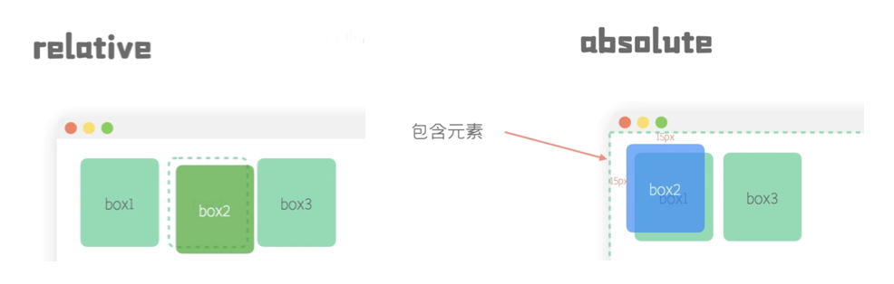
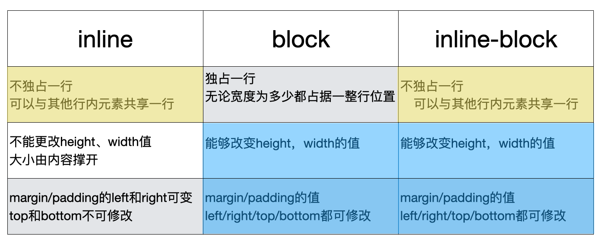

[TOC]

### 1. CSS字体：px rpx em rem vw vh vmin vmax

参考：[一文搞懂CSS中的字体单位大小(px,em,rem...)](https://juejin.im/post/6844903897421578253)。

**`px`**：pixel，像素，最小单位。一个最小电子元件负责展示一个像素。

**`rpx`**：微信小程序解决自适应屏幕尺寸的尺寸单位。由于屏幕的长宽不一样，物理设备的像素不一样，为了更好地开发，**规定屏幕的宽度为750rpx**，再根据具体设备宽度的像素，得出`1px = n rpx`的关系。

**`em`**：指的是父级元素`father EleMent`（来源于金属单位M=>point size的发音）的字体大小`font-size`。但是有一点需要注意的是，如果`em`用来表示长度，比如`padding: 2em`，那么就是以本身的`font-size`为单位长度。

**`rem`**：指的是根元素`Root EleMent`的字体大小(root font-size)，浏览器默认字体大小`1rem = 16px`。因为`em`是相对于父级元素，一旦某个父级元素重新设置了字体大小，其子元素使用`em`的时候也随之改变；通过规定`rem`并统一使用更好管理。可以通过`html {font-size: 20px;}`来设置根元素字体单位大小。

**`vw`**：视窗宽度`View Width`，`1vw = 1%视窗宽度`，因此可以指定`100vw`为整个视窗宽度。

**`vh`**：视窗高度`View Height`，`1vh = 1%视窗高度`，因此可以指定`100vh`为整个视窗高度。

**`vmin`**：取高度和宽度最小值所得。`1vmin = min{1vw, 1vh}`。

**`vmax`**：取高度和宽度最大值所得。 `vmax = max{1vw, 1vh}`。


#### 使用建议

1. 在对padding、margin进行定义的时候，使用em可以和font-size绑定关系，那么在设置font-size的时候，padding和margin也会相应按照比例增加或减小。
2. 使用百分比永远是跟parent绑定关系，除了height和parent's height绑定，font-size和parent' font-size绑定，其他都和parent's width。

---

### 2. 设置`a:link`不起作用？

```css
a:link {color:#FF0000;}		/* 未被访问的链接 */
a:visited {color:#00FF00;}	/* 已被访问的链接 */
a:hover {color:#FF00FF;}	/* 鼠标指针移动到链接上 */
a:active {color:#0000FF;}	/* 正在被点击的链接 */
```

​		css中对链接的属性定义主要有上面四个属性。`a:link`表示的是未被访问的链接，注意的是：历史中如果访问了但是没有清除缓存历史记录的话，这个链接就算是已经被访问过的链接了；而不是每一次重新打开这个页面的时候都会重新刷新状态，这就是`a:link`不起作用的原因。

****

### 3. `vertical-align`怎么使用，配合`text-align`？

- [x] `text-align`把内容文字水平设定，`vertical-align`负责竖直方向。参考：[vertical-align到底怎么用](https://www.jianshu.com/p/ce7e4a997a2c)。

​	1.`top`、`bottom`、`middle`


1. `baseline`：`baseline`**仅和父元素有关**。其产生的方式是按照父元素默认`font-size`生成一个类似于上述的`text`元素内容，其`baseline`就是文字内容的最下面。其他非文字属性如`<image>`默认底部对齐`baseline`。

2. 基于父元素的`baseline`的前提下：

   ​	`top`设置本元素对齐**行内最高元素**的顶部（顶部不是border，顶部连margin也算在内）；

   ​	`bottom`设置本元素对齐**行内最低元素**的底部；

   ​	`middle`设置本元素的中间轴（差不多1/2，有偏差）对齐`baseline`。

   ​	`auto`是不设置`vertical-align`的默认选项，这时候子元素的文字底部(不是容器底部)和`baseline`对齐。

****

​	2.`text-top`、`text-bottom`

​		注意这里的`text-top/bottom`中`text`的含义是指：假设生成了一个父元素指定的`font-size`的文字元素，这个元素的容器顶部（即text-top）和容器底部（即text-bottom）。

****

​	总结：所有都是以父元素`font-size`所产生的默认文字元素为基准，`baseline`是文字底部，`text-top`是该容器顶部，`text-bottom`是该容器底部。

#### 不想要 子元素底部与父元素底部的间隙 方法？

​		也因此产生另一个问题：可以看到`text`的文字底部作为`baseline`，而文字内容一般都居中在本元素内部，因此会产生`<image>`和父元素底部之间的间隙。而在不显示添加父元素文字内容的情况下，父元素默认有文字内容（即`baseline`默认与父元素底部产生间隙），这时候可以通过三种方式：

1. 针对`baseline`直接更正。通过设置文字内容`font-size: 0;`直接使`baseline`和父元素`bottom`重合

   ```css
   .div_father {
     font-size: 0;
   }
   ```

2. 忽略`baseline`。针对子元素的对齐方式是以`baseline`为标准，修改子元素的对齐方式为`vertical-align: bottom;`，因此不管`baseline`如何，都不会影响。

   ```css
   .div_son {
     vertical-align: bottom;
   }
   ```

3. 设置`display: block;`。

   - [ ] 不知道是不是因为block的对齐方式不是依据`baseline`而是依据`bottom`。

****

### 4. Flex布局`justify-content`和`align-items`区别

`justify-content`管理主轴；

`align-items`管理交叉轴，通常是单行元素；

`align-content`管理交叉轴，通常是多行元素；更加详细地可以看`./2.Flex布局.md/1 => 6.align-content(及与justify-content、align-items的异同)`。


****

### 5. 定位布局position：static relative absolute fixed sticky

参考[bilibili：动画解释CSS定位布局](https://www.bilibili.com/video/BV1ni4y1g7tc?t=3)，[bilibilib：前端入门教程CSS绝对定位 absolute 相对定位 relative 详讲](https://www.bilibili.com/video/BV1DK4y1h74M?t=781)。



`static`：默认值，不设置定位属性的时候为该值。

`relative`：设置样式之后，**仍记录在文本流中**，该组件还占据位置；再根据所占据的位置对该组件进行一定的偏移设置（但是对别的组件来说该组件的位置没动，所在的位置就是声明的位置）。如上图的虚线位置是对于其他组件来说的具体参照位置。

`absolute`：设置样式之后，**移除文本流**，即对其他组件来说，该组件不存在。其**所参考的position是包含元素的位置，即`最近设置为relative的父组件`**。如果向上索引没有父组件设置过`relative`，那么样式偏移的时候就参考根组件。（注意：利用`z-index`来调整组件覆盖（层叠上下文stacking contexts）的层次问题）

`fixed`：相对于视图的位置。与`absolute`参考最近设置为relative的父组件位置所不同，`fixed`是直接参考视图，即类似于导航栏，浮窗，所参考的是屏幕；而`absolute`参考的是文本流组件：`absolute`可能随着屏幕上下滑动而改变位置，其位置对于其参考组件来说没有改变；但是`fixed`是无论怎么滑动屏幕也不会改变。可以设置`left: 0; right: 0;`使组件包含整个屏幕宽度。

`sticky`：相当于`relative`和`fixed`的结合体：没有移除文本流，同时也可以表现出锁定在屏幕某位置的样式。如果设置`sticky`为`top:0`，那么在该组件未接触最上方的时候，按照正常的展示，一旦触碰到`top: 0;`，就会按照`fixed`的方式固定住；等到回到了原本位置，又回返回原本的位置。


****

### 6.form表单改变input样式需要用组件元素名

```html
<form>
  <input type="password" class="input-class">
</form>
```

```css
.form-class input[type="password"] {
  /* 这种方式可以改变 */
}

.input-class {
  /* 这种方式不能改变 */
}
```

****

### 7. 修改input中的`button`样式

参考[修改input file的样式（或用按钮button替代file）](https://blog.csdn.net/u014800380/article/details/53105767)：设置`opacity: 0;`拿自定义button覆盖

> ```
> file的透明度设为0的话，按钮和框好像是一起没了，再添一个框？这种方式我知道的。请问你是否知道EXT，我直接在JS里面能否用EXT
> ```

=> 在input外层套一个`a`标签，设置`input`的`position: absolute;`, `opacity: 0`：但没有文件显示列表。

****

### 8. `:focus` 、 `:hover` 、 `::after`、`::before`

​	注意类和`:`之间不能有空格。

`:focus`：点击触发。

`:hover`：鼠标悬浮触发。

```css
input:focus {
	outline: none; //点击了之后的外边框没有了
  border: 1px dotted black; //自定义
}
```

`::after`：在组件的最后添加一个伪类，一般配合`content`使用。

`::before`：在组件的最前添加一个伪类，一般配合`content`使用。

```css
.layout::after {
  content: '';
  border: 1px solid white;
}

.layout:hover::after {
  /* 注意顺序 */
}
```

****

### 9.inline、block、inline-block、inline-table

[inline ， block， inline-block的区别](https://blog.csdn.net/xuanwugang/article/details/80254401)。

[bilibili：[CSS] Block, Inline 与 Inline-Block](https://www.bilibili.com/video/BV1mk4y197se?t=356)：`margin: 0 auto`可以居中。



`inline`：常见的`inline`属性的标签有：`<a>`、`span`、`img`、`textarea`、`input`、`select`。

`block`：常见的`block`属性的标签有：`div`、`p`、`h1`-`h6`、`ul`、`ol`、`form`、`table`。

`inline-block`：在设计的时候分为**外在盒子**和**内在盒子/容器盒子**。外在盒子继承`inline`，负责显示行的方式（能够和其他元素共享一行）；容器盒子继承`block`，负责设置宽高（内容作为一个block，再把外在盒子撑开），以及能够对上下的padding和margin进行定义。

`inline-table`：对`inline-block`的进一步拓展，容器盒子变成了`table`，可以设置一些`table-item`。


****


