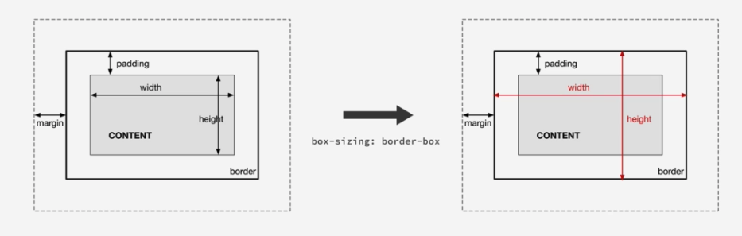
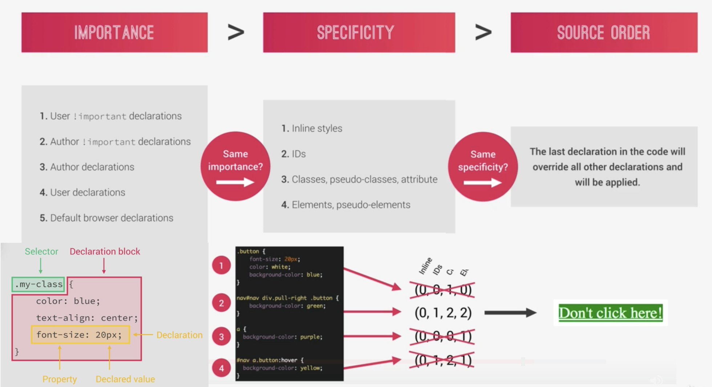
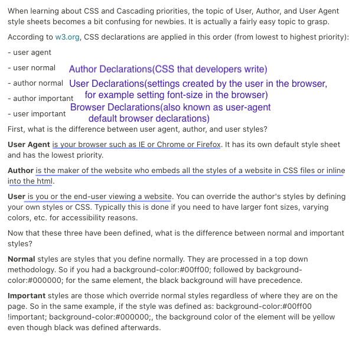
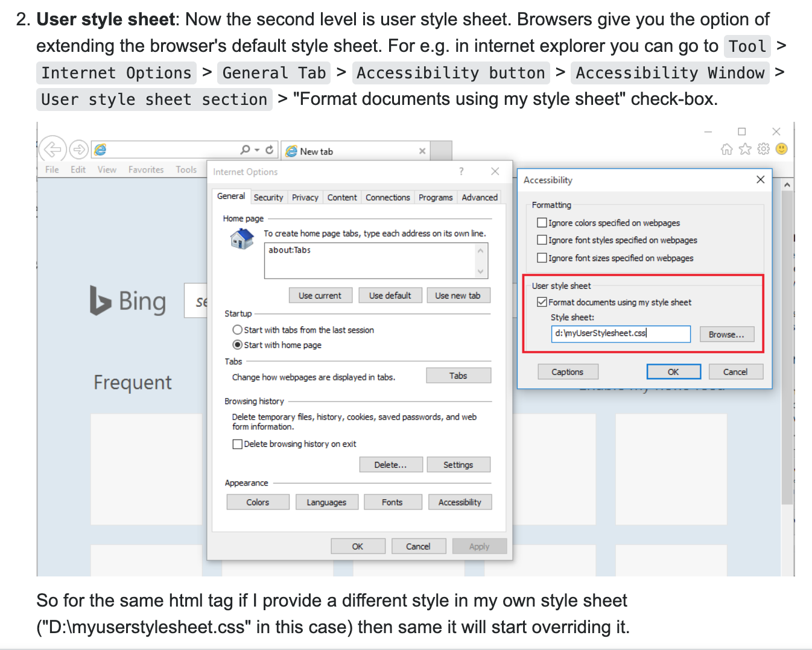
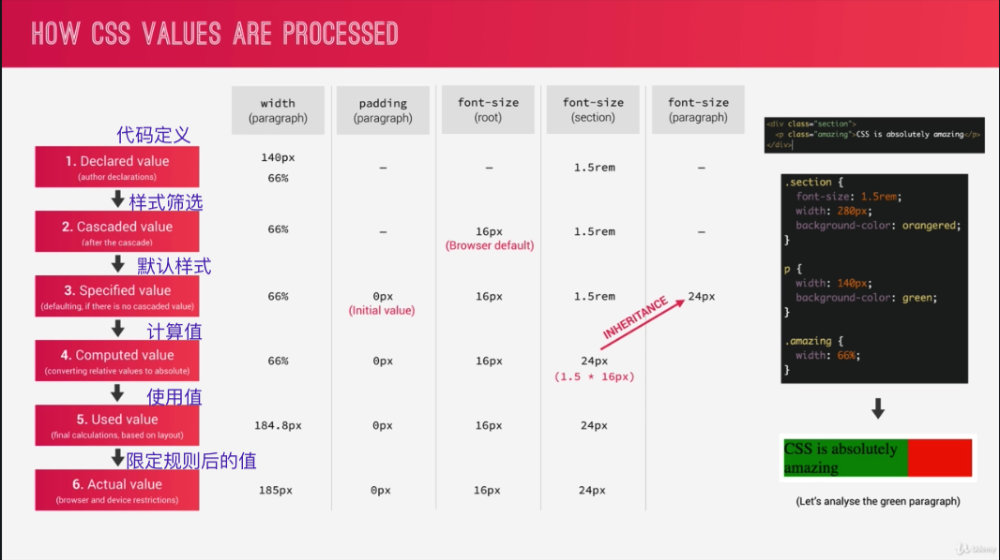
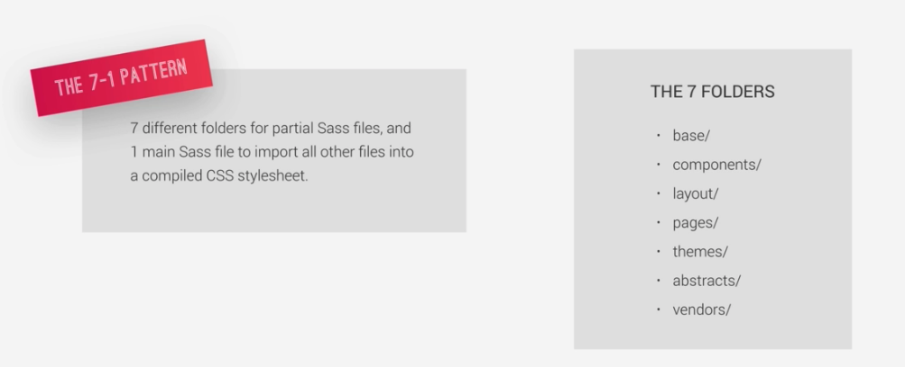

[TOC]

[CSS简单的继承](https://juejin.im/post/6844903997459922958)

[常用css样式属性大全](https://www.cnblogs.com/zhaoyingblog/p/8342739.html)

### 1. CSS盒模型


​		不同部分的说明：

> - **Margin(外边距)** - 清除边框外的区域，外边距是透明的。
> - **Border(边框)** - 围绕在内边距和内容外的边框。
> - **Padding(内边距)** - 清除内容周围的区域，内边距是透明的。
> - **Content(内容)** - 盒子的内容，显示文本和图像。
> - **Outline(轮廓线)** - 绘制于元素周围的一条线，位于边框边缘的外围，不会占据空间，也不一定是矩形。

#### 1.1 `content-box` & `border-box`



`content-box`：`box-sizing: content-box;`，W3C标准盒模型，默认的`box-sizing`。width是内容`content`的宽度，height是内容`content`的高度。

`border-box`：`box-sizing: border-box`，IE盒模型。width和height包括了`content`、`padding`和`border`。

---

### 2. 选择器

#### 2.1 语法及属性优先级

参考：[Udemy](https://www.udemy.com/)的Advance CSS and Sass课程P14、[How Does CSS Work Behind the Scenes?](https://betterprogramming.pub/how-does-css-works-behind-the-scenes-aca7152b4e7e)、[stackoverFlow：作者「RBT」的回答](https://stackoverflow.com/questions/18252356/what-is-the-difference-between-default-user-and-author-style-sheets)。



​		在进行样式渲染的时候，由于有可能在不同地方对一个属性进行定义，按照上述的优先级决定最后定义的效果：`importance > specificity > source order`。

1. `importance`>`specificity`>`source order`：

   针对`importance`：`User`是指使用网站的用户；`author`即写网站的作者，即html中的css部分的代码；`user agent`即网站的默认样式。

   针对`specificity`：`写在html的style`>`id`>`class`>`element`。

   针对`source order`：按照从上到下的代码扫描顺序，最后定义的为最终样式。

2. ```继承父节点的样式```，指的是所在的上一层的节点的样式。

3. ```default样式```，如果没找到新定义的样式，就会渲染原样式。

##### 2.1.1 user、author的具体行为

​	1. `user/author具体定义`：参考[Udemy](https://www.udemy.com/)的Advance CSS and Sass课程P14、[How Does CSS Work Behind the Scenes?](https://betterprogramming.pub/how-does-css-works-behind-the-scenes-aca7152b4e7e)中讲解，User代表网站的使用者，Author代表写网站的开发者=> User Declarations代表user自定义的css样式，Author Declarations代表developer写的css样式。

> 

​	2. `user/author declarations`：参考[stackoverFlow：作者「RBT」的回答](https://stackoverflow.com/questions/18252356/what-is-the-difference-between-default-user-and-author-style-sheets)：

`author declarations`具体行为：开发网站具体定义css样式、**在网站中通过「检查」来实时修改代码**。

`user declarations`具体行为：通过browser添加自定义的样式，这个样式会覆盖网站的`default css`。即如果没有人具体定义css的时候，所有的样式都会依据browser默认定义的样式来进行渲染；通过`user declarations`嵌入`user style sheet`，就可以覆盖browser的默认样式；即通过覆盖，`user declarations`成为用户打开网站的新的**默认样式**。 => `user declarations => user style sheet` ===`new default style sheet`。

- [x] 需要注意的是，网站中通过「检查」实时修改代码来改变样式，实际上属于`author declarations`的行为，而不是`user declarations`的行为。



##### 2.1.2 declaration value的最终值确认过程



​	1.获取样式表的层叠样式`cascaded value`：通过扫描代码获得所有的`declared value`，根据优先级规则最终确定一个优先级最高的`cascaded value`。

​	2.确认采用`specified value`：根据`cascaded value`的有无情况确认，有则直接使用，无则考虑是否可`inherited`，能继承则继承，不能继承则采用`default value`。

​	3.计算**非布局依赖的value**得出`computed value`：如`rem`、`em`等。`computed value`的主要作用是用于继承。

​	4.计算**布局依赖**的**百分比value**得出`used value`：如margin、padding、width、height等。

​	5.根据数值限定得出`actual value`：比如有些数值只能使用int，那么就对`used value`进行浮点数处理。

##### 2.1.3 布局依赖 及 继承属性

​	`布局依赖`：布局相关，比如child容器的width值使用百分比的时候是根据parent容器宽度计算。布局依赖的属性主要包括`margin`、`padding`、`width`、`height`、`top/right/bottom/left`、`background-position`、`text-indent`。

​	`继承属性`：`color`、`text-开头的`、`line-开头的`、`font-开头的`**文字样式的**都会被继承。

> 参考[继承属性](https://www.nowcoder.com/questionTerminal/b8c4d762aad84745a5dd13c3dcaee8db)
>
> 所有元素可继承：visibility和cursor。 
>
> 内联元素可继承：letter-spacing、word-spacing、white-space、line-height、color、font、font-family、font-size、font-style、font-variant、font-weight、text-decoration、text-transform、direction。 
>
> 终端块状元素可继承：text-indent和text-align。 
>
> 列表元素可继承：list-style、list-style-type、list-style-position、list-style-image。

****

#### 2.2 选择器

##### 元素选择器

> 对于元素选择器直接按照元素名定义即可

```vue
<style scoped>
  ul {
    color: black;
  }
  
  li {
    color: black;
  }
  
  p {
    color: blue;
  }
</style>
```

> 有时候可能几个元素需要定义的样式都一模一样，可以直接并列定义

```vue
<style scoped>
  ul, li {
    color: black;
  }
</style>
```

##### 类选择器 ```.``` & id选择器```#```

> 与vue的挂载el表示的完全不同，```el: #app```表示挂载到```id="app"```，```el: .app```表示挂载到```class="app"```。

```vue
<ul class="ul-class-type">
  <p> parent ul color: black </p>
  <li>li color: blue</li>
  <li class="li-class-type"> li-class-type color: green </li>
  <li id="li-id-type"> li-id-type color: pink </li>
</ul>
<p>default color</p>
<ul class="ul-class-type"></ul>

```

```vue
<style scoped>
ul {
  color: black;
}
li {
  color: blue;
}
.ul-class-type {
  color: red;
 }
.li-class-type {
  color: green;
  }
#li-id-type {
  color: pink;
}
</style>
```

##### 深度选择器 ```/deep/``` or ```>>>```

[Mine>Q: CSS样式穿透 ```>>>``` or ```/deep/```](../VUE/vue问题汇总.md)

[vue中CSS样式穿透](https://segmentfault.com/a/1190000020368529?utm_source=tag-newest)

> 采用有赞开发的vant组件库。组件库内置了很多样式，方便了我们开发者，同时又因高度封装，有时也会给我们带来一点点困扰。比如在使用vant组件库中的环形进度条时，查看官方文档，有改变进度条颜色，有改变轨道颜色，也有改变填充颜色。就是没有改变现实文字颜色的。凑巧的是，我们的需求就是要**改变文字颜色**，怎么办呢？

```van-circle```组件为例，该组件内部是一个svg和div标签组成，svg用于现实我们图形，div用于显示文字。并且在这个div上存在一个class为```van-circle__text```，且default-color: black。按照以下思路来进行文字颜色完成```color: blue```的修改：```父级选择器修改``` => ```不用scoped字符``` => ```深度选择器穿透样式```。

```vue
// 用/deep/关键字符
<style lang="less" scoped>
  .van-circle {
    /deep/ .van-circle__text {
      color: blue;
    }
  }
  
  .van-circle /deep/ .van-circle__text {
    color: blue;
  }
</style>
```

```vue
// 用>>>关键字符
<style lang="less" scoped>
  .van-circle {
    >>> .van-circle__text {
      color: blue;
    }
  }
  
  .van-circle >>> .van-circle__text {
    color: blue;
  }
</style>
```

##### 选择器组合使用

​	**元素选择器+类选择器**。e.g. 选择```class=special```的```li```元素。

```css
li.special {
  color: orange;
  font-weight: bold;
}
```

​	**后代选择器**。``` ``` e.g. 选择```div```内所有的```p```元素。只要是内嵌在div元素内的，无论多少层。

``` css
div p {
  color: blue;
}
```

```vue
<div>
  <p> blue COLOR </p>
  <ul>
    <p> still blue COLOR </p>
  </ul>
</div>
<p> default color </p>
```

​	**子元素选择器**。```>``` 直接嵌套在元素内的元素，只能保证一层。e.g. 选择```div```内的直接子元素```p```元素。

```css
div>p {
  color: blue;
}
```

```vue
<div>
  <p> blue COLOR </p>
  <ul>
    <p> 2nd layer, default color </p>
  </ul>
</div>
```

​	**相邻兄弟选择器**。```+``` 后续的<u>那一个</u>兄弟元素。e.g. 选择```h3```后续的那一个```p```元素。

```css
h3+p {
  color: blue;
}
div+p{
  color: red;
}

```

```vue
<div>
  <p> before H3: default color </p>
  <h3> check point </h3>
  <p> first behind-brother, blue color </p>
  <p> second behind-brother, default color </p>
</div>
```

​	后续兄弟选择器。出现在后面的所有兄弟元素。e.g. 选择```h3```后续的所有```p```元素。

```css
h3~p {
  color: blue;
}
```

```vue
<div>
  <p> before H3: default color </p>
  <h3> check point </h3>
	<p> first behind-brother, blue color </p>
  <p> second behind-brother, blue color </p>
</div>
```

##### 封装组件的选择器类型

​	由于每一个```<template></template>```里面只能放一个root元素，因此事实上一个组件的选择器类型就是这个root元素的类型（**实际上自定义组件之后，系统在调用这个组件的时候是把所有代码引入过去**）。比如现在定义一个```HelloWorld```组件，并且放到另一个文件中引入。在```div```元素前面但是却是在```HelloWorld```组件后面的兄弟```p```元素，依然会受到```div~p```样式渲染。

```vue
// HelloWorld.vue
<template>
<div class="hello">
  <p> hello! </p>
</div>
</template>
```

```vue
// app.vue
<template>
<div>
  <HelloWorld> hellorWorld check point </HelloWorld>
  <p> before div BUT behind-HelloWorld: blue color </p>
  <div> div brother check point </div>
	<p> first behind-brother, blue color </p>
  <p> second behind-brother, default color </p>
</div>
</template>

<script>
import HelloWorld from "./components/HellorWorld"
  
export default {
  components: {
    HellorWorld,
  }
}
</script>

<style scoped>
  div~p {
    color: blue;
  }
</style>
```

****

### 使用建议

​	1. 使用全局选择器global selector`*`使默认的`padding`、`margin`为`0`，最好包括`pseudo-element`。

```css
*,
*::after,
*::before {
  padding: 0;
  margin: 0;
}
```

	2. 设置`root font-size`的时候，最好使用百分比`%`来设定，代表`default font-size`的百分比。这样子可以按照不同的`default font-size`更加普适。如果设定了固定`px`，那么用户在改变了`default font-size`的时候，我们设置的`px`依然不变；但是用了百分比`a%`，就能相应改变了。

```css
html {
  font-size: 62.5%;
}
```

 3. `box-sizing`最好使用`* => inherit` + `root => border-box`。

    > For performance reasons; **inheritance is less "weighty" than direct selection**. HTML works by inheritance, the universal selector by direct selection. **Margins and paddings do not get inherited, hence we have no choice but to set those by direct universal selection**. But box-sizing does get inherited, and we chose the more performant option.

```css
* {
  box-sizing: inherit;
}

html {
  box-sizing: border-box;
}
```


### width & height

When setting height property of an element using percentages, then the percentage is relative to the **height** of the parent element. That's the only case I guess.

其他的按照百分比，比如`padding: 10%`、`margin: 10%`是按照parent的`width`。

#### 7-1 strategy

