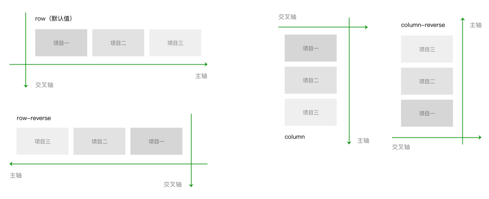
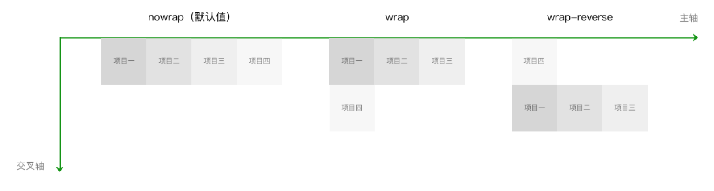
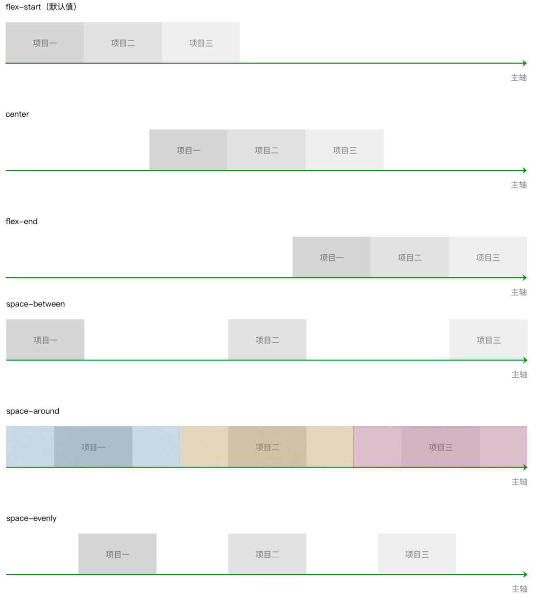
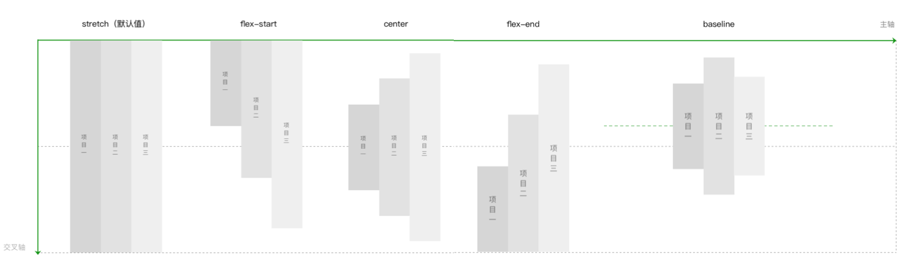
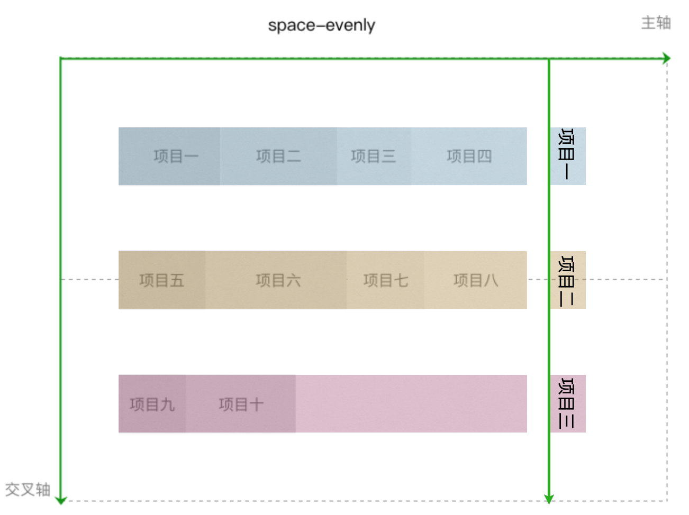
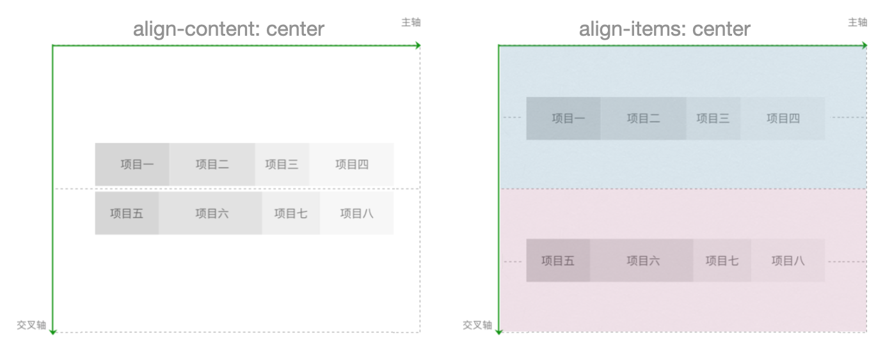
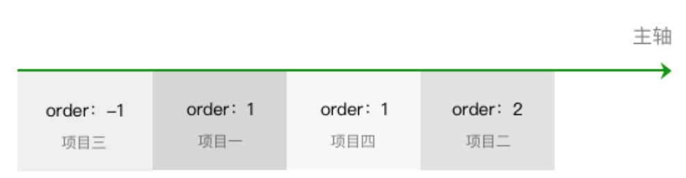
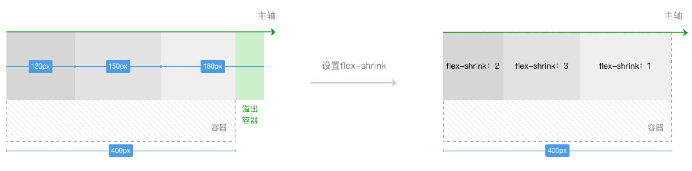
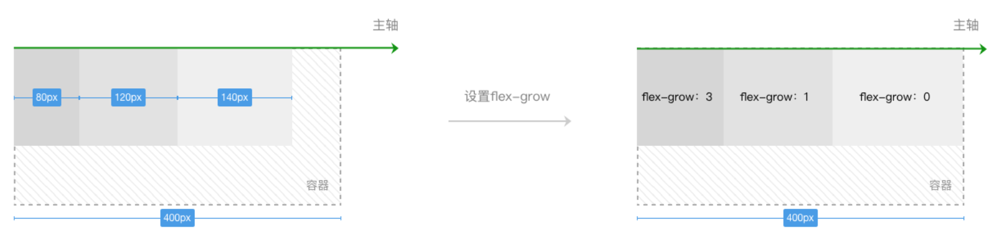
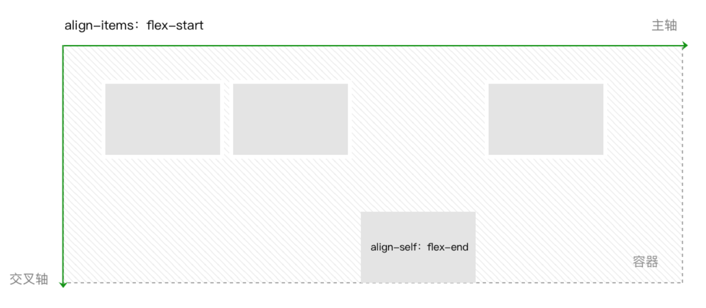

[TOC]

[Flex布局](http://www.ruanyifeng.com/blog/2015/07/flex-grammar.html)

[Flex布局-微信小程序官方](https://developers.weixin.qq.com/ebook?action=get_post_info&docid=00080e799303986b0086e605f5680a)

### 1.flex: 容器属性

​	容器属性包括六个：

```css
display:flex;

flex-direction:row（默认值） | row-reverse | column |column-reverse

flex-wrap:nowrap（默认值） | wrap | wrap-reverse

justify-content:flex-start（默认值） | flex-end | center |space-between | space-around | space-evenly

align-items:stretch（默认值） | center  | flex-end | baseline | flex-start

align-content:stretch（默认值） | flex-start | center |flex-end | space-between | space-around | space-evenly
```

****

###### 1.`display: flex;`

​	指定布局为flex布局。

###### 2.`flex-direction`

​	指定布局主轴的方向，**row表示按行**排元素，**column表示按列**排元素。



###### 3.`flex-wrap`

​	指定容器宽/高度不够的时候是否允许换行。

​	**比如**：如果指定`container`容器`width: 210px;`，而指定四个`item`项目`width: 70px;`。如果`flex-wrap: nowarp`，那么四个项目的宽度都会被压缩成`52.5px`。而如果`flex-wrap: wrap;`，那么就按照项目原本的宽度进行排列，最终展示出来的效果是三个`item`在第一行，一个`item`在第二行。



###### 4.`justify-content`

​	理解这个属性，只需要理解这个单词即可：`justify(整理版面)`。即在规定了**主轴元素**之后按照什么方式排列这些元素。注意`space-around`和`space-evently`两个的区别即可。



###### 5.`align-items`

​	**管理容器交叉轴的对齐方式**。一般`align-items`管理单行对齐，对多行的项目管理一般使用`align-content`。两个的区别在`align-content`中讲解。



###### 6.`align-content`(及与`justify-content`、`align-items`的异同)

​	`align-content`实际上就是以一行为单位作为一个`item`，管理交叉轴，其对齐的方式与`justify-content`一致。因此`align-content`和`justify-content`都是对content进行管理，只不过管理的轴不一样。



​	`align-content`相当于将多行当作一个content来管理，但是`align-items`则是单行分别管理。如下图：当有多行元素的时候设置`align-items: center;`，那么这n行首先将高度分成n份，再在各自的区域中单行控制为区域中心。



### 2.flex: 项目属性

​	项目属性包括六个：

```css
order: 0（默认值） | <integer>

flex-shrink: 1（默认值） | <number>

flex-grow: 0（默认值） | <number>

flex-basis: auto（默认值） | <number>px

flex: none | auto | @flex-grow @flex-shrink @flex-basis
  
align-self: auto（默认值） | flex-start | center | flex-end | baseline |stretch
```

****

###### 1.`order`

​	指定项目在主轴上的排列顺序，数值越小越靠前。相同时按照代码顺序。



###### 2.`flex-shrink`

​	指定当全部项目之和溢出容器时，该项目收缩的占比。数值越大，溢出部分需要该元素让出位置的占比程度越高。具体分配规则参考[Flex布局-微信小程序官方](https://developers.weixin.qq.com/ebook?action=get_post_info&docid=00080e799303986b0086e605f5680a)。



###### 3.`flex-grow`

​	容器尚有空间未分配时，指定项目扩张因子，分配多余的部分。数值越大，多余部分分配给该元素的位置占比程度越高。



###### 4.`flex-basis`

​	`width`：当指定`flex-direction: row;`时，`flex-basis`即`width`。

​	`height`：当指定`flex-direction: height;`时，`flex-basis`即`height`。

###### 5.`flex`

​	是flex-grow，flex-shrink，flex-basis的简写方式。值设置为none，等价于00 auto。值设置为auto，等价于1 1 auto。

```css
.item {
  flex: none | auto | @flex-grow @flex-shrink@flex-basis
}
```

###### 6.`align-self`

​	当容器中的个别元素有不一样的对齐方式时，可单独设置其对齐方式。

