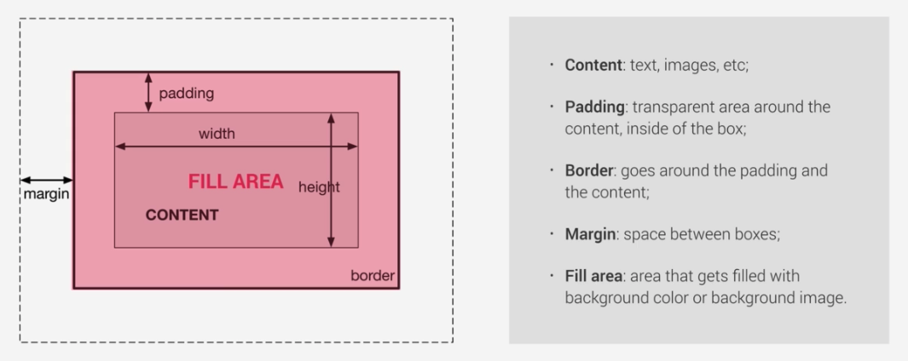

[TOC]

[Property(CSS)](https://developer.mozilla.org/en-US/docs/Glossary/property/CSS)

[CSS简单的继承](https://juejin.im/post/6844903997459922958)

[常用css样式属性大全](https://www.cnblogs.com/zhaoyingblog/p/8342739.html)

### CSS盒模型



​		不同部分的说明：

> - **Margin(外边距)** - 清除边框外的区域，外边距是透明的。
> - **Border(边框)** - 围绕在内边距和内容外的边框。
> - **Padding(内边距)** - 清除内容周围的区域，内边距是透明的。
> - **Content(内容)** - 盒子的内容，显示文本和图像。

###### W3C标准盒模型

> width=内容的宽度
>
> height=内容的高度
>
> ```js
> box-sizing: content-box;
> ```

###### IE盒模型

> width = border + padding + 内容的宽度
>
> height = border + padding + 内容的高度
>
> ```js
> box-sizing: border-box;
> ```

###### 从父元素继承box-sizing的值

> ```js
> box-sizing: inherit;
> ```

[CSS简单的继承](https://juejin.im/post/6844903997459922958)

---

### 选择器

​		在进行样式渲染的时候，按照下面的顺序进行样式索引：```与自己相匹配的选择器样式``` => ```继承父节点的样式``` => ```default样式```。下面的内容可以详细理解。

1. ```与自己相匹配的选择器样式```指的是直接关联，比如```.li-class-type```直接关联到```<li class="li-class-type">```；
2. ```继承父节点的样式```，指的是所在的上一层的节点的样式。
3. ```default样式```，如果没找到新定义的样式，就会渲染原样式。

###### 元素选择器

> 对于元素选择器直接按照元素名定义即可

```vue
<style scoped>
  ul {
    color: black;
  }
  
  li {
    color: black;
  }
  
  p {
    color: blue;
  }
</style>
```

> 有时候可能几个元素需要定义的样式都一模一样，可以直接并列定义

```vue
<style scoped>
  ul, li {
    color: black;
  }
</style>
```

###### 类选择器 ```.``` & id选择器```#```

> 与vue的挂载el表示的完全不同，```el: #app```表示挂载到```id="app"```，```el: .app```表示挂载到```class="app"```。

```vue
<ul class="ul-class-type">
  <p> parent ul color: black </p>
  <li>li color: blue</li>
  <li class="li-class-type"> li-class-type color: green </li>
  <li id="li-id-type"> li-id-type color: pink </li>
</ul>
<p>default color</p>
<ul class="ul-class-type"></ul>

```

```vue
<style scoped>
ul {
	color: black;
}
li {
	color: blue;
}
.ul-class-type {
	color: red;
 }
.li-class-type {
	color: green;
  }
#li-id-type {
	color: pink;
}
</style>
```

###### 深度选择器 ```/deep/``` or ```>>>```

[Mine>Q: CSS样式穿透 ```>>>``` or ```/deep/```](../VUE/vue问题汇总.md)

[vue中CSS样式穿透](https://segmentfault.com/a/1190000020368529?utm_source=tag-newest)

> 采用有赞开发的vant组件库。组件库内置了很多样式，方便了我们开发者，同时又因高度封装，有时也会给我们带来一点点困扰。比如在使用vant组件库中的环形进度条时，查看官方文档，有改变进度条颜色，有改变轨道颜色，也有改变填充颜色。就是没有改变现实文字颜色的。凑巧的是，我们的需求就是要**改变文字颜色**，怎么办呢？

```van-circle```组件为例，该组件内部是一个svg和div标签组成，svg用于现实我们图形，div用于显示文字。并且在这个div上存在一个class为```van-circle__text```，且default-color: black。按照以下思路来进行文字颜色完成```color: blue```的修改：```父级选择器修改``` => ```不用scoped字符``` => ```深度选择器穿透样式```。

```vue
// 用/deep/关键字符
<style lang="less" scoped>
  .van-circle {
    /deep/ .van-circle__text {
      color: blue;
    }
  }
  
  .van-circle /deep/ .van-circle__text {
    color: blue;
  }
</style>
```

```vue
// 用>>>关键字符
<style lang="less" scoped>
  .van-circle {
    >>> .van-circle__text {
      color: blue;
    }
  }
  
  .van-circle >>> .van-circle__text {
    color: blue;
  }
</style>
```

###### 选择器组合使用

​	**元素选择器+类选择器**。e.g. 选择```class=special```的```li```元素。

```css
li.special {
	color: orange;
  font-weight: bold;
}
```

​	**后代选择器**。``` ``` e.g. 选择```div```内所有的```p```元素。只要是内嵌在div元素内的，无论多少层。

``` css
div p {
  color: blue;
}
```

```vue
<div>
  <p> blue COLOR </p>
  <ul>
    <p> still blue COLOR </p>
  </ul>
</div>
<p> default color </p>
```

​	**子元素选择器**。```>``` 直接嵌套在元素内的元素，只能保证一层。e.g. 选择```div```内的直接子元素```p```元素。

```css
div>p {
  color: blue;
}
```

```vue
<div>
  <p> blue COLOR </p>
  <ul>
    <p> 2nd layer, default color </p>
  </ul>
</div>
```

​	**相邻兄弟选择器**。```+``` 后续的<u>那一个</u>兄弟元素。e.g. 选择```h3```后续的那一个```p```元素。

```css
h3+p {
  color: blue;
}
div+p{
  color: red;
}

```

```vue
<div>
  <p> before H3: default color </p>
  <h3> check point </h3>
	<p> first behind-brother, blue color </p>
  <p> second behind-brother, default color </p>
</div>
```

​	后续兄弟选择器。出现在后面的所有兄弟元素。e.g. 选择```h3```后续的所有```p```元素。

```css
h3~p {
  color: blue;
}
```

```vue
<div>
  <p> before H3: default color </p>
  <h3> check point </h3>
	<p> first behind-brother, blue color </p>
  <p> second behind-brother, blue color </p>
</div>
```

###### 封装组件的选择器类型

​	由于每一个```<template></template>```里面只能放一个root元素，因此事实上一个组件的选择器类型就是这个root元素的类型（**实际上自定义组件之后，系统在调用这个组件的时候是把所有代码引入过去**）。比如现在定义一个```HelloWorld```组件，并且放到另一个文件中引入。在```div```元素前面但是却是在```HelloWorld```组件后面的兄弟```p```元素，依然会受到```div~p```样式渲染。

```vue
// HelloWorld.vue
<template>
<div class="hello">
  <p> hello! </p>
</div>
</template>
```

```vue
// app.vue
<template>
<div>
  <HelloWorld> hellorWorld check point </HelloWorld>
  <p> before div BUT behind-HelloWorld: blue color </p>
  <div> div brother check point </div>
	<p> first behind-brother, blue color </p>
  <p> second behind-brother, default color </p>
</div>
</template>

<script>
import HelloWorld from "./components/HellorWorld"
  
export default {
  components: {
    HellorWorld,
  }
}
</script>

<style scoped>
  div~p {
    color: blue;
  }
</style>
```

---

### CSS语法


---

### CSS常用属性

[常用css样式属性大全](https://www.cnblogs.com/zhaoyingblog/p/8342739.html)


###### 文字属性

```color: #000000;``` ：[**颜色**]()

```font-family: sans-serif;```：[**字体**]()

```font-size: 9pt;```：[**大小**]()

```text-align: right/left/center/justify;```：[**对齐方式**](右对齐/左对齐/居中/分散对齐) 

```text-decoration: line-through/overline/underline/none;```：[**字体划线**](加删除线/顶线/下划线/删除链接下划线)

```font-style: itelic;```：[**斜体**]()

```font-weight: bold;```：[**粗体**]()

```font-variant: small-caps;```：[**小字体**]()

```letter-spacing: 1pt;```：[**字间距离**]()

```line-height: 200%/1/2;```：[**行高/行间距**]()

`text-indent: 28px;`：[**首行缩进**]()

```vertical-align: super/sub;```：[**上/下标字**]()  

```vertical-align: top/bottom/middle/text-top/text-bottom;```：[**垂直对齐方式**](垂直向上/下/中对齐or 文字垂直向上/下对齐)

```text-transform: capitalize/uppercase/lowercase;```：[**字母大小写**](首字大写or全大/小写) 

###### 背景

```background-color:#F5E2EC;```：[**背景颜色** ]()
```background:transparent;```：[**透视背景**]()
```background-image : url(/image/bg.gif);```：[**背景图片**]()
```background-attachment : fixed;``` /*浮水印固定背景*/
```background-repeat : repeat/no-repeat/repeat-x/repeat-y;```：[**图片重复**](默认重复/不重复/在x轴重复/在y轴重复)
```background-position : 90% 90%/top/right/buttom/left/center;```：[**位置**](相对于xy轴/上/右/下/左/居中)

###### 边框/框线/边界

```padding-top/right/bottom/left: 10px;```：[**边框留空**](上/右/下/左边框留空白)

```margin-top/right/bottom/left: 10px;```：[**边界值**]()

```border-top/right/bottom/left: 1px solid #000000;```：[**框线大小+样式+颜色**]()

> ```border-top-color: #000000;```：**只设置颜色**。
>
> ```border-top-width: 1px;```：**只设置宽度**。
>
> ```border-top-style: solid;```：**只设置样式**。
>
> ```js
> solid //实线框
> dotted //虚线框
> double //双线框
> groove //立体内凸框
> ridge //立体浮雕框
> inset //凹框
> outset //凸框
> ```

###### 速记属性

```css
.sample{
  /* 从top开始，顺时针旋转，top right bottom left */
  margin: 1px 2px 3px 4px;
  /* top&down left&right */
  margin: 1px 0px;
}
```

****

### CSS其他属性

`item-align`

```css
align-items: stretch|center|flex-start|flex-end|baseline|initial|inherit;
```

`align-content`

```css
align-content: stretch|center|flex-start|flex-end|space-between|space-around|initial|inherit;
```

`vertical-align`


`text-align`

```css
text-align: center|left|right|justify
```


****

### BEM命名规范

[BEM规范](https://blog.csdn.net/chenmoquan/article/details/17095465)