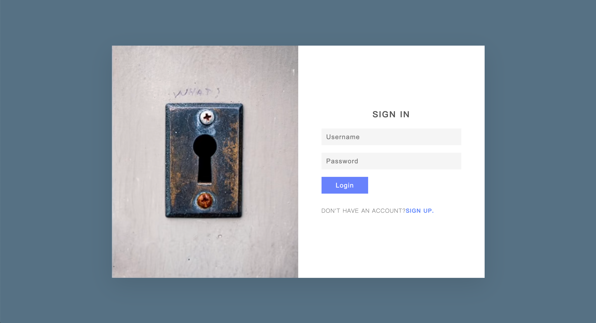
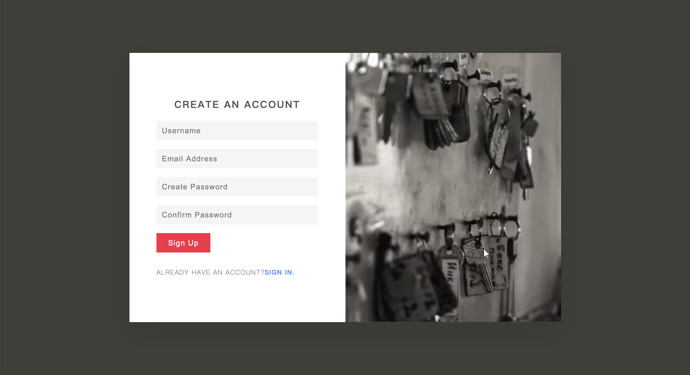

[TOC]

## 1.登录注册表单制作

​	Resiponsive sign in % sign up form：[bilibili：登陆注册表单制作](https://www.bilibili.com/video/BV1uv411a73Z)。





### transition / box-sizing / object-fit / display: none/initial / pointer-event / @media

`transition`：规定数据变化的时候有一个缓慢变化的时间。

`box-sizing`：规定`border`是否计算在`width`和`height`中。`content-box`指定边框为额外内容；`border-box`指定边框为指定大小内部内容。

`object-fix`：规定`img`、`video`是否保持尺寸。

`display: none;`：即移除文本流。`display: initial;`即设置为默认状态。

`pointer-event: none;`：鼠标不再监听当前层而去监听下面的层中的元素。`pointer-event: auto;`：效果和没有定义pointer-events属性相同，鼠标不会穿透当前层。

`@media`：可以针对不同的屏幕尺寸设置不同的样式，特别是如果你需要设置设计响应式的页面，@media 是非常有用的。当你重置浏览器大小的过程中，页面也会根据浏览器的宽度和高度重新渲染页面。

```css
/* 监听如果屏幕宽度小于900px，则重新渲染内容 */
@media (max-width: 900px)
{
  section
  {
    width: 400px;
  }
}
```

****

## 2.背景色切换

[bilibili:【HTML+CSS】三张图片 无Js 制作霓虹流光网页背景](https://www.bilibili.com/video/BV1Kp4y1H74F)

### @keyframes & animation

`@keyframe`：使用此生成一个动画的具体行为，将一套 CSS 样式逐渐变化为另一套样式，具体实现通过指定`0% - 100%`皆可。其中可以使用`from`和`to`，相当于`0%`和`100%`。

`animation`：动画实现的具体参数数值，包括持续时间等。具体参考`../css/0.2css进阶属性`

```css
@keyframe action {
  0% {
    opacity: 0; /* 指定样式内容 */
  }
  50% {}
  100% {}
}

@keyframe action {
  from{} /* 0% */
  to{} /* 100% */
}

// 使用
.class {
  animation-name: action;
  animation-duration: 10s;
  animation-timing-funcion: ease-in-out;
  animation-delay: 0s;
  animation-iteration-count: infinite;
  animation-direction: alternate;
}
```

****

## 3.背景渐变色切换

[bilibili：纯 CSS 实现渐变背景色过渡动画](https://www.bilibili.com/video/BV1Xv4y1Z7UW)

### linear-gradient & background-position

​	在2.背景色切换中，使用的是三张图片的opacity不断变化来实现。在这个例子中使用`linear-gradient`生成渐变色背景，通过拉伸成2倍大小，再通过`background-position`不断改变背景的位置来实现。同样使用到了上面一个例子的`@keyframes`和`animation`。

`linear-gradient`：根据指向方向，颜色渐变。颜色可指定多个。

`background-position`：指定背景图片左上角顶点的位置。注意如果指定了背景大小为200%，那么(100%,100%)才是正中间的位置。

```css
.bgd {
  background: linear-gradient(135deg, #C6FFDD, #FBD786, #f7797d);
  width: 100%;
  height: 100%;
  background-size: 200% 200%;
  
  animation-name: move;
  animation-duration: 5s;
  animation-timing-function: ease-in-out;
  animation-iteration-count: infinite;
  animation-direction: normal;
}

@keyframes move {
  0% {
    background-position: 0% 0%;
  }

  100% {
    background-position: 100% 100%;
  }
}
```

****

## 4. 3D背景-随光标背景移动效果

### 重点是js文件实现，后续再看

****

