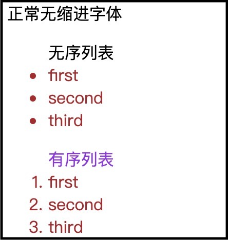

[TOC]


### 1. 关于ul、ol、li

**ul**：unordered list

**ol**：ordered list

**li**：list

```
<p>正常无缩进字体</p>
<ul> <!-- unordered list -->
  无序列表
  <li> first </li> <!-- list -->
  <li> second </li>
  <li> third </li>
</ul>
<ol> <!-- ordered list -->
  有序列表
  <li> first </li>
  <li> second </li>
  <li> third </li>
</ol>
```



---------------

### 2. 关于style样式设置匹配

```html
<style>
  ul{color:red;}
  li{color:blue;}
</style>

<ul>
 	<li>颜色是蓝色的，匹配li</li>
  <p>颜色是红色的，匹配ul</p>
</ul>
```

关于style设置中的匹配，将会按照自身嵌套的元素往外寻找style。

对于<li>元素，首先寻找是否有li的style设置，如果有，则匹配之，不再寻找其他style。

对于<p>元素，寻找没有p的style设置，则往外寻找ul的style设置，匹配之。即自身的style优先级高，父级次之。

----------------

### 3. script为什么放在html文件的body内部的最后为好？

[浅谈script标签中的async和defer](https://www.cnblogs.com/jiasm/p/7683930.html)

###### <script>放在html的<body>内部的最后并非是最优。最优的是利用好```async```和```defer```。

​		参照[虚拟DOM和真实DOM](../VUE/vue问题汇总)，理解渲染过程。

​		A: 在解决这个问题之前，先确认概念「首屏」和「最终效果屏」。

> ```Render Tree```（渲染树）是```DOM Tree```和```CSS Rule Tree```共同构造出来。而JS可以通过DOM API和CSSOM API接口分别对DOM Tree和CSS Rule Tree进行修改，从而构造最后的Render Tree。因此可以将这个过程分类成两种情况：
>
> 1. JS没有通过API修改形成的Render Tree
> 2. JS通过API修改形成的Render Tree
>
> 在讨论这个问题之前，**首屏**指的就是``JS没有通过API修改DOM Tree和CSS Rule Tree而形成的Render Tree渲染出来的页面``。而**最终效果屏**则指的是```JS通过API修改DOM Tree和CSS Rule Tree最终形成的Render Tree渲染出来的页面```。
>
> 在这种首屏的情况下，只对HTML里面的元素进行渲染，而没有JS修改。
>
> 

​		B: 而JS会阻塞```DOM Tree```和```CSS Rule Tree```的构造。

> 浏览器加载一个有 <script>标签的网站发生的事情:
>
> 1.拉取 HTML 页面 (e.g. index.html)，开始解析 HTML
>
> 2.解析到<script>标签之后准备获取 script 文件.
>
> 3.浏览器获取script文件。同时，html 解析中断并且**阻断**页面上其他html的解析。
>
> 4.一段时间后，script下载完成并且**执行**。继续解析HTML文档的其他部分（解析script之后的html代码）
>
> 在第三步中，浏览器获取script文件，会阻断页面上其他html的解析，也就是无法继续构造DOM Tree，直到script完全下载完成，才会进行第四步继续构造DOM Tree。

​		在理解了A和B两个部分之后，也就能看出：把script标签放在<body>的底部，可以防止script阻断DOM的构造，通过一定的参数设定使得在最终效果屏出来前，能加载出一个首屏。比如有时候加载一个网页，可能就会出现这样的首屏（只有内容，很丑），没有样式的修改。即```FOUC```：由于浏览器渲染机制（比如firefox），在CSS加载之前，先呈现了HTML，就会导致展示出无样式内容，然后样式突然呈现的现象；

​		但是对最终效果屏来说，二者都需要等待script文件下载并执行完毕才能够出来，因此是无差别的。

###### async & defer

​		```async```和```defer```都不会产生上述的阻断```DOM Tree```构造，即运用了这两个属性，script的下载不会阻断html的解析。

​		```async```：async标记的Script异步执行下载，并执行。

```html
<!-- 
异步执行需要关注两点：
1.不用顾虑前件script是否加载完毕，只要是script就可以立马进行加载，并行加载
2.不用考虑前件script是否执行完毕，只要是加载完毕就可以立马执行
-->
<script type="text/javascript" src="script1.js" async></script>
<script type="text/javascript" src="script2.js" async></script>
<!-- script2可能会比script1更早执行完毕 -->
```

​		```defer```：defer标记的Script顺序执行。

```html
<!-- 
顺序执行需要关注两点：
1.不用顾虑前件script是否加载完毕，只要是script就可以立马进行加载，顺序执行仍然是并行加载script
2.等待前件script执行完毕，只有前件script执行完毕之后才能执行
-->
<script type="text/javascript" src="script1.js" async></script>
<script type="text/javascript" src="script2.js" async></script>
<!-- 这意味着虽然script2可能加载比script1更早完成，但是一定要等待script1执行完毕 -->
```

​		值得注意的是，script的下载都是并行的。用以下三张图理解区别：

```html
<script type="text/javascript" src="script2.js" async></script>
<script type="text/javascript" src="script1.js" async></script>
```

图中```蓝色：html解析```、```紫色：script加载```、```黄色：script执行```、```绿色：DOMContentLoader```

```无属性script```：


```async```：


```defer```：


- [ ] defer比async稳定。

### 4. 关于tr、th、td

```tr```：table row，行

```th```：table header，行标题

```td```：table data，单元格内容

