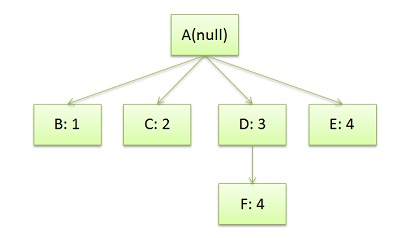
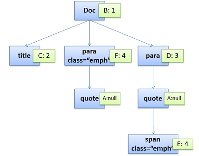

### 浏览器渲染原理

[TOC]


#### 什么是DOM

**文档对象模型**（英语：**Document Object Model**，缩写**DOM**），是[W3C](https://zh.wikipedia.org/wiki/W3C)组织推荐的处理[可扩展置标语言](https://zh.wikipedia.org/wiki/可扩展置标语言)的标准编程接口。它提供了对文档的结构化的表述，并定义了一种方式可以使从程序中对该结构进行访问，从而改变文档的结构，样式和内容。

DOM 将文档解析为一个由节点和对象（包含属性和方法的对象）组成的结构集合。简言之，它会将web页面和脚本或程序语言连接起来。

#### 浏览器工作大流程

浏览器工作流程：构建DOM -> 构建CSSOM -> 构建渲染树 -> 布局 -> 绘制。


1.浏览器会解析三个东西：

- 一个是HTML/SVG/XHTML，事实上，Webkit有三个C++的类对应这三类文档。解析这三种文件会产生一个DOM Tree。

- CSS，解析CSS会产生CSS规则树。

- Javascript，脚本，主要是通过DOM API和CSSOM API来操作DOM Treed和CSS Rule Tree.

2.解析完成后，浏览器引擎会通过DOM Tree 和 CSS Rule Tree 来构造 Rendering Tree。注意：

- Rendering Tree 渲染树并不等同于DOM树，因为一些像Header或display:none的东西就没必要放在渲染树中了。

- CSS 的 Rule Tree主要是为了完成匹配并把CSS Rule附加上Rendering Tree上的每个Element。也就是DOM结点。也就是所谓的Frame。

- 然后，计算每个Frame（也就是每个Element）的位置，这又叫layout和reflow过程。

3.最后通过调用操作系统Native GUI的API绘制。


#### DOM解析

```html
<html>
<html>
<head>
    <title>Web page parsing</title>
</head>
<body>
    <div>
        <h1>Web page parsing</h1>
        <p>This is an example Web page.</p>
    </div>
</body>
</html>
```

上面这段html会解析成这样：


#### CSS解析

```html
<doc>
<title>A few quotes</title>
<para>
  Franklin said that <quote>"A penny saved is a penny earned."</quote>
</para>
<para>
  FDR said <quote>"We have nothing to fear but <span>fear itself.</span>"</quote>
</para>
</doc>
```

DOM Tree:


CSS文档：

```css
/* rule 1 */ doc { display: block; text-indent: 1em; }
/* rule 2 */ title { display: block; font-size: 3em; }
/* rule 3 */ para { display: block; }
/* rule 4 */ [class="emph"] { font-style: italic; }
```

CSS Rule Tree:



> 注意，图中的第4条规则出现了两次，一次是独立的，一次是在规则3的子结点。所以，我们可以知道，建立CSS Rule Tree是需要比照着DOM Tree来的。

通过这两个树，我们可以得到一个叫Style Context Tree，也就是下面这样（把CSS Rule结点Attach到DOM Tree上）：



#### 渲染

渲染的流程基本上如下：

1. 计算CSS样式
2. 构建Render Tree
3. Layout – 定位坐标和大小，是否换行，各种position, overflow, z-index属性 ……
4. 正式开画


> 注意：上图流程中有很多连接线，这表示了Javascript动态修改了DOM属性或是CSS属会导致重新Layout，有些改变不会，就是那些指到天上的箭头，比如，修改后的CSS rule没有被匹配到，等等。

#### Repaint（重绘）和Reflow（回流）

- Repaint——屏幕的一部分要重画，比如某个CSS的背景色变了。但是元素的几何尺寸没有变。

- Reflow——意味着元件的几何尺寸变了，我们需要重新验证并计算Render Tree。是Render Tree的一部分或全部发生了变化。这就是Reflow，或是Layout。（**HTML使用的是flow based layout，也就是流式布局，所以，如果某元件的几何尺寸发生了变化，需要重新布局，也就叫reflow**）reflow 会从<html>这个root frame开始递归往下，依次计算所有的结点几何尺寸和位置，在reflow过程中，可能会增加一些frame，比如一个文本字符串必需被包装起来。

任何会改变元素几何信息(元素的位置和尺寸大小)的操作，都会触发回流，

- 添加或者删除可见的DOM元素；
- 元素尺寸改变——边距、填充、边框、宽度和高度
- 内容变化，比如用户在input框中输入文字
- 浏览器窗口尺寸改变——resize事件发生时
- 计算 offsetWidth 和 offsetHeight 属性
- 设置 style 属性的值

```js
var s = document.body.style;
s.padding = "2px"; // 回流+重绘
s.border = "1px solid red"; // 再一次 回流+重绘
s.color = "blue"; // 再一次重绘
s.backgroundColor = "#ccc"; // 再一次 重绘
s.fontSize = "14px"; // 再一次 回流+重绘
// 添加node，再一次 回流+重绘
document.body.appendChild(document.createTextNode('abc!'));
```


#### 问题一：渲染过程中遇到JS文件怎么处理？

<u>JavaScript的加载、解析与执行会阻塞DOM的构建</u>，也就是说，在构建DOM时，HTML解析器若遇到了JavaScript，那么它会暂停构建DOM，将控制权移交给JavaScript引擎，等JavaScript引擎运行完毕，浏览器再从中断的地方恢复DOM构建。

也就是说，<u>如果你想首屏渲染的越快，就越不应该在首屏就加载 JS 文件</u>，这也是都建议<u>将 script 标签放在 body 标签底部</u>的原因。当然在当下，并不是说 script 标签必须放在底部，因为你可以给 script 标签添加 defer 或者 async 属性。


> ##### 1）情况1  `<script src="script.js"></script>`
>
> 没有 defer 或 async，浏览器会立即加载并执行指定的脚本，也就是说不等待后续载入的文档元素，读到就加载并执行。
>
> ##### 2）情况2`<script async src="script.js"></script>` (**异步下载**)
>
> async 属性表示异步执行引入的 JavaScript，与 defer 的区别在于，一旦JS下载完毕，就会开始执行。
>
> ##### 3）情况3 `<script defer src="script.js"></script>`(**延迟执行**)
>
> defer 属性表示延迟执行引入的 JavaScript，即<u>这段 JavaScript 加载时 HTML 并未停止解析，这两个过程是并行的</u>。整个 document 解析完毕且 defer-script 也加载完成之后（这两件事情的顺序无关），会执行所有由 defer-script 加载的 JavaScript 代码。与async不同的是，defer需要所有的js下载完毕，然后再顺序依次执行。
>
> defer 与相比普通 script，有两点区别：
>
> 1.载入 JavaScript 文件时不阻塞 HTML 的解析，执行阶段被放到 HTML 标签解析完成之后。
>
> 2.在加载多个JS脚本的时候，async是无顺序的执行（后面的script可能比前面的更快执行完毕），而defer是有顺序的执行（全部加载完成后才会顺序执行，因此前面的script一定先执行完毕）。

<u>JS文件不只是阻塞DOM的构建，它会导致CSSOM也阻塞DOM的构建</u>。

原本DOM和CSSOM的构建是互不影响，井水不犯河水，但是一旦<u>引入了JavaScript，CSSOM也开始阻塞DOM的构建</u>，只有CSSOM构建完毕后，DOM再恢复DOM构建。

这是因为<u>JavaScript不只是可以改DOM，它还可以更改样式，也就是它可以更改CSSOM</u>。前面我们介绍，不完整的CSSOM是无法使用的，但JavaScript中想访问CSSOM并更改它，那么在执行JavaScript时，必须要能拿到完整的CSSOM。所以就导致了一个现象，如果浏览器尚未完成CSSOM的下载和构建，而我们却想在此时运行脚本，那么浏览器将延迟脚本执行和DOM构建，直至其完成CSSOM的下载和构建。也就是说，**在这种情况下，浏览器会先下载和构建CSSOM，然后再执行JavaScript，最后在继续构建DOM**。

#### 问题二：为什么操作 DOM 慢

因为 DOM 是属于渲染引擎中的东西，而 JS 又是 JS 引擎中的东西。当我们通过 JS 操作 DOM 的时候，其实这个操作<u>涉及到了两个线程之间的通信</u>，那么势必会带来一些性能上的损耗。操作 DOM 次数一多，也就等同于一直在进行线程之间的通信，并且<u>操作 DOM 可能还会带来重绘回流</u>的情况，所以也就导致了性能上的问题。

#### 问题三：渲染页面时常见哪些不良现象？

**由于浏览器的渲染机制不同，在渲染页面时会出现两种常见的不良现象—-白屏问题和FOUS（无样式内容闪烁）**

FOUC：由于浏览器渲染机制（比如firefox），<u>在CSS加载之前，先呈现了HTML</u>，就会导致展示出无样式内容，然后样式突然呈现的现象；

白屏：有些浏览器渲染机制（比如chrome）要先构建DOM树和CSSOM树，构建完成后再进行渲染，如果<u>CSS部分放在HTML尾部，由于CSS未加载完成，浏览器迟迟未渲染</u>，从而导致白屏；也可能是把<u>js文件放在头部，脚本会阻塞后面内容的呈现</u>，脚本会阻塞其后组件的下载，出现白屏问题。


#### 推荐书籍

JavaScript DOM 编程艺术  https://github.com/linghuam/boutique-books/blob/master/b06-JS%E4%B8%8ENodeJS/JavaScript%2BDOM%E7%BC%96%E7%A8%8B%E8%89%BA%E6%9C%AF.pdf


#### 参考资料

浏览器的渲染原理简介： https://coolshell.cn/articles/9666.html
深入浅出浏览器渲染原理：https://blog.fundebug.com/2019/01/03/understand-browser-rendering/

