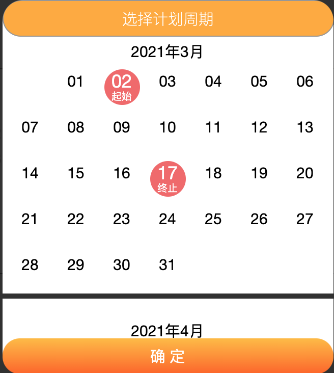
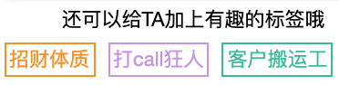
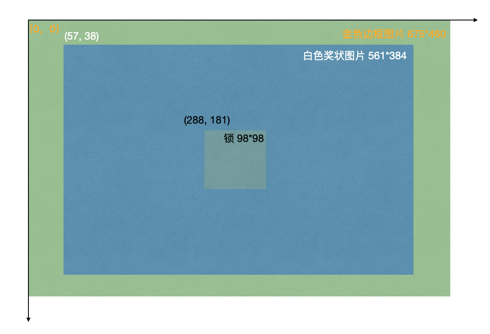
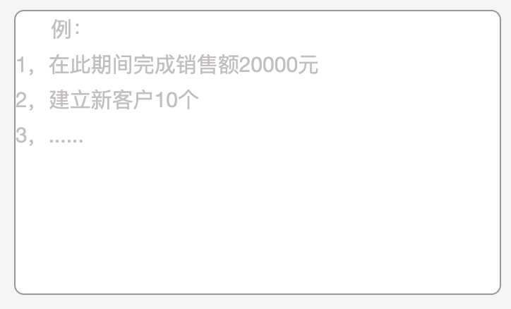
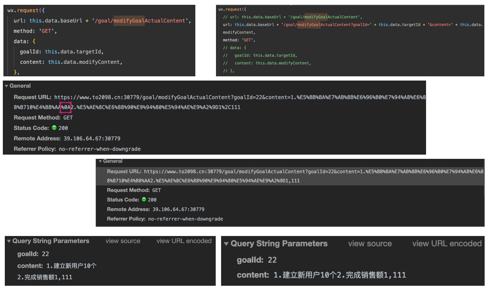

[TOC]

## 1.`wx:for`相关问题

### 1.1 `wx:for`嵌套循环：`wx:for-item` & `wx:for-index`

- [x] 问题产生原因：变量item和index复用。不指定的前提下，item表示本次循环的数据，index表示本次循环的下标。

- [x] 问题解决方案：使用`wx:for-item`和`wx:for-index`显式指明各自循环的名称。

- [x] 参考：[小程序多层嵌套wx:for](https://blog.csdn.net/zhanghuanhuan1/article/details/106186501/)：使用`wx:for-item`和`wx:for-index`指定各自的变量名称与index名称

​	1.在使用`wx:for`的时候，可以直接使用`item`和`index`获取循环的数据及下标

```html
<view wx:for="{{firstList}}" wx:key="index">{{item}}和{{index}}</view>
```

​	2.在使用嵌套`wx:for`循环的时候，因为初始的item和index名称都是一样的，因此是按照最近声明使用，及最靠近的一层`wx:for`的元素和下标。这时候如果想要用到外层的数据就没办法。因此这时候需要指定各自的item名称和下标index名称。

```html
<view wx:for="{{firstList}}" wx:for-item="first_item" wx:for-index="first_index" wx:key="first_index">
  <text>{{first_item.name}}</text>
  <text wx:for="{{first_item}}" wx:key="index">{{item}}</text>
</view>
```

```js
Page({
  data: {
    firstList: [
      {name: 'sam', tags: ['美丽', '大方', '智慧']},
      {name: 'peti', tags: ['稳重', '认真']}
    ],
  }
})
```

​	如上，那么就能实现上面的二维数组所有元素的展示了。

​	当然，其实最好的是第二层也显示指定好其item和index的名称。

```html
<view wx:for="{{firstList}}" wx:for-item="first_item" wx:for-index="first_index" wx:key="first_index">
  <text>{{first_item.name}}</text>
  <text wx:for="{{first_item}}" wx:for-item="second_item" wx:for-index="second_index" wx:key="second_index">{{second_item}}</text>
</view>
```

### 1.2 `wx:for`循环产生的元素`数据传递`及`内部组件特殊样式指定`(动态绑定class)

- [x] 问题产生原因：循环产生的元素在样式上是一致的，但是有时候希望某些元素有不一样的样式。并且有时候需要获取某一个元素的某些数据。
- [x] 问题解决方案：`data-name`传递参数，使用插值`{{}}`和三目运算符判断按需渲染。

​	1.`data-name`传递参数。

```html
<view wx:for="{{list}}" wx:key="index" bindtap="handleClick" data-index="{{index}}">{{item}}
</view>
<!-- 
data-index传过去的变量就是index
data-whatever传过去的变量就是whatever
data-realName传过去的变量就是realname (注意都是小写)
-->
```

```js
Page({
  data: {
    
  },
  
  handleClick(e) {
		// e.currentTarget.dataset.index 即从组件中传过来的参数 index
    // !!!!!!!!!!!!!!!!!!!!!!!!!!!!!!!!!!!!!!!!!!!!
    // 需要注意的是，参数传过来之后全部都是小写，比如data-realName="{{item}}"
    // 接收的时候是e.currentTarget.dataset.realname
    // 因此建议都用小写，以免出错
    // !!!!!!!!!!!!!!!!!!!!!!!!!!!!!!!!!!!!!!!!!!!!
    console.log(e); //下图是打印出来的数据
  },
})
```


****

​	2.循环内部元素指定特殊样式。**权重、状态管理数组及`wx:key`。**

​	关于制作日历、tag选中的整个过程，更加详细地见`0.2定制化组件汇总`。

​	为循环内部的某些组件指定特殊样式的核心在于：**使用插值`{{}}`和三目运算符判断按需渲染**。使用三目运算符是动态绑定class的第一种方式。

​	但是用来判断的这个变量的设计就比较重要。该判断变量主要是利用该组件的数据特殊性来形成，比如在生成一个日历之后，每一个日期的年月日构成了一个特殊字符，这个特殊字符有唯一性。这种方式我称之「**权重**」。



```html
<!-- 传递生成权重的数据 -->
<view class="calendar-card_content_view">
	<view 
	wx:for="{{monthList}}" 
	wx:for-item="date" 
	wx:for-index="date_index" 
	wx:key="date_index" 
        
	data-year="{{year}}" data-month="{{monthList_index+1}}" data-date="{{date}}"
	bindtap="chooseDate"
        
	class="{{preYear*10000+monthList_index*100+100+date*1 === startTimeWeight?'calendar-choosen-style':''}} {{preYear*10000+monthList_index*100+100+date*1 === endTimeWeight?'calendar-choosen-style':''}}" 
	>
	<text>{{date}}</text>
</view>
```

```css
.calendar-choosen-style {
  background: #F16969;
}
```

​	方便讲解，去掉其他比较复杂的，包括点击之后字体也应该变成白色；由于原理一样，这里就留下需要讲解的关于红色背景的部分。重点分成2步。第一步，生成权重；由于这里需要锁定起始、终止两个，因此要生成两个权重分别去对应；原理一致，只讲解起始。

```js
// page.js
Page({
  data: {
    // 权重
    startDateWeight: '',
    
    // 记录数据
    targetStartTime: '',
  },
  
  chooseDate(e) {
  	// 通过传递来的年月日生成一个唯一识别字符串
    var year = e.currentTarget.dataset.year;
		var month = e.currentTarget.dataset.month;
		var date = e.currentTarget.dataset.date;
    var time = year + '.' + month +'.'+ date;
    var timeWeight = year*10000 + month*100 + date*1; //e.g 20200102
    // 由于即时渲染，一定要用setData({})
    this.setData({
			targetStartTime: time,
			startTimeWeight: timeWeight,
		})
	},
})
```

​	使用`setData`改变了数据之后，前端中的插值语句就会即时判断，找到判断为true的组件中按需设定。`{{exp1?exp2:exp3}}`意思是：`exp1的判断为真假`？判断为真则执行`exp2`，判断为假则执行`exp3`。因此在唯一标识符相同的情况下，会设置其`class="calendar-choosen-style"`。

```html
<view
	class="{{year*10000+monthList_index*100+100+date*1 === startTimeWeight?'calendar-choosen-style':''}}">
</view>
```

​	可以看到日历由于选中的个数可以确定，只要两个（按需可能一个，日计划只要一个）。其个数是可以轻易穷举的，因此可以通过`if语句`来轻易判断。点击一次，就设置一下权重；如果再点击相同一个，就把权重置空。然而有一些不能确定的，比如有很多tag，点击选中之后就要记录其选中状态，被选中的tag个数不定，这时候就需要有一个「**状态管理数组**」。

​	



```js
Page({
  data: {
    tags: ['招财体质', '打call狂人', '客户搬运工'],
    tagsStatus: [false, false, false],
    
    tagsChoosen: [],
		tagsColor: ['#F79306', '#C891E8', '#31BC95', '#E81E9C'],
  },
  
  // 生成同等长度数组 管理状态
  generateTagsStatus(tags) {
    var tagsStatus = [];
    for(let i=0; i<tagsStatus.length; i++) {
      tagsStatus.push(false);
    };
    return tagsStatus;
  },
  
  // 一般tags都会从后端获取，在获取的success里面生成更妥当
  getTagsDefault() {
    var that = this;
    wx.request({
      url: '....',
      success(res) {
				var status = that.generateTagsStatus(res.data.data);
        that.setData({
          tags: res.data.data,
          tagsStatus: status,
        })
      }
    })
  },
  
  // 获取被选取的tags => tagsChoosen
  getTagsChoosen() {
    var tagsChoosen = [];
    for(let i=0; i<tagsStatus.length; i++) {
      if(tagsStatus[i] === true) {
        tagsChoosen.push(this.data.tags[i]);
      }
      this.setData({
        tagsChoosen: tagsChoosen,
      });
    }
  },
})
```

```html
<text class="{{tagsStatus[index] === true?'choosen-tag':'not-choosen-tag'}}" style="border: 1px solid {{tagsColor[index]}}" wx:for="{{tags}}" wx:key="index"></text>
```

​	状态管理数组及生成一个和`wx:for="{{list}}"`中`list`同等长度的数组管理。注意要即时渲染，不然前端的变化不会即时更新。其中`style="border: 1px solid {{tagsColor[index]}}"`是动态绑定class的第二种方法，即先在`js文件`中定义好变量名，再直接插值渲染；第一种是**三目运算符**——归结起来都是**插值运算**。

###### Q：个人感觉`wx:key`也有用处，是不是就和权重一样？还是在js中可以锁定到这个元素进行改变，就跟设定了id一样？

****

### 1.3 `wx.for`中实现循环中`<image>`几张图片覆盖


如上图，是三张图片的覆盖：金色外框（中空）、白色奖状内容、lock-icon。

#### 利用margin-top为负数调整位置(out)

- [x] 这种方法其实不太好把控，包括间隙、包括图片大小要求等等，建议利用定位方式

> 金色边框的margin-top位移情况根据中空调整；
>
> lock-icon.png则要根据金色边框的高度进行调整（500rpx)。

```html
<view class="award-image-view">
	<image class="award-image-0" src="{{item.gloryUrl}}" data-item="{{item}}"
        style="filter: blur(3px);" bindtap="gotoAwardDetail"></image>
	<view style="margin-top: -470rpx; z-index:99;" >
		<image src="/images/award-border.png" style="width: 686rpx; height: 500rpx;"></image>  
	</view>
	<view style="margin-top: -500rpx; z-index: 999;">
		<image src="/images/lock-icon.png" style="width: 686rpx;"></image>  
	</view>
</view>
```

```css
/* 这里主要是把照片居中 */
.award-image-view {
  display: flex;
  flex-direction: column;
  justify-content: center;
  align-items: center;
  margin-top: 20rpx;
}

.award-image-0 {
  width: 650rpx;
  height: 460rpx;
}
```

1. 利用`margin-top = -470rpx`达到照片重叠的作用。这里要注意：最后的照片(即`lock-icon.png`)决定了下一个元素将从哪里开始计算。for循环产生的下一个元素的`top`将按照`lock-icon.png`所在的`view`的底部开始算。因此要保证`lock-icon`的图片大小覆盖了整个父级view。最好保证所有的覆盖照片的大小一致。
2. 模糊效果的`z-index`较高，因此如果不想白色奖状被金色边框的部分显露出来，就要用`z-index`管理好三张照片的层级。

​	对于第1点的解释，假如最后放置`lock-icon.png`大小较小的情况进行分析：


> 注意上图`lock-icon.png`所在的`<view>`作为最后一个，它的`bottom`就是下一个元素的`top`，因此会影响下一个view的`top`。如果想要下一个view的样式正常，那么就要注意照片的高度。因此最好使得所有的照片的大小一致。

​	这是理论上没有出现问题的情况，实际上把`<image>`放在`<view>`里的时候，会出现容器内部间隙：


​	如上左图：`image`并没有完全填充整个`view`，那么使用`margin-top: minus rpx;`的时候就会产生不精确的覆盖，这个问题参考：[小程序 image跟view标签上下会有间隙](https://www.jianshu.com/p/dc590c9b2695)。在`image`中设置`display: block` 或者`vertical-align: bottom`即可。抑或者在`view`中设置 `font-size: 0`。关于`vertical-align`更加详细的解读，参考`../css/0.css问题汇总.md/6.vertical-align怎么使用？`。

> 底边产生间隔的原因：图片文字等inline元素默许是跟父级元素内容的baseline（默认为元素的底）对齐，而baseline又和父级底边有必定间距。
>
> 
>
> 另一种现象是，几个元素排列的时候，左右会有间隔（如上图text和右侧有间隔），原因是：这个问题产生的原因是换行引起的，因为我们写标签时通常会在标签结束符后顺手打个回车，而回车会产生回车符，回车符相当于空白符，通常情况下，多个连续的空白符会合并成一个空白符，而产生“空白间隙”的真正原因就是这个让我们并不怎么注意的**空白符**。因此设置`font-size: 0`，让这些空白符也不占位置即可。

```css
/* wxss */
.image {
  display: block;
}

.image {
  vertical-align: bottom;
}

.view {
  font-size: 0;
}
```

#### 利用定位`position: relative/absolute`重叠(choose this!)



​	在使用`position`定位之前，首先需要知道，设置`position: absolute;`后，其所参考的坐标系是由`最近设定的position: relative的父级单位`为参考，如果一级父容器没有设置，那么就参考二级父容器，一直循环，直到page页面容器为最高级父容器。那么在实现这样的重叠效果的时候，就可以先定义一个父级单位为`relative`，同时设置好该父级单位的大小（因为下一个元素的`top`为该元素的`bottom`）。最后注意一下前后的层级`z-index`的分配即可。参考`../css/0.css问题汇总.md/position的absolute,relative和fixed`。

```html
<view class="pic">
  <image class="pic__lace" src="图片的外边框金色条"></image>
  <image class="pic__content" src="图片的中间内容"></image>
  <image class="pic__lock" src="加锁的图片"></image>
</view>
```

```css
.pic {
  position: relative;
  width: 675rpx;
  height: 460rpx;
  margin: 0 50rpx; /* 居中 */
}

.pic__lace {
  position: absolute;
  top: 0;
  left: 0;
  z-index: 3;
}

.pic__content {
  position: absolute;
  top: 57;
  left: 38;
  z-index: 2;
}

.pic__lock {
  position: absolute;
  top: 288;
  left: 181;
  z-index: 3;
}
```

****

## 2. text相关

### 2.1 `text`换行

​	`text`展示内容的时候，遇到换行符想要正确换行需要设置两个属性：`space`和`decode`。参考[text文本换行](https://developers.weixin.qq.com/community/develop/doc/00024aad6086388dad4b3256f5b800)。

```html
<text space="{{true}}" decode="{{true}}">{{textContent}}</text>
```

****

### 2.2 `textarea`的`placeholder`换行

- [x] 微信小程序的`textarea`不支持对`placeholder`内容进行换行展示，因此需要自定义该样式。
- [x] 解决方式：在真正的`textarea`背后一层写一个`text`，输入内容之后让`text`的`placeholder`消失，就可以实现需求。参考[textarea placeholder换行](https://www.cnblogs.com/wangmeijian/p/6953813.html)。

```html
<textarea class="target-content-input" placeholder="" maxlength="-1" model:value="{{targetContent}}" bindinput="fillTargetContent" disabled="{{showCompleted}}"></textarea>
<view class="place-holder-hover_view">
	<text class="place-holder-hover_text" space="{{true}}" decode="{{true}}">{{targetContent.length === 0?'例：\n1，在此期间完成销售额20000元\n2，建立新客户10个\n3，......':''}}</text>
</view>
```

```css
/* textarea的样式 */
.target-content-input {
  width: 670rpx;
  height: 400rpx;
  margin: 0 40rpx;
  background: none;
  color: black;
}

/* hover在输入框表面的placeholder - 实现换行 */
.place-holder-hover_view {
  margin: -400rpx 30rpx 0 30rpx;
  height: 400rpx;
  background: white;
  border: 1px solid #979797;
  border-radius: 7px;
  z-index: -1;
}

.place-holder-hover_text {
  color: #C3BFBF;
  font-size: 30rpx;
  margin: 50rpx 0 0 50rpx;
}
```



​	如图，所能看到的所有样式都是`text`负责展示，并且把`z-index`放置在`textarea`的背后，点击这一部分区域的时候实际上操作的是`textarea`；使用插值语句的三目运算符判断，当`textarea`开始输入内容的时候，`text`的文字内容就变成空。

****

### 2.3 微信小程序textarea输入了换行符保存：使用了wx.request的body就没事，使用了拼接就有问题（GET）？


- [x] 尚且疑惑：按道理使用body最后还是变成了拼接传输过去，莫非是系统帮忙实现的`body=>拼接`这个过程，对其中的一些换行符`\n`进行了不知名替换，这些替换在query的时候反而让换行符保存了下来？而正常用拼接方式，query不允许换行符的存在？
- [x] 目前解决方案：明确使用好body和拼接这两种方式，不要混用。参考：[都 2019 年了，还问 GET 和 POST 的区别](https://blog.fundebug.com/2019/02/22/compare-http-method-get-and-post/)。



> 1.POST一般是用body方式的。除非是要求声明`parameterType`要用拼接`query`。
>
> 2.GET无所谓用body还是query，但是为了保证有效性，**以后统一用body最好**。

****

### 2.4 文字右上角添加`提示小红点`

​	参考：[小程序文字右上角加红点](https://www.jianshu.com/p/336a7e867bde)。如果想要在tabbar显示小红点，使用微信小程序官方接口`wx.showTabBarRedDot`即可。

```html
<text class="add-dot">文本</text>
```

```css
.add-dot {
  position: relative;
}

.add-dot::after {
  contetn: '';
  position: absolute;
  right: -8rpx;
  top: -3rpx;
  width: 12rpx;
  height: 12rpx;
  background-color: red;
  border-radius: 50%;
}
```

****

## 3.`scroll-view`相关

### 3.1 取消侧边滚动条

​	参考[微信小程序 -- 去掉scroll-view滚动条（测试有效）](https://blog.csdn.net/qq_41638795/article/details/98172326)，直接设置其css样式即可。

```css
scroll-view ::-webkit-scrollbar {
  width: 0;
  height: 0;
  color: transparent;
  display: none;
}

/* 注意::前面的空格 */
```

****

### 3.2 scroll-view下拉刷新 - 官方接口及自定义实现

下拉刷新有两种方式，一种是使用`refresher`，一种是触顶（触底同理）。

​	1.refresher：官方提供的下拉刷新接口。如果不想要用官方的样式的话，可以自定义。

| 属性                    | 作用                                                         |
| ----------------------- | ------------------------------------------------------------ |
| refresher-enable        | 设置为`{{true}}`可使用                                       |
| refresher-threshold     | 下拉刷新阈值`default=45`                                     |
| refresher-default-style | 样式`black/white/none`                                       |
| refresher-background    | 自定义背景颜色                                               |
| refresher-triggered     | 下拉之后会变成`true`，如果想要隐藏需要手动修改成`false`      |
| bindrefresherrefresh    | 下拉到触发阈值后停止下拉触发的handle函数 `='refreshFunction'` |
| bindrefresherpulling    | `下拉`动作持续触发，只要保持下拉就一直触发                   |
| bindrefresherrestore    | 恢复到初始状态触发                                           |
| bindrefresherabort      | 下拉动作没有到阈值即停止动作触发                             |

```js
// page.js
Page({
  data: {
    refreshTrigger: false,
  },
  
  refreshUpper() {
    // do something
  },
  
})
```

```xml
<!-- page.wxml -->
<scroll-view
	scroll-y="{{true}}"
	refresher-enabled='{{true}}'
	refresher-threshold='45'
	refresher-default-style="white"
	refresher-triggered="{{refreshTrigger}}"
	bindrefresherrefresh="refreshUpper"
	style="height: 1000rpx;"
>
  <!-- 如果不想要使用官方样式：refresher-default-style="none" -->
	<view slot="refresher"></view>
</scroll-view>
```

​	2.触顶/触底：

​		`bindscrolltoupper`：触顶(横向则触左)，配合`upper-threshold`使用。如果想要产生`fresher`的下拉效果，可以设置`upper-threshold=-45`。

​		`bindscrolltolower`：触底(横向则触右)，配合`lower-threshold`使用。如果想要产生像`fresher`一样的效果，可以设置`lower-threshold=-45`。

​		但是！**经测试，设置阈值为负数只能在IOS系统中，因为安卓系统不支持触底后继续拖拽。**那么就需要用另一种方式来实现：

```js
// page.js
Page({
  data: {
    loadNextPage: false,
  },
  
  loadNeatPage() {
    // 假如是首次触底，展示“加载下一页”的提醒文字内容
    if(this.data.loadNextPage === false) {
      this.setData({
        loadNextPage: true,
      })
    } else {
      this.loadMoreData();
      // 当然，如果还想要保持首次触底才展示提示文字，就需要在刷新了下一页之后重置
      // 这部分内容可能还根据上拉刷新、重新筛选等，也需要按需重置loadNextPage: false,
      this.setData({
        loadNextPage: false,
      });
    }
  },
  
  loadMoreData() {
    // 加载下一页的内容
  }
  
})
```

```xml
<!-- page.wxml -->
<scroll-view
	scroll-y="{{true}}"
	style="height: 1000rpx;"
	bindscrolltolower="loadMoreQuest" lower-threshold="15"
>
  <text wx:if="{{loadNextPage}}">下拉加载下一页</text>
</scroll-view>
```

​		整体的思路是绑定的触底函数添加判断，第一次触地那么就在`scroll-view`后续继续添加内容，在二次触地才真正执行内容。比如上述的方式：在第一次触底添加`<text>`，然后再继续下拉，实现加载下一页的功能。这样子就不会用户突然没反应过来就直接加载了下一页。

​		还可以进一步改善这个函数，比如加载下一页发现下一页已经没有内容了，就可以使用插值管理提醒的文本内容，并且按照文本内容按需判断是否执行`loadMoreData`的函数。

```js
// page.js
Page({
  data: {
    loadNextPage: false,
    loadNextPageText: '下拉加载下一页'
  },
  
  loadNeatPage() {
    if(this.data.loadNextPage === false) {
      this.setData({
        loadNextPage: true,
      })
    } else {
			if(loadNextPageText === '下拉加载下一页') {
        this.loadMoreData();
      } else {
        this.setData({
          loadNextPageText: '没有更多数据啦',
        })
      }
    }
  },
  
  loadMoreData() {
    // 加载下一页的内容
    // 由于loadNextPageText可能在某一次操作中变成"没有更多数据啦"
    // 因此在成功加载了下一页数据或者重新进行筛选成功的时候，需要重置loadNextPageText
    (success) => {
      this.setData({
        loadNextPage: false,
        loadNextPageText: '下拉加载下一页',
      })
    }
  }
})
```

- [ ] swipper 轮播组件（类似于preview几个图滑来滑去），类似scroll-view中的`paging-enable`属性。

****

### 3.3 指定高度：变量管理组件样式 & rpx

[微信小程序 - rpx和px互转，以及系统给的 pixelRatio 值比例不对](https://blog.csdn.net/zz00008888/article/details/109023879)

先要理解手机各个元素的关系，详情可以查看本文的`4. 自定义navigationBar`。

由于`scroll-view`需要指定固定的高度，因此需要用一致的单位管理页面组件，这样才能获取剩下的可分配高度然后给`scroll-view`的`style= "height: xx rpx;"`进行管理。因此就需要学会`1.rpx于px的转化规则`，`2.屏幕窗口操作内容的关系`，`3.变量管理元素样式`。

>  微信小程序将所有的屏幕的宽度都规定成**750rpx**。转换比`devicePixelRatio = 750/ px值`。比如手机宽度是375px，那么`dpr = 2`。
>
>  但是`wx.getSystemInfo`返回的`dpr`是整数（精确度不够），最好的方式还是通过获取屏幕的宽度`windowWidth`然后通过`dpr = 750/ windowWidth`来计算得出，这样更贴近真实的比例。

> 自定义`navigationBar`的话，`windowHeight`的高度实际上就是总的屏幕高度`screenHeight` - `原生组件tabBarHeight`。根据`wx.getSystemInfo`接口返回，`screenHeight`和`windowHeight`都会返回。

​	变量管理的主要方式是，在元素的`style`管理宽度高度，通过渲染时变量计算从而得到剩余部分高度。比如`scroll-view`必须指定固定高度，就可以采用这样的变量管理方式。在本问题的最后还有一个需要注意的问题。

> 以一个简单的例子：`自定义navBar`+`原生tabBar`
>
> 
>
> 在看代码之前，需要注意的是，`windowHeight`和`navBarHeight`都是通过`wx.getSystemInfo`直接或间接得到，其单位都是`px`，但是一般在管理小程序的组件的时候，都会使用`rpx`来适配不同的手机，因此在使用变量管理组件之前，要明确哪些变量是`px`，需要通过转化变成`rpx`。其中需要`devicePixelRatio`，这个参数也可以通过`wx.getSystemInfo`直接得到，但是为了得到的参数更加贴近实际(系统返回的会对多余的位数进行取舍操作，因此会不够精确)。
>
> 微信小程序都默认设置`width = 750rpx`，因此可以使用`dpr = 750 / windowWidth`得出。`dpr`直接在页面的`onLoad()`中实现获取即可。得到dpr后，具体使用的时候要注意`rpx = px * dpr`。
>
> 由于涉及到`wx.getSystemInfo()`以及`app.globalData`的使用，代码只记录具体变量如何管理元素。
>
> 现在看代码：
>
> ```js
> // page.js
> Page({
> data: {
>  // 最外层
>  windowDomHeight: '', //这里是通过系统返回参数直接获取，单位是px
>  navBarHeight: '', //这里是通过系统返回参数间接获取，单位是px
>  // 系统返回是px => 需要转换 rpx = px * dprWidth
>  userInfoHeight: '300', //自己管理，单位rpx
>  topTitleHeight: '50', //自己管理，单位rpx
> 
>  // 一些内层的组件参数，都是自己管理，单位rpx
>  // 用户头像的长宽
>  avatarHeight: '240', 
>  avatarPadding: '30', 
>  // 保证用户头像居中
>  avatarPadding: '50',
>  // 登录按钮高度
>  loginButtonHeight: '300', 
> 
>  // dpr
>  dprWidth: '2', //需要在onLoad加载的时候通过获取系统信息计算得出
> }
> })
> ```
>
> ```html
> <!-- 
> page.wxml
> <navbar>是自定义组件，其高度是navBarHeight
> -->
> 
> <view>
> <navbar page-name=""></navbar>
> <view class="user-information-view" style="height: {{userInfoHeight}}rpx;">
>  <view class="user-avatar-view" style="padding: {{avatarPadding}}rpx; ">
>    <image class="user-avatar" src="{{avatarImage}}" style="height: {{avatarHeight}}rpx; width: {{avatarHeight}}rpx; ">
>    </image>
>  </view>
>  <view class="login-button-view" style="height: {{loginButtonHeight}}rpx;">
>    <button class="login-button" type="primary" open-type="getUserInfo" bindgetuserinfo="clickLoginButton">
>      登录/注册</button>
>  </view>
> </view>
> <view class="award-content-view">
>  <view class="top-title-view" style="height: {{topTitleHeight}}rpx;">
>    <text class="top-title-text">我获得的奖项</text>
>  </view>
>  <scroll-view class="award-scroll-view" scroll-y style="height: {{(windowDomHeight-navBarHeight) * dprWidth - userInfoHeight - topTitleHeight}}rpx;">
>    <view class="scroll-show-view" wx:for="{{imageList}}" wx:key="index">
>      <view class="award-title">
>        <text class="award-title-text">{{item.imageName}}</text>
>      </view>
>      <view class="award-image">
>        <image src="{{item.imageUrl}}"></image>
>      </view>
>    </view>
>  </scroll-view>
> </view>
> </view>
> ```

​	最后需要注意的问题是，虽然都采用了变量赋值的方式，还是可以产生屏幕滑动的效果。即按照逻辑上来说，所有的变量总和=屏幕总高度，但是实际情况是所有组件的高度之和>屏幕总高度。这是因为在赋值的时候，内容高度>赋值高度，比如：

```js
// page.js
data: {
  viewHeight: 10,
}
```

```html
<!-- page.wxml -->
<view style="height: {{viewHeight}}rpx;">
  <text style="height: 20rpx"></text>
</view>
```

​	实际计算的时候应该`-20`，但是计算的时候用的是`viewHeight: 10`，因此少减了，导致组件总体高度更大。因此变量管理的时候要注意每一个组件，包括其内部组件。还有就是`margin`和`padding`有时候也会产生奇怪的影响， debug的时候如果实在找不出问题可以看看组件之间的`margin`和`padding`。

****

## 4.button文本居中、button嵌入图像


​	如图，要注意三个方面：1.文本上下居中 2.文本侧边的logo图片 3.按钮背景图片

### 4.1 文本居中：`height`+`line-height`配合使用

​	文本默认居中`line-height`，因此除了设置button的高度`height`之外，还要设置`line-height`为同等高度才能保证文本竖直居中。参考[button文本居中](https://blog.csdn.net/weixin_40087279/article/details/81358364)：注意设置文本高度和button高度一致。

```html
<button style="height: 40px; line-height: 40px;"></button>
```

****

### 4.2 button嵌入图像

- [x] 想要在button中嵌入图像，直接按照正常的子组件嵌入即可。

```html
<button>
	<view>
		<image src="/images/save-icon.png"></image>
	</view>
	<view>
		<text>保存到图片</text>
	</view>
</button>
```

****

## 5. 背景图片/颜色

### 5.1 `wxml`中管理背景为本地图片: `background-image`配合`background-size`使用

- [x] 图片链接必须放在`wxml`中渲染管理，如果放在样式管理文件`wxss`中是无法成功的。同时要注意`background-image`和`background-size`搭配使用。参考[CSS让背景图片填满DIV](https://blog.csdn.net/qq_29656961/article/details/80158778)：微信小程序不能再wxss中读取本地图片，就在wxml中管理。
- [x] 使用`background-image: url('本地图片')`的时候，手机端无法正常加载；建议使用网络图片。利用`wx.getImageInfo`获取后可以记录其临时路径。

```html
<view style="background-image: url('/images/red-bgd.png'); background-size: 140px 40px;"></view>
```

- [x] 如果只是单纯的颜色设定，那么可以在`wxss`中直接管理

```html
<view class='red-bgd'></view>
```

```css
.red-bgd {
	background: #C30F23;
}
```

****

### 5.2 背景渐变色

```css
.gra {
	background-image: linear-gradient(#FFBC39, #FE651A);
}
```

****

## 6.动态管理样式

### 6.1 js变量渲染到wxml中

### 6.2 插值`{{}}`+三目运算符`exp1?exp2:exp3`(&三目运算符嵌套)


