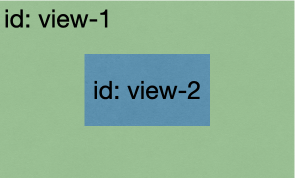

[TOC]

### 0. 微信小程序的异步/同步问题

​	**放在最前**

​	小程序由于很多操作都要等待，在等待图中所有操作都是异步的，也就是后面的代码内容如果需要这个等待之后产生的数据，那么有可能不能拿到。比如`wx.request`去获得数据，需要一段时间才能获取成功。比如下面：

```js
data: {
  res: 'default',
}
wx.request({
  ... //省略
  success(res){
  	// res = 'success';
		this.setData({
  		res = res;	
		})
	}
})
console.log(this.data.res); // 这里可能log出来的是default
```

​	因此特别需要注意微信小程序的异步问题。有问题的时候多想想是否有异步情况。

#### 0.1 发送请求：promise管理同步

[promise resolve()的用法](https://www.jianshu.com/p/5b0b89bf4664)

****

#### 0.2 app.js中onLaunch设置全局数据比page.js中onLoad执行更慢的异步问题

​	重点是：`app.onLaunch`应该是先执行，但并不一定比`page.onLoad`先结束。

​	如果`page.onLoad`里面有一些需要等待`app.onLaunch`改变的值(wx.request)，就会产生风险；可能在`page.onLoad`中已经执行到需要的值，但是`app.onLaunch`还没走到那一步。

#### 0.3 `storage`异步和`storageSync`同步

​	参考：[微信小程序 - wx.setstoragesync和wx.setstorage的区别](https://blog.csdn.net/idomyway/article/details/99481361)。

****

### 1. 数据传递/函数复用

#### 1.1 `this.setData()`必要性

​	改变一个数据的时候有两个方式，一个是使用`this.data.dataname`，一个是使用`this.setData({})`。先强调一个必要性：**`this.data`可以获取内部数据和属性值；但直接修改它不会将变更应用到界面上只有通过`this.setData`改变的数据能够在插值语法中即时更新。**

​	比如我们现在需要展示一个文本，并且点击之后更换文本数据。

```html
<text bindtap="click">{{content}}</text>
```

```js
Page({
  data: {
    content: 'content',
  },
  
  click(e) {
    this.data.content = 'change'; //这种方式不会即时渲染到页面
    this.setData({
      content: 'change',
    }) // 这种方式，点击后页面的文字立即由content变成change
  }
})

```

​	由于`this.setData`不能改变其中某一个，比如你想改变数组，就要混合两种方式。

```js
Page({
  data: {
    list: [false, false, false],
  },
  
  changeOne() {
    list = this.data.list;
    list[1] = true;
    this.setData({
      list: list,
    })
  }
})
```

****

#### 1.2 `data-dataname`完成`wxml`和`js`函数的传递

​	该内容参考`./0.1小程序布局问题汇总.md/1.wx:for的相关问题 => 1.2`。

****

#### 1.3 带参跳转页面 及 路径路由管理

- [x] 路径路由管理，直接`/`就可以指定为根目录，比如想要获取某一个page，就可以`/pages/pageName/pageName.js`，也可以通过相对路径慢慢跳；如果指定图片位置，也可以`/images/1.png`来指定。 但是如果用`require`引入的话，只能使用相对路径。

- [x] 带参跳转直接通过拼接的方式。

  > ```js
  > Page({
  >   data: {
  >     name: 'me',
  >     sex: 'male',
  >   },
  >   
  >   toAnotherPage() {
  >     wx.navigateTo({
  > 			url: '/pages/getPage/getPage?name='+this.data.name+'&sex='+this.data.sex,
  > 		});
  >   },
  > })
  > ```

****

#### 1.4 `globalData`及`localStorage`

- [x] 使用`globalData`还是`localStorage`？

​	1.`globalData`在`app.js`中定义使用，在其他页面的时候也可以使用。步骤就是在`app.js`中定义好`globalData`，在使用的页面的时候先`var app = getApp()`，再按照`app.globalData.dataname`使用即可。

```js
// app.js
App({
  globalData: {
    windowHeight: '', 
  },
  
  onLaunch() {
    this.getWindowHeight();
  },
  
  getWindowHeight() {
    wx.getSystemInfo({
      success(res) {
        this.globalData.windowHeight = res.windowHeight;
      }
    })
  },
})
```

```js
// page.js
const app = getApp();

Page({
  data: {
    windowHeight: '',
  },
  
  onLoad() {
    this.setData({
      windowHeight: app.globalData.windowHeight,
    })
  },
})
```

​	2.localStorage，可以存储在本地，即时关闭了小程序还是会储存 - `globalData`是在小程序运行的时候有的数据。类似于用户信息，就可以使用本地存储的方式，这样就不用每次运行都重新获取。理解参考：[微信小程序从入门到精通（二） 小程序的能力](https://blog.csdn.net/wlwlwlwl015/article/details/79125921)以及[深入理解cookie](https://www.jianshu.com/p/6fc9cea6daa2)。**注意，如果要更改部分内容，要覆写整个key值，而不能想数组一样只改变某一个；正确做法是提取出来，改变，然后重新设置缓存。**

- [x] 使用方式：`wx.setStorageSync('userId', '1');`存储；`var openId = wx.getStorageSync('userId') || null;`，如果没有获取到localStorage就会返回null。

​		早期的移动web开发中本地存储只能用**cookie**的方式解决，但是cookie大小限制在**4K**，而且某些浏览器还存在cookie个数限制，而后随着H5的发展本地存储可以通过**localStorage**这个东东解决，但也仅是IE8以后才能支持，大小有**5M**，这就解决了很大一部分的存储容量问题。

​		微信小程序的官方文档中说了：同一个微信用户，同一个小程序 storage 上限为 10MB。

> ```js
> // 展示本地存储能力
> // 如果是首次启动，wx.getStorageSync('logs' )的值就是0或null，那么就返回一个空数组
> var logs =wx.getStorageSync('logs') || []
> logs.unshift(Date.now())
> wx.setStorageSync('logs', logs)
> ```
>
> 1. 如上所示，调用了**wx.getStorageSync**和**wx.setStorageSync**这2个API，这就是小程序为我们提供的**本地存储API**
> 2. `wx.setStorageSync(key, data)`：将 data 存储在本地缓存中指定的 key 中，会覆盖掉原来该 key 对应的内容，这是一个**同步**接口。
> 3. `wx.getStorageSync(key)`：从本地缓存中同步获取指定key对应的内容。

****

#### 1.5 复用函数：插值渲染使用函数(`wxml`中使用脚本文件)及`js`中引入`util.js`

- [x] 问题产生：想要在插值`{{}}`即时运算得出结果，但是无限循环小数的时候无法按需展示一部分。

- [x] 解决方案：在`wxs`定义函数，在`wxml`中使用函数，按需保留。参考：[小程序界面渲染数据计算 小程序界面渲染保留小数](https://blog.csdn.net/qq_39425864/article/details/84251359)。

​	第一步导出`module.exports = {}`，第二步引入`var objectName = require('util.js')`。

​	在`js`中使用`util.js`文件，可以使用提取出来的复用函数；

```js
const utils = require('/utils/util.js'); // 路由路径
```

```js
// util.js
const formatNumber = n => {
  n = n.toString()
  return n[1] ? n : '0' + n
}

module.exports = {
  formatNumber: formatNumber,
}
```

​	在`wxml`中使用`utils.wxs`文件，可以使用想要在渲染过程中使用的函数；

```html
<wxs src="/utils/util.wxs" module="tools"></wxs>
<text> {{tools.parseIntByValue(value)}}</text>
```

```js
// util.wxs
// 变成整数
var parseIntByValue = function(rate) {
  var rateList = rate.toString().split('.');
  var rateShow = rateList[0]*1;
  if(!rateList[1]) {
    // pass
  } else {
    var dotAfter = rateList[1].split('');
    if(dotAfter[0]*1 >= 5) {
      rateShow = rateList[0]*1 + 1;
    }
  }
  return rateShow;
};

module.exports = {
  parseIntByValue: parseIntByValue,
}
```

​	在脚本文件中使用`module.exports = {}`，有一个关于`module.exports和exports的区别`的问题，可以参考：[module.exports和exports的区别](https://www.jianshu.com/p/beafd9ac9656)。如果从使用的层面上看，只需要知道：**直接使用`module.exports = {}`即可。**

​	按照[module.exports和exports的区别](https://www.jianshu.com/p/beafd9ac9656)提到：

> **`require`引入的对象本质上是`module.exports`**。这就产生了一个问题，当 `module.exports`和`exports`指向的不是同一块内存时，`exports`的内容就会失效。
>
> ```cpp
> // module里面有exports属性
> console.log(exports);//输出：{}
> console.log(module);//输出：Module {..., exports: {}, ...} （注：...代表省略了其他一些属性）
> ```
>
> ```java
> //people.js
> module.exports = {name: '萤火虫叔叔'}；
> exports = {name: '萤火虫老阿姨'};
> ```
>
> ```jsx
> //main.js
> let people = require('./people');
> console.log(people);//输出：{name: '萤火虫叔叔'}
> ```
>
> - [ ] 这里有评论说：`exports = {name: '萤火虫老阿姨'}; 不能这么赋值，通过require得到的永远是{}，exports只能通过打点属性赋值导出`。后期学习node.js的时候再深入地了解一下。现在先强调一下：使用`module.exports`而不要使用`exports`。

****

#### 1.6 组件与引用组件页面的参数传递

​	1.页面向组件传参：组件定义`properties`，页面直接传参即可。

```js
// customizeComponent.js
Component({
  properties: {
    title: {
      type: Array,
      value: [],
    }
  }
})
```

```html
<!-- page.wxml -->
<customize-component title="{{data}}">
</customize-component>
```

​	2.组件向页面传参：组件抛出函数接口，通过函数传递参数

```js
// customizeComponent.js
Component({
  methods: {
    selectItem(e) {
      // 绑定了本组件的处理函数，进行相关数据处理
      // ········
      // 抛出selfMethod函数接口
      this.triggerEvent("selfMethod", {
        index: e.target.dataset.index,
        name: e.target.dataset.index,
      })
    }
  }
})
```

```html
<!-- page.wxml -->
<customize-component bind:selfMethod="handleSelfMethod">
</customize-component>
```

```js
// page.js
Page({
  methods: {
    handleSelfMethod(e) {
      // 接收从组件中传递的参数
      let index = e.detail.index;
      let name = e.detail.name;
    }
  }
})
```

****

### 2. 配对理解使用的几个

#### 2.1 `showToast`&`hideToast`

​	`wx.showToast`会默认关闭，默认值`duration: 1500`，即1.5s。可以通过设置`duration: expect_time`来改变弹窗的持续时间，那么hideToast的存在又有什么用？参考：[wx.showToast 应与 wx.hideToast 配对使用？](https://developers.weixin.qq.com/community/develop/doc/0002226de6ce50b37f1b5c64351400)

> hideToast的意义，应该是你设置了duration为0的时候，必须等部分操作完成后，再调用hideToast手动关闭。

​	按照实际使用情况，其实应该配合`setTimeout`使用。比如加载一个页面，设置了`showToast`为无限等待，`setTimeout(,10000)`设置10秒后进行判断，利用一个加载成功与否的字符`load: false`，如果未加载则弹窗提醒；如果期间已经加载成功了，则改变字符`load: true`，不进行额外操作。

****

#### 2.2 `setInterval`&`clearInterval`

- [x] `setInterval`实际上是一个循环使用的`setTimeout`。但是不希望无尽头地循环下去，因此可以与`clearInterval`配对使用。参考[setInterval](http://caibaojian.com/setinterval-times.html)。

```js
Page({
  data: {
    index: 60,
  },
  
  // 比如设置一个倒计时，每秒-1
	addIndex() {
    var that = this;
    var interval = setInterval(() => {
      if(index === 0) {
        clearInterval(interval);
      }
			var index = that.data.index;
      index --;
      that.setData({
        index: index,
      })
    }, 1000)
  }
})
```

****

#### 2.3 `bindtap`&`catchtap`

- [x] `bindtap`用来绑定处理点击组件的函数，`catchtap`是组件内部的子组件点击而不触发父组件函数的方式。

​	比如现在想要实现一个遮罩的内容，遮罩内部有一个子内容，点击子内容只想要处理子内容里面的函数，点击子内容外的遮罩就使整个遮罩消失。这时候就需要配合`catchtap`使用。按照下面理解：



```html
<view id='view-1' style="width: 100%; height: 100%;" bindtap="clickOne" wx:if="{{mask}}">
	<view id="view-2" style="width: 10%; height: 10%;" bindtap="clickTwo" catchtap="catchOne"></view>
</view>

```

```js
Page({
  data: {
    mask: true,
  },
  
  clickOne() {
  	this.setData({
      mask: false,
    })
	},
  
  clickTwo() {
    // 处理操作
  },
  
  catchOne() {
    // catch
  },
})
```

​	上述，点击蓝色部分，会触发`clickOne`以及`clickTwo`两个函数。但是一般实现遮罩的时候，希望点击蓝色部分是处理一些操作；点击非蓝色的绿色部分的时候，是关闭这个遮罩。但是一旦触发了`clickOne`，那么整个内容就消失，因此需要在子组件中定义`catchTap="{{catchOne}}"`，这样子就会把父组件的`tap`函数阻止。

****

#### 2.4 `arr.unshift`&`arr.push`

`unshift`是js里面的一个方法，能够像数组的**开头**添加一个或多个元素，并返回新的长度。

`push`则是在数组末尾添加元素。

```js
add() {
  let temp1 = [''];
  temp1.unshift('1'); //temp1: ['1', ''];
  let temp2 = [''];
  temp2.push('1'); //temp2: ['', '1'];
}
```

****

### 3.小程序API

#### 3.1 `wx.request`合法域名配置

[微信小程序配置合法域名和业务域名](https://www.cnblogs.com/xubao/p/11982626.html)

合法域名配置需要在微信小程序的开发者平台中进行配置。

`合法域名`：针对`wx.request`。注意最后不要带斜杠，`https://www.to2098.com:30799`。不要写成`https://www.to2098.com:30799/`。

`业务域名`：针对跳转页面

****

#### 3.2 `wx.openSetting`用户拒绝授权后重新点击引导授权

​		`获取用户微信账户权限`接口如果用户拒绝，再次点击`open-type="getUserInfo"`的按钮还是会继续弹出是否授权的弹窗；

​		`获取相册权限`和微信账户权限不同，如果第一次用户点击了「拒绝」按钮，那么就不会再次弹出此窗口，需要用一个`open-type="openSetting"`的按钮，点击之后跳转到对于已拒绝权限的管理页面。而且这个管理页面只能通过定义按钮的方法打开。因此在需要用户相册权限的函数判断中，回调函数`fail`中设置进一步引导的按钮。

​		注意：保存相册必须是本地图片；如果是网络图片使用`wx.getImageInfo()`，其中会返回一个图片的本地临时路径。

```js
// page.js
Page({
  data: {
    loadNextPage: false,
    loadNextPageText: '下拉加载下一页'
  },
  
  // 保存到相册
  saveToAlbum(e) {
    var photoUrl = '/images/check.png';
    var that = this;
    //用户是否授权
    wx.getSetting({
      withSubscriptions: true,
      success: (res) => {
        // 如果还没询问过是否授权，询问用户授权
        if (!res.authSetting['scope.writePhotosAlbum']) {
          // 已经拒绝授权，再点击保存的处理
          if (res.authSetting['scope.writePhotosAlbum'] === false) {
            wx.authorize({
              scope: 'scope.writePhotosAlbum',
              success(res) {
                // 用户拒绝授权的情况下，不会进入success
                // pass
              },
              fail(res) {
                // 上次拒绝授权，会进入fail，引导打开授权
                that.setData({
                  showAuthenButton: true,
                });
              },
            })
          } else {
            // 还有一个判断'undefine'
            // 第一次询问授权
            wx.authorize({
              scope: 'scope.writePhotosAlbum',
              success() {
                that.savePhoto(photoUrl);
                wx.hideToast();
              },
              fail() {
                console.log("拒绝授权")
                wx.showToast({
                  icon: 'none',
                  title: '授权失败，保存图片失败',
                  duration: 3000,
                })
              },
            })
          }
        } else {
          // 已授权
          that.savePhoto(photoUrl);
        }
      },
    })
  },
  
	savePhoto(photoPath) {
    var that = this;
    wx.saveImageToPhotosAlbum({
      filePath: photoPath,
      success(res) {
        wx.showToast({
          title: '保存成功',
          icon: 'success',
        })
      },
    })
  },
  
  // 点击openSetting之后会跳转到设置页面，隐藏该引导view
  handleOpenSetting() {
    this.setData({
      showAuthenButton: false,
    })
  },
)}

```

​		在`wxml`中需要使用button来触发`wx.openSetting`，使用`open-type="openSetting"`

```xml
<view wx:if="{{showAuthenButton}}" catchtap="catchMask">
	<view>
		<text>请进一步确认保存到相册的权限</text>
	</view>
	<view>
		<button  bindtap="handleOpenSetting">取消</button>
		<button open-type="openSetting" bindtap="handleOpenSetting">同意</button>
	</view>
</view>
```

****

#### 3.3 wx的openId以及`wx.login` + res.code

[微信获取openId为何需要wx.login+res.code发送请求？](https://developers.weixin.qq.com/ebook?action=get_post_info&docid=000cc48f96c5989b0086ddc7e56c0a)：这是官方的解答。

- [x] 着重需要注意的是：`secret`字段不能泄漏，因此**要把访问官方接口放在后端实现**，再向前端暴露一个接口。前端只要向后端传入`res.code`即可，而不用知道`appid`和`secret`。这样子就不会泄露重要的两个数据。

`openId`：在关注者与公众号产生消息交互后,公众号可获得关注者的OpenID(加密后的微信号,每个用户对每个公众号的OpenID是唯一的。对于不同公众号,同一用户的openid不同)。

> 假如只是通过一个接口来获取用户的信息，如通过wx.request请求 https://test.com/getUserInfo?id=1 拉取到微信用户id为1在我们业务侧的个人信息，那么黑客就可以通过遍历所有的id，把整个业务侧的个人信息数据全部拉走。（暴力法遍历获取用户信息）
>
> 1. 为了避免这样的风险，wx.login是生成一个带有时效性的凭证，就像是一个会过期的临时身份证一样，在wx.login调用时，会先在微信后台生成一张临时的身份证`res.code`，其有效时间仅为5分钟。
> 2. 可以通过这个临时的登录凭证去微信提供的接口来获取相应的唯一标识符`openId`。如果5分钟内小程序的后台不拿着这个临时身份证来微信后台服务器换取微信用户id的话，那么这个身份证就会被作废，需要再调用wx.login重新生成登录凭证。
>
> 由于这个**临时身份证5分钟后会过期**，如果黑客要冒充一个用户的话，那他就必须在5分钟内穷举所有的身份证id，然后去开发者服务器换取真实的用户身份。显然，黑客要付出非常大的成本才能获取到一个用户信息，同时，开发者服务器也可以通过一些技术手段检测到5分钟内频繁从某个ip发送过来的登录请求，从而拒绝掉这些请求。

```js
wx.login({
  success: (res) => {
    if(res.code) {
      wx.request({
        // 此url是官方提供的接口
        url: 'https://api.weixin.qq.com/sns/jscode2session?appid=APPID&secret=SECRET&js_code=JSCODE&grant_type=authorization_code',
        method: 'GET',
        data: {
          appid: 'xxxxx',
          secret: 'xxxx', //这个不能泄漏，一旦泄漏就要重置
          js_code: res.code,
          grant_type: 'authorization_code',
        },
        header: {
          'content-type': 'application/json'
        },
        success(res) {
          //缓存操作
        }
      })
    }
  }
})
```

****

#### 3.4 `getUserInfo`获取微信用户信息的接口 => 改用3.6`getUserProfile`

- [x] ~~要求不能在用户未察觉的情况下调用接口，一般使用按钮绑定。~~2021.04目前已经禁用button方式。

- [x] 2021.04该接口已经调整，获取头像等信息需要使用`getUserProfile`。

[用户信息授权弹窗](https://developers.weixin.qq.com/community/develop/doc/0000a26e1aca6012e896a517556c01)

[小程序登录、用户信息相关接口调整说明](https://developers.weixin.qq.com/community/develop/doc/000cacfa20ce88df04cb468bc52801)

```vue
// 1.使用button open-type="getuserinfo"
<button open-type="getUserInfo" bindgetuserinfo="getUserInfoFunc">
  get user infomation
</button>

// js
getUserInfoFunc(res) {
  console.log(res);
}
```

```js
// 2.查看授权情况使用data
data: {
  canIUse: wx.canIUse('button.open-type.getUserInfo')
}
```

****

#### 3.5 `getSetting`获取用户授权情况

- [x] 询问授权后才会出现字段，拒绝则字段值为`false`，同意则为`true`。重新获取授权需要显示按钮使用`getUserInfo`接口。

> 比如使用`open-type="getUserInfo"`的`button`获取了登录权限之后，就会出现字段`scope.userInfo: true`

****

#### 3.6 `getUserProfile`获取微信隐私信息

- [x] 2021.04该接口作为`getUserInfo`的补充，获取头像、地区等信息需要使用该接口；无论上次的授权情况如何，每次访问该接口都会提示用户。
- [x] 注意：为了避免重复弹窗影响用户体验，要把相应的数据缓存起来。

> 可获取用户**头像、昵称、性别及地区信息**，开发者每次通过该接口获取用户个人信息均需用户确认。

```js
wx.getUserProfile({
  desc: "获取您的头像",
  success(res) {
    wx.setStorageSync('wechatInfo', res.userInfo);
  }
})
```

****

### 4. `onLoad`、`onShow`

#### 4.1 关于onLoad & onShow何时会被调用的问题

​	根据文档，`onLoad`只会加载一次，会在页面加载的时候执行。但是这个`加载的时候`具体是指什么时候？需要探究一下。需要具体区分`初始页面`和`非初始页面`。

> `初始页面`：在app.json中指定的首页，只有初始的页面才能拥有`tabBar`，也才能使用`wx.switchTab()`，这个是主要区分。

| operation           | onLoad     | onShow     |
| ------------------- | ---------- | ---------- |
| 第一次打开页面      | `onLoad()` | `onShow()` |
| `wx.navigateTo()`   | `onLoad()` | `onShow()` |
| `wx.navigateBack()` |            | `onShow()` |
| `wx.switchTab()`    |            | `onShow()` |
| `wx.redirectTo()`   | `onLoad()` | `onShow()` |
| `wx.reLaunch()`     | `onLoad()` | `onShow()` |
| `wx.previewImage()` |            | `onShow()` |

​	这里需要注意两对：`wx.navigateTo`+`wx.navigateBack`；`wx.navigateTo`和`wx.redirectTo`。

​	`wx.navigateBack`：可以返回上n层页面，页面栈为10；n可以通过`delta`来设定。

​	`wx.navigateTo`和`wx.redirectTo`都会在跳转页面的时候执行目的页面的`onLoad`和`onShow`函数，但是有所不同，即`wx.navigateTo`可以在跳转之后通过`wx.navigateBack`返回之前的页面；但是使用`wx.redirectTo`就不能执行返回页面。可以通过官方文档中体会差别：

> `wx.navigateTo`：保留当前页面，跳转到应用内的某个页面。 => 页面栈中有缓存。
>
> `wx.redirectTo`：关闭当前页面，跳转到应用内的某个页面。 => 页面栈中无缓存。

​	可以看到关键在于：保留/关闭。再看`wx.switchTab()`：

> 跳转到 tabBar 页面，并关闭其他所有非 tabBar 页面。

​	可以看到使用`wx.switchTab()`也会关闭其他的页面，因此也不能通过`delta`返回上n层。

​	`wx.reLaunch()`一样的道理，描述也是关闭。

> 关闭所有页面，打开到应用内的某个页面。

****

#### 4.2 网页传递参数onLoad及onShow中*`options`*

参考：[微信小程序传递参数(字符串、数组、对象)](https://blog.csdn.net/yanxiaosa/article/details/73643066)。

- [x] 1.options的类型为String
- [x] 2.options在onshow中使用为this.options 
- [x] 3.options随onLoad周期相同，按需可重新调用`this.onLoad(newOptions)`

​	1. 使用网页跳转添加参数传递的时候，**options接收到的都是字符串类型**（int数据过去也是string类型）。因此想要传递数组和对象的时候，需要先对数据进行字符串转换处理，然后在接收到的时候再重新转换成原本的数据。

```js
// 传递对象
Page({
  navTO(e) {
    var model = JSON.stringify(this.data.Obj);
    wx.navigateTo({
      url: '/pages/onLoadPage/onLoadPage?model=' + model,
    })
  }
})
Page({
  onLoad(options) {
    var obj = JSON.parse(options.model);
    console.log(obj);
  }
})
```

```js
// 传递数组
Page({
  navTO(e) {
    var arr = ['15', '4', '3'];
    // var arr = [15, {num1: 1, num2: 2}, 4]; 也能解析回来
    wx.navigateTo({
      url: '/pages/onLoadPage/onLoadPage?arr=' + JSON.stringify(arr),
    })
  }
})

Page({
  onLoad(options) {
    var arr = JSON.parse(options.arr);
    console.log(arr); // => [15,4,3]
  }
})
```

​	2. 在onLoad和onShow中调用options方式不同，onShow要添加`this.`。这个需求是有时候某些函数需要每次onshow都执行，不妨直接把options的赋值也直接放在onShow。

```js
Page({
  onLoad(options) {
    console.log(options);
  },
  
  onShow() {
    console.log(this.options);
  }
})
```

​	3.options是页面加载时候的参数，一般通过跳转页面来传参。同时如果页面如果没有重新加载（比如通过navigationBack，onLoad没有被调用），那么options的值就是上次加载页面执行onLoad的值。同时也可以手动重新加载，并且根据自己的需求传参，比如对options进行一些数据操作之后，再作为参数执行`this.onLoad(newOptions)`，那么就可以重新更改此时options的值。

> 场景：比如现在这个页面加载的时候会展示一个目标列表，目标的总数为15（通过options传参过来）。可以通过点击按钮跳转到某个目标的详情，详情页面可能会删除这个目标，并且为了保证页面栈的连贯（从首页=>目标列表=>目标详情，那么目标详情结束后应该是通过navigateBack的方式）使用了navigateBack，这时候目标的总数应该就变成了14。但是由于返回页面的方式不会触发`onLoad`，那么options里的参数记录的还是15；这时候就可以
>
> ```js
> let newOptions = this.options;
> newOptions.totalNum -= 1;
> this.onLoad(newOptions);
> ```
>
> 通过这样的操作，就相当于恢复了（首页=>目标列表）的跳转顺序，保证了页面栈的连贯，同时保证数据的正确性。

****

### 5. `canvas`绘制海报相关

#### 5.1 `canvas`绘制海报基础流程

- [x] 按照正常流程先总结一下，后续细节地方遇到的问题放在正常流程各点后面。参考[微信小程序分享之生成海报--canvas](https://www.cnblogs.com/imMeya/p/11454798.html)；[微信小程序canvas生成分享图片海报模糊解决方法](https://blog.csdn.net/memeda61/article/details/92831680)：画的时候多倍画（如采用10倍作图），展示的时候再按需缩小展示；[微信小程序 canvas画布渲染网络图片](https://blog.csdn.net/smile0315/article/details/102708891)：在回调成功`success`里进行绘制；[微信小程序--图片本地缓存与canvas绘制](https://www.jianshu.com/p/407254e1fe22?utm_campaign=maleskine&utm_content=note&utm_medium=seo_notes&utm_source=recommendation)：使用`getImageInfo`或者`downloadFile`变成本地文件；[canvas.save()与canvas.restore()](https://blog.csdn.net/tailyou0506/article/details/50680476)：多次绘制用成对的`save`和`restore`。

- [ ] 目前未尝试使用canvas 2D：[canvasContext.clearRect()清除2dcanvas无效？](https://developers.weixin.qq.com/community/develop/doc/00042a24688d306412fa579f45b400)，后续可以尝试一下再汇总。

​	**正常流程**：

**1.使用canvas作画，在wxml定义`canvas`。**

> 这里要注意的是：在wxml定义`<canvas canvas-id="postalCanvas"></canvas>`的时候，不能是隐藏起来的，即特别注意`wx:if="{{true}}"`和`hidden="{{true}}"`。
>
> 但是由于绘制了canvas只是需要在canvas作图得到需要的图片拼凑，因此并不希望看到canvas组件出现在页面当中，因此需要对canvas的样式修改，fix在页面之外，这样就可以间接隐藏。

```html
<!-- page.wxml -->
<canvas clas="postal-canvas" canvas-id="postalCanvas"></canvas>
```

```css
/* page.wxss */
.canvas-view {
  /* 不让用户看到canvas，后面看看有没有别的办法 */
  margin-top: 10000px;
  position: fixed;
}
```


**2.使用`wx.createCanvasContext('canvasId')`，并且绘制一个可操作的矩形区域。**

> 这里的可操作矩阵区域的大小值得考量。比如现在我想要绘制一个250 * 250(px)的图片并且导出，那么如果按照相同比例绘制的时候，就可能导致**canvas像素不够高而模糊**，因为在绘制的过程中绘制图片等进行压缩之后就会产生模糊，因此最好的方式是尽量按照绘制图片的原图比例进行绘制，最后再在需要展示的时候相应调整大小展示即可。比如在`drawImage()`的时候，图片原本的大小是3000 * 3000，那么就可以进行相同比例的`ctx.fillRec(0, 0, 3000, 3000)`进行绘制，当然也可以相应缩小，使用1500 * 1500即可保证一定的像素。参考[微信小程序canvas生成分享图片海报模糊解决方法](https://blog.csdn.net/memeda61/article/details/92831680)。
>
> ```js
> createPostal() {
> var ctx = wx.createCanvaasContex("postalCanvas");
> ctx.fillRect(0, 0, width, height);
> }
> ```


**3.绘制图片使用绘制接口`canvas.drawImage()`，绘制文字使用接口`canvas.fillText()`**

> `canvas.drawImage()`：绘制图片的时候需要提供一个图片路径，这个图片路径有可能是网络图片，也有可能是本地图片。本地图片的时候绘制并没有什么问题，但是使用网络图片的时候就有问题。根据官方文档[canvas.drawImage()](https://developers.weixin.qq.com/miniprogram/dev/api/canvas/CanvasContext.drawImage.html)，绘制网络图片的时候要使用`getImageInfo` / `downloadFile`先下载。因此具体的绘制操作可以在`getImageInfo`内部进行操作。参考[微信小程序--图片本地缓存与canvas绘制](https://www.jianshu.com/p/407254e1fe22?utm_campaign=maleskine&utm_content=note&utm_medium=seo_notes&utm_source=recommendation)以及[微信小程序 canvas画布渲染网络图片](https://blog.csdn.net/smile0315/article/details/102708891)。
>
> 同时，使用`getImageInfo`获取了图片的长宽之后可以计算比例，使得绘制的时候不变形。
>
> ```js
> // page.js
> createPostal() {
> wx.getImageInfo() {
>  src: httpImage,
>  success(e) {
>    var ctx = wx.createCanvasContext('postalCanvas');
>    ctx.fillRect(0, 0, width, height);
>    ctx.drawImage(e.path, x, y, widthe, height);
>  }
> }
> }
> ```
>
> `canvas.fillText()`：在绘制文字之前需要确定文字的大小`canvas.setFontSize(10)`以及文字的对齐方式`canvas.setTextAlign('left')`，默认左对齐。这里需要注意的是，**(1)**在绘制过程中如果设置了一次对齐方式，那么所有的文字都会按照这个对齐方式。因此如果不同文字有不同的对齐需求，需要在不同文字之前分别声明，文字的大小也同理。**(2)**`canvas.setTextAlign()`的对齐方式会根据`fillText()`给出的坐标点进行对齐，`'left'`表示`(x,y)`是最左侧；`'center'`表示`(x,y)`是文字的最中间；`'right'`则表示`(x,y)`是文字的最右侧。如果想要改变字体颜色的话，可以设置通过设置`canvas.setFillStyle('grey')`：需要注意的是，设置了之后无论绘制什么内容都会变成该颜色，因此要注意使用`save`和`resore`，或者在相应的地方都设置一下style。
>
> ```js
> // page.js
> createPostal() {
> var ctx = wx.createCanvasContext('postalCanvas');
> 	ctx.fillRect(0, 0, width, height);
> 
> ctx.setFontSize(75);
> ctx.setTextAlign('left');
> 	ctx.fillText("left", x, y);
> 
> ctx.setFontSize(95);
> ctx.setTextAlign('center');
> 	ctx.fillText("center", x, y);
> }
> ```


**4.完成绘制后，使用`draw()`结束绘制。**

> 在不同的绘制时间里可能有不同的绘制需求，比如第一次绘制了一个背景图片覆盖全部，第二次想绘制另一个图片覆盖在第一次绘制图片的某个位置。即第一次绘制背景，第二次绘制展示图片。就需要使用到`canvas.save()`以及`canvas.restore()`。使用了`canvas.save()`之后，夹在下一个`canvas.restore()`会被保存下来，那么就可以把下一次操作放在`canvas.restore()`之后进行绘制。参考[canvas.save()与canvas.restore()](https://blog.csdn.net/tailyou0506/article/details/50680476)。
>
> ```js
> // page.js
> createPostal() {
> var ctx = wx.createCanvasContext('postalCanvas');
> 	ctx.fillRect(0, 0, width, height);
> 
> ctx.save();
> ctx.drawImage('/images/a.png', x, y, width, height);
> 
> ctx.restore();
> ctx.save();
> ctx.drawImage('/images/b.png', x, y, width, height);
> 
> ctx.restore();
> ctx.drawImage('/images/c.png', x, y, width, height);
> 
> ctx.draw();
> }
> ```


**5.导出截图文件，`wx.canvasToTempFilePath`**

> 导出截图文件的时候，会出现一个异步问题，即canvas并未结束想要的绘制过程，而已经开始异步执行`wx.canvasToTempFilePath`，那么最后截图出来的就不是想要的结果。因此需要使用`setTimeout`来等待1-2s等绘制结束。相应可以给一个等待Toast.

```js
// page.js
wx.showToast({
	title: '绘制中',
	icon: 'loading',
	duration: 2000,
})

setTimeout(() => {
	wx.canvasToTempFilePath({
		x: 0,
		y: 0,
		width: that.data.widthCanvas,
		height: that.data.heightCanvas,
		destWidth: that.data.widthCanvas,
		destHeight: that.data.heightCanvas,
		anvasId: 'postalCanvas',
		success(res) {
    	console.log(res);
  	}
} ,2000);

```

****

#### 5.2 `canvas.fillText()`换行实现

- [x] 目前使用的是通过`split('，')`分成几部分，这样就必须严格规定输入的内容。比如内容严格规定在只有一句，并且只含有一个`，`。还有一个想法则是通过`split('')`来将一段话变成数组，利用for循环实现每行打印多少字符之后换行。

```js
data: {
  content: '这是前半句内容，这是后半句内容。'
}

createPostal() {
  contentList = this.data.content.split("，");
  canvas.setFontSize(60);
  canvas.fillText(contentList[0], x, y);
  canvas,fillText(contentList[1], x, y + 80;)
}
```

****

#### 5.3 微信小程序二维码、data:image/png;base64 及canvas绘制问题

- [x] bug内容：在canvas上绘制base64类型的二维码失败，没有绘制出来，但是没有报错。
- [x] 整体的debug思路：检查base64类型的二维码图片在`<image>`组件能否正常展示 -> 检查canvas绘制失败原因
- [x] 解决方案：1.注意绘制二维码也要变成本地照片。2.小程序码一般也从后端实现，返回到前端。参考[一物一码接口文档](https://developers.weixin.qq.com/doc/offiaccount/Unique_Item_Code/Unique_Item_Code_API_Documentation.html)：查看用哪种码以及接口；[获取小程序码](https://developers.weixin.qq.com/miniprogram/dev/framework/open-ability/qr-code.html)；[data:image/png;base64的用法详解](https://www.cnblogs.com/haoji/p/11446488.html)；

​	微信小程序二维码存在几个接口，可以参考[获取小程序码](https://developers.weixin.qq.com/miniprogram/dev/framework/open-ability/qr-code.html)按需使用不同的二维码。二维码一般需要在后端实现，因为涉及到appId以及secret。小程序二维码官方接口会返回一个`array`字段的数据，一般在后端进行`arrayToBase64`的处理，因此前端会获取到一个`base64`类型的字符串。

​	1.经过测试，直接使用后端返回的`base64`类型字段不能按照预期展示出图片。`<image/>`组件可以接收`base64`的图片格式，比如：

```xml
<image src='{{base64Src}}'></image>
```

但是从后端接收到一个`base64`类型，并不能如期展示。需要`wx.base64ToArrayBuffer`以及`wx.arrayBufferToBase64`接口重新转换一遍：

```js
// page.js
var arr = wx.base64ToArrayBuffer(base64Src);
var base64Img = 'data:image/png;base64,' + wx.arrayBufferToBase64(arr);
```

```xml
<!-- page.wxml -->
<image src="{{base64Img}}"></image>
```

​	2.上述的完成了image的debug之后，解决了base64Src问题。但是在image上能正常展示，还是无法绘制到canvas上面（在电脑上绘制正常，而在手机上绘制失败）。回顾一下`canvas.drawImage()`注意事项：需要对网络图片`getImageInfo` / `downloadFile`先下载变成本地图片，因此`base64`是否也有类似的注意点。最后搜索到一篇参考进行尝试：[微信小程序之将base64图片转为本地图片](https://blog.csdn.net/leo_xian/article/details/107141294)。其中代码中需要用`.replace`去掉空格的原因参考另一篇文章：[微信小程序wx.base64ToArrayBuffer调用，提示thirdScriptError "atob" failed;undefined Error: "atob" failed](https://www.codeleading.com/article/4043730355/)。

```js
// page.js
base64ToLocalImage() {
	let code = base64Src; // 后台返回的base64图片，没有带data:image/png;base64,的前缀。
	//let src = `data:image/png;base64,${code}`;
	const fsm = wx.getFileSystemManager();  // 获取文件管理器
	code = code .replace(/\ +/g, ""); //去掉空格方法
	code = code .replace(/[\r\n]/g, "");

	const buffer = wx.base64ToArrayBuffer(code );  //  将 base64 字符串转成 ArrayBuffer 对象
	const fileName = wx.env.USER_DATA_PATH + '/share_img.png';  // 文件系统中的用户目录路径 （本地路径）
/**
* @param fileName: 文件路径
* @param buffer : 要写入的文本或二进制数据
* @param binary: 指定写入文件的字符编码
*/
	fsm.writeFileSync(fileName, buffer, 'binary');  // 写入文件， 同步方法

	console.log(fileName);  // 写入成功后就可以访问到该图片路径了
}
```

****

### 6. 小程序二维码

#### 6.1 二维码获取

​	参考本文`5.3 微信小程序二维码、data:image/png;base64 及canvas绘制问题`

#### 6.2 二维码扫码带参测试

- [x] 问题产生：有时候扫码之后会传参进入页面，这时候就要测试。但是如果使用手机的话，就看不到具体的控制台数据。
- [x] 解决方案：微信开发者工具提供`通过二维码编译`的功能，将默认的`普通编译`选择为`通过二维码编译`，选择已经生成的二维码，就可以调试二维码测试查看scene值的具体情况（需要自行`decodeURIComponent`一次才可以获取到需要的scene所有内容）。参考[微信小程序获取二维码携带的参数内容/场景scene值](https://blog.csdn.net/qq_25102811/article/details/110198152)；[扫普通链接二维码打开小程序](https://developers.weixin.qq.com/miniprogram/introduction/qrcode.html#功能介绍)；[getUnlimited 生成二维码，通过开发者工具“通过二维码编译” 获取不到scene?](https://developers.weixin.qq.com/community/develop/doc/000cac14808c90bdc40a934f351800)；[小程序踩过的一个小坑---解析二维码decodeURIComponent() url解码](https://www.cnblogs.com/fps2tao/p/10137465.html)。

#### 6.3 前端重构引起bug

- [x] 问题产生：前端页面pages在重构的时候被重新命名；获取二维码图片的时候需要page参数
- [x] 问题解决：重构完成后，把新的page名称告知后端

****

### 7.官方component

参考官方[自定义组件](https://developers.weixin.qq.com/miniprogram/dev/framework/custom-component/wxml-wxss.html)：需要在引用组件的页面json文件中显式定义名称及来源；

- [x] 作为一个component，在别的页面调用的时候有三个问题：

  1.数据：哪些数据由页面决定，哪些数据由该组件内部决定 => 7.1

  2.样式：哪些样式由页面可以改变 哪些样式只由组件内部决定  => 7.2

  3.插槽：是否允许页面为组件添加子组件 => 7.3

#### 7.1 数据绑定 `data-name="{{}}"`

​	在`js`文件中定义`properties`，在页面调用组件是传递参数。在 `properties` 定义段中，属性名采用驼峰写法（`propertyName`）；在 `wxml` 中，指定属性值时则对应使用连字符写法（`component-tag-name property-name="attr value"`）

```js
// component.js
Component({
  options: {
    //样式
  },
  properties: {
    pageName: {
      type: String,
      value: '',
    },
    // 不需要初始值的话，可以直接：
    // pageName: String,
  },
  data: {
    // 内部数据
  },
  methods: {
    // 执行函数
  },
})
```

```html
<!-- 引用组件的页面 page.wxml -->
<component page-name="页面名字"></component>
<!-- 也可以使用插值语句 -->
<component page-name="{{title}}"></component>
```

****

#### 7.2 样式类 隔离及传递 `externalClasses`

​	在组件中规定样式的时候**避免使用**id选择器（`#a`）、属性选择器（`[a]`）和标签名选择器`button`、`page`；**避免使用**后代选择器（`.a .b`）、子元素选择器（`.a>.b`），可能会产生非预期情况。

```css
#a { } /* 在组件中不能使用 */
[a] { } /* 在组件中不能使用 */
button { } /* 在组件中不能使用 */
.a > .b { } /* 除非 .a 是 view 组件节点，否则不一定会生效 */
```

​	**样式污染1：继承样式**如 `font` 、 `color` ，会从组件外继承到组件内，注意组件调用位置；或者采用`:host`为组件指定它所在节点的默认样式。如果**希望样式由自定义组件本身完全决定**：使用虚拟化组件节点`virtualHost`（不影响`externalClasses`的使用）。

```css
/* 组件 custom-component.wxss */
:host {
  color: yellow;
}
```

```html
<!-- 页面的 WXML -->
<custom-component>这段文本是黄色的</custom-component>
```

```js
// 虚拟化组件节点
Component({
  options: {
    virtualHost: true,
  }
})
```

​	**样式污染2：标签名选择器**。`app.wxss`或者页面的`wxss`中使用了标签名选择器（或一些其他特殊选择器）来直接指定样式（比如`page {background: red;}`），这些选择器会影响到页面和全部组件。通常情况下这是不推荐的做法。

一般来说，保证组件的封装性更为妥当，即组件自定义样式不需要外部来改变。当然有时候有一些组件可以暴露一部分样式可以让页面引用的时候更改也可以。理解一下几个属性：

​	**样式污染3：样式隔离选项**`styleIsolation`、`addGlobalClass`。

```js
Component({
  options: {
    styleIsolation: 'isolated'/'apply-shared'/'shared',
    addGlobalClass: true,
  }
})
// 1.isolated => 表示启用样式隔离，在自定义组件内外，使用 class 指定的样式将不会相互影响
// 2.apply-shared => 表示页面 wxss 样式将影响到自定义组件，但自定义组件 wxss 中指定的样式不会影响页面
// 3.shared => 表示页面 wxss 样式将影响到自定义组件，自定义组件 wxss 中指定的样式也会影响页面和其他设置了 apply-shared 或 shared 的自定义组件
// 4.addGlobalClass: true =>  这个选项等价于设置 styleIsolation: apply-shared ，但设置了 styleIsolation 选项后这个选项会失效。
```

​	类似于数据绑定，自定义组件的样式也可以通过`externalClasses`暴露一个样式类接口，父组件通过这个接口按需设定样式：

​	1.在自定义组件中声明一个样式类接口

```js
// component.js
Component({
  externalClasses: ['self-define-class']
})
```

```html
<!-- component.wxml -->
<custom-component class="self-define-class">这段文本的颜色由组件外的class决定</custom-component>
```

​	2.在引用组件的页面中传递

```html
<!-- page.wxml -->
<custom-component self-define-class="red-text"/>
```

​	最后，由于**在同一个节点上使用普通样式类和外部样式类时，两个类的优先级是未定义的，因此最好避免这种情况。**可以使用`!important`确保自定义样式生效，保证优先级。

****

#### 7.3 组件插槽 `slot`

​	使用插槽时可定义单个插槽和多个插槽。

​	1.单个插槽

```html
<!-- component.wxml -->
<view>
  <view>组件自定义的内容</view>
	<slot></slot>
</view>
```

```html
<!-- papa.wxml -->
<component>
	<view>这里的内容直接会锁定到component的slot中</view>
</component>
```

​	2.多个插槽：声明使用多个插槽，并为每个插槽以`name`区分。

```js
// component.js
Component({
  options: {
    multipleSlots: true,
  }
})
```

```html
<!-- component.wxml -->
<view>
  <slot name="before"></slot>
  <view>这里是组件的内部细节</view>
  <slot name="after"></slot>
</view>
```

```html
<!-- papa.wxml -->
<component>
	<view slot="before">锁定name="before"的slot</view>
  <view slot="after">锁定name="after"的slot</view>
</component>
```

### 8. 自定义内容

#### 8.1 自定义navigationBar

[微信小程序自定义navigationBar](https://www.jianshu.com/p/9822d9ee168e)

[navigationBarTitle](https://developers.weixin.qq.com/miniprogram/dev/api/ui/navigation-bar/wx.setNavigationBarTitle.html)

```js
// 根据该接口，andriod的文字默认左侧对齐，苹果文字默认居中，如果想要都居中，需要自定义navigationBar
onLoad: function (options) {
    wx.setNavigationBarTitle({
      title: "查验"
    });
  },
```

1.自定义需要利用两个接口：`wx.getMenuButtonBoundingClientRect()`以及`wx.getSystemInfo()`。

2.需要理解接口返回的参数含义。	

​	1.关于`wx.getSystemInfo()`的各个参数。

> 
>
> 从参数所代表域从大到小进行解释：
>
> 1.`screen` = `safeArea` + `statusBar` = `window` (+ `原生navBar`) (+ `原生tabBar`)
>
> 2.`safeArea` 、 `statusBar`
>
> 3.`window` 、`原生navBar` 、 `原生tabBar`（区分`自定义navBar`、`自定义tabBar`）
>
> 对上面三个层次一一解释：
>
> 1.`screen` 屏幕：整个屏幕的高度
>
> 2.1`statusBar` 状态栏：状态栏指的是刘海，即显示时间、电量、信号的那个区域。
>
> 2.2`safeArea` 安全区域：指的是除去状态栏的部分，默认除去状态栏，对其他部分进行操作都是安全的。（见上面的**黑色线条围成区域**）
>
> 3.1`window`：针对整个屏幕`screen`而言，除去所有原生组件后剩下的区域。针对`window`必须要进行详细的认识，比如说上面的图片，自定义了`navBar`（自定义navBar相当于舍弃了`原生的statusBar以及navBar`内容），以及使用`原生tabBar`，那么剩下的`window`就是`screen - 原生tabBar`。如果没有`自定义navBar`，那么`window`的默认内容就是夹在`原生navBar`以及`原生tabBar`之间的区域。
>
> 3.2`原生tabBar`：通过在`app.json`里指定`"tabBar": {}`直接生成原生tabBar。
>
> 3.3`原生navBar`：通过提供的接口如`wx.setNavigationBarTitle({ title: "newTitle",})`即可操作一些内容，但操作十分有限，因此很多时候需要`自定义navBar`。

​	2.关于`wx.getMenuButtonBoundingClientRect()`

> 
>
> 返回了胶囊的信息，包括`top`(胶囊顶部的坐标), `right`, `bottom`, `left`，以及其宽度`width`高度`height`。
>
> 
>
> 可以看到，实际上胶囊`capsule`的位置居中于`navBar`，因此在胶囊和`navBar`的`border`上下侧还有`gap`。因此如果需要`自定义navBar`的话，就需要计算这个`gapHeight = capsule.top - statusBarHeight`，因此就能算出：
>
> `navBarHeight = capsule.height + gapHeight*2`
>
> 在得出了自定义`navBar`之后，由于后续使用的方便，一般将`navTotal`存起来，其代表`statusBar`和`navBar`的高度之和，因为后续添加元素都会在这两个元素下面。
>
> `navTotalHeight = navBarHeight + statusBarHeight`

​	**最后一步，放置内容。**

​	通过上述我们可以得到各个高度的参数值，这时候只要通过绝对定位将navigationBar的`title`或者`backIcon`、`homeIcon`等放置进去即可。

​	1.title：

```js
// navbar.js
// 定义传过来的参数 pageName
Component({
  properties: {
    pageName: {
      type: String,
      value: '',
    },
    // 或者直接pageName: String,
  },
})
```

```html
<view class="nav">
</view>
```

****

#### 8.2 自定义tabBar

[微信小程序自定义tabbar](https://www.jianshu.com/p/8b918e21cc6b)

[官方自定义tabBar指南](https://developers.weixin.qq.com/miniprogram/dev/framework/ability/custom-tabbar.html?search-key=自定义tabbar)

[微信小程序--获取tabBar的高度](https://blog.csdn.net/github_36843038/article/details/94563443)

需要注意的是，官方组件的`原生tabBar`并不计算在`windowHeight`。

详细可以看本文的`n.1. 自定义navigationBar`。

****

#### 8.3 自定义遮罩+点击限定区域外才取消遮罩

[小程序得背景半透明，内容不透明怎么实现](https://developers.weixin.qq.com/community/develop/doc/00042c4a050840dd1246d545f53c00)：`background:rgab(0,0,0,0.8);color:#fff;`

重点在于：指定区域的`view`阻止冒泡事件，设置`catchtap="func"`。

wxml：

```vue
<view class="mask-view" wx:if="{{showPostal}}" bindtap="closeMask">
	<view class='postal-view' id="postal-view-id" catchtap="catchMask"></view>
</view>
```

wxss：

```css
.mask-view{
  width: 100%;
  background: rgba(0, 0, 0, 0.4);
  position: fixed;
  top: 0;
  height: 100%;
  z-index: 9998;
}

.postal-view{
  // 设置居中
  position: absolute;
  left: 50%;
  top: 50%;
  transform: translate(-50%, -50%);
  align-items: center;
}
```

js：

```js
closeMask(e) {
	// console.log(e);
	this.setData({
		showPostal: false,
	})
},
  
catchMask(e) {
  console.log(e);
}
```

****

## not recorD: 

[自定义一个modal](https://blog.csdn.net/qq_43641373/article/details/107812436)

[一文彻底弄懂wx.chooseImage](https://blog.csdn.net/weixin_34194379/article/details/91439079)

[net::ERR_PROXY_CONNECTION_FAILED](https://blog.csdn.net/zhao_gao/article/details/53485313)


[js 判断数组中是否包含某个元素（转载）](https://www.cnblogs.com/hao-1234-1234/p/10980102.html):`arr.includes(el) => true/false`

- [ ] 自定义的navBar自己过一遍

- [ ] 微信小程序可以使用主题吗
- [ ] 微信小程序能不能使用scss

- [ ] cookie session token


[阿里图标字体库](https://www.iconfont.cn)

[阿里字体库使用方法](https://blog.csdn.net/alsnei/article/details/54344178?utm_source=itdadao&utm_medium=referral)

[微信小程序----引入外部字体库iconfont的图标](https://blog.csdn.net/m0_38082783/article/details/78873053)

[微信小程序引用外部字体](http://www.jisuapp.cn/news/1382.html)

[小程序如何引入外部字体（方法详解）](https://cloud.tencent.com/developer/article/1148758)

