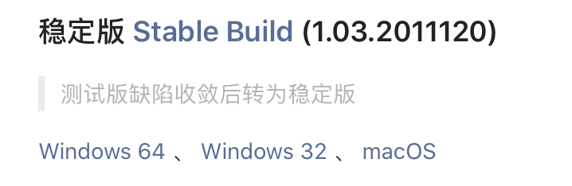
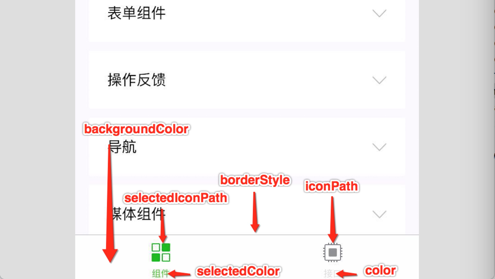

[TOC]

[微信小程序](https://developers.weixin.qq.com/miniprogram/dev/framework/quickstart/#小程序简介)

> 小程序的开发则有所不同，需要经过**申请小程序帐号**、**安装小程序开发者工具**、**配置项目**等等过程方可完成。

### 1. 协同开发


****

### 2. 测试小程序

账号：2829341496@qq.com

小程序名称：[228测试]()

****

#### 申请小程序账户

[注册小程序](https://mp.weixin.qq.com/wxopen/waregister?action=step1)

> 小程序的 **AppID** 相当于小程序平台的一个身份证，后续你会在很多地方要用到 AppID （注意这里要**区别于服务号或订阅号的 AppID**）。

[appID]()：wx421c68eb8d43725d

****

#### 安装工具

[工具下载](https://developers.weixin.qq.com/miniprogram/dev/devtools/download.html)

[工具使用介绍](https://developers.weixin.qq.com/miniprogram/dev/devtools/devtools.html)



****

#### Hellow程序

`.WXML`（WeiXin Markup Language）即网页开发中的`.HTML`文件。[WXML](https://developers.weixin.qq.com/miniprogram/dev/framework/view/wxml/)

`.WXSS`（WeiXin Style Sheets）即网页开发中的`.css`文件。[WXSS]()

> `wxss`拥有部分的`css`大部分特性。开发微信小程序时设计师可以用 **iPhone6** 作为视觉稿的标准。
>
> [单位]()：`wxss`支持新的尺寸单位`rpx`，会自动换算到手机的相应尺寸。
>
> 在`app.wxss`中定义全局样式，局部样式`page.wxss`只对**当前页面**生效。
>
> > ```js
> > /** 在一个wxss文件app.wxss 引入另一个外联样式表的相对路径 **/
> > @import "common.wxss";
> > ```

****

##### app.json

```js
/** 
通过pages字段就可以知道当前小程序的所有页面路径；
写在pages字段的第一个页面就是打开小程序的首页
**/
{
  "pages":[
    "pages/index/index",
    "pages/logs/logs"
  ]
}

/** app.json 中配置 "style": "v2"可表明启用新版的组件样式。 **/
```

****

##### app.js

```js
/** 
小程序启动后，在 app.js 定义的 App 实例的 onLaunch 回调会被执行
整个小程序只有一个 App 实例，是全部页面共享的
**/
App({
  onLaunch: function () {
    // 小程序启动之后 触发
  }
})
```

 关于更多的回调函数：[注册小程序](https://developers.weixin.qq.com/miniprogram/dev/framework/app-service/app.html)

****

##### logs `.json` `.WXML` `.WXSS` `.js`

> `logs.json`：微信客户端会先根据 `logs.json` 配置生成一个界面，顶部的颜色和文字你都可以在这个 `json` 文件里边定义好。
>
> `logs.WXML`&`logs.WXSS`：紧接着客户端就会装载这个页面的 `WXML` 结构和 `WXSS` 样式。
>
> `logs.js`：最后客户端会装载 `logs.js`
>
> ```js
> /** 
> log.js主体内容 
> 在onLoad（页面渲染后）里面处理逻辑
> **/
> Page({
>   data: { // 参与页面渲染的数据
>     logs: []
>   },
>   onLoad: function () {
>     // 页面渲染后 执行
>   }
> })
> ```
>
> 关于页面的更多回调函数：[注册页面](https://developers.weixin.qq.com/miniprogram/dev/framework/app-service/page.html)

****

### 3. 配置小程序

#### 全局配置

[全局配置](https://developers.weixin.qq.com/miniprogram/dev/framework/config.html#全局配置)

[全局配置详细参数](https://developers.weixin.qq.com/miniprogram/dev/reference/configuration/app.html)

###### `entryPagePath` & `pages`

> `entryPagePath`：打开小程序的默认启动页面。
>
> `pages`：页面列表，声明所有页面路径。当`entryPagePath`没有声明的时候，默认打开页面为该列表数组的第一项代表小程序的初始页面（首页）。**小程序中新增/减少页面，都需要对 pages 数组进行修改**。
>
> > ```json
> > {
> >   "pages": ["pages/index/index", "pages/logs/logs"],
> >  	"entryPagePath" : [pages/index/index]
> > }
> > ```

****

###### `window`

> 用于设置小程序的状态栏、导航条、标题、窗口背景色。

> 
>
> 具体`window`的参数查看官方文档：[全局配置详细参数](https://developers.weixin.qq.com/miniprogram/dev/reference/configuration/app.html)

****

###### `tabBar`

> 如果小程序是一个多 tab 应用（客户端窗口的底部或顶部有 tab 栏可以切换页面），可以通过 tabBar 配置项指定 tab 栏的表现，以及 tab 切换时显示的对应页面。

> 

****

###### `usingComponents`

> 在此处声明的自定义组件视为全局自定义组件，在小程序内的页面或自定义组件中可以直接使用而无需再声明。

****

###### `permission`

[接口权限授权](https://developers.weixin.qq.com/miniprogram/dev/framework/open-ability/authorize.html)

> 摄像头、用户信息、地理位置等权限的授权。
>
> ```json
> {
>   "pages": ["pages/index/index"],
>   "permission": {
>     "scope.userLocation": {
>       "desc": "你的位置信息将用于小程序位置接口的效果展示" // 高速公路行驶持续后台定位
>     }
>   }
> }
> ```

****

`usingExtendedLib`

> 指定需要引用的扩展库。目前支持以下项目：
>
> - `kbone`: [多端开发框架](https://developers.weixin.qq.com/miniprogram/dev/extended/kbone/)
> - `weui`: [WeUI 组件库](https://developers.weixin.qq.com/miniprogram/dev/extended/weui/)

****

#### 页面配置

[页面配置](https://developers.weixin.qq.com/miniprogram/dev/reference/configuration/page.html)

> 每一个小程序页面也可以使用 `.json` 文件来对本页面的窗口表现进行配置。页面中配置项在当前页面会覆盖 `app.json` 的 `window` 中相同的配置项。

****

#### sitemap配置

> 管理后台页面收录开关来配置其小程序页面是否允许微信索引。

****


****

### 4. 小程序框架

#### 场景值

> 场景值用来描述用户进入小程序的路径。即从哪里进来该程序（如扫描二维码，分享链接等）。

****

#### 页面

##### 页面生命周期

> 

##### 页面路由

- [ ] 暂时没有深入理解，只知道是对页面进行管理的栈。[页面路由](https://developers.weixin.qq.com/miniprogram/dev/framework/app-service/route.html)

****

#### 模块化

##### `module.exports`

> `module.exports`和`exports`都能使用，但是二者会有差别，但是对二者的了解还不够透彻，而且`exports`有时候还会产生问题，因此现在暂时先全部用`module.exports`，对于`exports`与它的理解暂缓在后面学习node.js。

```javascript
// common.js
function sayHello(name) {
  console.log(`Hello ${name} !`)
}

module.exports.sayHello = sayHello
```

```javascript
var common = require('common.js')

Page({
  helloMINA: function() {
    common.sayHello('MINA')
  }
})
```

##### 文本作用域

1. 局部数据：在 JavaScript 文件中声明的变量和函数**只在该文件中有效**；不同的文件中可以声明相同名字的变量和函数，不会互相影响。
2. 全局数据：通过全局函数 `getApp` 可以获取全局的应用实例，如果需要**全局的数据**可以在 `App()` 中设置。

> ```javascript
> // app.js
> App({
>   globalData: 1
> })
> ```
>
> ```javascript
> // a.js
> // The localValue can only be used in file a.js.
> var localValue = 'a'
> // Get the app instance.
> var app = getApp()
> // Get the global data and change it.
> app.globalData++
> ```
>
> ```javascript
> // b.js
> // You can redefine localValue in file b.js, without interference with the localValue in a.js.
> var localValue = 'b'
> // If a.js it run before b.js, now the globalData shoule be 2.
> console.log(getApp().globalData)
> ```

****

#### API

[小程序的API](https://developers.weixin.qq.com/miniprogram/dev/framework/app-service/api.html#API)

> 需要注意的是：多数 API 的回调都是**异步**，你需要处理好代码逻辑的异步问题。

****

### 6. WXML语法

#### 数据绑定

[数据绑定](https://developers.weixin.qq.com/miniprogram/dev/reference/wxml/data.html)

##### 简单绑定

###### 内容

```html
<view> {{ message }} </view>
```

```js
Page({
  data: {
    message: 'Hello MINA!'
  }
})
```

###### 组件属性

```html
<view id="item-{{id}}"> </view>
```

```js
Page({
  data: {
    id: 0
  }
})
```

###### 控制属性

```html
<view wx:if="{{condition}}"> </view>
```

```js
Page({
  data: {
    condition: true
  }
})
```

###### 关键字

> 关键字也需要在渲染括号里。

```html
<checkbox checked="{{false}}"> </checkbox>
```

****

##### 双向绑定 `model:`

[简单双向绑定](https://developers.weixin.qq.com/miniprogram/dev/framework/view/two-way-bindings.html)

数据的简单绑定是指，在渲染层对该数据进行操作的时候并不会对数据进行修改，比如`input`框的`value`，一般在后台进行修改`valuefrom`的时候，`value="valueFrom"`才会渲染到前面；如果使用了双向绑定`model:value=valueFrom`，那么input框中实时输入`value`的时候，`valueFrom`的数据也会进行改变，因此叫双向绑定。

****

##### 运算

##### 组合

****

#### 列表渲染 `wx:for`

****

#### 条件渲染 `wx:if`

****

#### 模版 & 引用

​	使用`name`定义好模版，之后用`is`属性调用模版。

```html
<!--
  index: int
  msg: string
  time: string
-->
<template name="msgItem">
  <view>
    <text> {{index}}: {{msg}} </text>
    <text> Time: {{time}} </text>
  </view>
</template>
```

```html
<template is="msgItem" data="{{...item}}"/>
```

```js
Page({
  data: {
    item: {
      index: 0,
      msg: 'this is a template',
      time: '2016-09-15'
    }
  }
})
```

​	想要使用`template`，需要使用引入`import`。

> import 有作用域的概念，即只会 import 目标文件中定义的 template，而不会 import 目标文件 import 的 template。**如：C import B，B import A，在C中可以使用B定义的`template`，在B中可以使用A定义的`template`，但是C不能使用A定义的`template`**。

```html
<!-- item.wxml -->
<template name="item">
  <text>{{text}}</text>
</template>
```

```html
<import src="item.wxml"/>
<template is="item" data="{{text: 'forbar'}}"/>
```

****

### 7. WXSS

WXSS (WeiXin Style Sheets)是一套样式语言，用于描述 WXML 的组件样式。

****


### 8. 自定义组件

#### behavior

#### component


### 9. 小程序开发指南

[小程序开发指南](https://developers.weixin.qq.com/ebook?action=get_post_info&docid=0008aeea9a8978ab0086a685851c0a)

#### 程序的生命周期和打开场景

> `onLaunch`：初次进入小程序的时候，微信客户端初始化好宿主环境，同时从网络下载或者从本地缓存中拿到小程序的代码包，把它注入到宿主环境，初始化完毕后，微信客户端就会给App实例派发onLaunch事件，App构造器参数所定义的onLaunch方法会被调用。
>
> `onHide`：进入小程序之后，用户可以点击右上角的关闭，或者按手机设备的Home键离开小程序，此时小程序并没有被直接销毁，我们把这种情况称为“**小程序进入后台状态**”，App构造器参数所定义的onHide方法会被调用。
>
> `onShow`：当再次回到微信或者再次打开小程序时，微信客户端会把“后台”的小程序唤醒，我们把这种情况称为“小程序进入前台状态”，App构造器参数所定义的onShow方法会被调用。

> 打开场景可以参考[生命周期函数](https://developers.weixin.qq.com/miniprogram/dev/reference/api/App.html)

****

#### 事件

详细的事件回调函数可以参考：[事件回调函数](https://developers.weixin.qq.com/ebook?action=get_post_info&docid=000846df9a03909b0086a50025180a)

****

#### FLEX布局

这个flex布局的ui设置得更加清楚，可以多看看。参考：[FLEX](https://developers.weixin.qq.com/ebook?action=get_post_info&docid=00080e799303986b0086e605f5680a)