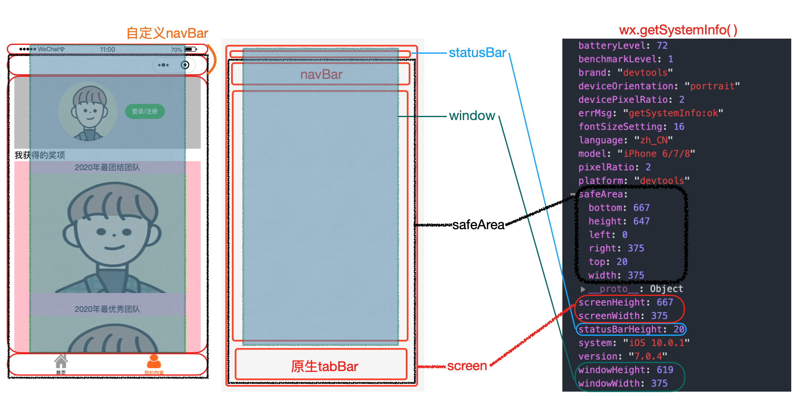
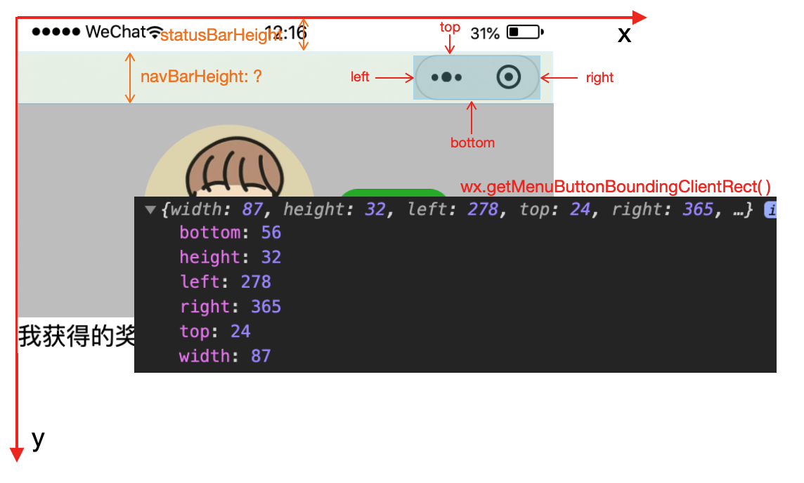
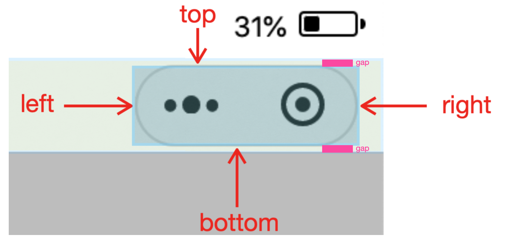
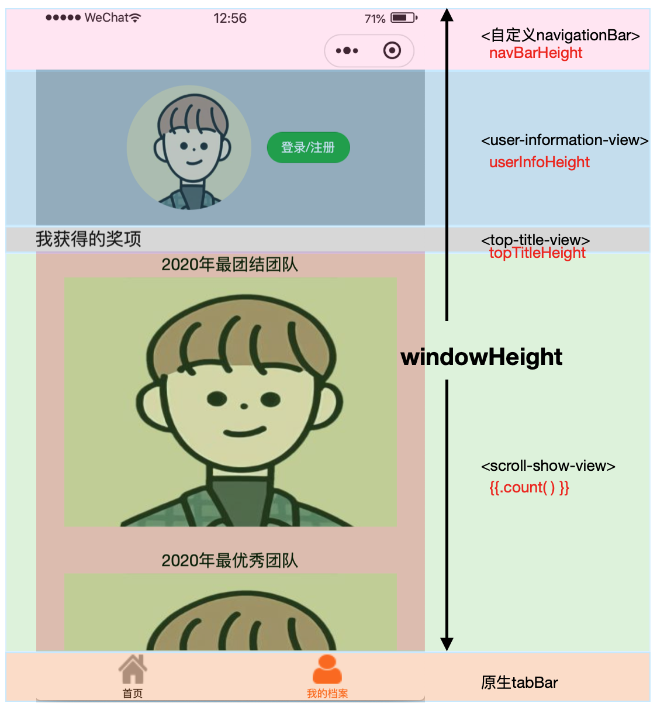

[TOC]

### 1. `exports` & `module.exports`

[module.exports和exports的区别](https://www.jianshu.com/p/beafd9ac9656)

​	使用`exports` / `module.exports`的时候需要分两步，第一步导出``module.exports.function = functionName`，第二步引入`var objectName = require('fileName.js')`。

```js
// common.js
function sayHello(name) {
  console.log(`Hello ${name} !`)
}
function sayGoodbye(name) {
  console.log(`Goodbye ${name} !`)
}

module.exports.sayHello = sayHello
exports.sayGoodbye = sayGoodbye
```

```javascript
// another.js
var common = require('common.js')
Page({
  helloMINA: function() {
    common.sayHello('MINA')
  },
  goodbyeMINA: function() {
    common.sayGoodbye('MINA')
  }
})
```

​	按照[module.exports和exports的区别](https://www.jianshu.com/p/beafd9ac9656)提到：

> **`require`引入的对象本质上是`module.exports`**。这就产生了一个问题，当 `module.exports`和`exports`指向的不是同一块内存时，`exports`的内容就会失效。
>
> ```cpp
> // module里面有exports属性
> console.log(exports);//输出：{}
> console.log(module);//输出：Module {..., exports: {}, ...} （注：...代表省略了其他一些属性）
> ```
>
> ```java
> //people.js
> module.exports = {name: '萤火虫叔叔'}；
> exports = {name: '萤火虫老阿姨'};
> ```
>
> ```jsx
> //main.js
> let people = require('./people');
> console.log(people);//输出：{name: '萤火虫叔叔'}
> ```
>
> - [ ] 这里有评论说：`exports = {name: '萤火虫老阿姨'}; 不能这么赋值，通过require得到的永远是{}，exports只能通过打点属性赋值导出`。后期学习node.js的时候再深入地了解一下。现在先强调一下：使用`module.exports`而不要使用`exports`。

****

### 2. button怎么绑定事件

`bindtap`

****

### 3. 数据的绑定

​	注意在操作`data: {}`的数据的时候，有两个方式。

> `this.setData()`
>
> ```js
> // this.setData()意思就是对data里面的数据进行操作
> Page({
>   data: {
>     boolean1: false,
>     boolean2: true
>   },
>  
>   changeBoolean() {
>     this.setData({
>       boolean1: true,
>       boolean2: false
>      })
>   } 
> })
> ```
>
> `this.data.sth`
>
> ```js
> Page({
>   data: {
>     boolean1: false,
>     boolean2: true
>   },
>  
>   changeBoolean() {
>     //注意不能直接使用this.boolean1 / this.boolean2
>     this.data.boolean1=true;
>     this.data.boolean2=false;
> })
> ```

****

### 4. 自定义navigationBar

[微信小程序自定义navigationBar](https://www.jianshu.com/p/9822d9ee168e)

[navigationBarTitle](https://developers.weixin.qq.com/miniprogram/dev/api/ui/navigation-bar/wx.setNavigationBarTitle.html)

```js
// 根据该接口，andriod的文字默认左侧对齐，苹果文字默认居中，如果想要都居中，需要自定义navigationBar
onLoad: function (options) {
    wx.setNavigationBarTitle({
      title: "查验"
    });
  },
```

1.自定义需要利用两个接口：`wx.getMenuButtonBoundingClientRect()`以及`wx.getSystemInfo()`。

2.需要理解接口返回的参数含义。	

​	1.关于`wx.getSystemInfo()`的各个参数。

> 
>
> 从参数所代表域从大到小进行解释：
>
> 1.`screen` = `safeArea` + `statusBar` = `window` (+ `原生navBar`) (+ `原生tabBar`)
>
> 2.`safeArea` 、 `statusBar`
>
> 3.`window` 、`原生navBar` 、 `原生tabBar`（区分`自定义navBar`、`自定义tabBar`）
>
> 对上面三个层次一一解释：
>
> 1.`screen` 屏幕：整个屏幕的高度
>
> 2.1`statusBar` 状态栏：状态栏指的是刘海，即显示时间、电量、信号的那个区域。
>
> 2.2`safeArea` 安全区域：指的是除去状态栏的部分，默认除去状态栏，对其他部分进行操作都是安全的。（见上面的**黑色线条围成区域**）
>
> 3.1`window`：针对整个屏幕`screen`而言，除去所有原生组件后剩下的区域。针对`window`必须要进行详细的认识，比如说上面的图片，自定义了`navBar`（自定义navBar相当于舍弃了`原生的statusBar以及navBar`内容），以及使用`原生tabBar`，那么剩下的`window`就是`screen - 原生tabBar`。如果没有`自定义navBar`，那么`window`的默认内容就是夹在`原生navBar`以及`原生tabBar`之间的区域。
>
> 3.2`原生tabBar`：通过在`app.json`里指定`"tabBar": {}`直接生成原生tabBar。
>
> 3.3`原生navBar`：通过提供的接口如`wx.setNavigationBarTitle({ title: "newTitle",})`即可操作一些内容，但操作十分有限，因此很多时候需要`自定义navBar`。

​	2.关于`wx.getMenuButtonBoundingClientRect()`

> 
>
> 返回了胶囊的信息，包括`top`(胶囊顶部的坐标), `right`, `bottom`, `left`，以及其宽度`width`高度`height`。
>
> 
>
> 可以看到，实际上胶囊`capsule`的位置居中于`navBar`，因此在胶囊和`navBar`的`border`上下侧还有`gap`。因此如果需要`自定义navBar`的话，就需要计算这个`gapHeight = capsule.top - statusBarHeight`，因此就能算出：
>
> `navBarHeight = capsule.height + gapHeight*2`
>
> 在得出了自定义`navBar`之后，由于后续使用的方便，一般将`navTotal`存起来，其代表`statusBar`和`navBar`的高度之和，因为后续添加元素都会在这两个元素下面。
>
> `navTotalHeight = navBarHeight + statusBarHeight`


****

### 5. global数据的使用

```js
// app.js
App({
  globalData: {
    userInfo: null
  }
})
```

```js
// index.js
const app = getApp();

Page({
  getUserInfo(e) {
    app.globalData.userInfo = e.detail.userInfo;
  }
})
```

****

### 6. url怎么通过路由管理

在模块化了一个函数之后，并不知道函数的调用具体在哪里

比如`pages`和`utils`是同级的文件夹

```js
// 模块化函数的位置
// utils/showLoginNeededModal/showLoginNeededModal.js
module.exports = funtion() {
	wx.navigateTo({
		url: 'path', //这里的path要根据具体调用这个函数的时候指定
	})
}
```

```js
// 调用函数在pages/certBlock/cerBlock.js
// navigateTo的path在 pages/loginPage/loginPage.js
// 那么指定的path为：
path: "../loginPage/loginPage" //loginPage.js一般省略.js
```

所以这时候就需要用到类似vue2中的路由管理`@/pages/loginPage/loginPage`这样的方式。

- [ ] 微信小程序是否有这样的管理方式？

****

### 7. 发送请求：promise管理同步

[promise resolve()的用法](https://www.jianshu.com/p/5b0b89bf4664)

****

### 8. showToast和hideToast

`wx.showToast`会默认关闭，默认值`duration: 1500`，即1.5s。可以通过设置`duration: expect_time`来改变弹窗的持续时间，那么hideToast的存在又有什么用？

参考：[wx.showToast 应与 wx.hideToast 配对使用？](https://developers.weixin.qq.com/community/develop/doc/0002226de6ce50b37f1b5c64351400)

> hideToast的意义，应该是你设置了duration为0的时候，必须等部分操作完成后，再调用hideToast手动关闭。

****

### 9. unshift

`unshift`是js里面的一个方法，能够像数组的**开头**添加一个或多个元素，并返回新的长度。

****

### 10. localStorage本地存储(&cookie)

[微信小程序从入门到精通（二） 小程序的能力](https://blog.csdn.net/wlwlwlwl015/article/details/79125921)

[深入理解cookie](https://www.jianshu.com/p/6fc9cea6daa2)

​		早期的移动web开发中本地存储只能用**cookie**的方式解决，但是cookie大小限制在**4K**，而且某些浏览器还存在cookie个数限制，而后随着H5的发展本地存储可以通过**localStorage**这个东东解决，但也仅是IE8以后才能支持，大小有**5M**，这就解决了很大一部分的存储容量问题。

​		微信小程序的官方文档中说了：同一个微信用户，同一个小程序 storage 上限为 10MB。

> ```js
> // 展示本地存储能力
> // 如果是首次启动，wx.getStorageSync('logs' )的值就是0或null，那么就返回一个空数组
> var logs =wx.getStorageSync('logs') || []
> logs.unshift(Date.now())
> wx.setStorageSync('logs', logs)
> ```
>
> 1. 如上所示，调用了**wx.getStorageSync**和**wx.setStorageSync**这2个API，这就是小程序为我们提供的**本地存储API**
> 2. `wx.setStorageSync(key, data)`：将 data 存储在本地缓存中指定的 key 中，会覆盖掉原来该 key 对应的内容，这是一个**同步**接口。
> 3. `wx.getStorageSync(key)`：从本地缓存中同步获取指定key对应的内容。

****

### 11. 获取微信用户信息的接口

[用户信息授权弹窗](https://developers.weixin.qq.com/community/develop/doc/0000a26e1aca6012e896a517556c01)

```vue
// 1.使用button open-type="getuserinfo"
<button open-type="getUserInfo" bindgetuserinfo="getUserInfoFunc">
  get user infomation
</button>

// js
getUserInfoFunc(res) {
  console.log(res);
}
```

```js
// 2.使用data
data: {
  canIUse: wx.canIUse('button.open-type.getUserInfo')
}
```

****

### 12. wx的openId以及wx.login + res.code

[微信获取openId为何需要wx.login+res.code发送请求？](https://developers.weixin.qq.com/ebook?action=get_post_info&docid=000cc48f96c5989b0086ddc7e56c0a)：这是官方的解答。

`openId`：在关注者与公众号产生消息交互后,公众号可获得关注者的OpenID(加密后的微信号,每个用户对每个公众号的OpenID是唯一的。对于不同公众号,同一用户的openid不同)。

> 假如只是通过一个接口来获取用户的信息，如通过wx.request请求 https://test.com/getUserInfo?id=1 拉取到微信用户id为1在我们业务侧的个人信息，那么黑客就可以通过遍历所有的id，把整个业务侧的个人信息数据全部拉走。（暴力法遍历获取用户信息）
>
> 1. 为了避免这样的风险，wx.login是生成一个带有时效性的凭证，就像是一个会过期的临时身份证一样，在wx.login调用时，会先在微信后台生成一张临时的身份证`res.code`，其有效时间仅为5分钟。
> 2. 可以通过这个临时的登录凭证去微信提供的接口来获取相应的唯一标识符`openId`。如果5分钟内小程序的后台不拿着这个临时身份证来微信后台服务器换取微信用户id的话，那么这个身份证就会被作废，需要再调用wx.login重新生成登录凭证。
>
> 由于这个**临时身份证5分钟后会过期**，如果黑客要冒充一个用户的话，那他就必须在5分钟内穷举所有的身份证id，然后去开发者服务器换取真实的用户身份。显然，黑客要付出非常大的成本才能获取到一个用户信息，同时，开发者服务器也可以通过一些技术手段检测到5分钟内频繁从某个ip发送过来的登录请求，从而拒绝掉这些请求。

```js
wx.login({
  success: (res) => {
    if(res.code) {
      wx.request({
        // 此url是官方提供的接口
        url: 'https://api.weixin.qq.com/sns/jscode2session?appid=APPID&secret=SECRET&js_code=JSCODE&grant_type=authorization_code',
        method: 'GET',
        data: {
          appid: 'xxxxx',
          secret: 'xxxx', //这个不能泄漏，一旦泄漏就要重置
          js_code: res.code,
          grant_type: 'authorization_code',
        },
        header: {
          'content-type': 'application/json'
        },
        success(res) {
          //缓存操作
        }
      })
    }
  }
})
```

但是注意一个问题，`secret`字段不能泄漏，因此**要把访问官方接口放在后端实现**，再向前端暴露一个接口。前端只要向后端传入`res.code`即可，而不用知道`appid`和`secret`。

****

### 13. app.js中onLaunch设置全局数据比page.js中onLoad执行更慢的异步问题

app.onLaunch应该是先执行，但并不一定比page.onLoad先结束。

如果page.onLoad里面有一些需要等待app.onLaunch改变的值(wx.request)，就会产生风险。

******

### 14. 自定义tabBar

[微信小程序自定义tabbar](https://www.jianshu.com/p/8b918e21cc6b)

[官方自定义tabBar指南](https://developers.weixin.qq.com/miniprogram/dev/framework/ability/custom-tabbar.html?search-key=自定义tabbar)

[微信小程序--获取tabBar的高度](https://blog.csdn.net/github_36843038/article/details/94563443)

需要注意的是，官方组件的`原生tabBar`并不计算在`windowHeight`。

详细可以看本文的`4. 自定义navigationBar`。

****

### 15. 自定义遮罩+点击限定区域外才取消遮罩

重点在于：指定区域的`view`阻止冒泡事件，设置`catchtap="func"`。

wxml：

```vue
<view class="mask-view" wx:if="{{showPostal}}" bindtap="closeMask">
	<view class='postal-view' id="postal-view-id" catchtap="catchMask"></view>
</view>
```

wxss：

```css
.mask-view{
  width: 100%;
  background: rgba(0, 0, 0, 0.4);
  position: fixed;
  top: 0;
  height: 100%;
  z-index: 9998;
}

.postal-view{
  // 设置居中
  position: absolute;
  left: 50%;
  top: 50%;
  transform: translate(-50%, -50%);
  align-items: center;
}
```

js：

```js
closeMask(e) {
	// console.log(e);
	this.setData({
		showPostal: false,
	})
},
  
catchMask(e) {
  console.log(e);
}
```

****

### 16. canvas生成海报问题

### 后面总结一下整体流程以及需要注意的点

[微信小程序分享之生成海报--canvas](https://www.cnblogs.com/imMeya/p/11454798.html)

[微信小程序canvas生成分享图片海报模糊解决方法](https://blog.csdn.net/memeda61/article/details/92831680)：画的时候多倍画（如采用10倍作图），展示的时候再按需缩小展示。

1.canvas生成海报图片长宽比使用`wx.getImageInfo`，再通过计算即可得到图片的比例，不使图片变形。

2.画的时候清晰度要高，展示的时候再按需改变大小。

****

### 17. 变量管理组件样式 & rpx

[微信小程序 - rpx和px互转，以及系统给的 pixelRatio 值比例不对](https://blog.csdn.net/zz00008888/article/details/109023879)

先要理解手机各个元素的关系，详情可以查看本文的`4. 自定义navigationBar`。

由于`scroll-view`需要指定固定的高度，因此需要用一致的单位管理页面组件，这样才能获取剩下的可分配高度然后给`scroll-view`的`style= "height: xx rpx;"`进行管理。因此就需要学会`1.rpx于px的转化规则`，`2.屏幕窗口操作内容的关系`，`3.变量管理元素样式`。

>  微信小程序将所有的屏幕的宽度都规定成**750rpx**。转换比`devicePixelRatio = 750/ px值`。比如手机宽度是375px，那么`dpr = 2`。
>
> 但是`wx.getSystemInfo`返回的`dpr`是整数（精确度不够），最好的方式还是通过获取屏幕的宽度`windowWidth`然后通过`dpr = 750/ windowWidth`来计算得出，这样更贴近真实的比例。

> 自定义`navigationBar`的话，`windowHeight`的高度实际上就是总的屏幕高度`screenHeight` - `原生组件tabBarHeight`。根据`wx.getSystemInfo`接口返回，`screenHeight`和`windowHeight`都会返回。

​	变量管理的主要方式是，在元素的`style`管理宽度高度，通过渲染时变量计算从而得到剩余部分高度。比如`scroll-view`必须指定固定高度，就可以采用这样的变量管理方式。

> 以一个简单的例子：`自定义navBar`+`原生tabBar`
>
> 
>
> 在看代码之前，需要注意的是，`windowHeight`和`navBarHeight`都是通过`wx.getSystemInfo`直接或间接得到，其单位都是`px`，但是一般在管理小程序的组件的时候，都会使用`rpx`来适配不同的手机，因此在使用变量管理组件之前，要明确哪些变量是`px`，需要通过转化变成`rpx`。其中需要`devicePixelRatio`，这个参数也可以通过`wx.getSystemInfo`直接得到，但是为了得到的参数更加贴近实际(系统返回的会对多余的位数进行取舍操作，因此会不够精确)。
>
> 微信小程序都默认设置`width = 750rpx`，因此可以使用`dpr = 750 / windowWidth`得出。`dpr`直接在页面的`onLoad()`中实现获取即可。得到dpr后，具体使用的时候要注意`rpx = px * dpr`。
>
> 由于涉及到`wx.getSystemInfo()`以及`app.globalData`的使用，代码只记录具体变量如何管理元素。
>
> 现在看代码：
>
> ```js
> // page.js
> Page({
>   data: {
>     // 最外层
>     windowDomHeight: '', //这里是通过系统返回参数直接获取，单位是px
>     navBarHeight: '', //这里是通过系统返回参数间接获取，单位是px
>     // 系统返回是px => 需要转换 rpx = px * dprWidth
>     userInfoHeight: '300', //自己管理，单位rpx
>     topTitleHeight: '50', //自己管理，单位rpx
> 
>     // 一些内层的组件参数，都是自己管理，单位rpx
>     // 用户头像的长宽
>     avatarHeight: '240', 
>     avatarPadding: '30', 
>     // 保证用户头像居中
>     avatarPadding: '50',
>     // 登录按钮高度
>     loginButtonHeight: '300', 
>     
>     // dpr
>     dprWidth: '2', //需要在onLoad加载的时候通过获取系统信息计算得出
>   }
> })
> ```
>
> ```html
> <!-- 
> page.wxml
> <navbar>是自定义组件，其高度是navBarHeight
> -->
> 
> <view>
>   <navbar page-name=""></navbar>
>   <view class="user-information-view" style="height: {{userInfoHeight}}rpx;">
>     <view class="user-avatar-view" style="padding: {{avatarPadding}}rpx; ">
>       <image class="user-avatar" src="{{avatarImage}}" style="height: {{avatarHeight}}rpx; width: {{avatarHeight}}rpx; ">
>       </image>
>     </view>
>     <view class="login-button-view" style="height: {{loginButtonHeight}}rpx;">
>       <button class="login-button" type="primary" open-type="getUserInfo" bindgetuserinfo="clickLoginButton">
>         登录/注册</button>
>     </view>
>   </view>
>   <view class="award-content-view">
>     <view class="top-title-view" style="height: {{topTitleHeight}}rpx;">
>       <text class="top-title-text">我获得的奖项</text>
>     </view>
>     <scroll-view class="award-scroll-view" scroll-y style="height: {{(windowDomHeight-navBarHeight) * dprWidth - userInfoHeight - topTitleHeight}}rpx;">
>       <view class="scroll-show-view" wx:for="{{imageList}}" wx:key="index">
>         <view class="award-title">
>           <text class="award-title-text">{{item.imageName}}</text>
>         </view>
>         <view class="award-image">
>           <image src="{{item.imageUrl}}"></image>
>         </view>
>       </view>
>     </scroll-view>
>   </view>
> </view>
> ```

### 需要做的

- [ ] 注册：如果没有的话需要在数据库添加
- [ ] 用户字表还要加一个“用户权限字段”
- [ ] 分公司：北京、天津、重庆、武汉、昆明、西安、成都
- [ ] 分享：照片即可
- [ ] 生成二维码


[自定义一个modal](https://blog.csdn.net/qq_43641373/article/details/107812436)


奖状图片：

https://ss1.bdstatic.com/70cFuXSh_Q1YnxGkpoWK1HF6hhy/it/u=3026705680,887291803&fm=26&gp=0.jpg