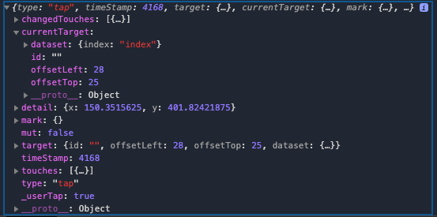
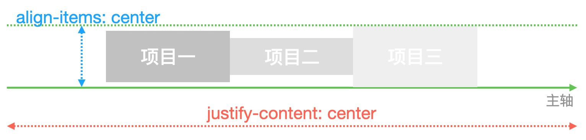
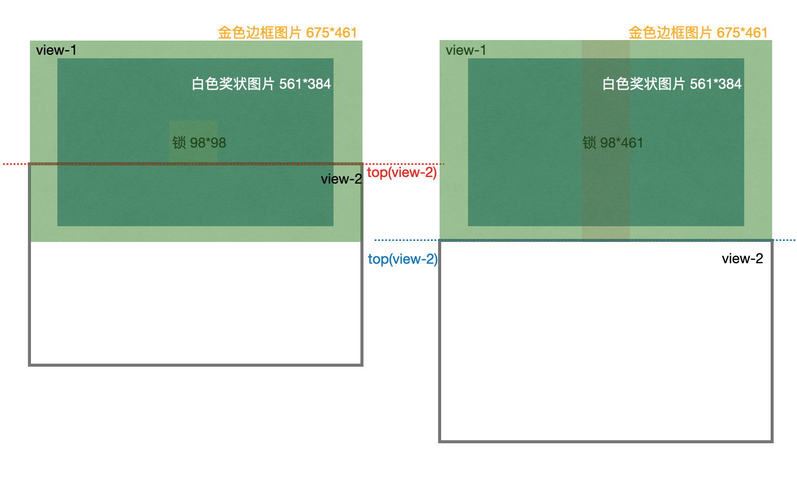

[TOC]

### 0. 微信小程序的异步/同步问题

​	**放在最前**

​	小程序由于很多操作都要等待，在等待图中所有操作都是异步的，也就是后面的代码内容如果需要这个等待之后产生的数据，那么有可能不能拿到。比如`wx.request`去获得数据，需要一段时间才能获取成功。比如下面：

```js
data: {
  res: 'default',
}
wx.request({
  ... //省略
  success(res){
  	// res = 'success';
		this.setData({
  		res = res;	
		})
	}
})
console.log(this.data.res); // 这里可能log出来的是default
```

​	因此特别需要注意微信小程序的异步问题。有问题的时候多想想是否有异步情况。

****

### 1. `exports` & `module.exports`

[module.exports和exports的区别](https://www.jianshu.com/p/beafd9ac9656)

​	使用`exports` / `module.exports`的时候需要分两步，第一步导出``module.exports.function = functionName`，第二步引入`var objectName = require('fileName.js')`。

```js
// common.js
function sayHello(name) {
  console.log(`Hello ${name} !`)
}
function sayGoodbye(name) {
  console.log(`Goodbye ${name} !`)
}

module.exports.sayHello = sayHello
exports.sayGoodbye = sayGoodbye
```

```javascript
// another.js
var common = require('common.js')
Page({
  helloMINA: function() {
    common.sayHello('MINA')
  },
  goodbyeMINA: function() {
    common.sayGoodbye('MINA')
  }
})
```

​	按照[module.exports和exports的区别](https://www.jianshu.com/p/beafd9ac9656)提到：

> **`require`引入的对象本质上是`module.exports`**。这就产生了一个问题，当 `module.exports`和`exports`指向的不是同一块内存时，`exports`的内容就会失效。
>
> ```cpp
> // module里面有exports属性
> console.log(exports);//输出：{}
> console.log(module);//输出：Module {..., exports: {}, ...} （注：...代表省略了其他一些属性）
> ```
>
> ```java
> //people.js
> module.exports = {name: '萤火虫叔叔'}；
> exports = {name: '萤火虫老阿姨'};
> ```
>
> ```jsx
> //main.js
> let people = require('./people');
> console.log(people);//输出：{name: '萤火虫叔叔'}
> ```
>
> - [ ] 这里有评论说：`exports = {name: '萤火虫老阿姨'}; 不能这么赋值，通过require得到的永远是{}，exports只能通过打点属性赋值导出`。后期学习node.js的时候再深入地了解一下。现在先强调一下：使用`module.exports`而不要使用`exports`。

****

### 2. button怎么绑定事件

`bindtap`

****

### 3. 数据的绑定

​	注意在操作`data: {}`的数据的时候，有两个方式。

> `this.setData()`
>
> ```js
> // this.setData()意思就是对data里面的数据进行操作
> Page({
>   data: {
>     boolean1: false,
>     boolean2: true
>   },
>  
>   changeBoolean() {
>     this.setData({
>       boolean1: true,
>       boolean2: false
>      })
>   } 
> })
> ```
>
> `this.data.sth`
>
> ```js
> Page({
>   data: {
>     boolean1: false,
>     boolean2: true
>   },
>  
>   changeBoolean() {
>     //注意不能直接使用this.boolean1 / this.boolean2
>     this.data.boolean1=true;
>     this.data.boolean2=false;
> })
> ```

****

### 4. 自定义navigationBar

[微信小程序自定义navigationBar](https://www.jianshu.com/p/9822d9ee168e)

[navigationBarTitle](https://developers.weixin.qq.com/miniprogram/dev/api/ui/navigation-bar/wx.setNavigationBarTitle.html)

```js
// 根据该接口，andriod的文字默认左侧对齐，苹果文字默认居中，如果想要都居中，需要自定义navigationBar
onLoad: function (options) {
    wx.setNavigationBarTitle({
      title: "查验"
    });
  },
```

1.自定义需要利用两个接口：`wx.getMenuButtonBoundingClientRect()`以及`wx.getSystemInfo()`。

2.需要理解接口返回的参数含义。	

​	1.关于`wx.getSystemInfo()`的各个参数。

> 
>
> 从参数所代表域从大到小进行解释：
>
> 1.`screen` = `safeArea` + `statusBar` = `window` (+ `原生navBar`) (+ `原生tabBar`)
>
> 2.`safeArea` 、 `statusBar`
>
> 3.`window` 、`原生navBar` 、 `原生tabBar`（区分`自定义navBar`、`自定义tabBar`）
>
> 对上面三个层次一一解释：
>
> 1.`screen` 屏幕：整个屏幕的高度
>
> 2.1`statusBar` 状态栏：状态栏指的是刘海，即显示时间、电量、信号的那个区域。
>
> 2.2`safeArea` 安全区域：指的是除去状态栏的部分，默认除去状态栏，对其他部分进行操作都是安全的。（见上面的**黑色线条围成区域**）
>
> 3.1`window`：针对整个屏幕`screen`而言，除去所有原生组件后剩下的区域。针对`window`必须要进行详细的认识，比如说上面的图片，自定义了`navBar`（自定义navBar相当于舍弃了`原生的statusBar以及navBar`内容），以及使用`原生tabBar`，那么剩下的`window`就是`screen - 原生tabBar`。如果没有`自定义navBar`，那么`window`的默认内容就是夹在`原生navBar`以及`原生tabBar`之间的区域。
>
> 3.2`原生tabBar`：通过在`app.json`里指定`"tabBar": {}`直接生成原生tabBar。
>
> 3.3`原生navBar`：通过提供的接口如`wx.setNavigationBarTitle({ title: "newTitle",})`即可操作一些内容，但操作十分有限，因此很多时候需要`自定义navBar`。

​	2.关于`wx.getMenuButtonBoundingClientRect()`

> 
>
> 返回了胶囊的信息，包括`top`(胶囊顶部的坐标), `right`, `bottom`, `left`，以及其宽度`width`高度`height`。
>
> 
>
> 可以看到，实际上胶囊`capsule`的位置居中于`navBar`，因此在胶囊和`navBar`的`border`上下侧还有`gap`。因此如果需要`自定义navBar`的话，就需要计算这个`gapHeight = capsule.top - statusBarHeight`，因此就能算出：
>
> `navBarHeight = capsule.height + gapHeight*2`
>
> 在得出了自定义`navBar`之后，由于后续使用的方便，一般将`navTotal`存起来，其代表`statusBar`和`navBar`的高度之和，因为后续添加元素都会在这两个元素下面。
>
> `navTotalHeight = navBarHeight + statusBarHeight`


****

### 5. global数据的使用

```js
// app.js
App({
  globalData: {
    userInfo: null
  }
})
```

```js
// index.js
const app = getApp();

Page({
  getUserInfo(e) {
    app.globalData.userInfo = e.detail.userInfo;
  }
})
```

****

### 6. url怎么通过路由管理

在模块化了一个函数之后，并不知道函数的调用具体在哪里

比如`pages`和`utils`是同级的文件夹

```js
// 模块化函数的位置
// utils/showLoginNeededModal/showLoginNeededModal.js
module.exports = funtion() {
	wx.navigateTo({
		url: 'path', //这里的path要根据具体调用这个函数的时候指定
	})
}
```

```js
// 调用函数在pages/certBlock/cerBlock.js
// navigateTo的path在 pages/loginPage/loginPage.js
// 那么指定的path为：
path: "../loginPage/loginPage" //loginPage.js一般省略.js
```

所以这时候就需要用到类似vue2中的路由管理`@/pages/loginPage/loginPage`这样的方式。

- [ ] 微信小程序是否有这样的管理方式？

****

### 7. 发送请求：promise管理同步

[promise resolve()的用法](https://www.jianshu.com/p/5b0b89bf4664)

****

### 8. showToast和hideToast

`wx.showToast`会默认关闭，默认值`duration: 1500`，即1.5s。可以通过设置`duration: expect_time`来改变弹窗的持续时间，那么hideToast的存在又有什么用？

参考：[wx.showToast 应与 wx.hideToast 配对使用？](https://developers.weixin.qq.com/community/develop/doc/0002226de6ce50b37f1b5c64351400)

> hideToast的意义，应该是你设置了duration为0的时候，必须等部分操作完成后，再调用hideToast手动关闭。

****

### 9.`arr.unshift` & `arr.push`

`unshift`是js里面的一个方法，能够像数组的**开头**添加一个或多个元素，并返回新的长度。

`push`则是在数组末尾添加元素。

```js
add() {
  let temp1 = [''];
  temp1.unshift('1'); //temp1: ['1', ''];
  let temp2 = [''];
  temp2.push('1'); //temp2: ['', '1'];
}
```

****

### 10. localStorage本地存储(&cookie)

[微信小程序从入门到精通（二） 小程序的能力](https://blog.csdn.net/wlwlwlwl015/article/details/79125921)

[深入理解cookie](https://www.jianshu.com/p/6fc9cea6daa2)

​		早期的移动web开发中本地存储只能用**cookie**的方式解决，但是cookie大小限制在**4K**，而且某些浏览器还存在cookie个数限制，而后随着H5的发展本地存储可以通过**localStorage**这个东东解决，但也仅是IE8以后才能支持，大小有**5M**，这就解决了很大一部分的存储容量问题。

​		微信小程序的官方文档中说了：同一个微信用户，同一个小程序 storage 上限为 10MB。

> ```js
> // 展示本地存储能力
> // 如果是首次启动，wx.getStorageSync('logs' )的值就是0或null，那么就返回一个空数组
> var logs =wx.getStorageSync('logs') || []
> logs.unshift(Date.now())
> wx.setStorageSync('logs', logs)
> ```
>
> 1. 如上所示，调用了**wx.getStorageSync**和**wx.setStorageSync**这2个API，这就是小程序为我们提供的**本地存储API**
> 2. `wx.setStorageSync(key, data)`：将 data 存储在本地缓存中指定的 key 中，会覆盖掉原来该 key 对应的内容，这是一个**同步**接口。
> 3. `wx.getStorageSync(key)`：从本地缓存中同步获取指定key对应的内容。

****

### 11. 获取微信用户信息的接口

[用户信息授权弹窗](https://developers.weixin.qq.com/community/develop/doc/0000a26e1aca6012e896a517556c01)

```vue
// 1.使用button open-type="getuserinfo"
<button open-type="getUserInfo" bindgetuserinfo="getUserInfoFunc">
  get user infomation
</button>

// js
getUserInfoFunc(res) {
  console.log(res);
}
```

```js
// 2.使用data
data: {
  canIUse: wx.canIUse('button.open-type.getUserInfo')
}
```

****

### 12. wx的openId以及wx.login + res.code

[微信获取openId为何需要wx.login+res.code发送请求？](https://developers.weixin.qq.com/ebook?action=get_post_info&docid=000cc48f96c5989b0086ddc7e56c0a)：这是官方的解答。

`openId`：在关注者与公众号产生消息交互后,公众号可获得关注者的OpenID(加密后的微信号,每个用户对每个公众号的OpenID是唯一的。对于不同公众号,同一用户的openid不同)。

> 假如只是通过一个接口来获取用户的信息，如通过wx.request请求 https://test.com/getUserInfo?id=1 拉取到微信用户id为1在我们业务侧的个人信息，那么黑客就可以通过遍历所有的id，把整个业务侧的个人信息数据全部拉走。（暴力法遍历获取用户信息）
>
> 1. 为了避免这样的风险，wx.login是生成一个带有时效性的凭证，就像是一个会过期的临时身份证一样，在wx.login调用时，会先在微信后台生成一张临时的身份证`res.code`，其有效时间仅为5分钟。
> 2. 可以通过这个临时的登录凭证去微信提供的接口来获取相应的唯一标识符`openId`。如果5分钟内小程序的后台不拿着这个临时身份证来微信后台服务器换取微信用户id的话，那么这个身份证就会被作废，需要再调用wx.login重新生成登录凭证。
>
> 由于这个**临时身份证5分钟后会过期**，如果黑客要冒充一个用户的话，那他就必须在5分钟内穷举所有的身份证id，然后去开发者服务器换取真实的用户身份。显然，黑客要付出非常大的成本才能获取到一个用户信息，同时，开发者服务器也可以通过一些技术手段检测到5分钟内频繁从某个ip发送过来的登录请求，从而拒绝掉这些请求。

```js
wx.login({
  success: (res) => {
    if(res.code) {
      wx.request({
        // 此url是官方提供的接口
        url: 'https://api.weixin.qq.com/sns/jscode2session?appid=APPID&secret=SECRET&js_code=JSCODE&grant_type=authorization_code',
        method: 'GET',
        data: {
          appid: 'xxxxx',
          secret: 'xxxx', //这个不能泄漏，一旦泄漏就要重置
          js_code: res.code,
          grant_type: 'authorization_code',
        },
        header: {
          'content-type': 'application/json'
        },
        success(res) {
          //缓存操作
        }
      })
    }
  }
})
```

但是注意一个问题，`secret`字段不能泄漏，因此**要把访问官方接口放在后端实现**，再向前端暴露一个接口。前端只要向后端传入`res.code`即可，而不用知道`appid`和`secret`。

****

### 13. app.js中onLaunch设置全局数据比page.js中onLoad执行更慢的异步问题

app.onLaunch应该是先执行，但并不一定比page.onLoad先结束。

如果page.onLoad里面有一些需要等待app.onLaunch改变的值(wx.request)，就会产生风险。

******

### 14. 自定义tabBar

[微信小程序自定义tabbar](https://www.jianshu.com/p/8b918e21cc6b)

[官方自定义tabBar指南](https://developers.weixin.qq.com/miniprogram/dev/framework/ability/custom-tabbar.html?search-key=自定义tabbar)

[微信小程序--获取tabBar的高度](https://blog.csdn.net/github_36843038/article/details/94563443)

需要注意的是，官方组件的`原生tabBar`并不计算在`windowHeight`。

详细可以看本文的`4. 自定义navigationBar`。

****

### 15. 自定义遮罩+点击限定区域外才取消遮罩

[小程序得背景半透明，内容不透明怎么实现](https://developers.weixin.qq.com/community/develop/doc/00042c4a050840dd1246d545f53c00)：`background:rgab(0,0,0,0.8);color:#fff;`

重点在于：指定区域的`view`阻止冒泡事件，设置`catchtap="func"`。

wxml：

```vue
<view class="mask-view" wx:if="{{showPostal}}" bindtap="closeMask">
	<view class='postal-view' id="postal-view-id" catchtap="catchMask"></view>
</view>
```

wxss：

```css
.mask-view{
  width: 100%;
  background: rgba(0, 0, 0, 0.4);
  position: fixed;
  top: 0;
  height: 100%;
  z-index: 9998;
}

.postal-view{
  // 设置居中
  position: absolute;
  left: 50%;
  top: 50%;
  transform: translate(-50%, -50%);
  align-items: center;
}
```

js：

```js
closeMask(e) {
	// console.log(e);
	this.setData({
		showPostal: false,
	})
},
  
catchMask(e) {
  console.log(e);
}
```

****

### 16. canvas生成海报问题

[微信小程序分享之生成海报--canvas](https://www.cnblogs.com/imMeya/p/11454798.html)

[微信小程序canvas生成分享图片海报模糊解决方法](https://blog.csdn.net/memeda61/article/details/92831680)：画的时候多倍画（如采用10倍作图），展示的时候再按需缩小展示。

[微信小程序 canvas画布渲染网络图片](https://blog.csdn.net/smile0315/article/details/102708891)：在回调成功`success`里进行绘制。

[微信小程序--图片本地缓存与canvas绘制](https://www.jianshu.com/p/407254e1fe22?utm_campaign=maleskine&utm_content=note&utm_medium=seo_notes&utm_source=recommendation)：使用`getImageInfo`或者`downloadFile`变成本地文件。

[canvas.save()与canvas.restore()](https://blog.csdn.net/tailyou0506/article/details/50680476)：多次绘制用成对的`save`和`restore`。

- [ ] 尝试使用canvas 2D：[canvasContext.clearRect()清除2dcanvas无效？](https://developers.weixin.qq.com/community/develop/doc/00042a24688d306412fa579f45b400)

​	按照正常流程先总结一下，后续细节地方遇到的问题放在正常流程各点后面。

​	**正常流程**：

1.使用canvas作画，在wxml定义`canvas`。

> 这里要注意的是：在wxml定义`<canvas canvas-id="postalCanvas"></canvas>`的时候，不能是隐藏起来的，即特别注意`wx:if="{{true}}"`和`hidden="{{true}}"`。
>
> 但是由于绘制了canvas只是需要在canvas作图得到需要的图片拼凑，因此并不希望看到canvas组件出现在页面当中，因此需要对canvas的样式修改，fix在页面之外，这样就可以间接隐藏。

```html
<!-- page.wxml -->
<canvas clas="postal-canvas" canvas-id="postalCanvas"></canvas>
```

```css
/* page.wxss */
.canvas-view {
  /* 不让用户看到canvas，后面看看有没有别的办法 */
  margin-top: 10000px;
  position: fixed;
}
```


2.使用`wx.createCanvasContext('canvasId')`，并且绘制一个可操作的矩形区域。

> 这里的可操作矩阵区域的大小值得考量。比如现在我想要绘制一个250 * 250(px)的图片并且导出，那么如果按照相同比例绘制的时候，就可能导致**canvas像素不够高而模糊**，因为在绘制的过程中绘制图片等进行压缩之后就会产生模糊，因此最好的方式是尽量按照绘制图片的原图比例进行绘制，最后再在需要展示的时候相应调整大小展示即可。比如在`drawImage()`的时候，图片原本的大小是3000 * 3000，那么就可以进行相同比例的`ctx.fillRec(0, 0, 3000, 3000)`进行绘制，当然也可以相应缩小，使用1500 * 1500即可保证一定的像素。参考[微信小程序canvas生成分享图片海报模糊解决方法](https://blog.csdn.net/memeda61/article/details/92831680)。
>
> ```js
> createPostal() {
>   var ctx = wx.createCanvaasContex("postalCanvas");
>   ctx.fillRect(0, 0, width, height);
> }
> ```


3.绘制图片使用绘制接口`canvas.drawImage()`，绘制文字使用接口`canvas.fillText()`

> `canvas.drawImage()`：绘制图片的时候需要提供一个图片路径，这个图片路径有可能是网络图片，也有可能是本地图片。本地图片的时候绘制并没有什么问题，但是使用网络图片的时候就有问题。根据官方文档[canvas.drawImage()](https://developers.weixin.qq.com/miniprogram/dev/api/canvas/CanvasContext.drawImage.html)，绘制网络图片的时候要使用`getImageInfo` / `downloadFile`先下载。因此具体的绘制操作可以在`getImageInfo`内部进行操作。参考[微信小程序--图片本地缓存与canvas绘制](https://www.jianshu.com/p/407254e1fe22?utm_campaign=maleskine&utm_content=note&utm_medium=seo_notes&utm_source=recommendation)以及[微信小程序 canvas画布渲染网络图片](https://blog.csdn.net/smile0315/article/details/102708891)。
>
> 同时，使用`getImageInfo`获取了图片的长宽之后可以计算比例，使得绘制的时候不变形。
>
> ```js
> // page.js
> createPostal() {
>   wx.getImageInfo() {
>     src: httpImage,
>     success(e) {
>       var ctx = wx.createCanvasContext('postalCanvas');
>       ctx.fillRect(0, 0, width, height);
>       ctx.drawImage(e.path, x, y, widthe, height);
>     }
>   }
> }
> ```
>
> `canvas.fillText()`：在绘制文字之前需要确定文字的大小`canvas.setFontSize(10)`以及文字的对齐方式`canvas.setTextAlign('left')`，默认左对齐。这里需要注意的是，**(1)**在绘制过程中如果设置了一次对齐方式，那么所有的文字都会按照这个对齐方式。因此如果不同文字有不同的对齐需求，需要在不同文字之前分别声明，文字的大小也同理。**(2)**`canvas.setTextAlign()`的对齐方式会根据`fillText()`给出的坐标点进行对齐，`'left'`表示`(x,y)`是最左侧；`'center'`表示`(x,y)`是文字的最中间；`'right'`则表示`(x,y)`是文字的最右侧。如果想要改变字体颜色的话，可以设置通过设置`canvas.setFillStyle('grey')`：需要注意的是，设置了之后无论绘制什么内容都会变成该颜色，因此要注意使用`save`和`resore`，或者在相应的地方都设置一下style。
>
> ```js
> // page.js
> createPostal() {
>   var ctx = wx.createCanvasContext('postalCanvas');
> 	ctx.fillRect(0, 0, width, height);
>   
>   ctx.setFontSize(75);
>   ctx.setTextAlign('left');
> 	ctx.fillText("left", x, y);
>   
>   ctx.setFontSize(95);
>   ctx.setTextAlign('center');
> 	ctx.fillText("center", x, y);
> }
> ```


4.完成绘制后，使用`draw()`结束绘制。

> 在不同的绘制时间里可能有不同的绘制需求，比如第一次绘制了一个背景图片覆盖全部，第二次想绘制另一个图片覆盖在第一次绘制图片的某个位置。即第一次绘制背景，第二次绘制展示图片。就需要使用到`canvas.save()`以及`canvas.restore()`。使用了`canvas.save()`之后，夹在下一个`canvas.restore()`会被保存下来，那么就可以把下一次操作放在`canvas.restore()`之后进行绘制。参考[canvas.save()与canvas.restore()](https://blog.csdn.net/tailyou0506/article/details/50680476)。
>
> ```js
> // page.js
> createPostal() {
>   var ctx = wx.createCanvasContext('postalCanvas');
> 	ctx.fillRect(0, 0, width, height);
>   
>   ctx.save();
>   ctx.drawImage('/images/a.png', x, y, width, height);
>   
>   ctx.restore();
>   ctx.save();
>   ctx.drawImage('/images/b.png', x, y, width, height);
>   
>   ctx.restore();
>   ctx.drawImage('/images/c.png', x, y, width, height);
>   
>   ctx.draw();
> }
> ```


5.导出截图文件，`wx.canvasToTempFilePath`

> 导出截图文件的时候，会出现一个异步问题，即canvas并未结束想要的绘制过程，而已经开始异步执行`wx.canvasToTempFilePath`，那么最后截图出来的就不是想要的结果。因此需要使用`setTimeout`来等待1-2s等绘制结束。相应可以给一个等待Toast.

```js
// page.js
wx.showToast({
	title: '绘制中',
	icon: 'loading',
	duration: 2000,
})

setTimeout(() => {
	wx.canvasToTempFilePath({
		x: 0,
		y: 0,
		width: that.data.widthCanvas,
		height: that.data.heightCanvas,
		destWidth: that.data.widthCanvas,
		destHeight: that.data.heightCanvas,
		anvasId: 'postalCanvas',
		success(res) {
    	console.log(res);
  	}
} ,2000);

```

****

### 17. 微信小程序二维码、data:image/png;base64 及canvas绘制问题

[一物一码接口文档](https://developers.weixin.qq.com/doc/offiaccount/Unique_Item_Code/Unique_Item_Code_API_Documentation.html)

[获取小程序码](https://developers.weixin.qq.com/miniprogram/dev/framework/open-ability/qr-code.html)

[data:image/png;base64的用法详解](https://www.cnblogs.com/haoji/p/11446488.html)

- [x] bug内容：在canvas上绘制base64类型的二维码失败，没有绘制出来，但是没有报错。

- [x] 整体的debug思路：检查base64类型的二维码图片在`<image>`组件能否正常展示 -> 检查canvas绘制失败原因

​	微信小程序二维码存在几个接口，可以参考[获取小程序码](https://developers.weixin.qq.com/miniprogram/dev/framework/open-ability/qr-code.html)按需使用不同的二维码。二维码一般需要在后端实现，因为涉及到appId以及secret。小程序二维码官方接口会返回一个`array`字段的数据，一般在后端进行`arrayToBase64`的处理，因此前端会获取到一个`base64`类型的字符串。

​	1.经过测试，直接使用后端返回的`base64`类型字段不能按照预期展示出图片。`<image/>`组件可以接收`base64`的图片格式，比如：

```xml
<image src='{{base64Src}}'></image>
```

但是从后端接收到一个`base64`类型，并不能如期展示。需要`wx.base64ToArrayBuffer`以及`wx.arrayBufferToBase64`接口重新转换一遍：

```js
// page.js
var arr = wx.base64ToArrayBuffer(base64Src);
var base64Img = 'data:image/png;base64,' + wx.arrayBufferToBase64(arr);
```

```xml
<!-- page.wxml -->
<image src="{{base64Img}}"></image>
```

​	2.上述的完成了image的debug之后，解决了base64Src问题。但是在image上能正常展示，还是无法绘制到canvas上面（在电脑上绘制正常，而在手机上绘制失败）。回顾一下`canvas.drawImage()`注意事项：需要对网络图片`getImageInfo` / `downloadFile`先下载变成本地图片，因此`base64`是否也有类似的注意点。最后搜索到一篇参考进行尝试：[微信小程序之将base64图片转为本地图片](https://blog.csdn.net/leo_xian/article/details/107141294)。其中代码中需要用`.replace`去掉空格的原因参考另一篇文章：[微信小程序wx.base64ToArrayBuffer调用，提示thirdScriptError "atob" failed;undefined Error: "atob" failed](https://www.codeleading.com/article/4043730355/)。

```js
// page.js
base64ToLocalImage() {
	let code = base64Src; // 后台返回的base64图片，没有带data:image/png;base64,的前缀。
	//let src = `data:image/png;base64,${code}`;
	const fsm = wx.getFileSystemManager();  // 获取文件管理器
	code = code .replace(/\ +/g, ""); //去掉空格方法
	code = code .replace(/[\r\n]/g, "");

	const buffer = wx.base64ToArrayBuffer(code );  //  将 base64 字符串转成 ArrayBuffer 对象
	const fileName = wx.env.USER_DATA_PATH + '/share_img.png';  // 文件系统中的用户目录路径 （本地路径）
/**
* @param fileName: 文件路径
* @param buffer : 要写入的文本或二进制数据
* @param binary: 指定写入文件的字符编码
*/
	fsm.writeFileSync(fileName, buffer, 'binary');  // 写入文件， 同步方法

	console.log(fileName);  // 写入成功后就可以访问到该图片路径了
}
```

****

### 18. 变量管理组件样式 & rpx

[微信小程序 - rpx和px互转，以及系统给的 pixelRatio 值比例不对](https://blog.csdn.net/zz00008888/article/details/109023879)

先要理解手机各个元素的关系，详情可以查看本文的`4. 自定义navigationBar`。

由于`scroll-view`需要指定固定的高度，因此需要用一致的单位管理页面组件，这样才能获取剩下的可分配高度然后给`scroll-view`的`style= "height: xx rpx;"`进行管理。因此就需要学会`1.rpx于px的转化规则`，`2.屏幕窗口操作内容的关系`，`3.变量管理元素样式`。

>  微信小程序将所有的屏幕的宽度都规定成**750rpx**。转换比`devicePixelRatio = 750/ px值`。比如手机宽度是375px，那么`dpr = 2`。
>
> 但是`wx.getSystemInfo`返回的`dpr`是整数（精确度不够），最好的方式还是通过获取屏幕的宽度`windowWidth`然后通过`dpr = 750/ windowWidth`来计算得出，这样更贴近真实的比例。

> 自定义`navigationBar`的话，`windowHeight`的高度实际上就是总的屏幕高度`screenHeight` - `原生组件tabBarHeight`。根据`wx.getSystemInfo`接口返回，`screenHeight`和`windowHeight`都会返回。

​	变量管理的主要方式是，在元素的`style`管理宽度高度，通过渲染时变量计算从而得到剩余部分高度。比如`scroll-view`必须指定固定高度，就可以采用这样的变量管理方式。在本问题的最后还有一个需要注意的问题。

> 以一个简单的例子：`自定义navBar`+`原生tabBar`
>
> 
>
> 在看代码之前，需要注意的是，`windowHeight`和`navBarHeight`都是通过`wx.getSystemInfo`直接或间接得到，其单位都是`px`，但是一般在管理小程序的组件的时候，都会使用`rpx`来适配不同的手机，因此在使用变量管理组件之前，要明确哪些变量是`px`，需要通过转化变成`rpx`。其中需要`devicePixelRatio`，这个参数也可以通过`wx.getSystemInfo`直接得到，但是为了得到的参数更加贴近实际(系统返回的会对多余的位数进行取舍操作，因此会不够精确)。
>
> 微信小程序都默认设置`width = 750rpx`，因此可以使用`dpr = 750 / windowWidth`得出。`dpr`直接在页面的`onLoad()`中实现获取即可。得到dpr后，具体使用的时候要注意`rpx = px * dpr`。
>
> 由于涉及到`wx.getSystemInfo()`以及`app.globalData`的使用，代码只记录具体变量如何管理元素。
>
> 现在看代码：
>
> ```js
> // page.js
> Page({
>   data: {
>     // 最外层
>     windowDomHeight: '', //这里是通过系统返回参数直接获取，单位是px
>     navBarHeight: '', //这里是通过系统返回参数间接获取，单位是px
>     // 系统返回是px => 需要转换 rpx = px * dprWidth
>     userInfoHeight: '300', //自己管理，单位rpx
>     topTitleHeight: '50', //自己管理，单位rpx
> 
>     // 一些内层的组件参数，都是自己管理，单位rpx
>     // 用户头像的长宽
>     avatarHeight: '240', 
>     avatarPadding: '30', 
>     // 保证用户头像居中
>     avatarPadding: '50',
>     // 登录按钮高度
>     loginButtonHeight: '300', 
>     
>     // dpr
>     dprWidth: '2', //需要在onLoad加载的时候通过获取系统信息计算得出
>   }
> })
> ```
>
> ```html
> <!-- 
> page.wxml
> <navbar>是自定义组件，其高度是navBarHeight
> -->
> 
> <view>
>   <navbar page-name=""></navbar>
>   <view class="user-information-view" style="height: {{userInfoHeight}}rpx;">
>     <view class="user-avatar-view" style="padding: {{avatarPadding}}rpx; ">
>       <image class="user-avatar" src="{{avatarImage}}" style="height: {{avatarHeight}}rpx; width: {{avatarHeight}}rpx; ">
>       </image>
>     </view>
>     <view class="login-button-view" style="height: {{loginButtonHeight}}rpx;">
>       <button class="login-button" type="primary" open-type="getUserInfo" bindgetuserinfo="clickLoginButton">
>         登录/注册</button>
>     </view>
>   </view>
>   <view class="award-content-view">
>     <view class="top-title-view" style="height: {{topTitleHeight}}rpx;">
>       <text class="top-title-text">我获得的奖项</text>
>     </view>
>     <scroll-view class="award-scroll-view" scroll-y style="height: {{(windowDomHeight-navBarHeight) * dprWidth - userInfoHeight - topTitleHeight}}rpx;">
>       <view class="scroll-show-view" wx:for="{{imageList}}" wx:key="index">
>         <view class="award-title">
>           <text class="award-title-text">{{item.imageName}}</text>
>         </view>
>         <view class="award-image">
>           <image src="{{item.imageUrl}}"></image>
>         </view>
>       </view>
>     </scroll-view>
>   </view>
> </view>
> ```

​	最后需要注意的问题是，虽然都采用了变量赋值的方式，还是可以产生屏幕滑动的效果。即按照逻辑上来说，所有的变量总和=屏幕总高度，但是实际情况是所有组件的高度之和>屏幕总高度。这是因为在赋值的时候，内容高度>赋值高度，比如：

```js
// page.js
data: {
  viewHeight: 10,
}
```

```html
<!-- page.wxml -->
<view style="height: {{viewHeight}}rpx;">
  <text style="height: 20rpx"></text>
</view>
```

​	实际计算的时候应该`-20`，但是计算的时候用的是`viewHeight: 10`，因此少减了，导致组件总体高度更大。因此变量管理的时候要注意每一个组件，包括其内部组件。还有就是`margin`和`padding`有时候也会产生奇怪的影响， debug的时候如果实在找不出问题可以看看组件之间的`margin`和`padding`。

****

### 19. wx.request合法域名配置

[微信小程序配置合法域名和业务域名](https://www.cnblogs.com/xubao/p/11982626.html)

合法域名配置需要在微信小程序的开发者平台中进行配置。

`合法域名`：针对`wx.request`。注意最后不要带斜杠，`https://www.to2098.com:30799`。不要写成`https://www.to2098.com:30799/`。

`业务域名`：针对跳转页面

****

### 20. for循环显示组件，获取当前点击元素的一些参数&样式管理

问题出现是因为，在`wx:for`对列表遍历进行生成元素的时候，1.希望得到列表中的参数，以便进行进一步操作。2.希望对不同组件进行不同的样式管理

针对1。这时候需要对在元素中设置`data-**="dataNeeded"`，然后就可以在`bindtap`绑定的事件中得到返回参数。比如下面图中的`e.currentTarget.dataset`里面就存放着已经传过来的`index`。



```html
<!-- 
使用data-index，那么就会出现index，
使用data-whatever，那么就会出现whatever
-->
<view wx:for="{{awardsList}}" wx:key="index">
	<image src="{{item.gloryUrl}}" data-index="index" bindtap="gotoAwardDetail"></image>
</view>
```

```js
// page.js
bindtapFunction(e) {
  console.log(e);
}
```

针对2。对`class`进行插值即可。

```html
<!-- page.wxml -->
<view wx:for="{{awardsList}}" wx:key="index">
	<image class="image-{{index}}" src="{{item.gloryUrl}}"></image>
</view>
```

```css
/* page.wxss */
.image-0 {
  width: 40rpx;
}

.image-1 {
  width: 50rpx;
}
```

****

### 21. 带参数跳转页面

​	需求是有些页面的显示内容需要根据变量显示，比如点击了某个图片跳转过来之后，显示的是这个图片，那么就需要把这个图片的url在跳转的时候传过来。

​	一开始想出来比较蠢的方法是利用本地缓存，然后在跳转后的页面使用本地缓存获取，就可以产生交互。

> ```js
> // sendPage.js
> wx.setStorageSyn('urlSend', imageUrl);
> wx.navigateTo({
>   url: '/pages/getPage/getPage',
> })
> ```
>
> ```js
> // getPage.js
> var imageUrl = wx.getStorageSyn('urlSend') || null;
> ```

​	但是：其实跳转页面的时候本身提供了传值操作，直接使用即可。

> ```js
> // sendPage.js
> wx.navigateTo({
>   url: '/pages/getPage/getPage?urlSend=' + imageUrl + '&imageName=' + imageName,
> })
> ```
>
> ```js
> // getPage.js
> // TODO!
> // onLoad只加载一次，是否要使用onShow?后续再回顾这个问题
> data: {
>   imageUrl: '',
>   imageName: '',
> }
> onLoad(options) {
>   this.setData({
>     imageUrl: options.imageUrl,
>     imageName: options.imageName,
>   })
> }
> ```

****

### 22. 关于onLoad & onShow调用问题

​	根据文档，`onLoad`只会加载一次，会在页面加载的时候执行。但是这个`加载的时候`具体是指什么时候？需要探究一下。需要具体区分`初始页面`和`非初始页面`。

> `初始页面`：在app.json中指定的首页，只有初始的页面才能拥有`tabBar`，也才能使用`wx.switchTab()`，这个是主要区分。

| operation           | onLoad     | onShow     |
| ------------------- | ---------- | ---------- |
| 第一次打开页面      | `onLoad()` | `onShow()` |
| `wx.navigateTo()`   | `onLoad()` | `onShow()` |
| `wx.navigateBack()` |            | `onShow()` |
| `wx.switchTab()`    |            | `onShow()` |
| `wx.redirectTo()`   | `onLoad()` | `onShow()` |
| `wx.reLaunch()`     | `onLoad()` | `onShow()` |
| `wx.previewImage()` |            | `onShow()` |

​	这里需要注意两对：`wx.navigateTo`+`wx.navigateBack`；`wx.navigateTo`和`wx.redirectTo`。

​	`wx.navigateBack`：可以返回上n层页面，页面栈为10；n可以通过`delta`来设定。

​	`wx.navigateTo`和`wx.redirectTo`都会在跳转页面的时候执行目的页面的`onLoad`和`onShow`函数，但是有所不同，即`wx.navigateTo`可以在跳转之后通过`wx.navigateBack`返回之前的页面；但是使用`wx.redirectTo`就不能执行返回页面。可以通过官方文档中体会差别：

> `wx.navigateTo`：保留当前页面，跳转到应用内的某个页面。 => 页面栈中有缓存。
>
> `wx.redirectTo`：关闭当前页面，跳转到应用内的某个页面。 => 页面栈中无缓存。

​	可以看到关键在于：保留/关闭。再看`wx.switchTab()`：

> 跳转到 tabBar 页面，并关闭其他所有非 tabBar 页面。

​	可以看到使用`wx.switchTab()`也会关闭其他的页面，因此也不能通过`delta`返回上n层。

​	`wx.reLaunch()`一样的道理，描述也是关闭。

> 关闭所有页面，打开到应用内的某个页面。

****

### 23. 按需关闭Toast

​	使用`wx.showToast()`时设置较大的`duration`，在想要关闭的时候使用`wx.hideToast()`。

```js
click() {
  wx.showToast({
    title: '正在获取',
		icon: 'loading',
		duration: 10000, //10s
  });
  wx.getImageInfo({
    src: imageUrl,
    success(e){
      wx.hideToast();
    }
  })
}
```

****

### 24. `canvas.fillText()`换行实现

目前使用的是通过`split('，')`分成几部分，这样就必须严格规定输入的内容。比如内容严格规定在只有一句，并且只含有一个`，`。

```js
data: {
  content: '这是前半句内容，这是后半句内容。'
}

createPostal() {
  contentList = this.data.content.split("，");
  canvas.setFontSize(60);
  canvas.fillText(contentList[0], x, y);
  canvas,fillText(contentList[1], x, y + 80;)
}
```

****

### 25. scroll-view下拉刷新

下拉刷新有两种方式，一种是使用`refresher`，一种是触顶（触底同理）。

​	1.refresher：官方提供的下拉刷新接口。如果不想要用官方的样式的话，可以自定义。

| 属性                    | 作用                                                         |
| ----------------------- | ------------------------------------------------------------ |
| refresher-enable        | 设置为`{{true}}`可使用                                       |
| refresher-threshold     | 下拉刷新阈值`default=45`                                     |
| refresher-default-style | 样式`black/white/none`                                       |
| refresher-background    | 自定义背景颜色                                               |
| refresher-triggered     | 下拉之后会变成`true`，如果想要隐藏需要手动修改成`false`      |
| bindrefresherrefresh    | 下拉到触发阈值后停止下拉触发的handle函数 `='refreshFunction'` |
| bindrefresherpulling    | `下拉`动作持续触发，只要保持下拉就一直触发                   |
| bindrefresherrestore    | 恢复到初始状态触发                                           |
| bindrefresherabort      | 下拉动作没有到阈值即停止动作触发                             |

```js
// page.js
Page({
  data: {
    refreshTrigger: false,
  },
  
  refreshUpper() {
    // do something
  },
  
})
```

```xml
<!-- page.wxml -->
<scroll-view
	scroll-y="{{true}}"
	refresher-enabled='{{true}}'
	refresher-threshold='45'
	refresher-default-style="white"
	refresher-triggered="{{refreshTrigger}}"
	bindrefresherrefresh="refreshUpper"
	style="height: 1000rpx;"
>
  <!-- 如果不想要使用官方样式：refresher-default-style="none" -->
	<view slot="refresher"></view>
</scroll-view>
```

​	2.触顶/触底：

`bindscrolltoupper`：触顶(横向则触左)，配合`upper-threshold`使用。如果想要产生`fresher`的下拉效果，可以设置`upper-threshold=-45`。

`bindscrolltolower`：触底(横向则触右)，配合`lower-threshold`使用。如果想要产生像`fresher`一样的效果，可以设置`lower-threshold=-45`。

- [ ]  swipper 轮播组件（类似于preview几个图滑来滑去），类似scroll-view中的`paging-enable`属性。

****

### 26.用户拒绝授权后重新点击引导授权

需要使用button来触发`wx.openSetting`

```xml
<button open-type="openSetting">打开授权页面</button>
```

****

### 27.微信小程序二维码参数测试

[getUnlimited 生成二维码，通过开发者工具“通过二维码编译” 获取不到scene?](https://developers.weixin.qq.com/community/develop/doc/000cac14808c90bdc40a934f351800)

[小程序踩过的一个小坑---解析二维码decodeURIComponent() url解码](https://www.cnblogs.com/fps2tao/p/10137465.html)

[扫普通链接二维码打开小程序](https://developers.weixin.qq.com/miniprogram/introduction/qrcode.html#功能介绍)

[微信小程序获取二维码携带的参数内容/场景scene值](https://blog.csdn.net/qq_25102811/article/details/110198152)：微信开发者工具默认是`普通编译`，可以选择`通过二维码编译`，选择已经生成的二维码，即可调试二维码测试查看scene值具体情况。

****

### 28.button文本居中、button嵌入图像和背景图片

[button文本居中](https://blog.csdn.net/weixin_40087279/article/details/81358364)：注意设置文本高度和button高度一致

[CSS让背景图片填满DIV](https://blog.csdn.net/qq_29656961/article/details/80158778)：微信小程序不能再wxss中读取本地图片，就在wxml中管理。

​	1.button文本居中需要注意设置文本的高度`line-height`以及button本身高度`height`一致。

```css
.sample-button {
  height: 77rpx;
  line-height: 77rpx;
}
```

​	2.button嵌入图像，在`<button>...</button>`中间添加即可。注意样式。

```xml
<button class="save-to-album-button" bindtap="saveToAlbum">
	<view bindtap="saveToAlbum">
		<image src="/images/save-icon.png" style="width: 60rpx; height: 62rpx;"></image>
	</view>
	<view bindtap="saveToAlbum">
		<text style="font-size:37rpx; align-items: center">保存到相册</text>
	</view>
</button>
```

```css
.save-to-album-button {
  display: flex;
  flex-direction: row;
  justify-content: center;
  background: #C30F23;
}
```

​	3. 微信小程序button背景图片需要在wxml中管理。

> ```html
> <button style="background: #F16969;" url(/images/button-background.png) no-repeat;>
>   完成
> </button>
> ```


****

### 29.Flex布局`justify-content`和`align-items`区别



****

### 30.`wx.for`中实现循环中`<image>`几张图片覆盖


如上图，是三张图片的覆盖：金色外框（中空）、白色奖状内容、lock-icon。

> 金色边框的margin-top位移情况根据中空调整；
>
> lock-icon.png则要根据金色边框的高度进行调整（500rpx)。

```html
<view class="award-image-view">
	<image class="award-image-0" src="{{item.gloryUrl}}" data-item="{{item}}"
        style="filter: blur(3px);" bindtap="gotoAwardDetail"></image>
	<view style="margin-top: -470rpx; z-index:99;" >
		<image src="/images/award-border.png" style="width: 686rpx; height: 500rpx;"></image>  
	</view>
	<view style="margin-top: -500rpx; z-index: 999;">
		<image src="/images/lock-icon.png" style="width: 686rpx;"></image>  
	</view>
</view>
```

```css
/* 这里主要是把照片居中 */
.award-image-view {
  display: flex;
  flex-direction: column;
  justify-content: center;
  align-items: center;
  margin-top: 20rpx;
}

.award-image-0 {
  width: 650rpx;
  height: 460rpx;
}
```

1. 利用`margin-top = -470rpx`达到照片重叠的作用。这里要注意：最后的照片(即`lock-icon.png`)决定了下一个元素将从哪里开始计算。for循环产生的下一个元素的`top`将按照`lock-icon.png`所在的`view`的底部开始算。因此要保证`lock-icon`的图片大小覆盖了整个父级view。最好保证所有的覆盖照片的大小一致。
2. 模糊效果的`z-index`较高，因此如果不想白色奖状被金色边框的部分显露出来，就要用`z-index`管理好三张照片的层级。

​	对于第1点的解释，假如最后放置`lock-icon.png`大小较小的情况进行分析：



> 注意上图`lock-icon.png`所在的`<view>`作为最后一个，它的`bottom`就是下一个元素的`top`，因此会影响下一个view的`top`。如果想要下一个view的样式正常，那么就要注意照片的高度。因此最好使得所有的照片的大小一致。

​	这是理论上没有出现问题的情况，实际上把`<image>`放在`<view>`里的时候，会出现容器内部间隙：


​	如上左图：`image`并没有完全填充整个`view`，那么使用`margin-top: minus rpx;`的时候就会产生不精确的覆盖，这个问题参考：[小程序 image跟view标签上下会有间隙](https://www.jianshu.com/p/dc590c9b2695)。在`image`中设置`display: block` 或者`vertical-align: bottom`即可。抑或者在`view`中设置 `font-size: 0`。

> 原因：图片文字等inline元素默许是跟父级元素的baseline对齐，而baseline又和父级底边有必定间距

```css
/* wxss */
.image {
  display: block;
}

.image {
  vertical-align: bottom;
}

.view {
  font-size: 0;
}
```

****

### 31.微信小程序的动态绑定class

```js
// page.js
Page({
  data: {
    dynamicClass: ['', 'class-1', 'class-2'],
  }
})
```

```xml
<!-- page.wxml, type在wx:for中按需选择参数即可，为0时数组元素''则没有设定样式-->
<button class="{{dynamicClass[type]}}"></button>
```

```css
/* page.wcss */
.class-1 {
  filter: blur(3px);
}

.class-2 {
  filter: blur(100px);
}
```

****

### 需要做的

- [ ] 注册：如果没有的话需要在数据库添加
- [ ] 用户字表还要加一个“用户权限字段”
- [ ] 遮罩中间的内容可以使用变量管理样式，然后就可以把右上角的徽章贴上去了
- [ ] 使用scroll-view来管理detail的文字内容
- [ ] 首页的展示应该是不能谁都能看到，根据登录情况/访问权限”空展示“
- [ ] 添加后端的affiliate、year字段数据库！

- [ ] 后面添加一个文档管理整个项目的所有东西。比如appId、secretd等。包括所有的接口等。
- [ ] [accessToken失效问题](https://developers.weixin.qq.com/community/develop/doc/0002a878d5ca185ebd6a0421351400?_at=1558898084068)
- [x] detail背景图现在是固定高度，不对。 [1333, 1311]：差别不大现在懒得修改。
- [x] base64修改了 二维码重新捣腾
- [x] 后台返回的data决定dropdown内容
- [x] 按需判断是否采用class

[自定义一个modal](https://blog.csdn.net/qq_43641373/article/details/107812436)

[一文彻底弄懂wx.chooseImage](https://blog.csdn.net/weixin_34194379/article/details/91439079)

[net::ERR_PROXY_CONNECTION_FAILED](https://blog.csdn.net/zhao_gao/article/details/53485313)

[position fixed absolute](https://blog.csdn.net/xiaoxinshuaiga/article/details/83274915)

周一下午 89节

周五下午 67节 


目前工作进展：

- [ ] 1.分享图片文字数据进行固定（梁泽胜和设计，原有基础上固定文字10～20个字）
- [x] 2.筛选数据为空显示提示页面（梁泽胜和设计，设计已完成，功能已完成🐮）
- [ ] 3.后台增加组织架构表，里面包括公司和部门数据（吴晨和孙秋成，进行中）
- [x] 4.前台需要从后台获取组织架构数据（梁泽胜和吴晨，完成🐮）
- [x] 5.保存图片加等待图标，保存完后出现保存分享的用户提示（梁泽胜，功能已完成🐮）
- [x] 6.所有列表添加翻页功能（贾浩苒和孙秋成，功能已完成🐮）
- [x] 7.首页年份等选择框框放大，有利于用户选择（贾浩苒，已完成🐮）
- [x] 8.返回首页的按钮放大（贾浩苒，已完成🐮）
- [x] 9.完成分享给好友功能的开发（贾浩苒、李岳阳，已完成🐮）
- [ ] 10.区块链认证功能跟存证系统打通（李岳阳和孙秋成，开发中）
- [x] 11.智能合约加入对json格式的数据进行处理（孙秋成，已完成🐮）
- [ ] 12.管理后台的用户管理、荣誉管理、组织架构管理，权限管理等功能开发（吴晨，未知）
- [x] 13.初期的测试数据导入（孙秋成，已完成🐮）
- [x] 14.冠军档案小程序上线（梁泽胜，已完成微信中可以搜索，目前正在迭代）
- [ ] 15.对小程序进行图片的网络cdn加速配置（技术，未完成）
- [x] 16.配合测试进行数据调整（孙秋成，已完成🐮）
- [x] 17.配合整理服务器部署信息（孙秋成，已完成🐮）

- [x] 18.调研微信反馈与投诉页面是否可以在小程序里进行调用（梁泽胜，完成🐮）
- [x] 19.导航栏增加“反馈”选项，直接可以跳转到微信的里反馈与投诉页面（梁泽胜，完成🐮）
- [ ] 20.前端按需模糊照片，不可点击跳转（梁泽胜、吴晨，测试中）


