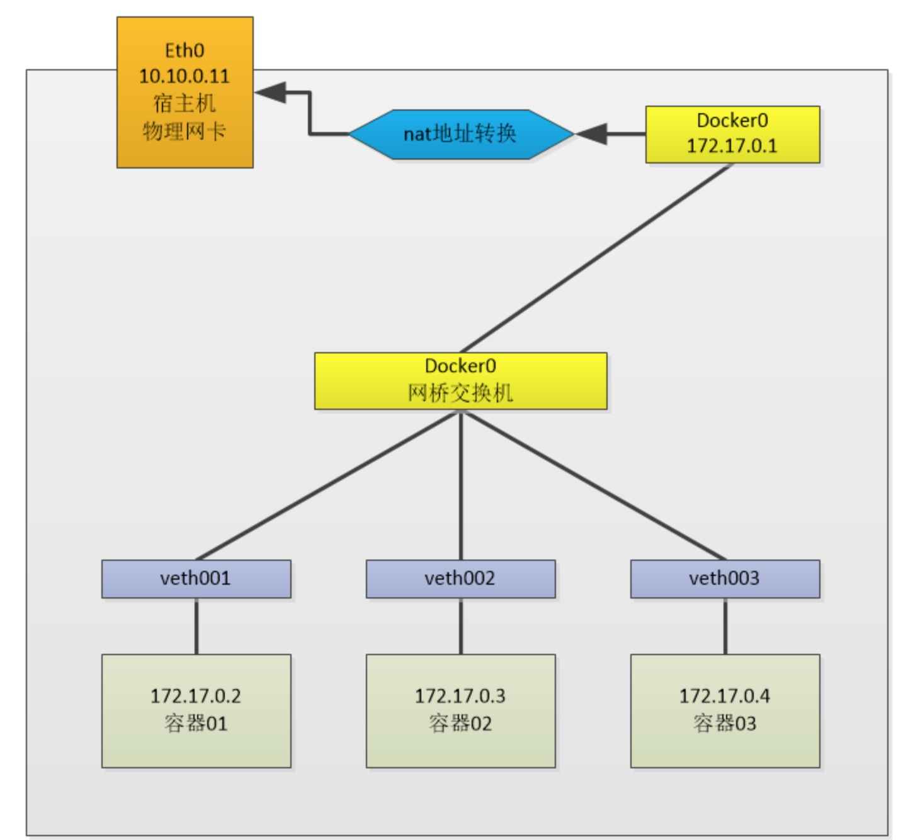
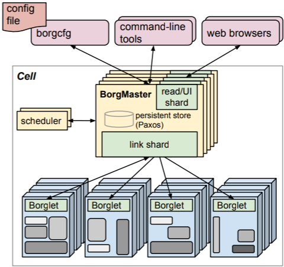
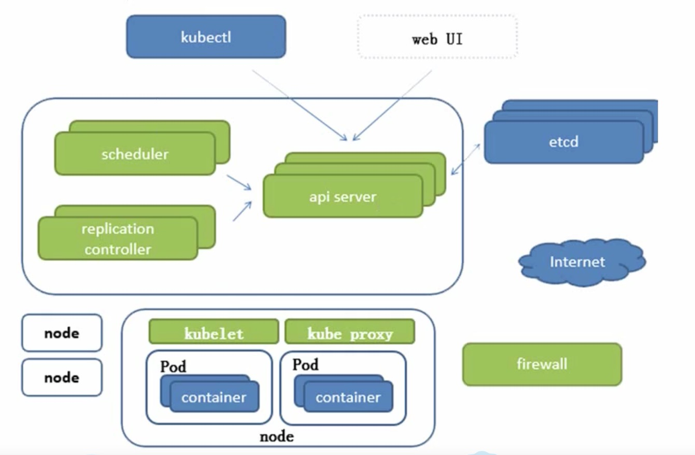
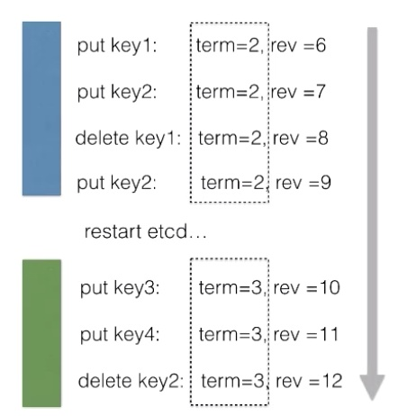
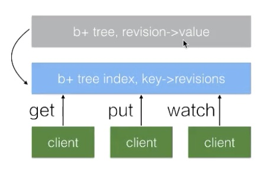
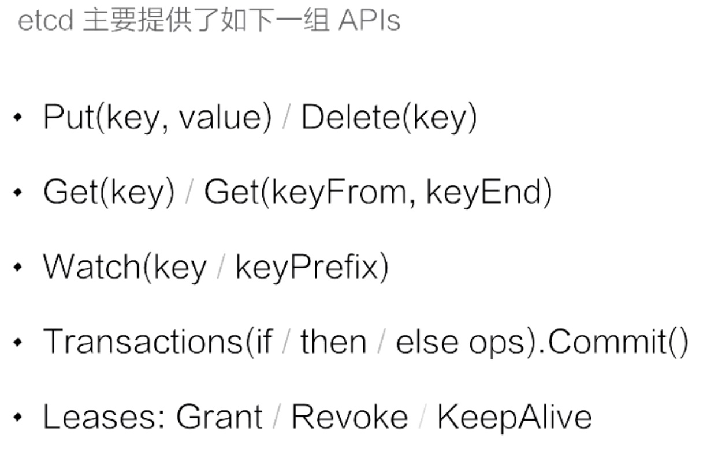
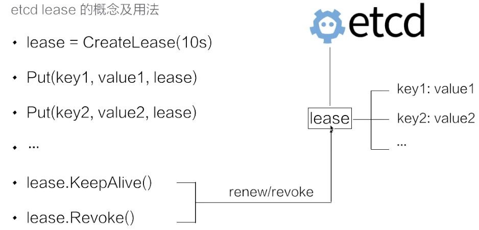
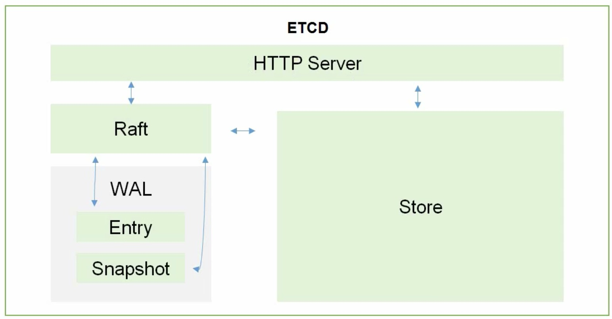
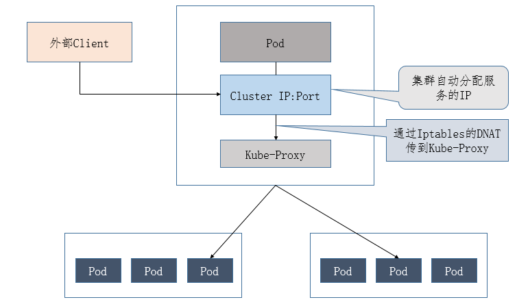
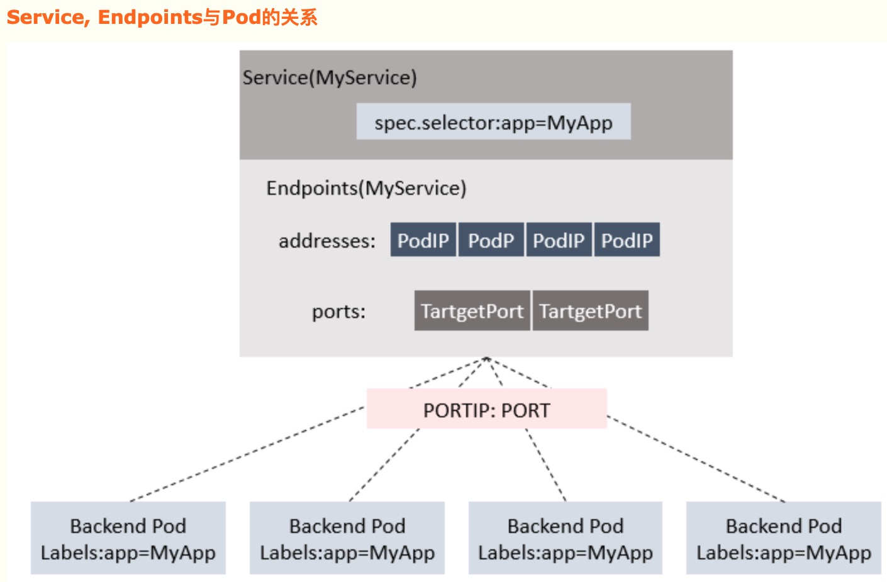

[TOC]

### Kubernetes

#### 引言

> Kuber'netes [kubə'netis] - K8s: K和s之间有八个字母，所以叫K8s

#### 资源管理器

> 在docker启动容器的时候，需要指定宿主机和容器虚拟端口的映射，见
>
> ```shell
> $ docker run -d -p 宿主机端口:容器端口 --name 容器名称 镜像的标识｜镜像名称[:tag]
> # -d:代表后台运行容器
> # -p 宿主机端口:容器端口 :为了映射当前Linux的端口和容器的端口（比如我想通过windows访问tomcat，需要通过windows访问Linux，再通过Linux访问容器端口从而找到最终访问的地点）
> # --name 容器名称：指定容器的名称
> ```
>
> 重点：比如我想通过windows访问tomcat，需要通过windows访问Linux，再通过Linux访问容器端口从而找到最终访问的地点
>
> 🌟docker的容器只能和宿主机通信
>
> 
>
> 如果在一台机器上运行几个容器的时候，容器的映射管理就比较复杂。比如在区块链中，运行两个peer的容器，那么映射端口访问的时候就开始复杂起来了。--需求产生：资源管理器

#### MESOS

> APACHE 分布式资源管理框架，2019-05 Twitter > Kubernetes

#### Docker Swarm

> 它是将一群Docker宿主机变成一个单一的虚拟主机，Swarm使用标准的Docker API接口作为其前端的访问入口，换言之，各种形式的Docker Client(compose,docker-py等)均可以直接与Swarm通信，甚至Docker本身都可以很容易的与Swarm集成，这大大方便了用户将原本基于单节点的系统移植到Swarm上，同时Swarm内置了对Docker网络插件的支持，用户也很容易的部署跨主机的容器集群服务。

> Docker Swarm 和 Docker Compose 一样，都是 Docker 官方容器编排项目，但不同的是，**Docker Compose 是一个在单个服务器或主机上创建多个容器的工具**，而 **Docker Swarm 则可以在多个服务器或主机上创建容器集群服务**，对于微服务的部署，显然 Docker Swarm 会更加适合。

> Swarm deamon只是一个调度器(Scheduler)加路由器(router),Swarm自己不运行容器，它只是接受Docker客户端发来的请求，调度适合的节点来运行容器，这就意味着，即使Swarm由于某些原因挂掉了，集群中的节点也会照常运行，放Swarm重新恢复运行之后，他会收集重建集群信息。

> Docker Swarm：没有滚动更新、回滚更新。

> 2019-07 阿里云 剔除 Docker Swarm使用选项

#### Borg

[Borg：Google集群管理大杀器](https://blog.csdn.net/u011387521/article/details/108231931)

> Borg系统主要由以下构成：
>
> 1.一系列机器 2.本地中心化控制器borgmaster 3.每台机器上运行的客户端 borglet
>
> 

##### borgmaster

> master用于处理客户端的RPC（remote procedure call, 远程过程调用）请求，改变集群中的资源状态或者响应数据只读访问请求。master还负责管理系统中的状态(machines,task,allocs...)，和Borglet通信，提供web UI。
>
> 在容错上，Borgmaster实际上有5个副本，逻辑上只有一个，通过Paxos协议选举逻辑上的leader。从选举leader到恢复数据大约要10s。master还会把自身某时刻的状态作为checkpoint存储到paxos store中。

##### scheduler 

> 当提交job时，borgmaster将它记录到paxos store中，并加入到task的**pending queue**。scheduler会扫描获取任务，然后调度到满足其需求的机器上。扫描过程是相对复杂的
>
> - [ ] 扫描过程：the scan proceeds from high to low priority, modulated by a round-robin scheme within a priority to ensure fairness across users and avoid head-of-line blocking behind a large job.

> 调度算法分为两部分：
>
> 1.feasibility checking，可行性检查，判断机器是否满足task的要求 2.scoring，通过对满足条件1中的机器打分，选择最合适的那个
>
> 这样一来，调度器的任务就是一个不断重复下面的流程：
>
> 1.从master抓取状态变更 2.更新本地状态拷贝 3.执行任务调度 4.通知master自己的调度情况

##### borglet

> Borgleft是每个机器(master除外)上都要运行的客户端，它负责任务的启动、停止、重启等，还负责管理机器资源、滚动debug日志、上报机器状态到master和监控系统。
>
> Borgmaster会主动从Borglet上polls信息，poll的频率可控制，这样Borgmaster可以控制系统中的通信频率，避免不必要的流程控制机制。
>
> 为了性能和扩展性，每个Borgmaster会运行无状态的副本，论文中称为link shard，来处理一些与Borglet的通信。在弹性方面，Borglet总是上报本节点的完整信息，link shard会对上报信息进行对比，只把不同的部分发送给状态机，降低master的更新负载。
>
> 当集群中的机器非常多时，Borg会把borglet分割为多个进行，提高吞吐量。

- [ ] Q？：当集群中的机器非常多时，Borg会把borglet分割为多个进行，提高吞吐量。

#### 引入K8s

> Google10年前就开始使用容器化的基础架构，内部使用Borg（博格）。Google利用borg的设计思路，用go语言翻写了一个类似的资源管理器，即K8s。Kubernetes总体而言你可以认为是Borg的一个开源的版本。Borg底层用的是lxc的容器，而Kubernetes是用的Docker容器。Borg是用C++编写的，Kubernetes是用Go语言编写的。Borg在集群调度的性能上做了很多的优化，Kubernetes还没有做非常多的优化，目前他在这方面还是比较土的，后面还有很多工作需要做。Borg的单集群能够调度的机器有上万台，而按Kubernetes目前只能支持几百台，这是目前的数据。

> 轻量级（GO编译型语言开发）、开源、弹性伸缩（需求变化的时候弹性变化节点）、负载均衡（IPVS）



##### scheduler

> 调度器，负责接受任务，选择合适的节点进行任务分配

##### replication controller

> 副本控制器。用来确保容器应用的副本数始终保持在用户定义的副本数。
>
> - [ ] 具体副本数定义是指什么？如何确认副本数数目？副本用来做什么？
>
> RC通过监控运行中的Pod来保证集群中运行指定数目的Pod副本。即如果有容器异常退出，会自动创建新的Pod来替代；而如果异常多出来的容器也会自动回收。

> - [ ] 在新版本的Kubernetes中建议使用ReplicaSet来取代replication controller
>
>   > ReplicaSet没有本质的不同，只是名字不一样，并且replicaSet支持集合式的selector

> 虽然ReplicaSet可以独立使用，但一般还是建议使用Deployment来自动管理ReplicaSet，这样就无需担心跟其他机制的不兼容问题（比如ReplicaSet不支持rolling-update但是Deployment支持）

##### etcd

[从零开始入门 K8s | 手把手带你理解 etcd](https://zhuanlan.zhihu.com/p/96721097)

> etcd 诞生于 CoreOS 公司，它最初是用于解决集群管理系统中 OS 升级的分布式并发控制以及配置文件的存储与分发等问题。基于此，etcd 被设计为提供高可用、强一致的小型 keyvalue 数据存储服务。

> etcd 是一个分布式的、可靠的 key-value 存储系统，它用于存储分布式系统中的关键数据，这个定义非常重要。

###### RAFT解决故障

> Raft算法解决故障：一个 etcd 集群，通常会由 3 个或者 5 个节点组成，多个节点之间通过 Raft 一致性算法的完成分布式一致性协同，算法会选举出一个主节点作为 leader，由 leader 负责数据的同步与数据的分发。当 leader 出现故障后系统会自动地选取另一个节点成为 leader，并重新完成数据的同步。客户端在多个节点中，仅需要选择其中的任意一个就可以完成数据的读写，内部的状态及数据协同由 etcd 自身完成。
>
> 在 etcd 整个架构中，有一个非常关键的概念叫做 quorum，quorum 的定义是 （n+1）/2，也就是说超过集群中半数节点组成的一个团体，在 3 个节点的集群中，etcd 可以容许 1 个节点故障，也就是只要有任何 2 个节点可用，etcd 就可以继续提供服务。同理，在 5 个节点的集群中，只要有任何 3 个节点可用，etcd 就可以继续提供服务，这也是 etcd 集群高可用的关键。

[分布式系统的Raft算法](https://www.jdon.com/artichect/raft.html)

[动画演示RAFT](https://www.jdon.com/artichect/raft.html)

> Consensus：指多个服务器在状态达成一致。
>
> 但是在一个分布式系统中，因为各种意外可能，有的服务器可能会崩溃或变得不可靠，它就不能和其他服务器达成一致状态。这样就需要一种Consensus协议，一致性协议是为了确保容错性，也就是即使系统中有一两个服务器当机，也不会影响其处理过程。

> 为了以容错方式达成一致，我们不可能要求所有服务器100%都达成一致状态，只要超过半数的大多数服务器达成一致就可以了，假设有N台服务器，N/2 +1 就超过半数，代表大多数了。
>
> Paxos和Raft都是为了实现Consensus一致性这个目标，这个过程如同选举一样，参选者需要说服大多数选民(服务器)投票给他，一旦选定后就跟随其操作。Paxos和Raft的区别在于选举的具体过程不同。

###### Term & Revision：

> Term：首先 etcd 中有个 term 的概念，代表的是整个集群 Leader 的任期。当集群发生 Leader 切换，term 的值就会 +1。在节点故障，或者 Leader 节点网络出现问题，再或者是将整个集群停止后再次拉起，都会发生 Leader 的切换。

> Revision：版本号。revision 代表的是全局数据的版本。当数据发生变更，包括创建、修改、删除，其 revision 对应的都会 +1。特别的，在集群中跨 Leader 任期之间，revision 都会保持全局单调递增。正是 revision 的这一特性，使得集群中任意一次的修改都对应着一个唯一的 revision，因此我们可以通过 revision 来支持数据的 MVCC，也可以支持数据的 Watch。



> 从一个更大的维度去看，可以发现在 term=2 和 term=3 的两个 Leader 任期之间，数据对应的 revision 值依旧保持了全局单调递增。

> 1. 在 etcd 中支持对同一个 Key 发起多次数据修改，每次数据修改都对应一个版本号。etcd 在实现上记录了每一次修改对应的数据，也就意味着一个 key 在 etcd 中存在多个历史版本。
> 2. 在查询数据的时候如果不指定版本号，etcd 会返回 Key 对应的最新版本，当然 etcd 也支持指定一个版本号来查询历史数据。
>
> ```java
> Put(key, value1); //revision = 5
> Put(key, value2); //revision = 6
> Get(key); //返回value2 (latest)
> Get(key, rev = 5); //返回value1
> ```

> 
>
> 如上图所示，etcd 中所有的数据都存储在一个 b+tree 中（灰色），该 b+tree 保存在磁盘中，并通过 mmap 的方式映射到内存用来支持快速的访问。灰色的 b+tree 中维护着 revision 到 value 的映射关系，支持通过 revision 查询对应的数据。因为 revision 是单调递增的，当我们通过 watch 来订阅指定 revision 之后的数据时，仅需要订阅该 b+ tree 的数据变化即可。
>
> 在 etcd 内部还维护着另外一个 btree（蓝色），它管理着 key 到 revision 的映射关系。当客户端使用 key 查询数据时，首先需要经过蓝色的 btree 将 key 转化为对应的 revision，再通过灰色的 btree 查询到对应的数据。
>
> etcd 将每一次修改都记录下来会导致数据持续增长，这会带来内存及磁盘的空间消耗，同时也会影响 b+tree 的查询效率。为了解决这一问题，在 etcd 中会运行一个**周期性的 Compaction 的机制**来清理历史数据，将一段时间之前的同一个 Key 的多个历史版本数据清理掉。最终的结果是灰色的 b+tree 依旧保持单调递增，但可能会出现一些空洞。

###### API

> API：我们可以通过 etcd 提供的客户端去访问集群的数据，也可以直接通过 http 的方式（类似 curl 命令）直接访问 etcd。同时 etcd 为了方便客户端去订阅数据的变更，也支持了一个 watch 机制，通过 watch 实时地拿到 etcd 中数据的增量更新，从而实现与 etcd 中的数据同步等业务逻辑。
>
> 

###### API-watch

> watch：因为 etcd 将每一次修改都记录了下来，使用 watch 订阅数据时，可以支持从任意历史时刻（指定 revision）开始创建一个 watcher，在客户端与 etcd 之间建立一个数据管道，etcd 会推送从指定 revision 开始的所有数据变更。
>
> ```java
> watcher = Watch(key, rev);
> for{
>   event = watcher.Recv();
>   handle(event);
>   ···
> }
> ```
>
> etcd 提供的 watch 机制保证，该 Key 的数据后续的被修改之后，通过这个数据管道即时的推送给客户端。

###### API-transactions

> mini-transactions：etcd 的 transaction 机制比较简单，基本可以理解为一段 if-else 程序，在 if 中可以提供多个操作。在 etcd 内部会保证整个事务操作的原子性。也就是说 If 操作所有的比较条件，其看到的视图一定是一致的。同时它能够确保多个操作的原子性不会出现 Then 中的操作仅执行了一半的情况。
>
> ```java
> Txn.if(
>   Compare(Value(key1), ">", "bar")), //当 Value(key1) 大于 "bar"
> 	Compare(Version(key1), "=", 2), //并且 Version(key1) 的版本等于 2 
> 	···
>   ).Then(
>     Put(key2, valueX), //修改 Key2 的数据为 valueX
>     Delete(Key3)··· //同时删除 Key3 的数据
>   ).Else(
>   	Put(key2, valueY)··· //Key2 修改为 valueY
>   ).Commit()
> ```
>
> 通过 etcd 提供的事务操作，我们可以在多个竞争中去保证数据读写的一致性，比如说前面已经提到过的 Kubernetes 项目，它正是利用了 etcd 的事务机制，来实现多个 KubernetesAPI server 对同样一个数据修改的一致性。

###### API-lease

> lease 是分布式系统中一个常见的概念，用于代表一个分布式租约。典型情况下，在分布式系统中需要去检测一个节点是否存活的时，就需要租约机制。

> 
>
> ```java
> //创建一个10s的租约，如果创建后不做任何的操作，那么10s之后会自动过期
> leaase = CreateLease(10s);
> //将 key1 和 key2 两个 key value 绑定到这个租约之上
> //这样当租约过期时 etcd 就会自动清理掉 key1 和 key2
> //使得节点 key1 和 key2 具备了超时自动删除的能力
> Put(key1, value1, lease);
> Put(key2, value2, lease);
> //如果希望这个租约永不过期，需要周期性的调用 KeeyAlive 方法刷新租约
> //···
> lease.KeepAlive();
> lease.Revoke();
> ```
>
> 通过租约检测节点是否存活：比如说需要检测分布式系统中一个进程是否存活，可以在进程中去创建一个租约，并在该进程中周期性的调用 KeepAlive 的方法。如果一切正常，该节点的租约会一致保持，如果这个进程挂掉了，最终这个租约就会自动过期。
>
> Multi-key关联到一个租约上：在 etcd 中，允许将多个 key 关联在同一个 lease 之上，这个设计是非常巧妙的，可以大幅减少 lease 对象刷新带来的开销。试想一下，如果有大量的 key 都需要支持类似的租约机制，每一个 key 都需要独立的去刷新租约，这会给 etcd 带来非常大的压力。通过多个 key 绑定在同一个 lease 的模式，我们可以将超时间相似的 key 聚合在一起，从而大幅减小租约刷新的开销，在不失灵活性同时能够大幅提高 etcd 支持的使用规模。

###### WAL(Write Ahead Log)

[[etcd raft模块分析--WAL日志]](https://my.oschina.net/fileoptions/blog/1825531)

[[etcd raft模块分析--snapshot]](https://my.oschina.net/fileoptions/blog/1637873)

> WAL，就是在执行真正的写操作之前先写一个日志。和它相对的是WBL（write behind log）。这些日志都会严格保证持久化，以保证整个操作的一致性和可恢复性。
>
> 与RAFT模块关联：WAL主要是用来持久化存储日志的，当raft模块收到一个proposal时就会调用Save方法完成。

> 
>
> Entry：Entry就表示提交的日志条目了，定义在raft.pb.go中，成员如下：
>
> ```go
> // Term：该条日志对应的Term
> // Index:日志的索引
> // Type:日志的类型，普通日志和配置变更日志
> // Data:日志内容
> type Entry struct {
> 	Term             uint64    `protobuf:"varint,2,opt,name=Term" json:"Term"`
> 	Index            uint64    `protobuf:"varint,3,opt,name=Index" json:"Index"`
> 	Type             EntryType `protobuf:"varint,1,opt,name=Type,enum=raftpb.EntryType" json:"Type"`
> 	Data             []byte    `protobuf:"bytes,4,opt,name=Data" json:"Data,omitempty"`
> 	XXX_unrecognized []byte    `json:"-"`
> }
> ```
>
> Snapshot：在raft协议中，snapshot主要用来压缩raft日志、减少raft日志的数量，一旦正确产生并持久化了一个snapshot，那么在这个snapshot之前的日志全部都可以直接丢掉。

> etcd是一个可信赖的分布式键值数据库，存储K8s集群所有重要信息（持久化）
>
> - [ ] 可信赖在于「单独支持集群化方案，不需要其他组件的参与」
>
> 协助分布式集群的正常运转：保存分布式集群需要的持久化的配置文件和配置信息
>

##### Kubelet

[io:kubelet](https://kubernetes.io/zh/docs/reference/command-line-tools-reference/kubelet/)

[kubelet 的工作流程](https://www.jianshu.com/p/4a068611b43e)

> kubernetes 是一个分布式的集群管理系统，在每个节点（node）上都要运行一个 worker **对容器进行生命周期的管理**，这个 worker 程序就是 kubelet。CRI(container runtime interface, 容器运行接口)，操作docker创建对应容器。直接跟容器引擎交互实现容器的生命周期管理。
>
> 简单地说，kubelet 的主要功能就是定时从某个地方获取节点上 pod/container 的期望状态（运行什么容器、运行的副本数量、网络或者存储如何配置等等），并调用对应的容器平台接口达到这个状态。

###### 容器管理

> 创建了容器之后，kubelet 还要查看容器是否正常运行，如果容器运行出错，就要根据设置的重启策略进行处理。
>
> 检查容器是否健康主要有三种方式：执行命令，http Get，和tcp连接。
>
> 不管用什么方式，如果检测到容器不健康，kubelet 会删除该容器，并根据容器的重启策略进行处理（比如重启，或者什么都不做）。

###### 容器监控

> kubelet 还有一个重要的责任，就是监控所在节点的资源使用情况，并定时向 master 报告。知道整个集群所有节点的资源情况，对于 pod 的调度和正常运行至关重要。
>
> kubelet 使用cAdvisor进行资源使用率的监控。cAdvisor 是 google 开源的分析容器资源使用和性能特性的工具，在 kubernetes 项目中被集成到 kubelet 里，无需额外配置。默认情况下，你可以在 localhost:4194 地址看到 cAdvisor 的管理界面。

##### Kube proxy

[Kubernetes核心组件kube-proxy](https://www.cnblogs.com/kevingrace/p/6655153.html)

###### Kube-proxy作用

> kube-proxy是Kubernetes的核心组件，部署在每个Node节点上，它是实现Kubernetes Service的通信与负载均衡机制的重要组件。kube-proxy负责为Pod创建代理服务，从apiserver获取所有server信息，并根据server信息创建代理服务，**实现server到Pod的请求路由和转发**，从而实现K8s层级的虚拟转发网络。具体来说，就是实现**集群内的客户端pod访问service**，或者是**集群外的主机通过NodePort等方式访问service**。

> 1. kube-proxy其实就是管理service的访问入口，包括集群内Pod到Service的访问和集群外访问service。
> 2. kube-proxy管理sevice的Endpoints，**该service对外暴露一个Virtual IP，也成为Cluster IP**, 集群内通过**访问这个Cluster IP:Port就能访问到集群内对应的serivce下的Pod**。
> 3. service是通过Selector选择的一组Pods的服务抽象，其实就是一个微服务，提供了服务的LB和反向代理的能力，而kube-proxy的主要作用就是负责service的实现。
>    - [ ] 提供了服务的LB（LoadBalancer）和反向代理的能力?
> 4. service另外一个重要作用是，一个服务后端的Pods可能会随着生存灭亡而发生IP的改变，service的出现，给服务提供了一个固定的IP，而无视后端Endpoint的变化。

> kubernetes还提供了一种在node节点上暴露一个端口，从而提供从外部访问service的方式
>
> ```go
> apiVersion: v1
> kind: Service
> metadata:
>   labels:
>     name: mysql
>     role: service
>   name: mysql-service
> spec:
>   ports:
> 	//在node上暴露出30964端口.
> 	//当访问node上的30964端口时，其请求会转发到service对应的cluster IP的3306端口
> 	//并进一步转发到pod的3306端口。
>     - port: 
>       targetPort: 
>       nodePort: 
>   type: NodePort
>   selector:
>     mysql-service: "true"
> ```
>
> 
>
> 访问Service的请求，不论是**Cluster IP+TargetPort**的方式（集群内部访问）；还是用**Node节点IP+NodePort**的方式（外部访问），都被Node节点的Iptables规则重定向到Kube-proxy监听Service服务代理端口。kube-proxy接收到Service的访问请求后，根据负载策略，转发到后端的Pod

###### service

> 1. 在k8s中，**提供相同服务的一组pod**可以抽象成一个service，通过service提供的统一入口对外提供服务，每个service都有一个虚拟IP地址（VIP）和端口号供客户端访问。
> 2. service是一组pod的服务抽象，相当于一组pod的LB（LoadBalancer，负载均衡器），负责将请求分发给对应的pod。
> 3. kube-proxy存在于各个node节点上，主要用于Service功能的实现，具体来说，就是实现集群内的客户端pod访问service，或者是集群外的主机通过NodePort等方式访问service

> - [ ] 实现服务映射访问，默认操作firewall
>
>新版本支持IPVS

IMPORTANT：service就是将提供相同服务的pod进行分组，在需要相应服务的pod的时候，通过Cluster IP锁定到提供需要的服务的service组别中，再通过TargetPort获取一个pod来进行服务。

###### service、endpoints与pod的关系



[k8s中的endpoints](https://blog.csdn.net/luanpeng825485697/article/details/84296765)

> 1. service通过selector和pod建立关联（选择哪些pod组成一个service统一入口，service提供对外提供服务的统一入口cluster IP）。k8s会根据service关联到**pod的podIP信息组合成一个endpoint**。endpoint是k8s集群中的一个资源对象，**存储在etcd中，用来记录一个service对应的所有pod的访问地址。**
> 2. service配置selector，endpoint controller才会自动创建对应的endpoint对象；否则，不会生成endpoint对象。若service定义中没有selector字段，service被创建时，endpoint controller不会自动创建endpoint。例如，k8s集群中创建一个名为k8s-classic-1113-d3的service，就会生成一个**同名的endpoint对象**。
> 3. endpoint controller：endpoint controller是k8s集群控制器的其中一个组件。负责生成和维护所有endpoint对象的控制器、负责监听service和对应pod的变化。
>    - 监听到service被**删除**，则删除和该service同名的endpoint对象。监听到新的service被**创建**，则根据新建service信息获取相关pod列表，然后创建对应endpoint对象。监听到service被**更新**，则根据更新后的service信息获取相关pod列表，然后更新对应endpoint对象。
>    - 监听到pod事件，则更新对应的service的endpoint对象，将podIp记录到endpoint中

##### kube-proxy iptables 与 IPVS

[k8s中的endpoints](https://blog.csdn.net/luanpeng825485697/article/details/84296765)

[Kubernetes核心组件kube-proxy](https://www.cnblogs.com/kevingrace/p/6655153.html)

#### Pod

> 在传统docker中，每一个docker容器都是独立存在，都有各自的ip地址，挂载卷等等。有些容器的关系应该能够直接互相“见面”（localhost访问）。例如区块链某两个节点之间的访问，如果可以localhost访问会十分便捷。--K8s定义了一个新的概念：pod

> 在 kubernetes 的设计中，最基本的管理单位是 pod，而不是 container。pod 是 kubernetes 在容器上的一层封装，由一组运行在同一主机的一个或者多个容器组成。如果把容器比喻成传统机器上的一个进程（它可以执行任务，对外提供某种功能），那么 pod 可以类比为传统的主机：它包含了多个容器，为它们提供共享的一些资源。
>
> 之所以费功夫提供这一层封装，主要是因为容器推荐的用法是里面只运行一个进程，而一般情况下某个应用都由多个组件构成的。
>
> pod 中所有的容器最大的特性也是最大的好处就是共享了很多资源，比如网络空间。pod 下所有容器共享网络和端口空间，也就是它们之间可以通过 localhost 访问和通信，对外的通信方式也是一样的，省去了很多容器通信的麻烦。
>
> 除了网络之外，定义在 pod 里的 volume 也可以 mount 到多个容器里，以实现共享的目的。
>
> 最后，定义在 pod 的资源限制（比如 CPU 和 Memory） 也是所有容器共享的。

> pod在运行的时候，就会立即启动一个叫做PAUSE的容器。PAUSE容器就是一个共享容器。
>
> 共享网络栈：pod内封装几个容器，同一个pod内的容器共享一个网络栈，相当于本地网络，容器之间可以通过localhost访问。
>
> 共享存储卷：？

##### RS- ReplicaSet

参见上面的RC - Replication Controller

##### HPA - Horizontal Pod Autoscaling

> HPA仅适用于Deployment和RS。在V1版本的时候仅支持根据Pod的CPU利用率扩缩容，在 v1-alpha版本中，支持根据内存和用户自定义的metric扩缩容。

> 实现弹性伸缩。比如规则要求（CUP > 80  MAX 10 MIN 2）

##### StatefulSet

> RS和Deployment是为无状态服务而设计
>
> StatefulSet是为了解决有状态服务的问题

> 应用场景包括：
>
> 1.稳定的持久化存储。即Pod重新调度后还是能访问到相同的持久化数据，基于PVC来实现。、
>
> - [x] 持久化存储数据。比如某一个POD在杀死之后，然后在调度回来，调度一个新的Pod去取代的时候，它的存储用到的依然还是之前的存储，并且里面的数据也不会丢失。
>
> 2.稳定的网络标志。即Pod重新调度后起PodName和HostName不变，基于Headless Service（即没有Cluster IP的Service）来实现。
>
> - [x] 网络标识。之前的Pod名、主机名都依然被继承了下来。防止在集群调度的过程中，由于新的pod取代了旧pod的时候名字的变化，需要重新写入
>
> 3.有序部署，有序拓展。即Pod是有顺序的，在部署或者拓展的时候要依据定义的顺序依次进行（即从0 - N-1，在下一个Pod运行之前所有之前的Pod必须都是Running和Ready状态），基于init containers来实现

##### DaemonSet

> DaemonSet确保全部（或者一些）Node上运行一个Pod副本。当有Node加入集群时，也会为他们新增一个Pod。当有Node从集群移除时，这些Pod也会被回收。删除daemonSet将会删除它创建的所有Pod。
>
> - [ ] Node运行有且只有一个Pod？后续确认。
>
>   > 如果需要使用daemonSet去执行不同的三个进程Pod，可以整3个daemonSet，也可以提取这三个主要进程作为容器放在同一个Pod里。

> - [ ] 使用DaemonSet的一些典型用法：（后续深入了解）
>
>   > 1.运行集群存储daemon，例如在每个Node上运行glustcrd、ccph
>   >
>   > 2.在每个Node上运行日志收集daemon，例如fluentd、logstash
>   >
>   > 3.在每个Node上运行监控daemon，例如Prometheus Node Exporter

