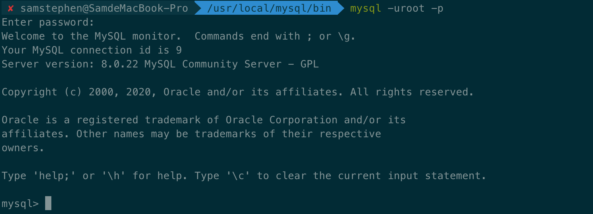

[TOC]

### 0.安装 

[MySQL正版安装网页](https://downloads.mysql.com/archives/community/)

[MySQL for Mac 安装教程](https://www.jianshu.com/p/199492627ccc)

​		正版下载的页面是这样显示的，不要去野网页里面下载。


---

#### 配置终端配置文件

1.mysql检查

```shell
# 直接输入mysql会报错，command not found
$ mysql
>>> command not found
# 检查mysql安装完成
$ cd /usr/local/mysql/bin
$ ls
>>> 显示出相应的mysql文件
```

2.添加环境路径

```shell
# 配置文件加入环境路径
$ vi ~/.zshrc
# 添加在末尾
PATH=$PATH:/usr/local/mysql/bin
# 生效
$ source ~/.zshrc
```

#### 登陆MySQL

```shell
# 配置完成之后直接使用mysql会发现不能使用，但是不再是command not found
# access denied for this.user
$ mysql
>>> ERROR 1045 (28000): Access denied for user 'samstephen'@'localhost' (using password: NO)
```

```shell
# root权限登陆
$ mysql -uroot -p
# 输入登录密码即可进入操作
```



```shell
# 退出mysql，直接输入exit即可
mysql> exit
```

#### 可视化界面

​		可以使用可视化软件navicat

