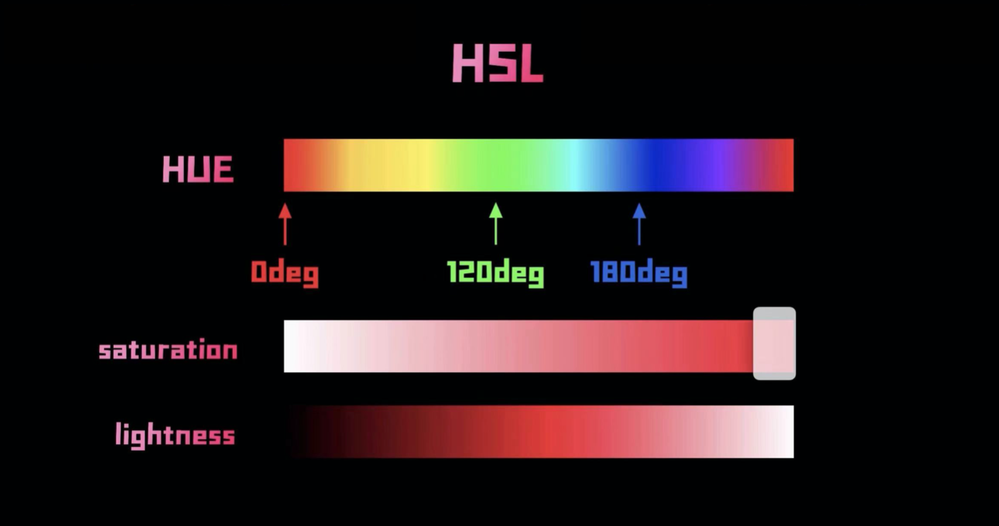
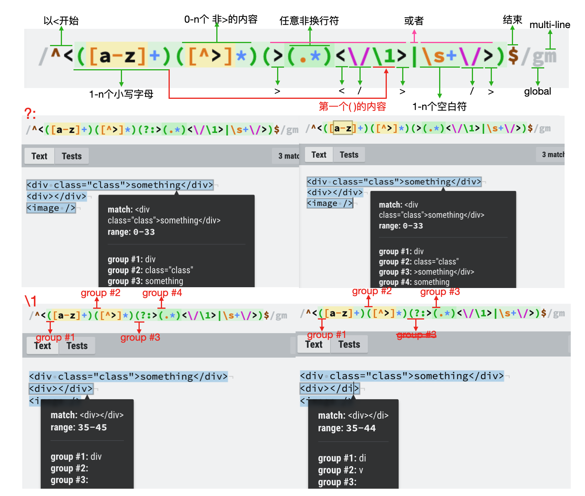
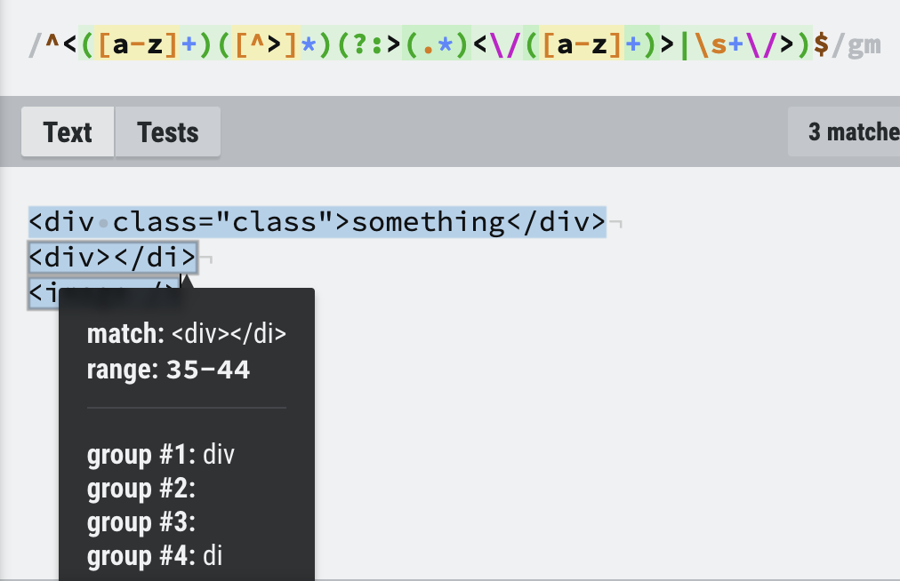
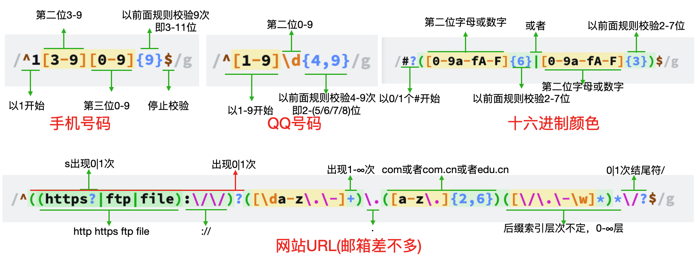

[TOC]

### 1. 颜色三种表示方式

#### `#000000` 及  `rgb` & `rgba`


​	最简单的两种是使用`rgb`以及十六进制的表示方法`#000000`。其中`rgba`是添加了表示透明度的字段，`0`表示全透明，`1`表示不透明。

#### `hsl`



​	`HSL`即`hue色相`、`saturation饱和度`和`lightness亮度`。同时HSL提供透明度属性`alpha`，从`0%`全透明到`100%`不透明。

```css
* {
  background: hsl(120deg, 100%, 50%, 100%);
}
```

****

### 2. 正则表达式

参考：1.[test和match的用法](https://blog.csdn.net/weixin_39818813/article/details/79731542)；2.[bilibili：JavaScript 10个常用正则表达式](https://www.bilibili.com/video/BV1QK4y1K72U) 3.[测试网站RegExr](https://regexr.com)。

#### 2.1 基础

##### 1. `?`、`+`、`*`及`{n,m}`

​	针对前面的一个字符，如果有括号括起来就算是一个字符整体。

`?`：匹配0｜1次，即最多只能出现一次。如果出现在`?`、`+`、`*`后面，表示由贪婪（最大匹配）变成非贪婪（最小匹配）。

`+`：匹配1-n次，即最少出现一次。

`*`：匹配0-n次。

`{n,m}`：匹配最少n次，最多m次；也可直接使用一个参数`{k}`，即匹配k次(包括这一次)。

****

##### 2. `\d`、`\w`、`\s`、`\S`、`.`

`\d`：(digit)表示`[0-9]`，在Javascript中可用，在其他语言中慎用。

`\w`：表示字母`[a-zA-Z]`、数字`[0-9]`和下划线`[_]`。

`\s`：匹配**所有空白符**，包括换行，等价于 `[ \f\n\r\t\v]`(注意有空格)。

`\S`：匹配任何非空白字符。等价于`[^ \f\n\r\t\v]`(注意有空格)。

`.`：表示换行符`\n`以外的所有字符。

****

##### 3. `^`、`$`、`|`、`\`

`^`：在中括号`[]`外面表示开始标志；在中括号里面使用表示`非`。

`$`：结束符号。`/[0-9]$/g`。

`|`：或者。注意这个符号是以**前后一串字符**为单位，比如`/0[1-9]|[12][0-9]|3[01]$/g`。

`\`：转义字符。如想要匹配`.`、`/`，就需要转义成`\.`、`\/`。

****

##### 4. `()`、`\1`、`?:`

- [x] 有时候我们不仅需要查看字符串是否匹配规则，还想要在匹配的同时获取一些数据。这时候使用`()`就可以选择获得内容；`\1`表示第一个括号获取的内容，`\2`表示第二个括号获取的内容······；但是有时候我们使用括号是因为作为一个整体，而并不想要获取里面的内容，就需要使用`?:`。



`?:`：可以看到使用`?:`之后，本选择组`()`的内容不会再进行选择记录，但是不影响本选择组里面的选择组。即屏蔽了右侧`group #3`的内容，但是并不影响原本的`group #4`；屏蔽之前有4组选择组，屏蔽之后`group #3`去除，`group #4`变为`group#3`。使用`?:` 的原因是，我们并不需要原本`group #3`的内容，但是由于`|`或者的判断，需要将前后的一长串字符作为判断单位；因此这时候需要选择组的作用，但不需要选择组的内容。

`\1`：`\1`是当前匹配字段和`group #1`所匹配的字段。可以看到将后面的`/div`改成了`/di`之后，`group #1`的内容就变成了`di`。如果我们不使用`\1`，而复制粘贴相同的规则，可以看到各自判断各自的内容：`group #1`的内容是`div`，`group #4`的内容是`di`。按照正确的使用场景，应该各自判断获取内容，然后再进行判断是否内容一致，内容不一致说明标签匹配错误；一致才能说明标签使用正确。



****

#### 2.2 常用正则表达式



```js
// 手机号码
let phoneReg = /^1[3-9][0-9]{9}$/g;
// QQ号码, js里面\d等同于[0-9]，如果是其他语言要注意，\d包括除了0-9之外的其他数字字符 
let qqAcountReg = /^[1-9]\d{4,9}/g; // \d <=> [0-9]
// 十六进制颜色匹配
let colorReg = /#?([0-9a-fA-F]{6}|[0-9a-fA-F]{3})$/g; // #000000; 000000; #000;
// 邮箱地址
let mailReg = /^([a-zA-Z0-9_\-\.])+@([a-zA-Z0-9_\-\.])+\.([A-Za-z]{2,4})$/g;
// URL
let urlReg = /^((https?|ftp|file):\/\/)?([\da-z\.\-]+)\.([a-z\.]{2,4})([\/\.\-\w]*)*\/?$/g;
// html标签/爬虫
let elReg = /^<([a-z]+)([^>]*)(?:>(.*)<\/([a-z]+)>|\s+\/>)$/gm; // m表示匹配多行，各行都按照该规则匹配
// ipv4
let ipv4Reg = /^(([01]?[0-9][0-9]?|2[0-4][0-9]|25[0-5])\.){3}([01]?[0-9][0-9]?|2[0-4][0-9]|25[0-5])$/g;
// 日期 2021-03-01
let dateReg = /^[0-9]{4}-(0[1-9]|1[0-2])-(0[1-9]|12[0-9]|3[01])$/g;
// 身份证 正则部分(还需要通过权重判断)
let idReg = /^[1-9][0-9]{5}(18|19|[23][0-9])[0-9]{2}(0[1-9]|1[0-2])(0[1-9]|[12][0-9]|3[01])[0-9]{3}[0-9xX]$/g;
```

`身份证权重计算`：

```js
// 身份证前17位与各自权重相乘得出总数，取余之后根据相应的数组得出最后一位；
// 根据上面的生成规则对比即可得出身份证是否正确
// 1.身份证号前17位的权重因子
const factor = [7, 9, 10, 5, 8, 4, 2, 1, 6, 3, 7, 9, 10, 5, 8, 4, 2];
// 2.身份证号最后一位校验位的对应11的余数
const parity = [1, 0, 'X', 9, 8, 7, 6, 5, 4, 3, 2]; 
// 假如idCard为输入的身份证号码
var idCard = '';
// code为身份证最后一位校验码
let code = idCard.substring(17);
// 根据权重因子计算出总数
let sum = 0;
for (let i = 0; i < 17; i++) {
  sum += str[i] * factor[i];
}
// 判断是否正确
if (parity[sum % 11].toString() !== code.toUpperCase()) {
	return false;
}
```

****

#### 2.3 `text | match`判断是否符合规定的正则：

```js
let phoneReg = /^1[3-9][0-9]{9}$/g;
let phoneNum = '13120030000';
// test是regExp的方法，参数是字符串，返回值返回true｜false
if (!phoneReg.test(phoneNum)) {
	return false;
}
// match是String的方法，参数是正则表达式，返回值是数组
if(phoneNum.match(phoneReg) === null) {
  return false;
}
```


