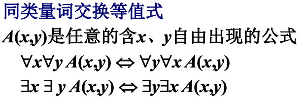

[TOC]

### 一. 命题逻辑

#### 1. 命题符号化 & 联结词

`命题`：能判断真假（或判断结果唯一）的陈述句。

`命题的真值`：判断的结果。

`真值的取值`：真与假

`真命题`：真值为真的命题

`假命题`：真值为假的命题

---

##### 非命题

> 真值不确定、疑问句、感叹句、祈使句、悖论都不是命题
>
> 
>
> => **命题是真值存在且唯一的陈述句**。

---

##### 简单命题 & 复合命题

`简单命题` / `原子命题`：简单陈述句构成的命题

`命题符号化`：用小写英文字母p, q, r, ··· , pi, qi, ri（i≥1）来表示简单命题

`命题真值符号化`：用“1”表示真，用“0”表示假

`命题常项` / `命题常元`：简单命题

`命题变项` / `命题变元`：真值可以变化的简单陈述句 => [**命题变项不是命题**]()

`复合命题`：由简单命题用联结词联结而成的命题

---

##### 联结词

`¬`否定联结词

`∧`合取联结词 => `合取式` `p并且q` `p∧q ` 只有`1∧1 = 1`

`∨`析取联结词  => `析取式` `p或q` `p∨q` => 只有`0∨0 = 0`

`->`蕴涵联结词 => `蕴涵式` `如果p,则q` `p->q` => 只有 `1->0 = 0` `p为前件` `q为后件`

`<->`等价联结词 => `等价式` `p当且仅当q` `p<->q` => `p, q同值为1` `p, q异值为0`

=> 联结词的**优先顺序**从高到低是：`¬` `∧` `∨` `-> ` `<->`

---

###### 考点：命题符号化

---

##### 相容或 & 排斥或

`相容或`：二者能够同时取真值。

> 

`排斥或`：二者不能够同时取真值。

> 必须写成排斥或：小明只能拿一个苹果或一个梨
>
> 可以写成相容或：生于1975年或1976年（因为逻辑上已经排斥了，所以可以写成相容或）
>
> 

---

#### 2. 命题公式及分类

`公式` / `合式公式` / `命题公式`：六种状态组合`原子公式`、`¬`、`∧`、`∨`、`->`、`<->`

> 
>
> **IMPO**：第五章的`归纳定义` related

---

##### 公式层次gra/复杂度deg

​	层次`gra(dation)`和复杂度`deg(ree)`含义一致，是两本书的两种不同说法。

> 
>
> 简单来说就是：
>
> 1.原子命题`deg=0`；
>
> 2.每使用`¬`、`∧`、`∨`、`->`、`<->`一次都按照`max(deg(A), deg(B))`进行`deg++`
>
> `e.g.`:  `deg(¬p∨q)` = `max(deg(¬p), deg(q)) ++` = `max(1, 0) ++` = `1++` = `2`

---

##### 公式赋值

`成真赋值`：使公式为真的赋值

`成假赋值`：使公式为假的赋值

###### 考点：真值表

> 

---

##### 公式类型

`重言式` / `永真式`：公式A无成假赋值

`矛盾式` / `永假式`：公式A无成真赋值

`可满足式`：A不是矛盾式。这里答题有时候可以细化到`重言式` & `非重言式的可满足式`

---

##### 真值函数

​	n元函数的真值函数是所有可能取值的全集（`n元`指n个命题变项），故n元函数的真值函数共22n个。

> `定义域`：{`00..0`, `00..1`, ···, `11..1`}，共2n种取值。
>
> `值域`：{`0`, `1`}，共两种取值。
>
> 对于某一个真值函数中每一种定义域取值，都有两种取法，即`F(00..0) = {0, 1}`。
>
> 故n元函数总共有22n个真值函数。
>
> 

###### 考点：记住真值函数结论即可 : n元函数共有22n个真值函数

---

#### 3. 等值演算

##### 等值式

​	若等价式`A<->B`是**重言式**，则称**A**与**B**等值， 记作`A<=>B`，并称`A<=>B`等值式。

`哑元`：相对于整个式子出现的所有元来说，相对于某一侧来说没有出现的元。

> 

****

###### 背诵：等值式

> 
>
> 
>
> 

​	分成五大块背诵**34225**共16个24条：

> ---
>
> **Block1**：`¬`、`∧`、`∨`变化最终变成`A`
>
> `双重否定律`：`¬¬A <=> A`
>
> `等幂律`：`A∨A <=> A`	`A∧A <=> A`
>
> `吸收律`：`A∨(A∧B) <=> A`	``A∧(A∨B) <=> A`` 
>
> ---
>
> **Block2**：类似于加减乘除的一些**基础运算**
>
> `交换律`：`A∨B <=> B∨A` 	`A∧B <=> B∧A` 
>
> `结合律`：`(A∧B)∧C <=> A∧(B∧C)`	`(A∨B)∨C <=> A∨(B∨C)`
>
> `分配律`：`A∨(B∧C) <=> (A∨B)∧(B∨C)`	`A∧(B∨C) <=> (A∧B)∨(B∧C)`
>
> `德·摩根律`：`¬(A∨B) <=> ¬A∧¬B`	`¬(A∧B) <=> ¬A∨¬B`
>
> ---
>
> **Block3**：`A`和0/1捣腾的全作用或零作用
>
> `零律`：`A∨1 <=> 1`	`A∧0 <=> 0` (A的作用为零，与A无关，故叫零律)
>
> `同一律`：`A∨0 <=> A`	`A∧1 <=> A` (全看A，即跟A同一，故叫同一律)
>
> ---
>
> **Block4**：`A`自己捣腾
>
> `排中律`：`A∨¬A <=> 1`
>
> `矛盾律`：`A∧¬A <=> 0`
>
> ---
>
> **Block5**：
>
> `蕴含等值式`：`A->B <=> ¬A∨B`	(有钱就还你 <=> 要么没钱，要么还你)
>
> `假言易位`：`A->B <=> ¬B->¬A `	(有钱就还你 <=> 没还说明没钱)
>
> `等价等值式`：`A<->B <=> (A->B)∧(B->A) `
>
> `等价否定等值式`：`A<->B <=> ¬A<->¬B`
>
> `归谬论`：`(A->B)∧(A->¬B) <=> ¬A `	(前提假无论如何结论如何都真，无论如何都真说明前提假)

---

###### 考点：等值演算

1.如果强调`用等值演算法证明`，需要用上述`等值式`进行推导。要在公式后面添加名称（不添加只是相应扣点分）。

> 
>
> 一般的技巧是从`<->`由**等价等值式**推导`->`再由**蕴涵等值式**推导`∨`，再去利用Block1234

2.如果没有强调，使用`真值表`计算出`<=>`两侧的真值表一致即可。

---

#### 4. 范式

##### 简单析取式 & 简单合取式

1.联结词只有`¬`、`∧`、`∨`	

2.否定词`¬`只用来否定元（零层公式，如p, q, r ）

`简单析取式`：仅由有限个命题变项或其否定构成的**析取式**（联结词是`∨`）

> e.g. `p`, `¬p`, `p∨¬q`, `p∨q∨r`,···

`简单合取式`：仅由有限个命题变项或其否定构成的**合取式**（联结词是`∧`）

> e.g. `p`, `¬p`, `p∧¬q`, `p∧q∧r`,···

---

##### 析取范式 & 合取范式

`范式`：析取范式与合取范式的总称。

`析取范式`：由有限个简单合取式组成的析取式，即`简单合取式`通过析取联结词`∨`组合而成。

> e.g. `p∧¬q∧r`, `¬p∨q∨¬r`, `(p∧¬q)∨(q∧r)`

`合取范式`：由有限个简单析取式组成的合取式，即`简单析取式`通过合取联结词`∧`组合而成。

> e.g. `p∧¬q∧r`, `¬p∨q∨¬r`, `(p∨¬q)∧(q∨r)`

=> Q：怎么看待`p∧¬q∧r`, `¬p∨q∨¬r`既是析取范式，又是合取范式？

> `(p)∧(¬q)∧(r)`分开看是合取范式，`(p∧¬q∧r)`整体看是析取范式（由一个简单合取式与0析取`∨0`组成）

> `(¬p)∨(q)∨(¬r)`分开看是析取范式，`(¬p∨q∨¬r)`整体看是合取范式（由一个简单析取式与1合取`∧1`组成）

****

###### 考点：求范式

> 注意简单析/合取式的总结：1.联结词只有`¬`、`∧`、`∨`	2.否定词`¬`只用来否定元（零层公式，如p, q, r ）。因此步骤就是`消除联结词 -> 移动否定词 -> 组合范式`
>
> 1.利用等价等值式`A<->B <=> (A->B)∧(B->A) `和蕴含等值式`A->B <=> ¬A∨B`消`->`&`<->`
>
> 2.移动否定联结词`¬`只用来否定元`¬p`
>
> 3.分配律

---

##### 极小项 & 极大项

​	`简单析/合取式`每个`元`及其`否定元`有且仅有一个出现一次。1.`元`及`否定元`只出现一个 2.只出现一次。(e.g.见下表)

​	因此n元命题变项产生 2n 个极小项和 2n 个极大项。

> `极小项`：不断取`∧`会不断限定范围，因此以`小`命名，用`m`表示。
>
> `极大项`：不断取`∨`会不断扩大范围，因此以`大`命名，用`M`表示。
>
> `极小项`用`成真赋值`取下标：`∧`有唯一取值`1∧1 = 1`
>
> `极大项`用`成假赋值`取下标：`∨`有唯一去值`0∨0 = 0`

****

##### 主析取范式 & 主合取范式

****

###### 考点：求主析/合取范式

​	求范式有两个方法，第一个式`真值表`法，第二个是`等值演算法`正儿八经地按照`求范式` -> `化极项` -> `换极项`的步骤。

​	看懂下面的两个例子就差不多了。

1.真值表法（没强调用`等值演算法`）

>
>
>其中`m`取`成真赋值`，`M`取`成假赋值`。上面极项中已经说明为何。

2.等值演算法（如果有强调一定要用）

> 

> 整体步骤：`求范式` -> `化极项` -> `换极项`
>
> 其中`化极项`的时候需要一些律来无中生有，如排中律`A∨¬A <=> 1`和矛盾律`A∧¬A <=> 0`。
>
> **IMPO例子**：
>
> > 1.先求范式
> >
> > 
> >
> > 2.化极项(这里需要把两个`简单式`都化一下`p∧q`以及`r`)
> >
> > > 由于`p∧q`是简单合取式，进行`∧1`操作对原式无影响，使用排中律`A∨¬A <=> 1`
> > >
> > > 
> > >
> > > 同理，对`r`也使用排中律进行操作
> > >
> > > 
> >
> > 3.换极项(上述操作已经换了)得出主范式
> >
> > 

****

##### 本节整体流程

1.由`∨`和`¬`组成的`简单式`

2.通过`∧/∨`不断组合形成`范式`

3.通过`极小/大项`替换其中的`简单式`形成`主范式`

****

##### 主范式的作用

​	主范式由于可以和`真值表`相关联（`成真赋值`和`成假赋值`直接写出主范式），而真值表本身能判断`公式类型`、`公式是否等值`。因此主范式1.`能写出真值表` 2.`判断公式类型` 3.`判断公式是否等值`(主范式一模一样则等值)

****

### 二. 一阶逻辑

#### 1. 一阶逻辑基本概念

###### `个体词（个体）`

> **所研究对象中可以独立存在的具体或抽象的客体**
>
> `个体常项`：具体的或特定的事物，用`a`,`b`,`c`表示
>
> `个体变项`：抽象的或泛指的事物，用`x`,`y`,`z`表示
>
> `个体域`：个体变项的取值范围。**有限个体域**如{a,b,c}, {1,2}；**无限个体域**如N, Z, R, ...；**全总个体域**宇宙间一切事物组成。

###### `谓词`

> **表示个体词性质或相互之间关系的词** => 性质/关系
>
> `谓词常项`：F(a)：a是人
>
> `谓词变项`：F(x)：x具有性质F
>
> 
>
> `0元谓词`：不含个体变项的谓词，即**命题常项**或**命题变项**
>
> `n元谓词`：含n个（n≥1）个体词的谓词
>
> > `一元谓词`：表示个体词的性质
> >
> > `多元谓词`：表示个体词之间的关系

###### `量词`

> **表示数量的词**
>
> : 表示任意的**,** 所有的**,** 一切的
>
> : 表示存在**,** 有的**,** 至少有一个
>
> 全称量词
>
> 

****

###### 考点：命题符号化

​	在一阶逻辑符号化的时候必须**明确个体域**。题目中没给个体域，使用全总个体域。

​	在第一章的命题逻辑中也有命题符号化。看懂下面几题即可。

> **T1: 2是偶数**
>
> 1.命题逻辑：设p: 2是偶数，符号化为p
>
> 2.一阶逻辑：设a: 2，F(x): x是偶数，符号化为F(a)

> **T2: √2是无理数仅当√3是有理数**
>
> 1.命题逻辑：设p: √2是无理数， q: √3是有理数，符号化为p->q
>
> 2.一阶逻辑：设F(x): x是无理数，G(x): x是有理数，a: √2，b: √3，符号化为F(a) -> G(b)

> **T3:** 
>
> 

****

#### 2. 一阶逻辑公式

###### `字母表`

> 

###### `项`

> 个体常项、个体变项是项，由它们构成的n元函数和复合函数还是项。
>
> 

###### `原子公式`

> `F(x, y)`,` F(f(x,y), g(x,y))` 均为原子公式
>
> 

###### `合式公式`

> 

###### `自由出现` & `约束出现`

> 
>
> 自由出现：前面无限定。
>
> 约束出现：前面有限定。
>
> 

###### `闭式` & `换名规则`

> `闭式`：没有自由出现的个体变项的公式。
>
> `换名规则`：由于公式中的`x`既有自由出现，又有约束出现。利用换名统一其出现。
>
> 

###### `解释` & `赋值` 

> 对于给定的**闭式**，只需要解释就能够使之成为一个可以判断的命题；
>
> 对于给定的**非闭式**（有自由出现的元），不仅需要解释，还需要赋值。
>
> 理解下面的例子即可：
>
> 
>
> 其中 `令y=1`是对自由变元进行`赋值`，才能够使非闭式成为一个可以判断的命题。

###### `分类`

> 根据对闭式/非闭式的解释情况，不同的解释都可以得到一个真/假结果。
>
> `逻辑有效式` / `永真式`：在任何解释和该解释下的任何赋值下都为真
>
> `矛盾式` / `永假式`：在任何解释和该解释下的任何赋值下都为假
>
> `可满足式`：至少存在一个解释和该解释下的一个赋值是真。
>
> 
>
> **谓词公式的可满足性是不可判定的（有的个体域无法穷举）**
>
> **特定的谓词公式的可满足性是可判定的**
>
> > 这里的`谓词公式`是以一个概念来说，因为对于非确定的谓词公式，可能存在成真赋值，但是你所罗列出来很多成假赋值，并不代表没有成真赋值；即有时候无法找到成真/成假赋值，但也不能言之凿凿地确认其是否为永真/永假。

`代换实例`

> 从上面可以看到，通过解释+赋值的当时能够判断一个公式的分类。
>
> 但是特殊情况下还可以通过更简单的`代换实例`来判断。代换实例的方式其实就是将`公式`替换成第一章中的`逻辑命题`，然后通过逻辑命题直接判断。
>
> **注意：**用同一种谓词的时候就不能代换。如下面的两个例子，都使用`F(x,y)`，就不能替换成两个命题符号，只能通过解释+赋值的方式去判断。
>
> 
>
> 
>
> 而下面几个例子，就可以替换成不同符号，因为使用的是无关联的`F`、`G`、`R`
>
> 
>
> 

****

###### 背诵：等值式

​	除了在第一章中的16种24个等值式，通过`代换`的方式使用，还有五类量词等值式。

> 

> 

> 

> 

> 

****

###### 考点：前束范式

​	所有的量词都必须放在最前面。

​	**注意**：如果有自由出现+约束出现同时存在的时候，记得先进行换名规则。

> 

